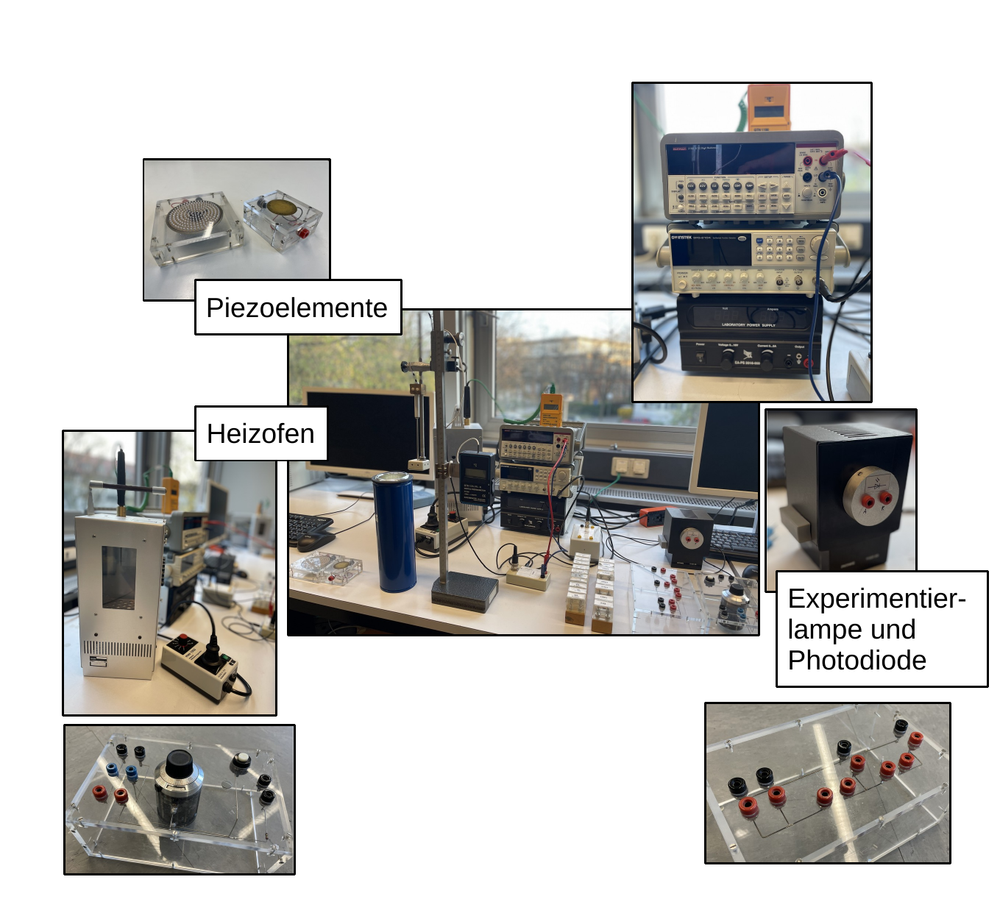

# Fakultät für Physik

## Physikalisches Praktikum P2 für Studierende der Physik

Versuch **H16** (Stand: **April 2026**)

[Raum F1-17](https://labs.physik.kit.edu/img/Klassische-Praktika/Lageplan_P2.png)

# Elektrische Bauelemente

## Motivation

Im Rahmen dieses Versuchs untersuchen Sie eine Reihe (passiver) elektrischer Bauelemente jenseits des einfachen ohmschen Widerstands, der Spule oder des Kondensators. Viele dieser Bauelemente besitzen für technische Anwendungen maßgeschneiderte Eigenschaften: 

- [Dioden](https://de.wikipedia.org/wiki/Diode) besitzen eine bestimmte Durchlassrichtung mit niedrigem elektrischem Widerstand. In der Gegenrichtung, der sog. Sperrrichtung weisen sie einen sehr hohen Widerstand auf und leiten einen nur sehr geringen Sperrstrom. 
- Bei [Photodioden](https://de.wikipedia.org/wiki/Photodiode) verändert sich der Sperrstrom abhängig von der Lichtintensität, der sie ausgesetzt sind. 
- [Leuchtdioden](https://de.wikipedia.org/wiki/Leuchtdiode) senden selbst Licht aus, wenn sie in Durchlassrichtung betreiben werden. 
- Andere Werkstoffe aus der Halbleiterindustrie ändern ihre Widerstände als Funktion der Temperatur, der anliegenden Spannung, des Drucks oder der Intensität des auf sie einfallenden Lichts. 

> All diesen Bauelementen ist **gemeinsam, dass man ihre Eigenschaften im Rahmen der [Festkörperphysik](https://de.wikipedia.org/wiki/Festk%C3%B6rperphysik) verstehen muss**. Im Gegenzug erwächst aus dem grundlegenden Verständnis die technische Anwendung. 

Im Speziellen gibt im Rahmen dieses Versuchs das **Bändermodell** eine Erklärung für die Existenz von Isolatoren, Halbleitern und Leitern. Aus diesem Verständnis erwächst die technische Anwendung der Dotierung von Halbleitern, sowie verschiedener Dioden- und Widerstandstypen. 

- Die Anwendung des [Piezoeffekts](https://de.wikipedia.org/wiki/Piezoelektrizit%C3%A4t) begleitet den Alltag vieler beim Blick auf die Quarzuhr. Er kommt aber auch in Druckfeuerzeugen zur Anwendung. 
- Das Verständnis von Heiss- und Kaltleitung findet seine Fortsetzung in der experimentellen Untersuchung und der theoretischen Erklärung der [Supraleitung](https://de.wikipedia.org/wiki/Supraleiter). 

## Lenrziele

Wir listen im Folgenden auf, was wir von Ihnen erwarten, nachdem Sie diesen Versuch erfolgreich absolviert haben:  

- :white_check_mark: Sie sind geübt im Umgang mit dem Oszilloskop zur Messung von $UI$-Kennlinien verschiedener Dioden und verwandter Widerstände.
- :white_check_mark: Sie kennen die Eigenschaften und die technische Bedeutung der untersuchten Bauelemente und wissen, wie sie sich unter Änderungen äußerer Zustandsgrößen, wie Druck und Temperatur verhalten.
- :white_check_mark: Sie können mit Hilfe der Vorbereitungshilfe qualitativ wiedergeben, wie man sich die Eigenschaften der untersuchten Bauelemente erklärt. 
- :white_check_mark: Sie können einfache Messungen mit einem Hochtemperatursupraleiter (HTSL) vornehmen.

## Weiterführendes Angebot

Die in diesem Versuch vorgestellten Bauelemente besitzen allesamt außergewöhnliche und zum Teil verblüffende Eigenschaften, die erst im Rahmen der Festkörperphysik entsprechende Erklärungen finden. Es ist uns bewusst, dass Sie zu diesem Zeitpunkt ggf. noch nicht in den Genuss einer entsprechenden Vorlesung gekommen sind. Allerdings ist eine Vorlesung nicht die einzige Quelle, um sich mit einem neuen Gebiet der Physik vertraut zu machen. Neben eingängiger Literatur bietet die Vorbereitungshilfe genügend Material, um sich ein qualitatives Verständnisse zugrundeliegender Modellvorstellungen zu erarbeiten und neugierig zu machen.

## Versuchsaufbau

Ein typischer Arbeitsplatz für den Versuch **Elektrische Bauelemente** ist in **Abbildung 1** gezeigt:

---

**Abbildung 1**: (Ein typischer Arbeitsplatz für den Versuch **Elektrische Bauelemente**)

---

Für die Untersuchung der verschiedenen Bauelemente verwenden Sie mehrere unabhängige Aufbauten, von denen einige im **Abbildung 1** hervorgehoben sind: 

- Das Schaltbrett unten rechts dient zur Charakterisierung der Diodenkennlinien auf dem Oszilloskop, für die **Aufgaben 1.1 und 1.2** und des Photowiderstands für **Aufgabe 1.3**. 
- Rechts im Bild ist der Kasten mit Experimentierlampe und Photodiode für **Aufgabe 1.3** zu sehen. Dieser wird über das schwarze Spannungsgerät (EA-PS-2016) betrieben, das im Bild darüber zu sehen ist. 
- Oben links sind das Piezoelement mit Gehäuse und der Lautsprecher gezeigt, die Sie für Ihre Untersuchungen aus **Aufgabe 2.1** verwenden.  
- Links im Bild ist der Heizofen für die Messungen mit den Heiss- und Kaltwiderständen für **Aufgabe 2.2** gezeigt. Die zu vermessenden Widerstände sind fest im Ofen verbaut. Die Temperatur des kalibrierten Thermoelements zur Messung der Temperatur im Ofen kann auf der gelben Anzeige in den drei Bildern in der Mitte von **Abbildung 1** abgelesen werden. 
- Das Schaltbrett mit dem Drehpotentiometer dient zur Widerstandsmessung mit Hilfe der [Wheatstoneschen Brückenschaltung](https://de.wikipedia.org/wiki/Wheatstonesche_Messbr%C3%BCcke). 
- Das Dewargefäß und das Stativ in der Mitte von **Abbildung 1** gehören zur Messung der Sprungtemperatur des Hochtemperatursupraleiters für **Aufgabe 2.3**. 

## Was macht diesen Versuch aus?

Mit diesem Versuch untersuchen Sie die Eigenschaften einer Reihe außergewöhnlicher, elektrischer Bauelemente. Der erste Aufgabenteil beschäftigt sich überwiegend mit der Charakterisierung verschiedener Dioden- und verwandter spezieller Widerstandstypen. Im zweiten Aufgabenteil untersuchen Sie die Abhängigkeit besonderer Materialien von äußeren Zustandsgrößen, wie Druck und Temperatur. 

> Ein gutes qualitatives Verständnis des Verhaltens all dieser Bauteile erlangt man mit Hilfe des [Bändermodells](https://de.wikipedia.org/wiki/B%C3%A4ndermodell) der Festkörperphysik: Es liefert eine Erklärung für die Koexistenz von Leitern und Isolatoren, für die Funktionsweise aller untersuchten Dioden und Widerstände, sowie für das zunächst undurchsichtig erscheinende Phänomen der Kalt- und Heissleitung. 

Auch für ein grundlegendes Verständnis der Supraleitung sind eine klare Vorstellung der Gitterstruktur von Festkörpern, sowie der Bewegung von Leitungselektronen im Bändermodell eine wichtige Voraussetzung. **Auf diese Weise zieht sich mit dem Bändermodell ein einfaches Modell der Festkörperphysik als roter Faden durch diesen Versuch**, mit dessen Hilfe sich verschiedenste, wie im Fall der Kalt- und Heissleitung sogar entgegengesetzte, elektrische Effekte und Eigenschaften in einem gemeinsamen Bild erklären lassen. Die HTSL gibt einen Ausblick in ein stark vom Experiment getriebenes Gebiet der Physik, in dem zahlreiche Phänomene bisher noch nicht vollständig verstanden sind. 

## Wichtige Hinweise

- 🚨  Sie benötigen u.U. einen USB-Stick zur Datensicherung.
- 🚨  Das Gehäuse des Ofens für **Aufgabe 2.2** erhitzt sich auch äußerlich stark! Vermeiden Sie daher jeglichen Kontakt mit der Oberfläche.
- 🚨  [Flüssigstickstoff](https://de.wikipedia.org/wiki/Fl%C3%BCssigstickstoff), wie Sie ihn für **Aufgabe 2.3** verwenden, kann schwere Kälteverbrennungen verursachen! Tragen Sie daher stets Handschuhe und Schutzbrille, wenn Sie damit umgehen.

# Inventar des Versuchs

- Wir gehen davon aus, dass Sie das Protokoll zu diesem Versuch aus einer **Jupyter-Umgebung** führen:
  - 💡 Hierzu steht Ihnen das [bwJupyter Hub](https://hub.bwjupyter.de/) zur Verfügung.
  - 💡 Nutzen Sie **diesen [Direkt-Link](https://hub.bwjupyter.de/services/profilemanagement/add?profile=5fbace23-bf49-4edd-bcaf-c9d421afa8c7)** zur erstmaligen Einrichtung der Umgebung für das P1/P2-Praktikum.
  - 💡 Hinweise zur Arbeit auf dem bwJupyter Hub entnehmen Sie der Datei [JupyterServer.md](https://gitlab.kit.edu/kit/etp-lehre/p1-praktikum/students/-/blob/main/doc/JupyterServer.md).
- Die folgenden Links führen auf/in die wichtigsten Dateien und Verzeichnisse dieser Versuchsanleitung:
  - [Elektrische_Bauelemente.iypnb](https://gitlab.kit.edu/kit/etp-lehre/p2-praktikum/students/-/blob/main/Elektrische_Bauelemente/Elektrische_Bauelemente.ipynb): Aufgabenstellung und Vorlage fürs Protokoll (in Form eines Jupyter-notebook).
  - [Elektrische_Bauelemente_Hinweise.ipynb](https://gitlab.kit.edu/kit/etp-lehre/p2-praktikum/students/-/blob/main/Elektrische_Bauelemente/Elektrische_Bauelemente_Hinweise.ipynb): Hinweise zu Versuchsdurchführung und Auswertung (in Form eines Jupyter-notebook).
  - [Datenblatt.md](https://gitlab.kit.edu/kit/etp-lehre/p2-praktikum/students/-/blob/main/Elektrische_Bauelemente/Datenblatt.md): Inventar und technische Details zu den Versuchsaufbauten.
  - [doc](https://gitlab.kit.edu/kit/etp-lehre/p2-praktikum/students/-/tree/main/Elektrische_Bauelemente/doc): Dokumente zur Vorbereitung auf den Versuch.
  - [figures](https://gitlab.kit.edu/kit/etp-lehre/p2-praktikum/students/-/tree/main/Elektrische_Bauelemente/figures): Bilder, die für die Dokumentation des Versuchs verwendet wurden.
