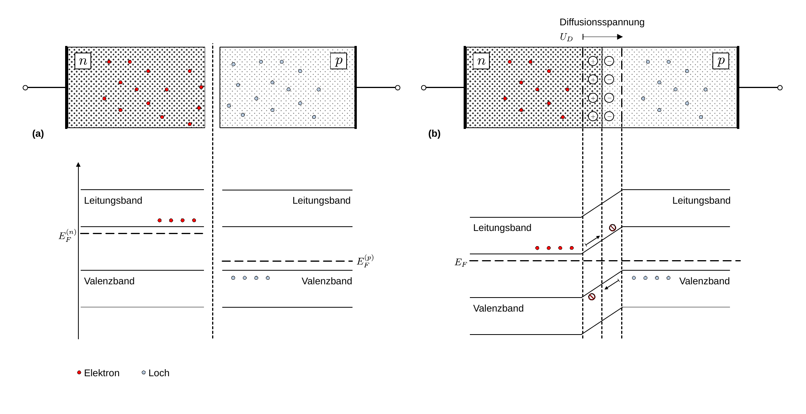
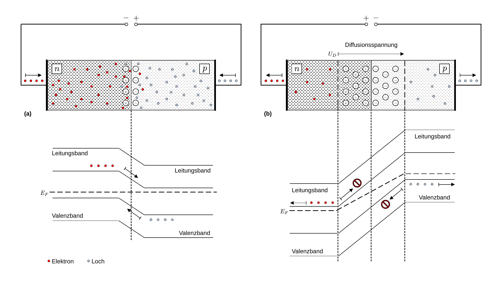
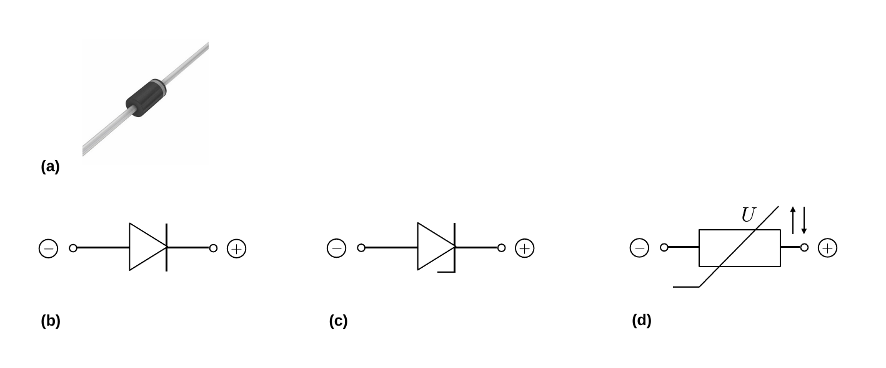
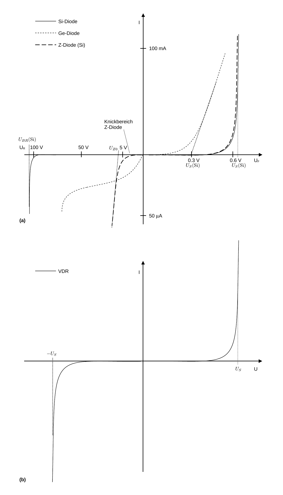
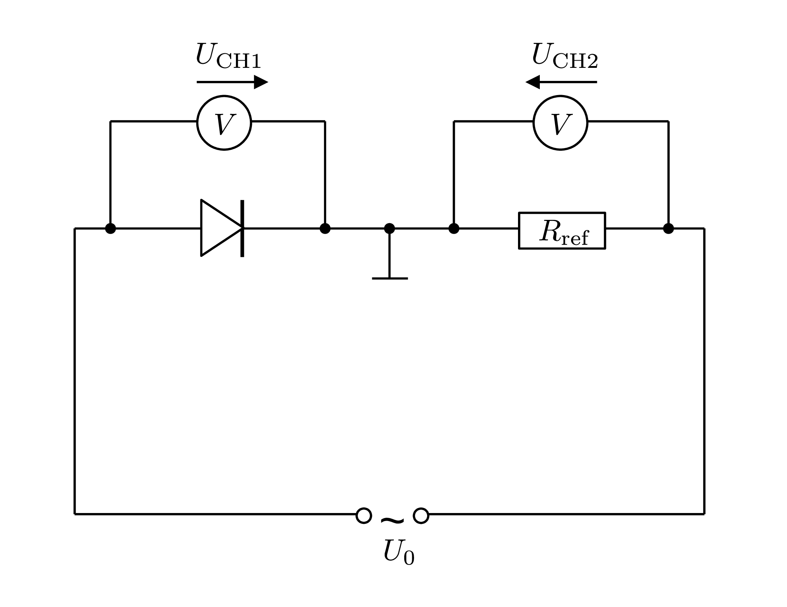

# Elektrische Bauelemente

## Halbleiterdioden und Varistoren

### Die Halbleiterdiode im thermischen Gleichgewicht

Eine Halbleiter (HL)-Diode (kurz auch einfach als Diode bezeichnet) besteht aus der Verbindung eines n- mit einem p-dotierten HL, wie in **Abbildung 1** dargestellt:

---

**Abbildung 1**: (Übergang von zwei jeweils n- und p-dotierten HL (Abbildung (a)) zur Diode (Abbildung (b)), in einer räumlichen Modellvorstellung (oberer Teil des Bildes), sowie unter Berücksichtigung der Energieniveaus der freien Ladungsträger im Bändermodell (unterer Teil des Bildes))

---

Bei den freien Ladungsträgern des n-dotierten HL handelt es sich um Elektronen im Leitungsband, beim p-dotierten HL sind es die Löcher im Valenzband. Kommt es zum Kontakt (am **pn-Übergang**), wie in **Abbildung 1 (b)** gezeigt, diffundieren die freien Ladungsträger beider HL an der Grenzfläche in den jeweils anderen HL, wo sie mit den dortigen freien Ladungsträgern **rekombinieren**. Die jeweiligen, im Kristall verankerten und damit unbeweglichen Rümpfe bleiben zurück. Beim n-dotierten HL sind dies z.B. die positiv geladenen Rümpfe der P-Atome, beim p-dotierten HL die negativ geladenen Al-Rümpfe. Es bildet sich eine **Grenzschicht** ohne freie Ladungsträger aus, entlang derer sich durch die räumliche Trennung der Ladungen eine **Diffusionsspannung $U_{D}$** aufbaut. Diese Spannung stellt für die freien Ladungsträger jenseits der Grenzschicht eine **Barriere** dar, so dass der Diffusionsstrom zum erliegen kommt. $U_{D}$ ist materialspezifisch und temperaturabhängig. Bei Zimmertemperatur gilt 
$$
\begin{equation*}
U_{D}(\mathrm{Si})\approx 0.6-0.7\ \mathrm{V};\qquad 
U_{D}(\mathrm{Ge})\approx 0.3\ \mathrm{V}.
\end{equation*}
$$
Im Bändermodell liegen Valenz- und Leitungsbänder des n- und p-dotierten HL auf unterschiedlichen Energieniveaus, das Fermi-Niveau $E_{F}$ ist jedoch über den gesamten Übergang der Diode gleich. Die Elektronen im Leitungsband des n-dotierten HL können nicht über die Barriere der Grenzschicht in den p-dotierten HL fließen. 

🤓 Als Eselsbrücke kann man sich die Elektronen als Kugeln im Leitungsband vorstellen, die in **Abbildung 1 (a)** nicht bergauf rollen. Umgekehrt können die Löcher im Valenzband des p-dotierten HL nicht über die Barriere in den n-dotierten HL fließen. Als Eselsbrücke kann man sich die Löcher als Luftblasen im Valenzband vorstellen. 

Im thermischen Gleichgewicht fließt durch die Diode kein Strom. 

### Die Halbleiterdiode im Betrieb

> Liegt an der Diode eine äußere Spannung mit dem Minus-Pol an der n- und dem Plus-Pol an der p-dotierten Seite an, wird diese in **Durchlassrichtung** betrieben, sie ist leitend. Liegt umgekehrt an der n-dotierten Seite eine positive und an der p-dotierten Seite eine negative Spannung an, befindet sich die Diode im **Sperrbetrieb**, sie ist nicht-leitend. 

Mit dieser Eigenschaft ist die Diode in einer wohldefinierten Stromrichtung durchlässig, während sie den Stromfluss in umgekehrter Richtung sperrt. Die offensichtlichste Anwendung einfacher Dioden besteht daher in der [Gleichrichtung von Wechselstromsignalen](https://de.wikipedia.org/wiki/Gleichrichter). Diese Situation ist in **Abbildung 2** dargestellt: 

---

(**Abbildung 2**: Darstellung einer Diode im (a) Durchlass- und (b) Sperrbetrieb)

---

#### Durchlassbetrieb

Der Durchlassbetrieb der Diode ist in **Abbildung 2 (a)** gezeigt. In diesem Fall wird die n-dotierte Seite der Diode mit Elektronen und die p-dotierte Seite mit Löchern geflutet, wodurch sich die Grenzschicht verringert. 💡 Bei einer Spannung von 
$$
\begin{equation*}
U_{S} = -U_{D}
\end{equation*}
$$
ist die Grenzschicht vollständig abgebaut. An der Grenzfläche rekombinieren die Elektronen und Löcher ungestört und es kommt zum Stromfluss. Man bezeichnet $U_{S}$ als **Schleusen- oder Schwellenspannung**. Tatsächlich driften freie Ladungsträger auch über die Grenzschicht hinaus bis sie rekombinieren. Diesen Vorgang bezeichnet man als **Injektion**. Er sorgt dafür, dass die Minoritätsladungsträgerdichte auf beiden Seiten der Diode ansteigt. 

Im Bändermodell verschieben sich die Energieniveaus der Leitungs- und Valenzbänder im n- und p-dotierten HL, bis sich die Barriere "umkehrt" und zum **Durchlass** wird. Im Fall $U_{S}=-U_{D}$ liegen beide Energieniveaus für beide HL auf gleicher Höhe. ℹ️ Das Fermi-Niveau wird entsprechend verzerrt. 

#### Sperrbetrieb

Der Sperrbetrieb der Diode ist in **Abbildung 2 (b)** gezeigt. In diesem Fall werden durch die äußere Spannung die Elektronen aus dem n- und die Löcher aus dem p-dotierten Teil der Diode gezogen, womit sich die Dichte der freien Ladungsträger stark verringert. Die Grenzschicht, die in diesem Fall auch als **Sperrschicht** bezeichnet wird, weitet sich aus bis die sich dadurch ausbildende Driftspannung aufgrund der verbliebenen, im HL fest eingebauten Atomrümpfe die äußere Spannung kompensiert. Dies passiert so schnell, dass der Stromfluss quasi augenblicklich zum erliegen kommt. 

Im Idealzustand ist die Diode in diesem Betrieb nicht leitend. In der Realität besitzt sie immer noch einen endlichen Widerstand, der auf die Eigenleitung des HL zurückzuführen ist. Ab der sog. **Durchbruchspannung $U_{BR}$ (engl. *breakdown voltage*)** wird die Diode auch in Sperrrichtung leitend. ℹ️ In diesem Fall kommt es i.a. zur Zerstörung der Diode. 

ℹ️ An technischen Bauteilen wird die Durchlassrichtung einfacher Dioden i.a. durch einen silbernen Ring angezeigt, wie in **Abbildung 3 (a)** gezeigt. Das Schaltsymbol für eine Diode ist in **Abbildung 3 (b)** dargestellt: 

---

(**Abbildung 3**: Abbildung (a) zeigt das typische Aussehen einer Diode, als elektronischem Bauteil. Die Durchlassrichtung wird durch einen silbernen Ring gekennzeichnet. In Abbildung (b) ist das Schaltsymbol einer Diode, in Abbildung (c) einer Z-Diode und in Abbildung (d) eines VDR gezeigt. In den Abbildungen (b) und (c) weisen die Dreieckspitzen in die technische Stromrichtung in Durchlassrichtung)

---

⚠️ Falls Unsicherheit besteht empfiehlt es sich immer mit dem Multimeter einen Diodentest durchzuführen. Dieser gibt die Durchlassrichtugn und $U_{D}$ an. 

### Z-Diode

💡 [Z-Dioden](https://de.wikipedia.org/wiki/Z-Diode) sind besonders hoch dotierte Si-Dioden mit einer schmalen Grenzschicht und vordefinierter Durchbruchspannung. Sie sind für den **dauerhaften Betrieb in Sperrrichtung** ausgelegt und dienen auf diese Weise der Spannungsstablisierung oder **Spannungsbegrenzung**. Die Durchbruchspannung, bei der die Z-Diode auch in Sperrrichtung leitend wird, heißt **Zener-Spannung** $U_{Z0}$. Sie liegt je nach Typ normalerweise zwischen $2-5.5\ \mathrm{V}$. 

Z-Dioden verhalten sich in Durchlassrichtung wie normale Dioden. In Sperrrichtung kommt es durch die starke Verschiebung der Energieniveaus der Leitungs- und Valenzbänder an der Grenzschicht zum [Zener-Effekt](https://de.wikipedia.org/wiki/Zener-Effekt), durch den ab einer bestimmten Größe des elektrischen Felds Elektronen aus ihren Kristallbindungen gelöst werden und den Strom $I_{Z}$ ausbilden. Erreicht die anliegende Sperrspannung $U_{Z0}$, dann nimmt $I_{Z}$ stark zu. Die Ladungsträger, die durch den Zener-Effekt frei geworden sind, werden durch das elektrische Feld beschleunigt und schlagen weitere Elektronen aus ihren Kristallbindungen aus. Schließlich kommt es zum **Zener-Durchbruch** der Sperrschicht. Sinkt die angelegte Spannung unter $U_{Z0}$, werden keine weiteren Ladungsträger mehr
freigesetzt und die Sperrschicht verarmt. 

💡Im Gegensatz zu einer normalen Diode wird die Z-Diode durch den Zener-Durchbruch nicht zerstört. 

Das Schaltsymbol für eine Z-Diode ist in **Abbildung 3 (c)** gezeigt.

### Varistor

Widerstände, die ihren Wert aufgrund der anliegenden Spannung ändern, heißen **Varistoren oder VDR (in engl. *volt dependent resistor*)**. 🔔 Beim VDR handelt es **nicht** um eine Diode, er besteht dennoch aus vielen kleinen HL-Kristallen, zwischen denen sich Sperrschichten ausbilden. ☝️ Da diese Kristalle (und damit auch die Sperrschichten) völlig ungeordnet vorliegen, haben VDRs keine Vorzugsrichtung für den Strom. Wird eine äußere Spannung angelegt, entsteht im VDR ein elektrisches Feld und die Sperrschichten bauen sich teilweise ab. Mit zunehmender Spannung werden immer mehr Sperrschichten abgebaut, so dass der Widerstand des VDR sinkt. Die Polung der Spannung spielt dabei keine Rolle. 

Die Spannung, von der ab ein deutlicher Stromanstieg zu beobachten ist, heißt auch in diesem Fall **Schwellenspannung** ($U_{S}$). Sie hängt maßgeblich von der Dicke des VDR ab, denn je dicker die VDR-Schicht ist, desto mehr Kristalle liegen in Reihe geschaltet vor und desto mehr Sperrschichten müssen abgebaut werden. 

Das Schaltsymbol für einen VDR ist in **Abbildung 3 (d)** gezeigt. 

### Dioden- und Varistorkennlinien

Die [Strom-Spannungs ($UI$)-Kennlinien](https://de.wikipedia.org/wiki/Diode#Kennlinie) einer Si-, Ge- und Z-Diode, mit ihren wichtigsten Kenngrößen, sind in **Abbildung 4 (a)** schematisch dargestellt. Der typische Verlauf einer VDR-Kennlinie ist in **Abbildung 4 (b)** gezeigt: 

---

(**Abbildung 4**: Abbildung (a) zeigt die Kennlinien einer Si-, Ge- und Z-Diode. Abbildung (b) zeigt die Kennlinie eines VDR)

---

⚠️ Zu beachten sind in **Abbildung 4 (a)** die deutlich unterschiedlichen Skalen für Strom und Spannung, auf den positiven $x$- und $y$-Achsen. 

Die Spannung für den Betrieb einer Diode in Durchlassrichtung wird als **Flussspannung $U_{F}$ (engl. *forward voltage*)** bezeichnet. Bis $U_{S}$ fließt nur ein geringer Strom. Für $U_{F}>U_{S}$ ist die Sperrschicht komplett abgebaut und der Stromfluss nimmt rapide zu. Die Spannung für den Betrieb in Sperrrichtung wird als **Sperrspannung $U_{R}$ (engl. *reverse voltage*)** bezeichnet. In Sperrrichtung fließt im Idealzustand kein Strom durch die Diode. Jenseits der **Durchbruchspannung $U_{BR}$** nimmt der Strom wieder schnell zu.  

🤓 Oberhalb von $U_{BR}$ kann die $UI$-Kennlinie einer Diode allg. durch die [Shockley-Gleichung](https://de.wikipedia.org/wiki/Shockley-Gleichung) beschrieben werden:
$$
\begin{equation}
\begin{split}
&I_{F}(U_{F}) = I_{S}(T)\left(e^{\frac{U_{F}}{n\,U_{T}}}-1\right);\\
&\\
&\text{mit}\\
&\\
&U_{T}=\frac{k_{B}\,T}{e},
\end{split}
\tag{1}
\end{equation}
$$
wobei $I_{S}(T)$ dem temperaturabhängigen Sättigungsstrom (Sperrstrom), $n\approx 1\ldots 2$ dem sog. Emissionskoeffizienten und  $U_{T}$ der Temperaturspannung entsprechen.  

**Bei der Z-Diode ist der Durchbruch in Sperrrichtung erwünscht!** Er erfolgt, aufgrund des Zener-Effekts bei $U_{Z0}$. $U_{Z0}$ ist temperaturabhängig und weist deutlich niedrigere Werte als $U_{BR}$ auf. An der Kennlinie sind **Sperr- und Durchbruchbereich** deutlich zu erkennen. Dazwischen liegt der sogenannte **Knickbereich**, der mit dem Einsetzten des Durchbruchs beginnt.

Die Kennlinie des VDR ist ab der Schwellenspannung ${\pm}U>U_{S}$ in beide Richtungen durchlässig. Aufgrund der Tatsache, dass die HL-Kristalle im VDR keine Vorzugsrichtung haben, weist die $UI$-Kennlinie eine Punktsymmetrie zum Ursprung des $UI$-Koordinatensystems auf. 

Die Aufzeichnung von $UI$-Kennlinien mit dem Oszilloskop erfolgt z.B. mit einem Aufbau, wie in **Abbildung 5** gezeigt: 

---

(**Abbildung 5**: Messanordnung zur Darstellung einer $UI$-Kennlinie für eine Diode am Oszilloskop)

---

Es handelt sich bei diesem Beispiel um eine **Schaltung zur Darstellung einer Diodenkennlinie**. 

Das Oszilloskop wird dabei im XY-Modus verwendet. Das zu untersuchende Bauteil ist die Diode oben links im Bild. Über der Diode wird die abfallende Spannung als $U_{\mathrm{CH1}}$ auf CH1 des Oszilloskops gelegt. Die abfallende Spannung über dem Referenzwiderstand $R_{\mathrm{ref}}$ wird als Maß für den Strom
$$
\begin{equation*}
U_{\mathrm{CH2}} = I\,R_{\mathrm{ref}},
\end{equation*}
$$
als $U_{\mathrm{CH2}}$, auf CH2 des Oszilloskops gelegt. ☝️ Zu diesem Zweck müssen Sie die folgenden Punkte beachten: 

- Die Masse des Oszilloskops liegt zwischen $R_{\mathrm{ref}}$ und der zu vermessenden Diode. 
- Die Wechselspannung liegt massefrei an. Im Versuch erreichen Sie dies durch die Verwendung einer am Versuch ausliegenden Trenntransformator-Schaltung. 
- Zur richtigen Darstellung der Kennlinie ist $U_{\mathrm{CH2}}$ auf CH2 zu invertieren. 

☝️ Sie haben solche Kennlinien im **P1-Grundversuch [Oszilloskop](https://gitlab.kit.edu/kit/etp-lehre/p1-praktikum/students/-/blob/main/Oszilloskop/doc/Hinweise-Kennlinie.md)** aufgenommen. 

## Erwartung

Was wir an dieser Stelle von Ihnen erwarten:

- :white_check_mark: Sie können die **Funktionsweise einer einfachen Diode** geometrisch und im Bändermodell erklären. 

- :white_check_mark: Sie können die **Sperr- und Durchlassrichtung** einer einfachen Diode angeben. 
- :white_check_mark: Sie wissen, wie die $UI$-Kennlinien einer Diode, Z-Diode und eines VDR aussehen.
- :white_check_mark: Sie wissen, wie man die $UI$-Kennlinie einer Diode auf dem Oszilloskop darstellt. 

## Testfragen

1. Wie sollten Sie die Diode in **Abbildung 3 (a)** polen, um sie in Durchlassrichtung zu betreiben? 
2. Sind die Dioden in den **Abbildung 3 (b) und (c)** in Durchlass- oder Sperrrichtung gepolt?
3. Eine Ge-Diode besitzt einen höheren Strom in Sperrrichtung, als die Si-Diode, der auch mit zunehmenden Werten von $U_{R}$ etwas zunimmt (siehe **Abbildung 4 (a)**). Wie erklären Sie sich diesen Umstand?
4. Wie ist **Abbildung 5** zu modifizieren, um auch die Trenntransformator-Schaltung zu berücksichtigen?   

---

[Main](https://gitlab.kit.edu/kit/etp-lehre/p2-praktikum/students/-/tree/main/Elektrische_Bauelemente/README.md)

