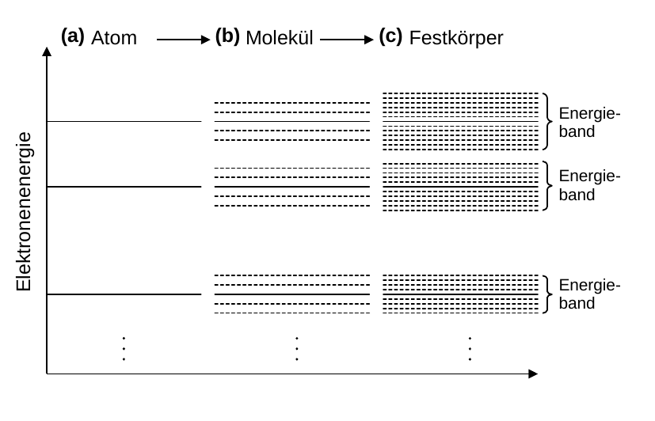
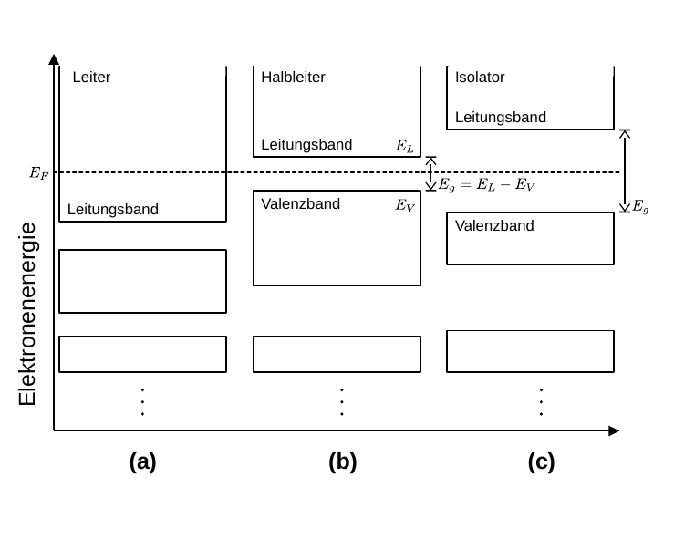
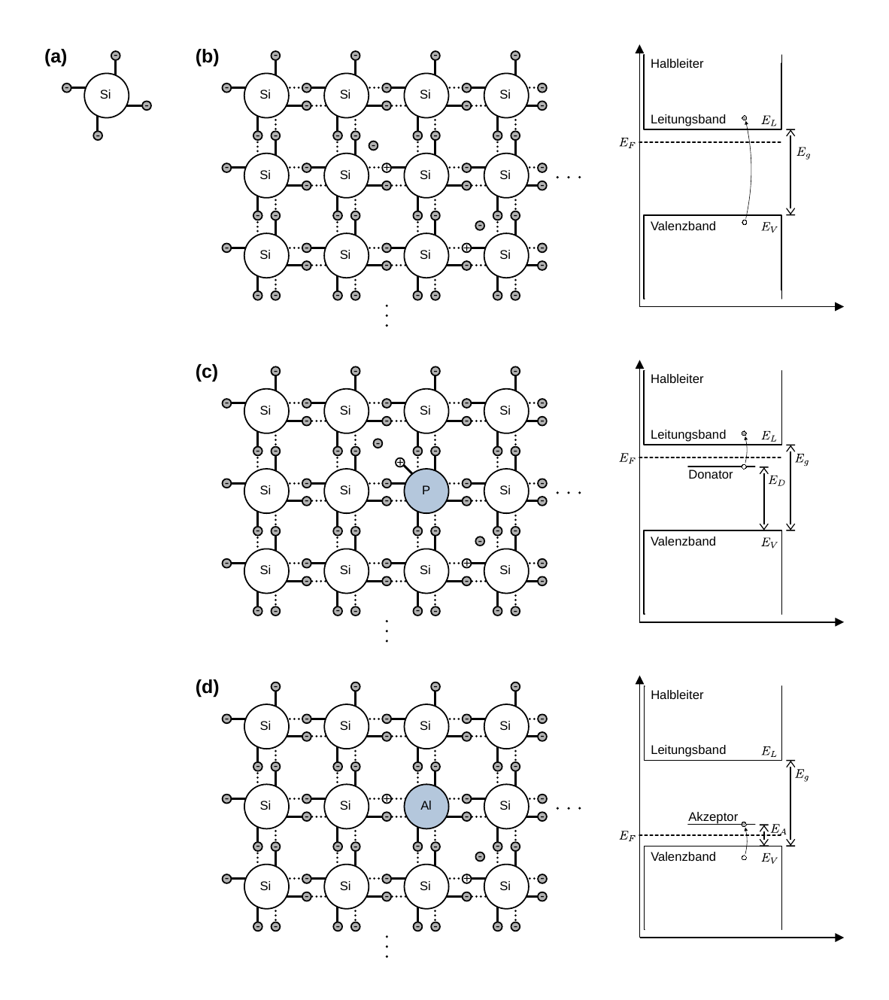
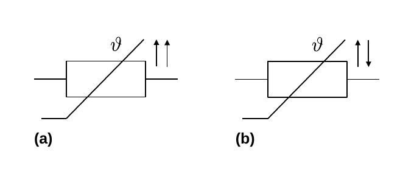
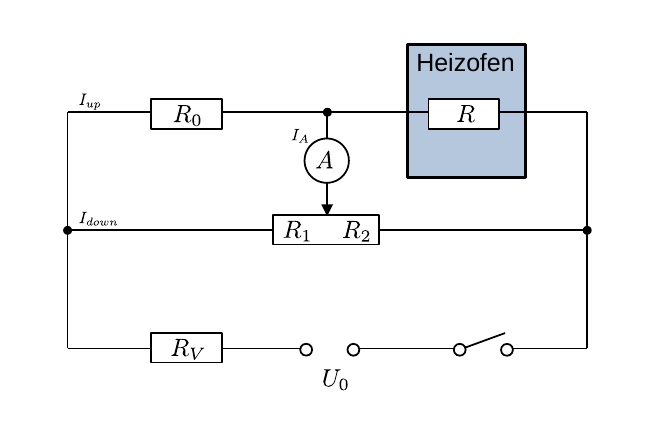
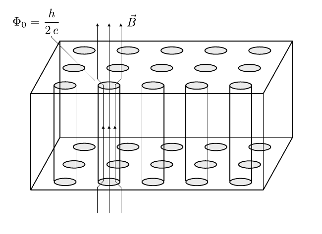
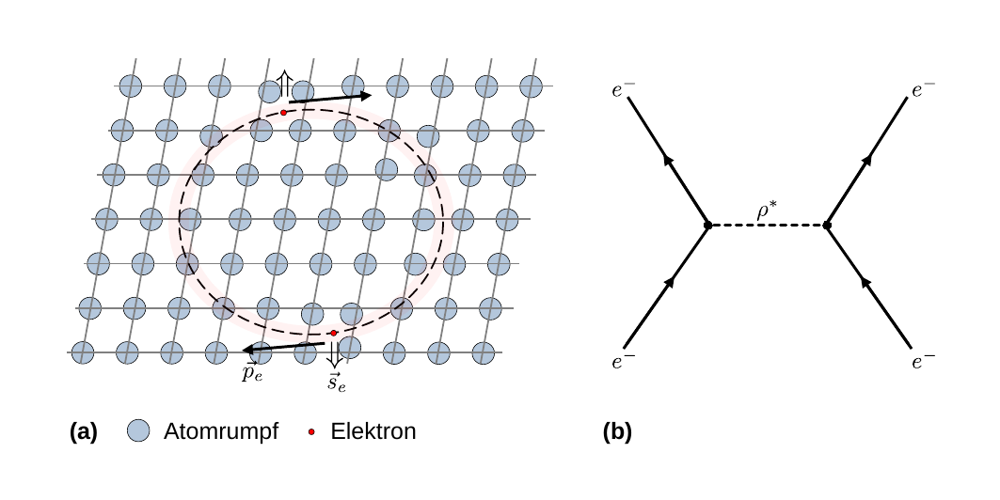
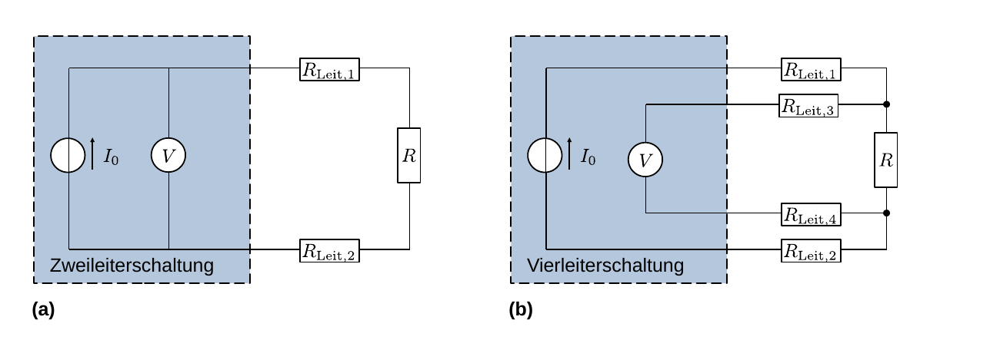

# Hinweise für den Versuch **Elektrische Bauelemente**

## Energieniveaus in Atom und Festkörper

Im Atom besetzen die Elektronen der Hülle [Orbitale](https://de.wikipedia.org/wiki/Atomorbital) mit diskreten Energieniveaus. Aufgrund des [Pauli-Prinzips](https://de.wikipedia.org/wiki/Pauli-Prinzip) kann jedes Energieniveau nur durch eine endliche Anzahl von Elektronen besetzt werden. In Molekülen spalten die Energieniveaus z.B. aufgrund zusätzlicher Rotations- und Vibrationsfreiheitsgrade auf. Im Übergang zum Festkörper (FK) nimmt diese Aufspaltung weiter zu, so dass sich (für eine Anzahl von Basisatomen (BA) eines FK in der Größenordnung von $N_{A}$) quasi-kontinuierliche Energiebänder ausbilden. Es handelt sich dabei immer noch um eine wenn auch sehr große Zahl diskreter Energieniveaus, die in bestimmten Bereichen sehr eng beieinander liegen. Dieser Übergang ist in **Abbildung 1** schematisch dargestellt:

---

**Abbildung 1**: (Übergang von den Energieniveaus eines einzelnen Atoms (a) über die Energieniveaus eines Moleküls (b) bis zu den quasi-kontinuierlichen Energiebändern im FK (c))

---

Nach wie vor gilt für die Elektronen im FK das Pauli-Prinzip, so dass jedes einzelne Energieniveau nur durch eine endliche Anzahl von Elektronen besetzt werden kann. Zwischen den Energiebändern bilden sich **verbotene Bereiche** aus, deren Energieniveaus von Elektronen im FK nicht angenommen werden können. 

Durch thermische Anregung nimmt der FK Energie aus seiner Umgebung auf, so dass sich Elektronen auch in höheren (jedoch erlaubten) Energieniveaus, als im Grundzustand des FK befinden können. Die Wahrscheinlichkeit dafür bei der Temperatur $T$ des FK ein Elektron mit der Energie $E$ anzutreffen ist durch die [Boltzmann-Statistik](https://de.wikipedia.org/wiki/Boltzmann-Statistik) 
$$
\begin{equation*}
p = \frac{1}{Z}e^{-E/k_{\mathrm{B}}T}
\end{equation*}
$$
gegeben, wobei $k_{\mathrm{B}}$ die [Boltzmann-Konstante](https://de.wikipedia.org/wiki/Boltzmann-Konstante) und $Z$ eine Normierungskonstante sind. Für das Produkt $k_{\mathrm{B}}T$ gilt
$$
\begin{equation*}
\left.k_{\mathrm{B}}T\right|_{T=300\,\mathrm{K}} = 0.0258\,\mathrm{eV}.
\end{equation*}
$$
Ein Elektron kann jedoch nur dann thermisch angeregt werden, wenn die Anregung den Gesetzen der Energie-Impulserhaltung folgt und der Energiezustand nach Anregung durch das Pauli-Prinzip erlaubt ist.  

Für die Temperatur $T_{0}=0\ \mathrm{K}$ sind alle Energiezustände vom niedrigsten bis zu einem maximalen Energieniveau durch die Elektronen des FK besetzt. Diese maximale Energie bezeichnet man als [Fermi-Energie](https://de.wikipedia.org/wiki/Fermi-Energie) $E_{F}$. Das höchste (bei $T_{0}$) durch Elektronen vollständig besetzte Band bezeichnet man als [**Valenzband**](https://de.wikipedia.org/wiki/Valenzband). Es ist durch die [Valenzelektronen](https://de.wikipedia.org/wiki/Valenzelektron) der BA besetzt. Das niedrigste nicht vollbesetzte Band bezeichnet man als [**Leitungsband**](https://de.wikipedia.org/wiki/Leitungsband). Das **Valenz- und das Leitungsband bestimmen die elektronischen Eigenschaften des FK**, die Sie in diesem Versuch an verschiedenen elektrischen Bauelementen untersuchen.

## Leitfähigkeit im Festkörper

Im FK sind die BA fest in einem periodischen Gitter, dem [**Kristall**](https://de.wikipedia.org/wiki/Kristallstruktur), gebunden. Das genaue Aussehen dieses Gitters wird durch die elektronischen Eigenschaften, wie z.B. die [Wertigkeit](https://de.wikipedia.org/wiki/Wertigkeit_(Chemie)), der BA bestimmt. Bis zum Valenzband sind die Elektronen fest an die BA gebunden. Im Leitungsband besteht diese lokale Bindung nicht mehr, so dass sich die Elektronen im Leitungsband frei durch den FK bewegen können (freies [Elektronengas](https://de.wikipedia.org/wiki/Elektronengas)). Wechselt ein Elektron, z.B. durch thermische Anregung vom Valenz- ins Leitungsband hinterlässt es im Gitter den ionisierten Rumpf eines BA, der in diesem Fall auch als Loch oder [Defektelektron](https://de.wikipedia.org/wiki/Defektelektron) bezeichnet wird. Die [Leitfähigkeit](https://de.wikipedia.org/wiki/Leitf%C3%A4higkeit) eines FK für elektrischen Strom wird durch die Anzahl der Elektronen im Leitungsband bestimmt, die im Idealfall (d.h. bei einem FK mit ungestörter Gitterstruktur) zur Anzahl der Löcher äquivalent ist. 

Der Transport elektrischer Ladung findet in der Realität nur durch die Elektronen im Leitungsband statt, da die Rümpfe der BA fest in der Gitterstruktur verankert sind. Die Bewegung der Elektronen ist jedoch mit der Interpretation einer (Quasi-)Bewegung von Löchern entgegen der Elektronenbewegung im Valenzband äquivalent. 

Die vereinfachte Beschreibung des FK durch Valenz- und Leitungsband erfolgt im [**Bändermodell**](https://de.wikipedia.org/wiki/B%C3%A4ndermodell). Im Rahmen dieses Modells lassen sich alle FK bezüglich ihrer Leitfähigkeit in drei Klassen einteilen: 

- Beim **Leiter** überlappen Valenz- und Leitungsband. Ein Leiter besitzt eine hohe Leitfähigkeit. 
- Beim **Isolator** ist die Lücke (engl. *gap*) $E_{g}$ zwischen Valenz- und Leitungsband so groß, dass sie für ein einzelnes Elektron nicht einfach aufgebracht werden kann ($E_{g}>3\ \mathrm{eV}$). Ein Isolator ist i.a. nicht leitend.  
- Dazwischen liegt der **Halbleiter**, bei dem die Lücke zwischen Valenz- und Leitungsband mit $1<E_{g}<3\ \mathrm{eV}$ klein ist.  Ein Halbleiter besitzt eine geringe (intrinsische) Leitfähigkeit.

Diese Einordnung von FK in Leiter, Isolatoren und Halbleiter ist in **Abbildung 2** schematisch dargestellt:

---

**Abbildung 2**: (Schematische Einteilung des FK in (a) Leiter, (b) Halbleiter und (c) Isolator im Bändermodell)

---

In der Abbildung bezeichnet $E_{L}$ die niedrigste Energie im Leitungsband und $E_{V}$ die höchste Energie im Valenzband. Bei Leitern unterscheidet man i.a. nicht mehr zwischen Valenz- und Leitungsband. Die Unterscheidung zwischen Halbleiter und Isolator erfolgt über den Betrag von $E_{g}$. 

## Halbleiter

Wir führen die wichtigsten Eigenschaften von Halbleitern am Beispiel des am häufigsten verwendeten Halbleitermaterials, Silizium (Si) ein. 

- Si hat die Ordnungszahl 14; 
- es weist vier Elektronen im Valenzband auf und ist damit vierwertig; 
- seine elektrische Leitfähigkeit beträgt $\sigma_{\mathrm{Si}}=5\times10^{-4}\ \mathrm{\Omega^{-1}m^{-1}}$. 
- die Energie zwischen Valenz- und Leitungsband ([Bandlücke](https://de.wikipedia.org/wiki/Bandl%C3%BCcke)) beträgt $E_{g}=1.1\ \mathrm{eV}$.

Eine schematische Darstellung eines Si-Atoms ist in **Abbildung 3 (a)** gezeigt:

---

(**Abbildung 3**: Schematische Darstellung der Gitterstruktur und Darstellung der Energieniveaus im Bändermodell von Si mit und ohne Störstellen)

---

**Abbildung 3 (b)** zeigt ein Schema der daraus resultierenden Gitterstruktur, sowie die Konfiguration aus Valenz-, Leitungsband und $E_{F}$.  

Die (geringe) Leitfähigkeit von Halbleitern hat im Allgemeinen die folgenden Ursachen:

- $E_{g}$ ist klein genug, so dass die Bindung für eine geringe Anzahl von Elektronen durch thermische Anregung gelegentlich aufgebrochen werden kann und diese Elektronen vom Valenz- ins Leitungsband gelangen. Dadurch entsteht zeitweise ein **Elektron-Loch-Paar**.
- Zusätzlich gelangen Elektronen durch unvermeidbare Störstellen der Kristallstruktur (z.B. in Form von Verunreinigungen leichter) ins Leitungsband.
- An der Oberfläche des Kristalls liegt grundsätzlich ein Defekt der Gitterstruktur vor.

Bezieht man sich auf die Leitfähigkeit nur des reinen Halbleiters spricht man auch von der **Eigenleitung**. Die Eigenleitung von Halbleitern hängt von der Temperatur ab. Bei Zimmertemperatur ist sie nach wie vor gering. Um die Leitfähigkeit von Halbleitern auch bei Zimmertemperatur zu erhöhen bringt man gezielt Verunreinigungen in Form von Fremdatomen in den Halbleiter ein. Diesen Vorgang bezeichnet man als [**Dotierung**](https://de.wikipedia.org/wiki/Dotierung). 

### n-Dotierung

Bringt man in das Gitter des vierwertigen Si z.B. fünfwertige Phosphor (P)-Atome ein geben diese, unter deutlich geringerem Energieaufwand, ein für die Erfüllung der Kristallstruktur überschüssiges Valenzelektron ans Leitungsband ab. Nach außen bleibt der Kristall elektrisch neutral. Im Leitungsband ist das Elektron nun aber frei beweglich. Man bezeichnet diesen Vorgang als **n-Dotierung**, das P-Atom als **(Elektron-)Donator**. Legt man an einen n-dotierten Halbleiter eine Spannung an fließt ein Elektronenstrom vom Minus- zum Plus-Pol. Man bezeichnet diesen Vorgang als **n-Leitung**. Die Kristallstruktur und Energieniveaus für Si im Fall der n-Dotierung sind in **Abbildung 3 (c)** dargestellt.

### p-Dotierung

Bringt man in das Si-Gitter z.B. dreiwertige Aluminium (Al)-Atome ein weisen diese ein Valenzelektron zu wenig auf, um die Kristallstruktur zu erfüllen. Auf diese Weise entsteht ein Defekt des Kristallgitters, der durch Elektronen benachbarter Si-Atome im Kristall aufgefüllt werden kann. Energetisch bedeutet dies, dass unter nur geringem Energieaufwand ein Elektron aus dem Valenzband in die freie Defektstelle gelangen kann. Im Valenzband entsteht dadurch ein Loch, dass durch den Kristall diffundieren kann. Man bezeichnet diesen Vorgang als **p-Dotierung**, das Al-Atom als **(Elektron-)Akzeptor**. Legt man an einen p-dotierten Halbleiter eine Spannung an fließt ein Strom, der dadurch zustande kommt, dass aus dem Minus-Pol der Spannungsquelle Elektronen in den Halbleiter einströmen, die die vorhandenen Löcher im Valenzband befüllen. Am Plus-Pol werden diese Elektronen wieder aus dem Halbleiter gesaugt. Dieser Vorgang ist äquivalent zu der Vorstellung, dass die Löcher im Valenzband, in entgegengesetzter Richtung vom Plus- zum Minus-Pol wandern. Diesen Vorgang bezeichnet man als **p-Leitung**. Die Kristallstruktur und Energieniveaus für Si im Fall der n-Dotierung sind in **Abbildung 3 (d)** dargestellt.     

## Verhalten von Widerständen als Funktion der Temperatur

Die elektrische Leitfähigkeit $\sigma$ eines FK 
$$
\begin{equation}
\sigma = q\,n\,\mu
\end{equation}
$$
wird durch die Anzahl $n$ und die [Beweglichkeit](https://de.wikipedia.org/wiki/Beweglichkeit_(Physik)) $\mu$ der Ladungsträger bestimmt, wobei $q=e$ der Ladung der Elektronen (oder Löcher) entspricht. Entsprechende Werte für Kupfer (Cu) und Si sind in der folgenden Tabelle zusammengestellt:

| FK   | $n_{i}\ (\mathrm{cm^{-3}})$ | $\mu_{i}\ (\mathrm{cm^{2}V^{-1}s^{-1}})$ | $\sigma\ (\mathrm{\Omega\  cm^{-1}})$ |
| ---- | --------------------------- | ---------------------------------------- | ------------------------------------- |
| Cu   | $8.47\times10^{22}$         | $43$                                     | $5.8\times10^{5}$                     |
| Si   | $6.8\times10^{10}$          | 1400 (400)                               | $2.0\times10^{-5}$                    |

### Kaltleiter

Bei Leitern, wie Cu, nimmt $\sigma_{\mathrm{Cu}}$ mit zunehmender Temperatur ab, $n_{\mathrm{Cu}}$ ist ohnehin sehr hoch, $\mu_{\mathrm{Cu}}$ wird bei steigenden Temperaturen durch zusätzliche Schwingungen im Gitter und damit zunehmende Stöße der Elektronen mit den Rümpfen der BA reduziert. Man parametrisiert die Änderung des Widerstands als Funktion der Temperatur durch 
$$
\begin{equation}
R(T) = R_{0}\left(1+\alpha\,T\right),
\end{equation}
$$
 wobei $T$ in $\mathrm{K}$ anzugeben ist. $\alpha$ bezeichnet man als [Temperaturbeiwert](https://de.wikipedia.org/wiki/Temperaturkoeffizient#Beispiel:_Temperaturkoeffizient_des_elektrischen_Widerstands). 

Materialien die ein solches Verhalten aufweisen bezeichnet man als **Kaltleiter**, technische Widerstände, die ein solches Verhalten aufweisen als **Kaltleiter- oder PTC (*positive temperature coefficient*) Widerstände**. Das entsprechende Schaltsymbol ist in **Abbildung 4 (a)** gezeigt:  

---

(**Abbildung 4**: Schaltsymbole für den (a) Kalt- und (b) Heissleiterwiderstand)

---

### Heissleiter

Anders verhält es sich beim Si, das ohnehin eine sehr viel höhere Beweglichkeit der Elektronen (und Löcher) aufweist und dessen Ladungsträgerdichte mit zunehmender Temperatur ansteigt. In diesem Fall erwartet man einen Anstieg der Leitfähigkeit mit zunehmender Temperatur. Für die Änderung des Widerstands als Funktion der Temperatur würde man, der bisherigen Diskussion zufolge, ein Verhalten der Form
$$
\begin{equation}
\ln(R/[\Omega])(T) = C\left(\frac{1}{T} - C'\right)
\end{equation}
$$
erwarten, wobei $C$ und $C'$ zu bestimmende Konstanten sind. 

Materialien die ein solches Verhalten aufweisen bezeichnet man als **Heissleiter**, technische Widerstände, die ein solches Verhalten aufweisen bezeichnet man als **Heissleiter- oder NTC (*negative temperature coefficient*) Widerstände**. Das entsprechende Schaltsymbol ist in **Abbildung 4 (b)** gezeigt.  

### Stromlose Messung des Widerstands

Fließt ein Strom $I$ durch einen Widerstand $R$ gibt dieser die Leistung $P_{\mathrm{th}}=R\ I^{2}$ ab, die zur Erwärmung des Widerstands führt. Um den Widerstand im Experiment minimal durch die Messung zu beeinflussen erfolgt die Messung **stromfrei**, mit Hilfe eines Referenzwiderstands $R_{0}$ und der [Wheatstoneschen Brückenschaltung](https://de.wikipedia.org/wiki/Wheatstonesche_Messbr%C3%BCcke), wie in **Abbildung 5** gezeigt:  

---

(**Abbildung 5**: Wheatstonesche Brückenschaltung zur stromlosen Messung von $R$)

---

Dabei entspricht $R_{V}$ einem Vorwiderstand und $R_{1,2}$ den Teilwiderständen eines Drehpotentiometers. Der zu bestimmende Widerstand $R$ befindet sich im Heizofen. Der Schalter im Bild unten rechts erlaubt es den Stromfluss während der Einstellung des Potentiometers zu unterbrechen, um den Einfluss der Messung auf die Temperatur von $R$ weiter zu minimieren. 

Für den Fall, dass durch das Strommessgerät kein Strom $I_{A}$ fließt gilt:
$$
\begin{equation}
\begin{split}
&I_{A}=0; \quad R_{\mathrm{pot}}=R_{1}+R_{2}; \\
&\\
&I_{up}\,R_{0} = I_{down}\,R_{1}; \quad I_{up}\,R = I_{down}\,R_{2}; \\
&\\
&R = \frac{R_{0}}{R_{1}}R_{2} = \frac{R_{0}}{R_{1}}\left(R_{\mathrm{pot}}-R_{1}\right).
\end{split}
\end{equation}
$$
Dabei sind $R_{0}=1\ \mathrm{k\Omega}$ und der maximale Widerstand des Potentiometer $R_{\mathrm{pot}}=10\ \mathrm{k\Omega}$ fest vorgegeben und $R_{1}$ die Einstellung am Potentiometer. 

## Spuraleitung

### Klassifikation und Phänomenologie

Für einen vollkommen reinen Kaltleiter würde man erwarten, dass der Widerstand für $T\to 0\ \mathrm{K}$ ebenfalls gegen Null geht. Da jedoch alle realen Kristalle verbleibende Verunreinigungen enthalten, die zu diffuser Streuung der Elektronen im Leitungsband führen, würde man nicht davon ausgehen, dass ein Widerstand von $0\ \Omega$ wirklich erreicht werden kann. Stattdessen erwartet man, dass sich für $T\to0$ ein sehr geringer Restwiderstand einstellt. 

Um so überraschender war es, als der niederländische Pionier der Tieftemperaturphysik [Heike Kammerlingh Onnes](https://de.wikipedia.org/wiki/Heike_Kamerlingh_Onnes) 1911 entdeckte, dass der elektrische Widerstand von Quecksilber (Hg) bei einer Temperatur von $T_{\mathrm{C}}=4.183\ \mathrm{K}$ schlagartig auf einen unmessbar kleinen Wert abfällt. Kammerlingh Onnes bezeichnete dieses Phänomen als [**Supraleitung**](https://de.wikipedia.org/wiki/Supraleiter), die Temperatur $T_{\mathrm{C}}$ unterhalb derer Supraleitung einsetzt bezeichnete er als **Sprungtemperatur**. 

Inzwischen kennt man über 1000 verschiedene Materialien, die supraleitende Eigenschaften bei entsprechend tiefen Temperaturen aufweisen. Das Material mit der bisher höchsten Sprungtemperatur ist Lanthanhydrid $\mathrm{LaH_{10}}$ bei einem Druck von $170\ \mathrm{GPa}$ mit einer Sprungtemperatur von $T_{\mathrm{C}}=250\ \mathrm{K}$. Supraleiter mit Sprungtemperaturen oberhalb von ${\approx}30\ \mathrm{K}$ (der höchsten Sprungtemperatur konventioneller metallischer Supraleiter) bezeichnet man als **Hochtemperatursupraleiter (HTSL)**. Technisch wichtig sind Sprungtemperaturen von $T_{\mathrm{C}}>77.35\ \mathrm{K}$ für die [Flüssigstickstoff](https://de.wikipedia.org/wiki/Fl%C3%BCssigstickstoff) zur kostengünstigen Kühlung verwendet werden kann. Tiefere Sprungtemperaturen erfordern die teure und aufwendige Verwendung von Helium als Kühlmittel.

Bei Supraleitern tritt zusätzlich zur Supraleitung der [**Meißner-Ochsenfeld-Effekt**](https://de.wikipedia.org/wiki/Mei%C3%9Fner-Ochsenfeld-Effekt) auf, d.h. sie verdrängen magnetische Felder vollständig aus ihrem Inneren, sie sind also zusätzlich zum Umstand, dass sie ideale Leiter sind, auch **ideale Diamagnete**. Diese Eigenschaft ist für einen idealen Leiter nicht verwunderlich, wenn dieser bereits ideal leitend ist bevor das Magnetfeld angeschaltet wird. Der Umstand, dass ein Supraleiter ein bestehendes Magnetfeld aus seinem Inneren herausdrängt, **das bereits bestand bevor er supraleitend wurde** ist [klassisch jedoch nicht erklärbar](https://de.wikipedia.org/wiki/BCS-Theorie#Erfolge_der_BCS-Theorie). 

Die Supraleitung hängt von der Temperatur, dem Magnetfeld und der Stromdichte ab und bricht jeweils oberhalb eines kritischen Werts $T_{\mathrm{C}},\ B_{\mathrm{C}},\ j_{\mathrm{C}}$ in jeder dieser Größen zusammen. Die Abhängigkeit der kritischen Magnetfeldstärke von der Temperatur folgt dem Verlauf: 
$$
\begin{equation*}
B_{\mathrm{C}}(T) = \left. B_{\mathrm{C}}\right|_{T=0\ \mathrm{K}}\left(1-\left(\frac{T}{T_{\mathrm{C}}}\right)^{2}\right).
\end{equation*}
$$
Man unterscheidet zwei Typen von Supraleitern je nachdem, wie sie sich in der Nähe von $B_{\mathrm{C}}$ verhalten: 

**Supraleiter vom Typ-1**: Hierbei handelt es sich z.B. um alle einfachen metallischen Supraleiter. Oberhalb von $B_{\mathrm{C}}$ brechen sowohl die Spuraleitung, als auch der ideale Diamagnetismus zusammen.    

**Supraleiter vom Typ-2**: Diese Spuraleiter besitzen zwei kritische Feldstärken $B_{\mathrm{C1}}<B_{\mathrm{C2}}$. Oberhalb von $B_{\mathrm{C1}}$ bricht der ideale Diamagnetismus zusammen, magnetische Feldlinien können in den Supraleiter eindringen, werden jedoch zu normal leitenden Schläuchen gebündelt, die den quantisierten magnetischen Fluss 
$$
\begin{equation*}
\Phi_{0} = \frac{h}{2\,e} = 2\times10^{-15}\,\mathrm{Vs} 
\end{equation*}
$$
tragen. Die äußeren Magnetfeldlinien treten durch diese regelmäßig angeordneten Flussschläuche hindurch, wie in **Abbildung 6** gezeigt: 

---

(**Abbildung 6**: Schematische Darstellung eines Supraleiters vom Typ-2 in einem Magnetfeld der Stärke $B_{\mathrm{C2}}>|\vec{B}|>B_{\mathrm{C1}}$, in der sog. [Schubnikow](https://de.wikipedia.org/wiki/Lew_Wassiljewitsch_Schubnikow)-Phase)

---

Die Supraleitung bleibt zumindest teilweise noch bis $B_{\mathrm{C2}}$ bestehen. 

### Theoretische Beschreibung

Die theoretische Beschreibung der Supraleitung erfolgte erstmals 1935, zunächst ohne auf die Träger des Stroms selbst einzugehen, durch die [London-Gleichungen](https://de.wikipedia.org/wiki/London-Gleichung). Im Jahr 1950 erfolgte eine feldtheoretische Beschreibung in Form der [Ginzburg-Landau-Theorie](https://de.wikipedia.org/wiki/Ginsburg-Landau-Theorie), die Formal Ähnlichkeiten zum [Higgs-Mechanismus](https://de.wikipedia.org/wiki/Higgs-Mechanismus) in der Teilchenphysik aufweist. Eine fundamentale, mikroskopische Beschreibung der konventionellen Supraleitung erfolgte 1957 durch die nach [John Bardeen](https://de.wikipedia.org/wiki/John_Bardeen), [Leon Neil Cooper](https://de.wikipedia.org/wiki/Leon_Neil_Cooper) und [John Robert Schrieffer](https://de.wikipedia.org/wiki/John_Robert_Schrieffer) benannte [BCS-Theorie](https://de.wikipedia.org/wiki/BCS-Theorie): 

Die Grundidee der BCS-Theorie beruht auf der Vorstellung, dass durch Schwingungen der positiv geladenen Atomrümpfe im Gitter über makroskopische Distanzen (von $\mathcal{O}(\mathrm{\mu m})$) hinweg Leitungselektronen aneinander gekoppelt werden und sogenannte [Cooper-Paare](https://de.wikipedia.org/wiki/Cooper-Paar) ausbilden, wie in **Abbildung 7** gezeigt: 

---

(**Abbildung 7**: Abbildung (a) zeigt die geometrische Vorstellung eines Cooper-Paars. In Abbildung (b) ist die gleiche Bindung durch Austausch eines virtuellen Phonons im Teilchenbild gezeigt)

---

Im Gitter ziehen die negativ geladenen Leitungselektronen die Atomrümpfe an und führen dadurch zu einer geringen Polarisation des Gitters. Da die Bewegung der Atomrümpfe um ein Vielfaches träger ist, als die Bewegung der Elektronen zieht das Elektron eine Schleppe positiv polarisierter Gitterstellen nach sich. In dieser Schleppe kann ein Leitungselektron ein zweites Leitungselektron einfangen und leicht an sich binden. Im Teilchenbild erfolgt die Bindung der Elektronen durch den Austausch eines virtuellen Phonons ($\rho^{*}$). Die Bindungsenergie lässt sich zu 
$$
\begin{equation*}
E_{g}=10^{-3}\,\mathrm{eV}
\end{equation*}
$$
abschätzen, weshalb sich Cooper-Paare erst bei Temperaturen nahe 0 ausbilden, bei denen die Energie thermischer Schwingungen des Gitters unter $E_{g}$ fällt. Mit weiter abnehmender Temperatur können die Gitterschwingen die Energie nicht mehr aufbringen, diese kondensierten Cooper-Paare aufzubrechen.

Der Spin, sowie der Impuls der gebundenen Elektronen ist entgegengesetzt. Der quasi-gebundene Zustand bildet ein gebundenes Boson aus. Zwischen den Elektronen des räumlich makroskopisch ausgedehnten Cooper-Paars können sich bis zu $10^{10}$ weitere Leitungselektronen bewegen, die ebenfalls Cooper-Paare ausbilden können. Als zusammengesetzte Bosonen können diese durch eine gemeinsame Wellenfunktion als Kollektiv geschrieben werden und bewegen sich als solches störungsfrei durch den Supraleiter. 

mit Hilfe der BCS-Theorie lassen sich alle Eigenschaften konventioneller Supraleiter beschreiben. Das zustandekommen von HTSL ist jedoch noch nicht vollständig verstanden.

## Widerstandmessung mit der Vierleiterschaltung

Um die Messung des Widerstands des Supraleiters nicht durch die Widerstände in den nicht-supraleitenden Zuleitungen zu verfälschen erfolgt die Widerstandmessung für **Aufgabe 2.3** mit Hilfe der [**Vierleitungsschaltung**](https://de.wikipedia.org/wiki/Vierleitermessung), wie in **Abbildung 8 (b)** gezeigt: 

---

(**Abbildung 8**: Erklärung der Vierleitungsschaltung zur Widerstandsmessung. In Abbildung (a) ist eine normale Zweileitungsschaltung gezeigt. Abbildung (b) zeigt die Erweiterung zur Vierleitungsschaltung)

---

Das Messprinzip geht von einer einfachen Messung der über $R$ abfallenden Spannung $U_{R}$ bei bekanntem Strom $I_{0}$ aus. Der Widerstand wird dann aus dem ohmschen Gesetz bestimmt: 
$$
\begin{equation}
R = \frac{U_{R}}{I_{0}}.
\end{equation}
$$
Links im den Abbildungen ist jeweils eine bekannte [Konstantstromquelle](https://de.wikipedia.org/wiki/Konstantstromquelle) gezeigt, die als quasi [ideale Stromquelle](https://de.wikipedia.org/wiki/Stromquelle#Ideale_Stromquelle), selbst unter Last, immer den bekannten Strom $I_{0}$ abgibt. Das Problem der Zweileiterschaltung besteht darin, dass das Spannungsmessgerät V die Summe aus $R$ und den Leitungswiderständen $R_{\mathrm{Leit.},i}$ misst. Für $R\to0$ führt dies zu einem offensichtlichen Fehler. 

Mit der Vierleiterschaltung wird dieser Fehler vermieden. Die Konstantstromquelle regelt die Betriebsspannung kontinuierlich nach, so dass $I_{0}$ immer gewährleistet ist. Dadurch sind die Widerstände von $R_{\mathrm{Leit.},1}$ und $R_{\mathrm{Leit.},2}$ für die Messung von $R$ irrelevant. Der Einfluss der Widerstände $R_{\mathrm{Leit.},3}$ und $R_{\mathrm{Leit.},4}$ kann durch eine (im Vergleich zu $R$) möglichst hochohmige Messung durch das Spannungsmessgerät minimiert werden. Die Kontakte des Spannungsmessgeräts befinden sich so nah wie möglich an den Enden von $R$. Aus diese Weise lässt sich der Einfluss der Leitungen beliebig minimieren. 

Gerade bei physisch kleinen temperaturabhängigen Widerständen in Widerstandsthermometern mit nicht allzu großen thermischen Kontakten zur Außenwelt gilt es zudem die Erwärmung des Widerstands durch den fließenden Messstrom zu minimieren. Dieser sollte daher möglichst klein sein. Üblich sind Ströme im Bereich von einigen $0.1-10\ \mathrm{mA}$.

## Essentials

Was Sie ab jetzt wissen sollten:

- Sie sollten das **Bändermodell qualitativ** aus dem Übergang vom Atom, über das Molekül, bis zum FK erklären können. 
- Sie sollten anhand des Bändermodells den Unterschied zwischen **Leiter, Halbleiter und Isolator** qualitativ erklären können. 
- Sie sollten erklären können, was die **Fermi-Energie** $E_{F}$ ist.
- Sie sollten die **Größenordnung von $k_{\mathrm{B}}T$** bei Zimmertemperatur kennen. 
- Sie sollten wissen was ein **Supraleiter vom Typ-1 oder 2** ist.
- Sie sollten wissen, was ein **Cooper-Paar** ist.

## Testfragen

1. Aus einer einfachen Überlegung folgt, dass i.d.R. alle FK, die aus einwertigen BA bestehen leitend sind. Können Sie diese Aussage erklären?
1. Wie groß ist die Bandlücke für Ge?
1. Wie viele Elektronen erwarten Sie in $1\ \mathrm{mol}$ Si bei Zimmertemperatur im Leitungsband?
1. Wie würden Sie den Umstand, dass ein idealer Leiter ein äußeres Magnetfeld in seinem Inneren verdrängt im Rahmen der Elektrodynamik erklären?
1. Was erwarten Sie im Rahmen der Elektrodynamik, wenn das äußere Magnetfeld besteht bevor ein Leiter ideal wird?

# Navigation

[Main](https://gitlab.kit.edu/kit/etp-lehre/p2-praktikum/students/-/tree/main/Elektrische_Bauelemente)

