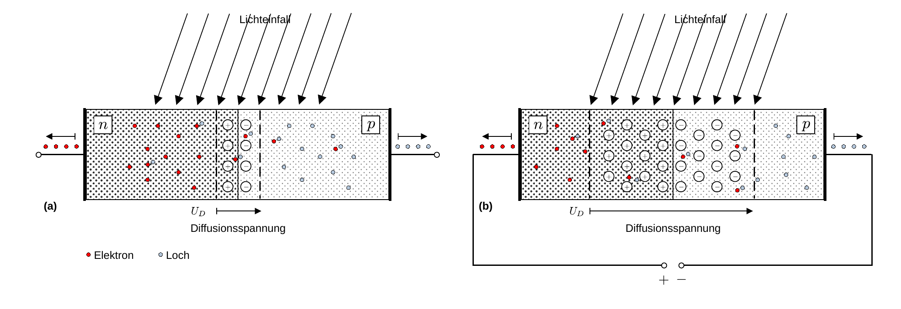
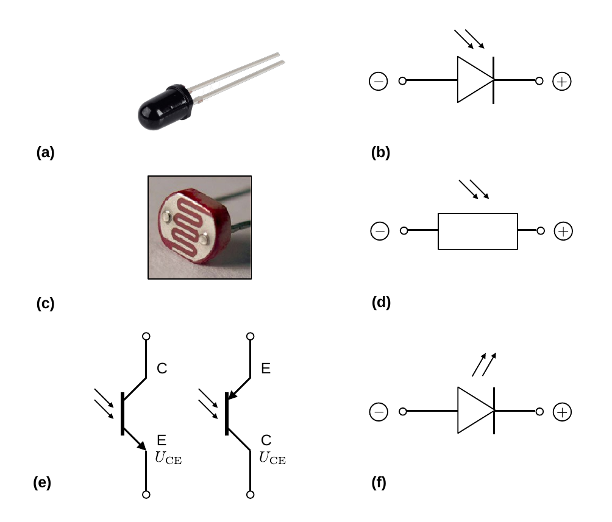
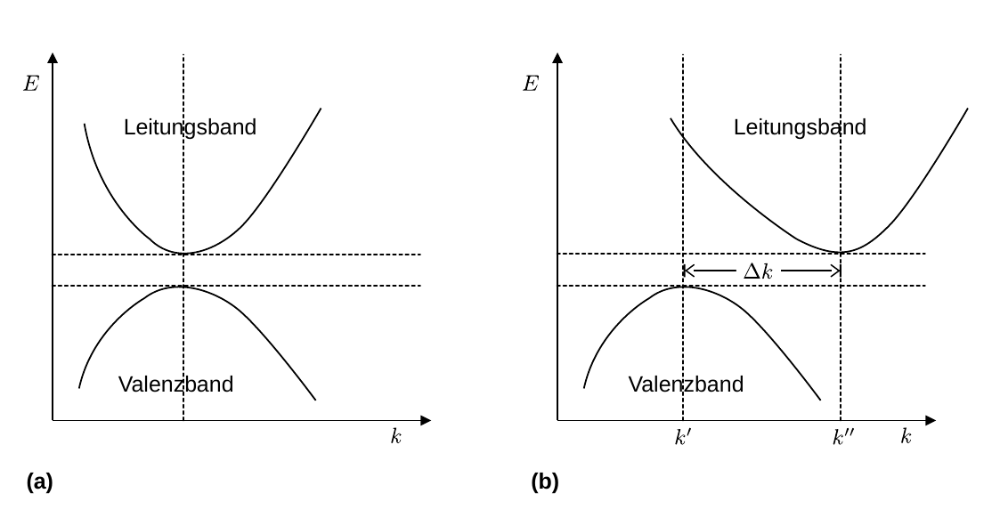

# Hinweise für den Versuch **Elektrische Bauelemente**

## Photodiode

Eine Photodiode, ist eine Diode, auf die Licht ungehindert einfallen kann, wie in **Abbildung 1** dargestellt:

---

**Abbildung 1**: (Funktionsweise einer Diode als Photodiode, unter ungehindertem Lichteinfall. Abbildung (a) zeigt die Photodiode ohne äußere Beschaltung. Abbildung (b) zeigt die Photodiode in Sperrrichtung)

---

Die Bandlücke in Si beträgt $E_{g}=1.1\ \mathrm{eV}$ und liegt damit im Energiebereich sichtbaren Lichts. Fällt Licht hinreichend kurzer Wellenlänge auf die Diode kommt es im HL-material zum [inneren Photoeffekt](https://de.wikipedia.org/wiki/Photoelektrischer_Effekt#Innerer_photoelektrischer_Effekt): Valenzelektronen werden aus ihrer Bindung gelöst und ins Leitungsband gehoben. Gleichzeitig entsteht im Valenzband ein Loch. Sowohl Elektron, als auch Loch stehen daraufhin als freie Ladungsträger zur Verfügung. Findet der Photoeffekt im Grenzbereich der Diode statt kommt es aufgrund von $U_{D}$ zur sofortigen Ladungstrennung. Den entstehenden Strom bezeichnet man als **Driftstrom**. Elektron-Loch-Paare jenseits der Grenzschicht tragen ebenfalls zum Stromfluss bei. In diesem Fall muss einer der beiden Ladungsträger, Elektron oder Loch, die Grenzschicht der Diode überwinden. Diesen Beitrag zum Gesamtstrom bezeichnet man als **Diffusionsstrom**. 

- Ohne weitere äußere Anschlüsse, wie in **Abbildung 1 (a)** gezeigt, baut sich eine materialspezifische charakteristische Spannung an den Klemmen der Diode auf. 
- Schließt man die Diode kurz fließt ein Strom $I_{\mathrm{Ph}}$ proportional zur einfallenden Lichtintensität. In dieser Form würde man die Photodiode als **Solarzelle** betreiben.  
- Wird die Diode in Sperrrichuntg betrieben, wie in **Abbildung 1 (b)** gezeigt, verändert sich der sich einstellende Sperrstrom $I_{S}$ proportional zur einfallenden Lichtintensität. 

Eine Photodiode, als elektronisches Bauelement, ist in **Abbildung 2 (a)** gezeigt. Das Schaltsymbol einer Photodiode ist in **Abbildung 2 (b)** gezeigt.

---

(**Abbildung 2**: Beispiele für eine Photodiode (a) als Bauelement und (b) als Schaltsymbol, einen Photowiderstand (LDR) (c) als Bauelement und (d) als Schaltsymbol, (e) das Schaltsymbol eines Phototransistors und (f) das Schaltsymbol einer Leuchtdiode (LED))

---

## Photowiderstand (LDR)

Nach dem gleichen Prinzip, aber im Vergleich zur Photodiode langsamer und träger in seinem Verhalten funktioniert der **Photowiderstand oder LDR (engl. *light dependent resistor*)**. Dabei wird eine dünne Schicht aus dem photosensitivem Halbleitermaterial auf eine Keramikschicht aufgebracht. Der Strom bei anliegender Spannung wird dann i.a. durch kammartige Elektroden abgegriffen. Ein VDR, als elektronisches Bauelement, ist in **Abbildung 2 (c)** gezeigt. Das Schaltsymbol eines VDR ist in **Abbildung 2 (d)** gezeigt. 

## Phototransistor

Zur technischen Anwendung würde man eine Photodiode nicht einfach als Diode, sondern als **Phototransistor** betreiben. Dabei handelt es sich i.a. um einen bipolaren pnp- oder pnp-Transistor, dessen Basis-Kollektor-Sperrschicht einer externen Lichtquelle zugänglich ist. Die grundlegende Funktionsweise von Transistoren wird im **P1 Versuch [Transistor und Operationsverstärker](https://gitlab.kit.edu/kit/etp-lehre/p1-praktikum/students/-/tree/main/Transistor_und_Operationsverstaerker)** ausgiebig diskutiert. Im Gegensatz zu einem normalen bipolaren Transistor hat ein Phototransistor i.a. nur zwei Klemmen, für den Kollektor und den Emitter. 

In der Basis-Kollektor-Sperrschicht werden, wie bei der Photodiode, durch den inneren Photoeffekt Elektron-Loch-Paare erzeugt. Durch die zwischen Kollektor und Emitter anliegende äußere Spannung werden die Ladungen getrennt und der Ladungsfluss durch den statischen **Stromverstärkungsfaktor $\beta$** des Transistors gleichzeitig verstärkt. Die Basis wird i.a. nicht durch einen eigenen Spannungsanschluss, sondern durch den sich bei Beleuchtung einstellenden Photostrom $I_{\mathrm{Ph}}$ gesteuert. Übliche Verstärkungen liegen im Bereich 
$$
\begin{equation*}
\beta\approx100\ldots 1000.
\end{equation*}
$$
Der Phototransistor besitzt eine um den Faktor $\beta$ höhere Lichtempfindlichkeit, als die Photodiode, weist aber ein sich langsamer entwickelndes Stromsignal auf. 

Bei der Darstellung der Kennlinie wird meist eine Auftragung des Kollektorstroms $I_{\mathrm{C}}$ über der Spannung $U_{\mathrm{CE}}$ zwischen Kollektor und Emitter in Abhängigkeit von der Beleuchtungsstärke gewählt. Das Schaltsymbol eines Phototransistors ist in **Abbildung 2 (e)** gezeigt. 

## Leuchtdiode

**[Leuchtdioden oder LEDs](https://de.wikipedia.org/wiki/Leuchtdiode) (engl. *light emitting diode*)**, senden Licht aus, wenn sie in Durchlassrichtung betrieben werden. In diesem Fall wird also elektrische Energie in Licht umgewandelt. 

Die Leuchtdiode besteht aus einem n-leitenden Grundhalbleiter, auf dem eine sehr dünne p-leitende Halbleiterschicht mit großer Löcherdichte aufgebracht wird. Durch die hohe Löcherdichte rekombinieren die Elektronen der n-leitenden HL-Schicht sehr schnell mit den Löchern der p-leitenden HL-Schicht. Dabei fällt ein Elektron aus dem Leitungsband (d.h. aus dem höheren Energieniveau) ins Valenzband (d.h. auf ein niedrigeres Energienivau) und gibt die Energiedifferenz $E_{g}$ der Bandlücke in Form eines Lichtimpulses mit der Wellenlänge
$$
\begin{equation*}
\lambda = \frac{h\,c}{E_{g}} = \frac{1240\,\mathrm{eV\,nm}}{E_{g} [\mathrm{eV}]}
\end{equation*}
$$
ab. $E_{g}$ bestimmt die Farbe des abgestrahlten Lichts, die somit von der genauen Wahl und Beschaffenheit des Halbleitermaterials abhängt. Da die p-Schicht sehr dünn ist, kann das Licht entweichen und wird nicht wieder absorbiert. Im Gegensatz zu einer normalen [Gleichrichterdiode](https://de.wikipedia.org/wiki/Gleichrichter#Moderne_Halbleitergleichrichter) besteht eine LED nicht aus Si sondern aus anderen Stoffverbindungen, wie z.B. Galliumarsenid (GaAs), einem [III-V-Verbindungshalbleiter](https://de.wikipedia.org/wiki/III-V-Verbindungshalbleiter). GaAs gehört zur Gruppe der sog. [**direkten HL**](https://de.wikipedia.org/wiki/Bandl%C3%BCcke#Direkte_Bandl%C3%BCcke), während Si ein **indirekter HL** ist. Der Unterschied dieser beiden HL-Typen ist in **Abbildung 3** schematisch dargestellt:

---

(**Abbildung 3**: Schematische Darstellung einer (a) direkten und (b) indirekten Bandlücke in einem HL, im reziproken Raum, in dem man die Energie $E$ auf der $y$- und dem Wellenzahlvektor $k$ (bzw. den Impulsübertrag $\Delta p$) auf der $x$-Achse aufträgt)

---

Für diese Unterscheidung betrachtet man die Energiebänder des HL im [**reziproken Raum**](https://de.wikipedia.org/wiki/Reziprokes_Gitter), in dem die Energie $E$ auf der $y$- und dem Wellekzahlvektor $k$ auf der $x$-Achse dargestellt sind. $k$ ist dabei zum Impulsübertrag $\Delta p$ z.B. bei Übergängen zwischen Valenz- und Leitungsband äquivalent.

Als **direkte Bandlücke** bezeichnet man eine Bandstruktur im reziproken Raum, bei der das Energieminimum $E_{L}$ des Leitungsbandes direkt über dem Energiemaximum $E_{V}$ des Valenzbandes liegt. In diesem Fall kann ein Elektron ohne nennenswerten Impulsübertrag vom Leitungs- ins Valenzband gelangen. Diese Situation ist in **Abbildung 3 (a)** gezeigt. Ist dies nicht der Fall, spricht man von einer **indirekten Bandlücke**. Diese Situation ist in **Abbildung 3 (b)** gezeigt.

Findet der Übergang eines Elektrons vom Leitungs- ins Valenzband elektronisch, d.h. durch die Abstrahlung eines Photons mit der Wellenlänge $\lambda$ statt, trägt das abgestrahlte Photon den Impuls
$$
\begin{equation*}
p = \frac{h\ c}{\lambda} = \frac{1240\,\mathrm{eV\,nm}}{\lambda [\mathrm{nm}]}= \frac{E_{g}}{c}
\end{equation*}
$$
bei. Bei einem indirekten Halbleiter erfordert ein solcher Übergang i.a. einen zusätzlichen Stoßpartner für den Impulsübertrag, so dass die Energie-Impuls-Relation der Reaktion erhalten bleibt. I.a. wird dieser Impuls in Form von Gitterschwingungen (Phononen) vom Halbleiter aufgenommen. Der Umstand, dass bei indirekten Halbleitern ein zusätzliches Quasiteilchen am Übergang beteiligt ist, reduziert die Wahrscheinlichkeit für solche Übergänge. Stattdessen dominieren nicht-strahlende Übergänge wie die [Rekombination über Störstellen](https://de.wikipedia.org/wiki/Rekombination_(Physik)#Shockley-Read-Hall-Rekombination). Entsprechend leuchtet z.B. eine normale Si-[Gleichrichterdiode](https://de.wikipedia.org/wiki/Gleichrichter#Moderne_Halbleitergleichrichter) nicht. 

Bei einer aus GaAs bestehenden LED sind strahlende Übergänge im Gegensatz zum Si sehr häufig. Man bezeichnet die Anzahl abgestrahlter Photonen pro Übergang eines Elektrons vom Leitungs- ins Valenzband als Quantenausbeute. Diese liegt für GaAs bei  ${\approx}0.5$, für Si liegt sie bei ${\approx}10^{−5}$. Dieser Umstand erklärt, warum eine GaAs-Diode leuchtet und eine Si-Diode nicht. 

Schon bei kleinen Stromstärken ist bei LEDs eine Lichtabstrahlung wahrnehmbar. Die Lichtstärke wächst proportional mit der Stromstärke. Leuchtdioden reagieren sehr empfindlich auf einen zu großen Durchlassstrom, deshalb schalten Sie im Versuch einen strombegrenzenden Vorwiderstand in Reihe zur Leuchtdiode. Auch die Durchlassspannungen der Bauteile unterscheiden sich. Die $UI$-Kennlinie ist
in Folge dessen je nach Material der LED auf der $U$-Achse verschoben, alle LEDs weisen jedoch, wie normale Dioden, einen exponentiellen Anstieg des Durchlassstroms bei zunehmender Durchlassspannung auf.

## Essentials

Was Sie ab jetzt wissen sollten:

- Sie sollten wissen wie eine Photodiode funktioniert und auf welchem zugrundeliegenden Effekt ihre **Funktionsweise** beruht. 
- Sie sollten die **Unterschiede einer Photodiode zu einem Photowiderstand und zu einem Phototransistor** benennen können. 
- Sie sollten erklären können, **warum eine LED aus GaAs leuchtet, aber eine Photodiode aus Si nicht**. 

## Testfragen

1. Welche Wellenlänge gehört zur Energie von $E_{g}=1.1\ \mathrm{eV}$? 
2. Wie groß sind Wert und Polung der Spannung, die sich an einer Photodiode aufbauen, an der keine äußere Spannung anliegt? 
3. Wie würde Sie mit Hilfe einer Photodiode einen Versuch zum (inneren) Photoeffekt aufbauen? 

# Navigation

[Main](https://gitlab.kit.edu/kit/etp-lehre/p2-praktikum/students/-/tree/main/Elektrische_Bauelemente)

