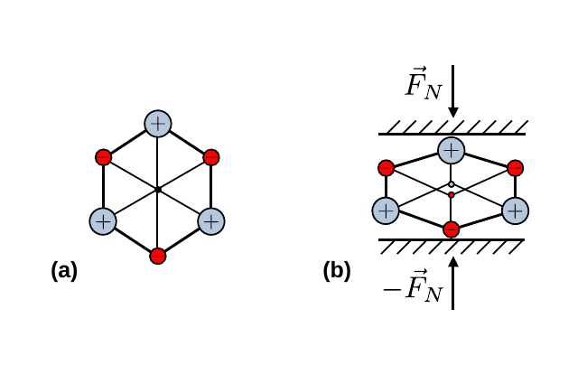

# Elektrische Bauelemente

## Piezoelektrischer Effekt

> Stoffe bei denen es unter der Einwirkung gerichteter mechanischer Spannung zur elektrischen Polarisation kommt bezeichnet man als [piezoelektrisch](https://de.wikipedia.org/wiki/Piezoelektrizit%C3%A4t). Man bezeichnet diesen Effekt als den **direkten piezoelektrischen Effekt** oder **direkten Piezoeffekt**. Umgekehrt verformen sich piezoelektrische Stoffe, wenn elektrische Spannungen an ihnen anliegen. Diesen Effekt bezeichnet man als **inversen Piezoeffekt**. 

Der Piezoeffekt tritt bei Stoffen auf, die polare Bindungen besitzen und deren Kristallstruktur Elementarzellen (EZ) ohne Punktsymmetrie am Zentrum der EZ aufweisen, wie dies z.B. bei Quarz ($\mathrm{SiO_{2}}$) der Fall ist. Eine vereinfachte Darstellung der Geometrie für Quarz ist in **Abbildung 1** gezeigt:

---

**Abbildung 1**: (Ein hexagonal nicht punktsymmetrsicher Schnitt durch Quarz, für den es unter mechanischer Spannung zum **direkten Piezoeffekt** kommt. Abbildung (a) zeigt eine EZ des Kristall ohne äußere, mechanische Spannungseinwirkung. Abbildung (b) zeigt die gleiche EZ unter einer äußeren, mechanischen Spannungseinwirkung)

---

ℹ️ Im Quarz bildet das vierwertige Si zwei polare Doppelbindungen mit zwei Sauerstoffatomen aus. Die Kristallstruktur weist einen Schnitt auf, entlang dessen sich eine hexagonale Struktur in einer Helix durch den Kristall windet, mit einer EZ, wie in **Abbildung 1 (a)** gezeigt. Diese weist keine Punktsymmetrie an ihrem Zentrum auf, ein Sauerstoffatom wird jeweils durch das Zentrum auf ein Si-Atom abgebildet und umgekehrt. Die Ladungsschwerpunkte der Sauerstoffatome (in rot) und der Si-Atome (in blau) fallen aufeinander, so dass der Kristall keine Nettopolarisation aufweist. Unter der Einwirkung einer gerichteten mechanischen Spannung, wie in **Abbildung 1 (b)** gezeigt, verschieben sich die Ladungsschwerpunkte und es kommt zur Polarisation die, in diesem Fall an den Oberflächen des Kristalls, auf die die mechanische Spannung jeweils ausgeübt wird zur Ladungstrennung und damit zu einer elektrischen Spannung führt. 

Im Gegenzug führt das Anlegen einer elektrischen Spannung (im Bild mit positiver Polung unten und negativer Polung oben) zu einer Abflachung des Kristalls in der angegebenen Richtung. Dieser **Längs-Effekt** ist am einfachsten zu beschreiben. Je nach Kristallstruktur kann es aber auch zu **Quer- und Scher-Effekten** kommen.

Die mathematische Beschreibung erfolgt im Allgemeinen effektiv, d.h. ohne Berücksichtigung der mikroskopischen Struktur, im Rahmen z.B. der [Kontinuumsmechanik](https://de.wikipedia.org/wiki/Kontinuumsmechanik) in erster Näherung durch die Gleichung:
$$
\begin{equation*}
P=d\,T = e\,S,
\end{equation*}
$$
wobei $P$ der Polarisation des Kristalls, $T$ der mechanischen Spannung und $S$ der relativen Verformung entsprechen. 

🤓 Bei den 
$$
\begin{equation*}
d_{ijk} = \frac{\partial S_{ij}}{\partial E_{k}}
\end{equation*}
$$
handelt es sich um die **piezoelektrischen Verzerrungskoeffizienten**. Bei den 
$$
\begin{equation*}
e_{ijk} = \frac{\partial T_{ij}}{\partial E_{k}}
\end{equation*}
$$
handelt es sich um die **piezoelektrischen Spannungskoeffizienten**. Beide lassen sich jeweils zu einem Tensor dritter Stufe anordnen.

### Funktionsweise einer Quarzuhr

Die Funktionsweise einer Quarzuhr beruht auf dem Piezoeffekt von Quarz. Im Werk wird ein Resonator, wie eine Stimmgabel, auf eine Eigenfrequenz 
$$
\begin{equation*}
\nu_{0}=32.768\,\mathrm{kHz}
\end{equation*}
$$
kalibriert. Dies erfolgt unter Auftragung dünner Goldschichten, um die Trägheit des Resonators zu erhöhen, bis die gewünschte Eigenfrequenz erreicht ist. 

💡 Bei $\nu_{0}$ handelt es sich um die niedrigste Zweierpotenz
$$
\begin{equation*}
2^{15}=32768
\end{equation*}
$$
oberhalb des Frequenzbereichs von ${\approx}20\ \mathrm{kHz}$, ab dem das menschliche Ohr Frequenzen nicht mehr wahrnimmt. Die Uhr macht dadurch beim Betrieb keine wahrnehmbaren Geräusche. In der Uhr wird die Spannung aufgrund des piezoelektrischen Effekts abgegriffen und durch einen Operationsverstärker positiv auf den Kristall zurück gekoppelt, **was den Quarz zur resonanten Schwingung anregt**. Die Schwingung wird durch die Toggle-Zustände von 15 in Reihe geschaltete Jack-Kilby Flipflops (JK-FF) 15 mal halbiert, woraus sich eine Schwingung von einer Sekunde einstellt. ☝️ Die Funktionsweise eines JK-FF wird im **P1 Versuch [Schaltlogik](https://gitlab.kit.edu/kit/etp-lehre/p1-praktikum/students/-/blob/main/Schaltlogik/doc/Hinweise-Speicher.md)** erklärt. 

🔔 Sehr gute Quarzuhren verlieren auf einen Tag nicht mehr als 5 Sekunden, was einer Präzision von besser als $6\times10^{-5}$ entspricht. 

---

[Main](https://gitlab.kit.edu/kit/etp-lehre/p2-praktikum/students/-/tree/main/Elektrische_Bauelemente/README.md)

