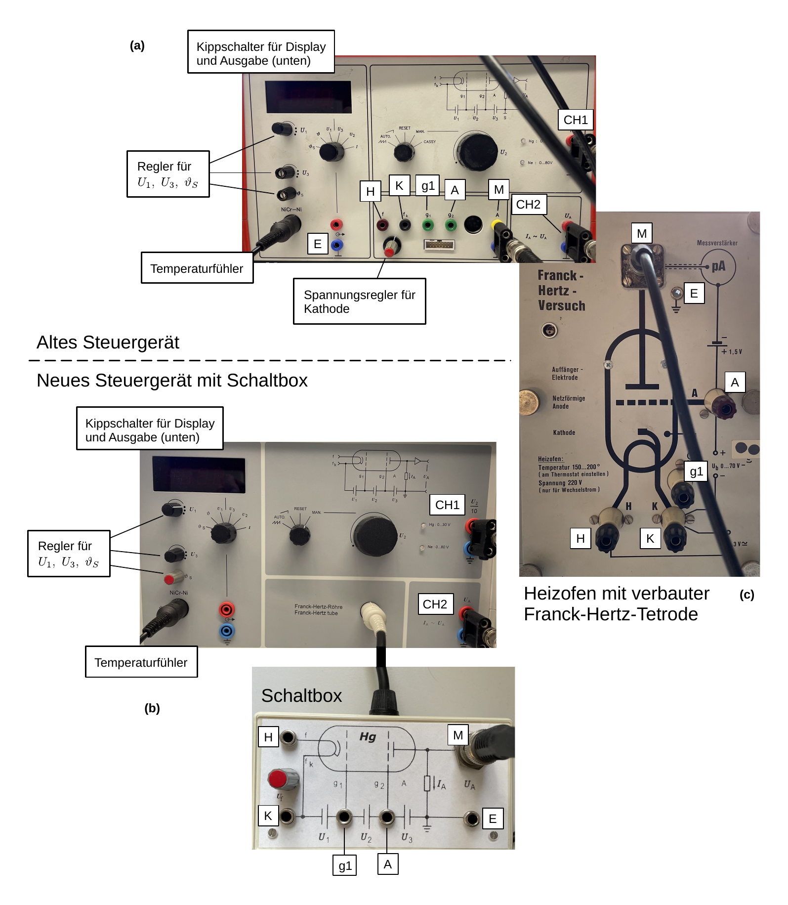
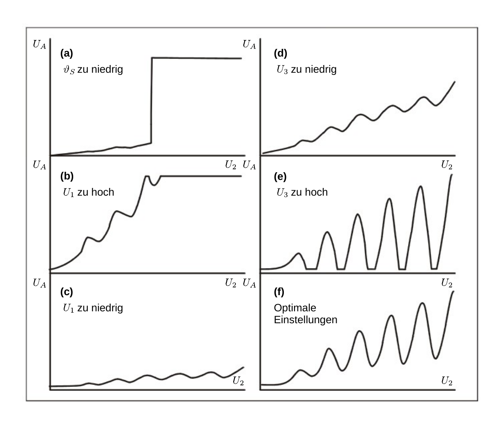

# Hinweise für den **Franck-Hertz-Versuch**

## Heizofen

- Der Heizofen ist mit einem $\mathrm{NiCr}$-$\mathrm{Ni}$ Temperaturfühler und mit einem Thermostaten ausgestattet. Bei Erreichen der Solltemperatur $\vartheta_{S}$ leuchtet eine Diode am Betriebsgerät grün auf. 
- Die Heiztemperatur reicht von $\vartheta\approx140$ bis $220^{\circ}\mathrm{C}$, die Röhre sollte im Dauerbetrieb jedoch nicht längere Zeit bei mehr als $200^{\circ}\hspace{0.05cm}\mathrm{C}$ betrieben werden. Die nominelle Betriebstemperatur der Röhre, laut Hersteller, liegt bei $180^{\circ}\mathrm{C}$. **Im Praktikum verwenden Sie Betriebstemperaturen bis zwischen $130$ und $160^{\circ}\mathrm{C}$**.  
- Es ist nicht möglich die Röhre mit dem Ofen vollkommen homogen zu beheizen. Man kann beobachten, dass das Hg bevorzugt in bestimmten Bereichen der Glaswand kondensiert. Für $p_{\mathrm{Hg}}$ ist die kälteste Stelle maßgebend. Obwohl der empfindliche Teil des Temperaturfühlers sich im Ofen auf gleicher Höhe befindet kann die Temperatur in der Röhre von der des Temperaturfühlers geringfügig abweichen.
- Es sollte sich kein Hg an K niederschlagen, da dies die Funktion von K bis zur Zerstörung beeinträchtigen kann. **Sie vermeiden dies, indem Sie die Kathodenheizung ($U_{K}$) immer angeschaltet lassen solange der Ofen beheizt ist.**

## Betriebsgerät

Im Versuch haben wir zwei leicht verschiedene Aufbauten der Firma [Leybold Didactic](https://www.leybold-shop.de/chemie/versuche-sek-ii-universitaet/allgemeine-und-anorganische-chemie/stoffeigenschaften/aufbau-der-materie/franck-hertz-versuch/vc1-1-3-6.html), wie in **Abbildung 1** gezeigt in Verwendung:

---

**Abbildung 1**: (Verschaltung der FHT einschließlich Heizofen mit dem alten und neuen Betriebsgerät)

---

Dieser Aufbau sieht vor, dass man die komplette FHT einschließlich Heizofen über ein integriertes Steuergerät bedient. Auf der Frontseite des Ofens befinden sich entsprechende Anschlüsse. 

Die Frontseite des älteren Steuergeräts (mit orangefarbenem Gehäuse) ist in **Abbildung 1 (a)** gezeigt. Von diesem Steuergerät aus ist die Beschaltung der FHT und des Ofens offensichtlicher zu erkennen. Die Frontseite eines neueren Steuergeräts ist in **Abbildung 1 (b)** gezeigt. Hier erfolgt die Ansteuerung über ein  einziges Kabel. Für die Verwendung im Praktikum haben wird dieses Kabel in eine Schaltbox geführt und die einzelnen Spannungsstränge ihrer Funktion nach wieder getrennt. In **Abbildung 1 (c)** sind die entsprechenden Anschlüsse an der Frontplatte eines der Heizöfen gezeigt. Folgen sie zur Beschaltung den Angegebenen Buchstaben. Mit CH1 und CH2 sind die Ausgänge für $U_{2}/10$ und $U_{A}$ zur Auslese am Oszilloskop gezeigt. 

### Spannungssteuerung

Für die Darstellung von $U_{\mathrm{A}}(U_{B})$ wird eine ansteigende Spannung $U_{2}$ verwendet. Diese darf sich aber nicht zu schnell ändern, da sich ein **stationärer Zustand in der Röhre** nur relativ langsam einstellt. Langsame Vorgänge sind z.B. die Bewegung und Rekombination der Ionen, sowie die Rückkehr optisch verbotener angeregter Zustände des Hg in den Grundzustand. 

Die Betriebsgeräte der Röhre stellen die folgenden Einstellmöglichkeiten zur Verfügung: 

- $U_{1}=0\ldots 5\ \mathrm{V}$;
- $U_{2}=0\ldots 30\ \mathrm{V}$;
- $U_{3}=0\ldots -10\ \mathrm{V}$.

Dabei werden $U_{1}$ und $U_{3}$ von Hand geregelt. Für die Variation von $U_{2}$ werden **drei Betriebsformen** angeboten: 

- Eine (schnelle) Sägezahnspannung zur oszillographischen Aufnahme von $U_{\mathrm{A}}$; 
- Eine (langsame) lineare Rampe für die Aufzeichnung der Kurve als einem einmaligen Ereignis, z.B. mit der Speicherfunktion des Oszilloskops; oder 
- Eine über ein Potentiometer von Hand einstellbare Gleichspannung für eine punktweise Aufnahme von $U_{\mathrm{A}}$ (Bezeichnung MAN.). 

Die Sägezahnspannung empfiehlt sich lediglich zum Kennenlernen der Apparatur und beim Einstellen von $\vartheta$, $U_{1}$ und $U_{3}$. Um die Verhältnisse im quasi-stationären Zustand aufzuzeichnen, wird das **Speicheroszilloskop am besten mit der linearen Rampe** ausgelöst. Der Unterschied zur Darstellung mit Hilfe der Sägezahnspannung sollte deutlich sichtbar sein. Die manuelle Einstellung benötigen Sie z.B. für die **Aufgaben 2.2 und 3.2**.

Für die Darstellung von $U_{A}(U_{2})$ empfiehlt sich der **XY-Betrieb des Oszilloskops**. Die Daten können als $U_{2}U_{A}$-Wertepaare per USB-Stick auf dem Jupyter-Server übertragen und anschließend weiter verarbeitet werden.

## Ansteuerung der Franck-Hertz-(Hg)-Tetrode

Parameter zur Ansteuerung der FHT sind $\vartheta_{S},\ U_{1},\ U_{2},\ U_{3}$. In **Abbildung 2** ist gezeigt, welche Effekte die einzelnen Steuerparameter grundsätzlich haben sollten:

---

**Abbildung 2**: (Effekt der Steuerparameter $\vartheta_{S},\ U_{1},\ U_{2},\ U_{3}$)

---

Auf der $x$-Achse sind jeweils ansteigende Werte von $U_{2}$ gezeigt, auf der $y$-Achse $U_{A}$. 

### $\vartheta_{S}$ zu niedrig

Steigt $U_{A}$ mit zunehmenden Werten von $U_{2}$ sprunghaft an, wie in **Abbildung 2 (a)** gezeigt, kommt es zur Gasentladung. Dieser Vorgang ist i.a. von fahlblauem Leuchten der Röhre begleitet. Sie sollten eine **unkontrollierte Gasentladung unbedingt vermeiden**, um die Röhre nicht zu beschädigen. 

Schalten Sie in diesem Fall $U_{2}$ sofort ab und erhöhen Sie $\vartheta_{S}$, um $\lambda$ zu reduzieren. 

### $U_{1}$ zu niedrig oder zu hoch

Das Raumladungsgitter G1 befindet sich dicht hinter K. Durch $U_{1}$ kommt es zwischen K und G1 daher zu hohen elektrischen Feldern, deren Funktion es ist die Raumladungswolke um K abzusaugen, so dass weitere Elektronen aus K nachrücken können. Die Spannung $U_{1}$ reguliert auf diese Weise effektiv den Elektronenstrom durch die Röhre und somit die **Steigung von $U_{A}$** als Funktion von $U_{2}$.  

In **Abbildung 2 (b)** geht $U_{A}$ bereits weit vor Erreichen des Maximalwertes von $U_{2}$ in die Sättigung der Messanordnung. $U_{1}$ sollte nach unten geregelt werden. In **Abbildung 2 (c)** sollte $U_{1}$ nach oben geregelt werden. Bleibt der Verlauf von $U_{A}$ selbst bei maximaler Einstellung von $U_{1}\approx 5\ \mathrm{V}$ flach regeln Sie $\vartheta_{S}$ nach Möglichkeit nach unten, um die mittlere freie Weglänge der Elektronen auf dem Weg durch die Röhre zu erhöhen.

### $U_{3}$ zu niedrig oder zu hoch

Die Höhe von $U_{3}$ reguliert die Ausprägung der beobachteten Minima und Maxima. Gleichzeitig wird $U_{A}$ für steigende Werte von $U_{3}$ insgesamt reduziert. Ohne besondere Optimierung von $U_{3}$ könnte $U_{A}$, bei geeigneter Einstellung von $U_{1}$ so aussehen, wie in **Abbildung 2 (d)** gezeigt. 

Von **Abbildung 2 (d)** gelangen zu **Abbildung 2 (f)**, indem Sie vorsichtig iterativ erst $U_{3}$ erhöhen und dann $U_{1}$ nachregeln (ebenfalls leicht erhöhen). Von **Abbildung 2 (e)** gelangen Sie zu **Abbildung 2 (f)**, indem Sie vorsichtig iterativ $U_{3}$ reduzieren und dann $U_{1}$ nachregeln (ebenfalls leicht reduzieren).  

**Es erfordert einiges Geschick $U_{A}$ optimal zu präparieren. Nehmen Sie sich ausreichend Zeit das Wechselspiel der Steuerparameter zu studieren.**

### Beobachtung höherer Anregungen von Hg

Bei Normalbetrieb der FHT, wie er z.B. für **Aufgabe 2** vorliegt, kommt es so gut wie nie zu Anregungen höherer Energiezustände im Hg. Grund hierfür ist die hohe Wahrscheinlichkeit mit der der $`6^{1}\mathrm{S}_{0}\to 6^{3}\mathrm{P}_{1}`$ Übergang stattfindet. Sobald die kinetische Energie eines Elektrons ausreicht, um diesen Übergang anzuregen steigt die Wahrscheinlichkeit für einen unelastischen Stoß stark an. Beim Stoß verliert das Elektron seine gesamte kinetische Energie und muss wieder von Null an beschleunigt werden. Dadurch hat das Elektron kaum Gelegenheit zwischen zwei unelastischen Stößen genug kinetische Energie aufzunehmen, um höhere Energiezustände im Hg anzuregen. 

Um dies zu ändern muss die FHT so betrieben werden, dass es während der Beschleunigungsphase kaum zu Stößen zwischen Elektronen und Hg-Atomen kommen kann. Dies lässt sich erreichen, indem man die mittlere freie Weglänge, durch Reduktion von $\vartheta_{S}$, erhöht und die Beschleunigungsstrecke stark verkürzt. Sobald die Elektronen genug kinetische Energie über die Beschleunigungsstrecke aufgenommen haben, um auch höhere Energiezustände im Hg anregen zu können wird die Stoßwahrscheinlichkeit dadurch erhöht, dass man die Elektronen über eine hinreichend lange Wegstrecke driften lässt.

# Navigation

[Main](https://gitlab.kit.edu/kit/etp-lehre/p2-praktikum/students/-/tree/main/Franck_Hertz_Versuch)
