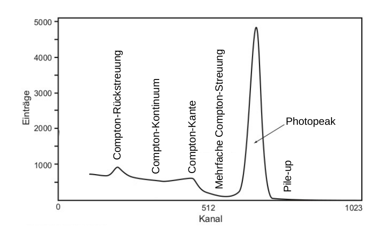

# Hinweise für den Versuch **Gammaspektroskopie**

## Eigenschaften des Gammaspektrums

Die schematische Darstellung eines zu erwartenden mit einem Photondetektor aufgezeichneten Spektrums für einen Strahl mono-energetischer Photonen mit der Energie $E_{\gamma}$ ist in **Abbildung 1** gezeigt:

---

**Abbildung 1**: (Schematische Darstellung eines zu erwartenden mit einem Photondetektor aufgezeichneten Spektrums für einen Strahl mono-energetischer Photonen der Energie $E_{\gamma}$, nach [H. Kolanoski, N. Wermes *Teilchendetektoren* (DOI 10.1007/978-3-45350-6)](file:///home/rwolf/Downloads/978-3-662-45350-6-1.pdf).)

---

Es handelt sich dabei um ein Histogramm. Auf der $x$-Achse sind die Kanäle des MCA aufgetragen, auf der $y$-Achse die Häufigkeit, mit der ein Eintrag im entsprechenden Kanal aufgezeichnet wurde. Jeder Eintrag im Histogramm entspricht einer einzelnen Messung, ein Spektrum besteht also immer aus einer Vielzahl von Einzelmessungen. 

In **Abbildung 1** sind die folgenden grundlegenden Eigenschaften eines typischen Spektrums klar zu erkennen:

- Der **Photopeak** bei $E_{\gamma}$ resultiert aus der vollständigen Absorption der nachgewiesenen Photonen. Wir erwarten eine Normalverteilung deren Erwartungswert $\mu_{Q}$ wir $E_{\gamma}$ zuordnen können.

- Einträge rechts des Photopeaks sind auf Energie-Depositionen mehrerer zeitgleich nachgewiesener Photonen (**pile-up**) zurückzuführen. 

- Das **Compton-Kontinuum** resultiert aus Ereignissen bei denen ein Photon ein Elektron aus dem Detektormaterial ausgelöst und dann den Detektor wieder verlassen hat. Die **Compton-Kante** entspricht dabei der Rückstreuung des Photons um $\theta=180^{\circ}$. Die Compton-Kante ist für das Spektrum ebenso charakteristisch, wie der Photopeak. Sie befindet sich im Spektrum an der Position $`Q(E^{\prime\,\mathrm{max}}_{\mathrm{e}})`$, die nur von $E_{\gamma}$ und $m_{\mathrm{e}}$ abhängt.

- Einträge zwischen der Compton-Kante und dem Photopeak können durch **mehrfache Compton-Streuung** erklärt werden, nach der das gestreute Photon $\gamma'$ den Detektor schließlich verlässt. Würde $\gamma'$ den Detektor nicht verlassen würde die Messung zum Photopeak beitragen. 

- Ein weiteres charakteristisches Merkmal des gezeigten Spektrums ist ein Peak, der durch **Compton-Rückstreuung** entsteht. Dabei vollzieht ein Photon $\gamma$ Compton-Streuung unter $180^{\circ}$, z.B. in einer den Detektor umgebenden Abschirmung. Das gestreute Photon $\gamma'$ wird daraufhin im Detektor aufgefangen und nachgewiesen, wo es die gesamte Energie $E'_{\gamma}$ in einem Photopeak deponiert.

In der Abbildung nicht gezeigt können für Photonen mit $E_{\gamma}\gtrsim1\ \mathrm{MeV}$, für die auch Paarbildung möglich ist, noch zwei weitere charakteristische Peaks im Spektrum auftreten. Dabei wird das Positron aus der Paarbildung im Detektormaterial abgebremst und zerstahlt schließlich in zwei antiparallel auslaufende Photonen gleicher Energie $`E'_{\gamma}=m_{\mathrm{e}}c^{2}`$. Beim Auftreten des [**Single-Escape Peaks**](https://de.wikipedia.org/wiki/Escapelinie) entkommt eines dieser Photonen der Detektion; der Peak befindet sich an der Stelle
$$
\begin{equation*}
Q(E_{\mathrm{S.E.}}) = Q(E_{\gamma}-m_{\mathrm{e}}c^{2}),
\end{equation*}
$$
beim **Double-Escape Peak** entkommen beide Photonen der Detektion; der Peak befindet sich an der Stelle
$$
\begin{equation*}
Q(E_{\mathrm{S.E.}}) = Q(E_{\gamma}-2\,m_{\mathrm{e}}c^{2}).
\end{equation*}
$$

## Energieauflösung des verwendeten Photondetektors

Unter Verwendung mehrerer Präparate, deren Energien der emittierten Photonen bekannt sind können Sie aus den aus den Photopeaks (und vergleichbarer Strukturen), für deren Verlauf Sie in guter Näherung eine Normalverteilung annehmen können, die **Energieauflösung des Detektors** bestimmen. 

Als erwarteten **Verlauf der relativen Energieauflösung** können Sie hierzu z.B. das folgende Modell annehmen: 
$$
\begin{equation}
\begin{split}
\frac{\Delta E_{\gamma}}{E_{\gamma}}(A, B, C) 
&= \frac{A}{\sqrt{E_{\gamma}}}\oplus\frac{B}{E_{\gamma}} \oplus C \\
&=\sqrt{\frac{A^{2}}{E_{\gamma}}+\frac{B^{2}}{E^{2}_{\gamma}}+C^{2}}, \\
\end{split}
\end{equation}
$$
wobei $A$, $B$ und $C$ freie Parameter des Modells sind. 

Der Term zu $A$ entspricht dem **Auflösungsverhalten aufgrund der zugrunde liegenden statistischen Prozesse**. Beachten Sie, dass durchaus auch andere funktionale Zusammenhänge zur Auflösung beitragen können, die im oben angegebenen Modell mit den Parametern $B$ und $C$ verbunden sind.  Dabei kann es sich um Unsicherheiten aufgrund der Digitalisierung, Signalübertragung und anderer Quellen handeln. 

Die erwartete Anzahl $\mu_{N_{\mathrm{e}}}$ der Elektronen an der Photokathode des im Photodetektor verbauten PM können Sie aus Gleichung (**(4)** [hier](https://gitlab.kit.edu/kit/etp-lehre/p2-praktikum/students/-/blob/main/Gammaspektroskopie/doc/Hinweise-Statistik.md)) abschätzen, wobei $\mu_{Q}$ dem Erwartungswert und $\sigma_{Q}$ der Standardabweichung des Peaks entsprechen. **Nutzen Sie hierzu nur den Anteil der Auflösung der zum $1/\sqrt{E_{\gamma}}$-Verlauf gehört.** 

## Akzeptanz des verwendeten Photondetektors

In die Effizienz des Detektors gehen Größen, wie die apparative Nachweiseffizienz $\epsilon$ aber auch die geometrische Akzeptanz $\Alpha$ des Detektors ein. Für isotrope Abstrahlung erwarten Sie für $\Alpha$ die Abhängigkeit
$$
\begin{equation}
\Alpha\propto\frac{1}{d^{2}},
\end{equation}
$$
wenn $d$ der Abstand des Präparats vom Detektor ist.

## Essentials

Was Sie ab jetzt wissen sollten:

- Sie sollten die einzelnen **Eigenschaften eines Gammaspektrums** in einem Photondetektor erkennen und zuordnen können.
- Sie sollten ein grundlegendes Verständnis dafür haben, wie der **Photopeak im Gammaspektrum** zustande kommt. 
- Sie sollten erklären können, wie **Energieeinträge oberhalb des Photopeaks** zustande kommen.

## Testfragen

1. Was können Sie aus **Abbildung 1** über die Energieauflösung des Photondetektors aussagen?
2. "Alle Photonen, die Energieeinträge im Photopeak hinterlasen haben haben all ihre Energie bei einem Stoß durch den Photoeffekt abgegeben." Ist diese Aussage korrekt?
3. "Alle Photonen, die Energieeinträge an der Compton-Kante hinterlassen haben, haben all ihre Energie durch Rückstreuung bei einem einzigen Stoßprozess im Detektormaterial hinterlassen und danach den Detektor verlassen." Ist diese Aussage korrekt?

# Navigation

[Main](https://gitlab.kit.edu/kit/etp-lehre/p2-praktikum/students/-/tree/main/Gammaspektroskopie)
