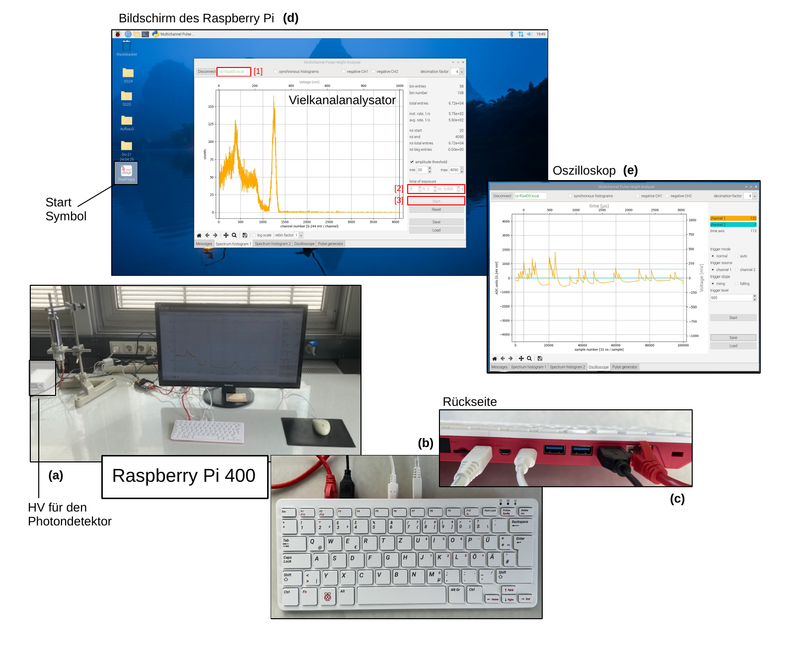

# Hinweise für den Versuch **Gammaspektroskopie**

## Messaufabu

Der Messaufbau zur Auslese des Versuchs **Gammaspektroskopie** ist in **Abbildung 1** zusammengefasst: 

---

  

**Abbildung 1** (Messaufbau zur Auslese des Versuchs **Gammaspektroskopie**)

---

Links im **Abbildung 1 (a)** ist der Photodetektor, als senkrecht eingespannter silberner Tubus in einer Halterung mit Stativ zu sehen. Links daneben befindet sich die weiße HV-Box zur Ansteuerung des Photomultipliers, die sich separat regeln lässt. Zwischen Photodetektor und Bildschirm, im Bild leicht nach hinten versetzt und mit einem roten LAN-Kabel verbunden, liegt der [Red Pitaya](https://de.wikipedia.org/wiki/Red_Pitaya) Vielkanalanalysator, der von einem [Raspberry Pi 400](https://gitlab.kit.edu/kit/etp-lehre/p2-praktikum/students/-/blob/main/doc/raspberry-pi-400-product-brief.pdf) ausgelesen wird. Dieser ist in der vor dem Bildschirm liegenden Tastatur verbaut (siehe **Abbildung 1 (b)**). Auf deren Rückseite befinden sich mehrere USB-Schnittstellen über die Sie auch die Daten auf Ihr Jupyter-notebook transferieren können (siehe **Abbildung 1 (c)**).    

Beim Einschalten der Spannungen an den Messplätzen sollte die HV-Box in Betrieb gehen und sowohl der Red Pitaya als auch der Raspberry Pi automatisch booten. Die **Benutzeroberfläche des Raspberry Pi** nach dem Boot-Vorgang ist in **Abbildung 1 (d)** zu sehen. 

Sie starten die Auslese des Red Pitaya durch **Doppelklick auf das Icon unten links auf dem Bildschirm**. Das gestartete Programm ist in der Mitte des Arbeitsbildschirms in **Abbildung 1 (d)** zu sehen. Der Red Pitaya und der Raspberry Pi sind über LAN-Kabel miteinander verbunden. Die IP-Addresse des Red Pitaya wird durch den Raspberry Pi automatisch gefunden. Sie erkennen die aktive Verbindung an der grünen IP-Adresse oben links in **Abbildung 1 (d)** ([1]). Der größte Teil des Fensters wird in der Abbildung durch ein Histogramm für eines der Präparate eingenommen. Darunter erkennen Sie einige Reiter, für ein weiteres Histogram und die Verwendung des Red Pitaya als **Oszilloskop** oder **on-board Pulsgenerator**. Auf der linken Seite des Fensters sehen Sie einige Einstellungsmöglichkeiten und einfache Diagnostikausgaben für Ratenmessungen und eine Start-Stop-Automatik. In **Abbildung 1 (e)** sehen Sie den Reiter zur Verwendung des Red Pitaya als Oszilloskop.

Der untere Bereich der Steuerelemente erlaubt es Ihnen jeweils Messungen zu starten ([2], der Stop erfolgt nach Ablauf der eingestellten Zeitspanne), einen Reset der Messung ([3]), eine Messung zu speichern oder zu laden. Die Speicherung erfolgt im cvs-Format. Die Bedienung ist recht intuitiv und einfach.  

**ACHTUNG: Schließen Sie das Programm nach Ihren Messungen und fahren Sie den Raspberry Pi geordnet, aus dem Betriebssystem heraus, runter. Dies geschiet zur Schonung der Hardware.**  

# Navigation

[Main](https://gitlab.kit.edu/kit/etp-lehre/p2-praktikum/students/-/tree/main/Gammaspektroskopie)
