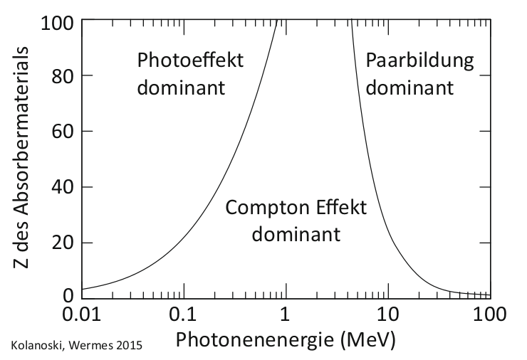
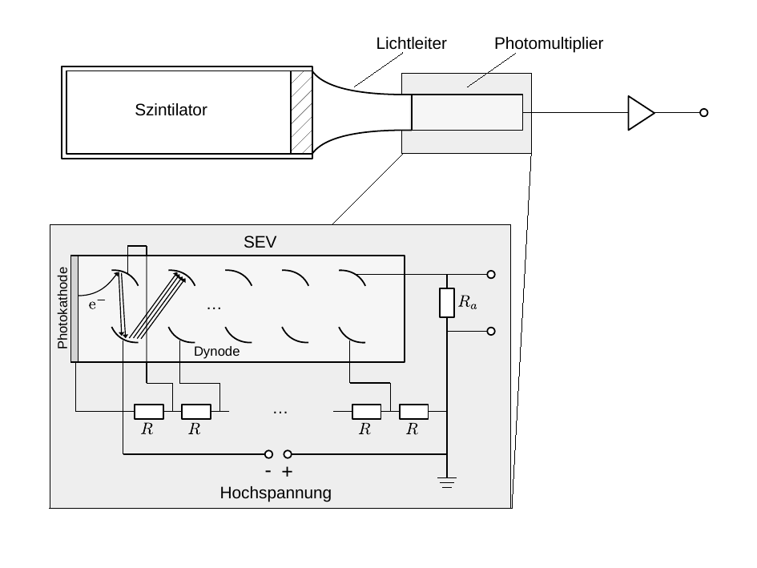

# Hinweise für den Versuch **Gammaspektroskopie**

## Spektrum, Histogramm und Dichte

Als Spektrum bezeichnet man die Untersuchung eines Objekts O nach einer Eigenschaft X.  Die Fragestellung lautet: 

> "Wie häufig treffe ich O mit der Eigenschaft X an?"

Diese Untersuchung erfolgt zunächst durch die Darstellung der [**Häufigkeitsverteilung**](https://de.wikipedia.org/wiki/H%C3%A4ufigkeitsverteilung) als [**Histogramm**](https://de.wikipedia.org/wiki/Histogramm), mit einer vorgegebenen Anzahl von Kategorien (Bins) $i$. Auf der $x$-Achse des Histogramms werden die Werte (oder Ausprägungen) von X aufgetragen, die bestimmen welchem Bin $i$ das Auftreten von O zuzuordnen ist. Auf der $y$-Achse wird die Häufigkeit $\Delta N_{i}$ aufgetragen, mit der im Laufe einer Messreihe ein Objekt O dem Bin $i$ zugeordnet wurde. 

Die Werte von $\Delta N_{i}$ hängen sowohl von der Gesamtanzahl der Beobachtungen, als auch von der Breite der Bins $\Delta x_{i}$ ab. Teilt man $\Delta N_{i}$ durch jeweils beide Größen, bezeichnet man die entstehende Verteilung als [**Dichtefunktion**](https://de.wikipedia.org/wiki/Dichtefunktion). Sind alle $\Delta x_{i}$ gleich, ist die Form der Häufigkeitsverteilung zur Form der Dichtefunktion gleich, was nicht der Fall ist, wenn $\Delta x_{i}$ für unterschiedliche $i$ variiert.  Im Grenzübergang unendlich vieler Bins verschwindend kleiner Breiten $\Delta x_{i}$ geht der Differenzenquotient in die Ableitung über: 
$$
\begin{equation*}
\lim\limits_{i\to\infty} \frac{\Delta N_{i}}{\Delta x_{i}} = \frac{\mathrm{d}N}{\mathrm{d}x}; \quad \text{mit: }\Delta x_{i}\to 0.
\end{equation*}
$$
Man findet daher auch oft Bezeichnungen, wie $\mathrm{d}N/\mathrm{d}x$ an der $y$-Achse eines Histogramms, bei dem die Häufigkeiten durch $\Delta x_{i}$ geteilt wurde. 

## Photondetektor

In diesem Versuch bestimmen Sie, wie häufig ein einlaufendes Photon mit der Energie $E_{\gamma}$ in einer Messreihe auftritt. Die Bestimmung von $E_{\gamma}$ erfolgt über den Nachweis elektrischer Ladung in einem geeigneten Detektormaterial. Die Ladung wird durch **Photoeffekt, Compton-Effekt und Paarbildung** im Detektormaterial primär erzeugt. **Abbildung 1** zeigt, in welchen Bereichen von $E_{\gamma}$ welcher Prozess die Wechselwirkung von Photonen mit Materie dominiert. Dabei bezeichnet Z die Kernladungszahl des Detektormaterials.

---

  

**Abbildung 1** (Dominante Bereiche für Photoeffekt, Compton-Effekt und Paarbildung, aus [H. Kolanoski, N. Wermes *Teilchendetektoren* (DOI 10.1007/978-3-45350-6)](file:///home/rwolf/Downloads/978-3-662-45350-6-1.pdf))

---

### Elektromagnetischer Schauer

Für $E_{\gamma}\gg 10\ \mathrm{MeV}$ erfolgt der Energieverlust in Materie durch ein Wechselspiel aus Paarbildung und Bremsstrahlung der entstehenden Elektron-Positron-Paare. Dies ist der Fall, bis eine bestimmte Energieschwelle unterschritten wird. Für Elekronen (Positronen) bezeichnet man diese Schwelle als [**kritische Energie**](https://de.wikipedia.org/wiki/Strahlungsl%C3%A4nge) ($E_{\mathrm{krit.}}$). Für $E_{\mathrm{e}}\lesssim E_{\mathrm{krit.}}$ überwiegt bei Elektronen (Positronen) der Energieverlust durch Ionisation den Energieverlust durch Bremsstrahlung. Als Faustformel für die Berechnung gilt:
$$
\begin{equation*}
E_{\mathrm{krit.}} \approx \frac{610\,\mathrm{MeV}}{Z+1.24}.
\end{equation*}
$$
Tabellarische Werte können z.B. [hier](https://pdg.lbl.gov/2015/AtomicNuclearProperties/) nachgeschlagen werden. 

Für Photonen überwiegt im Bereich zwischen $E_{\gamma}=100\ \mathrm{keV}$ bis $10\ \mathrm{MeV}$ der Compton-Effekt, für $E_{\gamma}\lesssim100\ \mathrm{keV}$ dominiert schließlich der Photoeffekt. Das Produkt jeder Reaktion sind Elektronen, Positronen und sekundäre Photonen mit jeweils niedrigerer Energie, wobei mit sinkender Energie schließlich der Photoeffekt als Prozess für die Entstehung weiterer Photonen im Detektormaterial die Vorherrschaft übernimmt. 

Aus einem einlaufenden Photon mit $E_{\gamma}\gg 10\ \mathrm{MeV}$ entsteht im Detektormaterial auf diese Weise eine große Zahl an Ladungsträgern, proportional zu $E_{\gamma}$, mit Energien im Bereich weniger eV. Man bezeichnet diesen Vorgang als [**elektromagnetischen Schauer**](https://de.wikipedia.org/wiki/Elektromagnetischer_Schauer). Einfache Modelle zur Beschreibung elektromagnetischer Schauer gehen ebenfalls auf Walter Heitler zurück. 

### Detektormaterial

Detektoren zur Bestimmung von Teilchenenergien bezeichnet man allg. als [Kalorimeter](https://de.wikipedia.org/wiki/Kalorimeter_(Teilchenphysik)). Ein Kalorimeter sollte eine hohe Energieauflösung und kurze Nachweiszeiten aufweisen. Es sollte außerdem groß genug sein, so dass Sekundärteilchen, z.B. eines elektromagnetischen Schauers, das aktive Detektormaterial möglichst nicht verlassen können. 

Man unterscheidet zwei Nachweisprinzipien der im elektromagnetischen Schauer entstandenen Ladungsträger: 

- Sie werden durch äußere elektrische Felder getrennt und direkt als abfallende Spannung über einen Lastwiderstand ausgelesen (**Ionisationkalorimeter**).
- Sie regen das Detektormaterial selbst wiederum zum Leuchten, d.h. zur Emission von Photonen, an. Diese Methode nutzt das Phänomen der [Szintillation](https://de.wikipedia.org/wiki/Szintillator), das einige Materialien aufweisen, die sich daher als Detektormaterial besonders gut eignen. Das entstehende Licht wird gesammelt, durch Photoeffekt wieder in ein elektrisches Signal umgewandelt und daraufhin als abfallende Spannung über einen Lastwiderstand ausgelesen (**Szintillationskalorimeter**).

Um $E_{\gamma}$ in diesem Versuch zu bestimmen verwenden wir einen anorganischen [Szintillationszähler](https://de.wikipedia.org/wiki/Szintillationsz%C3%A4hler), bestehend aus mit Tallium dotiertem NaJ (NaJ(Tl)). Dieser Nachweis hat den Vorteil, dass man i.a. keine äußere Spannung an das u.U. großflächig verbaute aktive Detektormaterial anlegen muss. Ein Nachteil besteht darin, dass nicht jedes Elektron (Positron) aus dem elektromagnetischen Schauer zur Emission eines Szintillations-Photons führt. Wichtige Eigenschaften nach denen Szintillationsmaterialien ausgewählt werden sind: 

- Es sollten möglichst viele Szintillationsniveaus im Material angeregt werden, um eine möglichst hohe **Ausbeute an Szintillationslicht pro Ladungsträger** zu erreichen.
- Die Lebensdauer dieser Niveaus ([**Relaxationszeit**](https://de.wikipedia.org/wiki/Relaxation_(Naturwissenschaft))) sollte nicht zu hoch sein, damit der Detektor zeitlich dicht aufeinander folgende Signale auflösen kann. 
-  Der Detektor sollte **für das erzeugte Szintillationslicht möglichst transparent** sein.
- Es sollte eine zur Wellenlänge des Szintillationslichts passende Photokathode mit hoher [Quantenausbeute](https://de.wikipedia.org/wiki/Quantenausbeute) existieren (siehe nächster Abschnitt). 

Als Szintillator hat NaJ(Tl) die folgenden konkreten Eigenschaften:

- Maximale Wellenlänge des emittierten Lichts: $423\ \mathrm{nm},\ ({\approx}3\,\mathrm{eV})$;
- Erwartete Anzahl emittierter Photonen pro MeV: 43000;
- Relaxationszeit der Anregung: $245\ \mathrm{ns}$.

Damit hat dieser Szintillator, im Vergleich zu anderen Materialien eine hohe Ausbeute an Szintillationsphotonen; im Gegenzug weist er eine vergleichsweise hohe Relaxationszeit auf. Die Prozesse des oben beschriebenen elektromagnetischen Schauers laufen deutlich schneller ab, so dass die individuellen Prozesse zur Deposition von $E_{\gamma}$ **zeitlich nicht aufgelöst sondern als ein Prozess ausgelesen werden**. 

### Auslesekette

Nach Erzeugung des Szintillationslichts besteht die primäre Aufgabe darin, dieses  Licht möglichst **verlustfrei aus dem aktiven Detektormaterial heraus** zur weiteren Auslese zu leiten. Um zu vermeiden, dass es den Szintillator ohne Nachweis verlässt ist dieser i.a. von einem diffus reflektierenden Material umgeben. Zusätzlich kann sich an das (beliebig geometrisch geformte) aktive Detektormaterial ein sog. [**Lichtleiter**](https://de.wikipedia.org/wiki/Lichtleiter) anschließen, um den Weg des Szintillationslichts durch den Detektor an die geometrischen Vorgaben der weiteren Auslesekette anzupassen. Grenzflächen müssen möglichst dicht anschließen, um Verluste durch Rückstreuung beim Übergang von einem ins andere Material zu vermeiden.

Die weitere Auslese erfolgt durch die erneute Rückübersetzung der einzelnen Szintillationsphotonen in Ladungsträger (d.h. Elektronen). In unserem Fall geschieht dies an der Photokathode (PK) eines [**Photomultipliers**](https://de.wikipedia.org/wiki/Photomultiplier) (PM). Diese Rückübersetzung erfolgt, bei den nun sehr viel geringeren Energien des Szintillationslichts von wenigen eV, wiederum durch den Photoeffekt. Das Verhältnis der Anzahl ausgeschlagener Elektronen über der Anzahl auftreffender Photonen bezeichnet man als [**Quantenausbeute**](https://de.wikipedia.org/wiki/Quantenausbeute) $q$. Sie ist ein wichtiges Qualitätsmerkmal des PM. Typische Werte für $q$ liegen bei 25–50%.   

Die effektive Anzahl resultierender Elektronen an der Photokathode $N_{\mathrm{e}}$ einer solchen Anordnung, für ein einlaufendes Photon mit $E_{\gamma}$, ist von der Größenordnung 100, was einer Ladung von $10^{-17}\ \mathrm{C}$ entspricht. Neben weiteren Aufgaben werden Sie diese Zahl für die Messanordnung Ihres Versuchsaufbaus selbst abschätzen. An der kleinsten plausiblen Kapazität von ${\approx}10\ \mathrm{pF}$, führt eine Ladung von $10^{-17}\ \mathrm{C}$ zu einer praktisch nicht messbaren Spannungsänderung von ${\approx}1\ \mathrm{\mu V}$. Um ein messbares elektrisches Signal zu erhalten ist es daher notwendig $N_{\mathrm{e}}$ zu vervielfachen. Dies erfolgt über eine Folge von 10–14 Prallelektroden (**Dynoden**) im sogenannten Sekundärelektronenvervielfacher-Abschnitt (SEV) des PM. Jede Dynode liegt dabei gegenüber der vorangehenden Dynode auf einem typischerweise $100\ \mathrm{V}$ höheren Potential. Die Dynoden weisen eine spezielle Beschichtung auf, um ein möglichst hohes Verhältnis von ausgeschlagenen Sekundärelektronen pro einfallendem Elektron (**Sekundäremissionsverhältnis, $\delta$**) zu erreichen. Typische Werte von $\delta$ liegen zwischen 3 und 10. Die Anzahl ausgeschlagener Elektronen, wächst dadurch exponentiell an. Für eine mittlere Anzahl von $\langle\delta\rangle=4$ und 10 Dynoden ergibt sich eine erwartete Verstärkung des Signals von $\mu_{V}\approx10^{6}$, was zu einem leicht messbaren Signal führt.

Der SEV wird mit einer regelbaren, stabilisierten Hochspannung betrieben. Die Notwendigkeit der Stabilisierung ergibt sich aus der starken Abhängigkeit von $\mu_{V}$ von der Beschleunigungsspannung. Das Spannungssignal wird an einem Ausgangswiderstand $R_{a}$ in der Leitung zur letzten Elektrode (d.h. der Anode) des SEV abgegriffen. Dabei ist $R_{a}$ so bemessen, dass zusammen mit einer immer vorhandenen Streukapazität $C$ eine Integrations-Zeitkonstante 
$$
\begin{equation*}
\tau=R_{a}\,C
\end{equation*}
$$
resultiert, die nach Möglichkeit groß gegen die Relaxationszeit des Szintillators (siehe oben), aber klein gegen den zu erwartenden mittleren zeitlichen Abstand zweier einlaufender Photonen ist. 

Die erste Forderung stellt sicher, dass ein Spannungssignal erzeugt wird, das proportional zur $E_{\gamma}$ ist. Die letzte Forderung berücksichtigt, dass sich aus zwei dicht aufeinander folgenden einlaufenden Photonen $\gamma$ und $\gamma'$ nicht ein gemeinsamer Spannungsimpuls aufbauen sollte, eine Situation, die man auch als [pile-up](https://de.wikipedia.org/wiki/Pile-up) bezeichnet. Dass sich dies, je nach Messanordnung jedoch nicht immer vermeiden lässt werden Sie im Verlauf des Experiments u.U. beobachten können. 

Die Skizze eines typischen Photondetektors einschließlich Auslesekette und PM ist in **Abbildung 2** gezeigt:

---

**Abbildung 2:** (Skizze eine Photodetektors, wie er für diesen Versuch verwendet wird)

---

Das analoge Spannungssignal des PM wird mit Hilfe eines 12-Bit [Vielkanalanalysators](https://de.wikipedia.org/wiki/Vielkanalanalysator) ([*Multichannel analyzer*](https://en.wikipedia.org/wiki/Multichannel_analyzer) MCA) vom Typ [Rep Pitaya](https://de.wikipedia.org/wiki/Red_Pitaya) in bis zu 4096 Kanälen ausgelesen. Die Auslesekanäle des MCA entsprechen den Histogramm-Bins auf der $x$-Achse. Eine einfache graphische Benutzeroberfläche erlaubt die Beobachtung der aufgezeichneten Signale, während der Datennahme, unter Verwendung des MCA als [Oszilloskop](https://de.wikipedia.org/wiki/Oszilloskop) oder [Spektrumanalysator](https://de.wikipedia.org/wiki/Spektrumanalysator). Die Datennahme erfolgt in zuvor festgelegten Zeitfenstern. Zur abschließenden Auswertung können Sie sich das aufgezeichnete Spektrum z.B. in [csv-Format](https://de.wikipedia.org/wiki/CSV_(Dateiformat)) ausgeben lassen und auf dem Jupyter-Server weiter verarbeiten. 

## Essentials

Was Sie ab jetzt wissen sollten:

- Sie sollten wissen was der **Unterschied zwischen einer Häufigkeitsverteilung und einer Dichtefunktion** ist.
- Sie sollten wissen, in welchen Bereichen von $E_{\gamma}$ und Z **welche Wechselwirkungen von Photonen mit Materie dominieren**. 
- Sie sollten die **Funktionsweisen eines Ionisations- und eines Szintillationskalorimeters** erklären können und mindestens einen Szintillator benennen können.
- Sie sollten die **Funktionsweise eines Photomultipliers** erklären können.

## Testfragen

1. Einfache Szintillationszähler sind manchmal in schwarzes Tape eingewickelt. Ist die Umwicklung nach innen auch schwarz?
3. Zählen Sie einige Vor- und Nachteile eines Szintillationsdetektors gegenüber einem Ionisationsdetektor zum Photonnachweis auf.
4. Kennen Sie ein Ionisations- und ein Szintillationskalorimeter, das in der Teilchenphysik im Einsatz ist?

# Navigation

[Main](https://gitlab.kit.edu/kit/etp-lehre/p2-praktikum/students/-/tree/main/Gammaspektroskopie)
