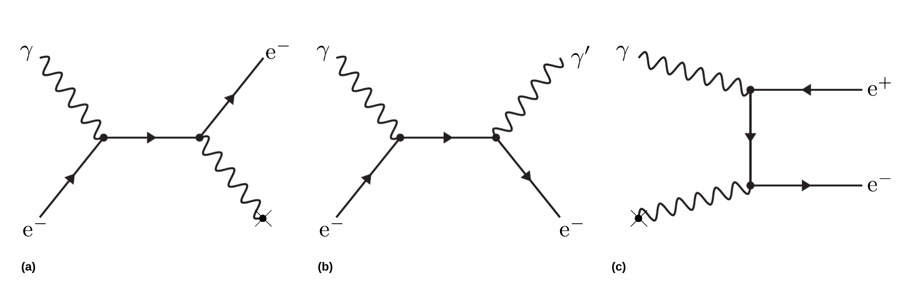
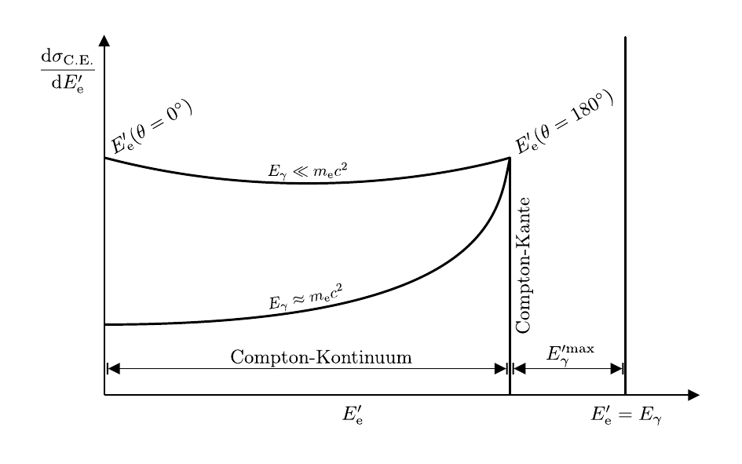

# Hinweise für den Versuch **Gammaspektroskopie**

## Wechselwirkung von Photonen mit Materie

Es gibt drei Arten, auf die ein Photon $\gamma$ mit der Energie $E_{\gamma}$ mit Materie in Wechselwirkung treten kann: 

- [**Photoeffekt**](https://de.wikipedia.org/wiki/Photoelektrischer_Effekt): Das Photon trifft auf ein Elektron aus der Atomhülle, überträgt dabei seine gesamte Energie und wird voll absorbiert. Der Energieübertrag erfolgt zunächst virtuell. Die erneute Reaktion des Elektrons mit dem elektromagnetischen Feld, z.B. des Atomkerns, stellt die Energie- und Impulserhaltung im Endzustand der Reaktion sicher. Das Elektron wird aus der Atomhülle ausgeschlagen und bewegt sich zunächst als freie Ladung durch das Material. 
- [**Compton-Effekt**](https://de.wikipedia.org/wiki/Compton-Effekt): Auch in diesem Fall erfolgt der Impulsübertrag zwischen $\gamma$ und Elektron zunächst virtuell, das ausgeschlagene Elektron emittiert unmittelbar ein neues Photon $\gamma'$ mit der Energie $E_{\gamma}'\lt E_{\gamma}$. Dieser Prozess kann als elastischer Stoßprozess zwischen Elektron und Photon angesehen werden. Es handelt sich jedoch nicht um einen elastischen Stoßprozess im klassischen Sinne, sondern um einen Prozess der [Quantenelektrodynamik](https://de.wikipedia.org/wiki/Quantenelektrodynamik) (QED), bei dem $\gamma$ zerstört und $\gamma^{\prime}$ neu erzeugt wird.
- [**Paarbildung**](https://de.wikipedia.org/wiki/Paarbildung_(Physik)): In diesem Fall zerfällt $\gamma$ in ein Elektron-Positron-Paar. Aus Gründen der Energie- und Impulserhaltung ist dieser Prozess nur oberhalb der kinematischen Schwelle von $E_{\gamma}\gtrsim 2\,m_{\mathrm{e}}c^{2}$ und ebenfalls nur im elektromagnetischen Feld, z.B. eines Atomkerns, möglich. Dabei entspricht $m_{\mathrm{e}}$ der Masse des Elektrons bzw. Positrons.

Die Häufigkeit, mit der jeweils einer der oben genannten Prozesse stattfindet wird durch die Wirkungsquerschnitte $\sigma_{\mathrm{P.E.}}$ (für den Photoeffekt), $\sigma_{\mathrm{C.E.}}$ (für den Compton-Effekt) und $\sigma_{\mathrm{pair}}$ (für die Paarbildung) quantifiziert. In **Abbildung 1** sind die drei Reaktionen schematisch dargestellt:

---

**Abbildung 1** (Diagrammatische Darstellung des (a) Photo-, (b) Compton- und (c) Paarbildungseffekts. Das Kreuz symbolisiert jeweils die Wechselwirkung mit dem elektromagnetischen Feld, z.B. eines Atomkerns)

---

Elektronen sind dabei durch gerade Linien mit Pfeilen und Photonen durch Wellenlinien dargestellt. In den jeweiligen Diagrammen sind die in die Reaktion einlaufenden Teilchen links und die aus der Reaktion auslaufenden Teilchen rechts dargestellt. Linien, die kein freies Ende haben gelten als virtuell, d.h. sie verletzen im Rahmen der [Heisenbergschen Unschärferelation](https://de.wikipedia.org/wiki/Heisenbergsche_Unsch%C3%A4rferelation) kurzfristig die Energie- und Impulserhaltung. Das Kreuz symbolisiert jeweils die Wechselwirkung mit dem elektromagnetischen Feld, z.B. eines Atomkerns. 

In **Abbildung 1 (a)** (für den **Photoeffekt**) läuft das Photon $\gamma$ von links in die Reaktion ein und trifft auf ein quasi-freies Elektron. Durch die unmittelbare Wechselwirkung des Elektrons mit dem elektromagnetischen Feld, z.B. eines Atomkerns, ist die Energie- und Impulserhaltung im Endzustand der Reaktion sichergestellt. Das Elektron läuft schließlich auf der rechten Seite  des Diagramms aus der Reaktion aus. 

In **Abbildung 1 (b)** (für den **Compton-Effekt**) läuft das Photon $\gamma$ von links in die Reaktion ein und trifft auf ein quasifreies Elektron. Das Elektron strahlt das Photon $\gamma'$ ab und läuft ebenso, wie $\gamma'$ auf der rechten Seite des Diagramms aus der Reaktion aus.

In **Abbildung 1 (c)** (für die **Paarbildung**) zerfällt das von links einlaufende Photon $\gamma$ in ein Elektron-Positron-Paar. Das Elektron koppelt unmittelbar an das elektromagnetische Feld, z.B. eines Atomkerns, wodurch die Energie- und Impulserhaltung im Endzustand sichergestellt sind Danach laufen das Elektron und das Positron auf der rechten Seite des Diagramms aus der Reaktion aus. 

Im Folgenden gehen wir auf die einzelnen Prozesse etwas näher ein. 

### Photoeffekt

Beim Photoeffekt geht $E_{\gamma}$ vollständig auf das gestreute Elektron über. Dieser Effekt ist nur im elektromagnetischen Feld, z.B. eines Atomkerns, möglich. Der Atomkern nimmt dabei als Rückstoßpartner zusätzlichen Impuls aus der Reaktion auf, so dass im Endzustand der Reaktion die Energie- und Impulserhaltung gewährleistet sind. Dies ist umso leichter möglich, je stärker das Elektron an den Atomkern gebunden ist, weshalb der Photoeffekt hauptsächlich mit Elektronen aus den K- und L-Schalen von Atomen mit großer Kernladungszahl Z auftritt. Die vollständige theoretische Beschreibung dieses Prozesses über den gesamten Bereich von $E_{\gamma}$ ist schwierig und auf Näherungen angewiesen. Die Abhängigkeit von $\sigma_{\mathrm{P.E.}}$ von Z und $E_{\gamma}$ wird durch die folgende Relation abgebildet: 
$$
\begin{equation*}
\sigma_{\mathrm{P.E.}}(E_{\gamma}, Z)\propto\frac{Z^{n}}{E_{\gamma}^{m}}; \qquad \text{mit: } n=4\ldots5; \, m\leq 3.5,
\end{equation*}
$$
weshalb der Photoeffekt gerade bei kleinen Werten von $E_{\gamma}$ und großen Werten von Z die anderen beiden Effekte dominiert. Für $E_{\gamma}\gg m_{\mathrm{e}}c^{2}$ gilt $m\to 1$, $\sigma_{\mathrm{P.E.}}$ fällt also mit zunehmender Energie $E_{\gamma}$ weniger stark ab.

Im Material erfolgt die Absorption durch Photoeffekt nicht durch eine einzige Reaktion sondern in mehreren, schnell aufeinander folgenden Schritten: 

- Das Photon $\gamma$ schlägt ein Elektron, z.B. aus der K-Schale eines Atoms aus; 
- dieses verliert Energie durch [Ionisation](https://de.wikipedia.org/wiki/Bethe-Formel) oder [Bremsstrahlung](https://de.wikipedia.org/wiki/Bremsstrahlung), d.h. Emission eines weiteren Photons $\gamma'$ niedrigerer Energie $E_{\gamma}'\lt E_{\gamma}$. 
- Die Lücke in der K-Schale des Atoms wird, z.B. durch ein Elektron aus einer höheren Schale aufgefüllt, wobei wiederum ein Photon $\gamma^{\prime\prime}$ mit $E_{\gamma}^{\prime\prime}\ll E_{\gamma}$ emittiert wird. 
- Aufgrund der niedrigeren Energien $E_{\gamma}^{\prime}$ und $E_{\gamma}^{\prime\prime}$ steigt die Wahrscheinlichkeit für den Photoeffekt für $\gamma'$ und $\gamma^{\prime\prime}$, wodurch eine Absorptionskaskade in Gang gesetzt wird, bis $E_{\gamma}$ vollständig auf Elektronen übertragen wurde.

### Compton-Effekt

Der Compton-Effekt ist der dominierende Wechselwirkungsprozess für Photonen im Energiebereich von $E_{\gamma}=100\ \mathrm{keV}$ bis $10\ \mathrm{MeV}$ mit Materie. Er wurde 1922 erstmals von [Arthur Compton](https://de.wikipedia.org/wiki/Arthur_Holly_Compton) nachgewiesen, erklärt und untersucht. Compton stellte fest, dass bei der Streuung von Röntgenstrahlung an Graphit, die Wellenlänge $\lambda'$ des gestreuten Lichts größer als die Wellenlänge $\lambda$ des eingestrahlten Lichts ist. Für die Änderung der Wellenlänge gilt der einfache Zusammenhang: 
$$
\begin{equation}
\begin{split}
&\Delta\lambda=\lambda'-\lambda = \frac{h}{m_{\mathrm{e}}\,c}\left(1-\cos\theta\right);\\
&\\
&\text{mit} \\
&\\
&\lambda_{\mathrm{C}} = \frac{h}{m_{\mathrm{e}}\,c}.
\end{split}
\end{equation}
$$
Dabei bezeichnet $\lambda_{\mathrm{C}}$ die sogenannte **Compton-Wellenlänge** und $\theta$ den Streuwinkel (im Laborsystem). Es ist bemerkenswert, dass der Energieübertrag des Photons $\gamma$, der zu $\Delta\lambda$ korrespondiert, nur von $\theta$ und nicht von $E_{\gamma}$ abhängt. Er wird bei der Rückstreuung des Photons (d.h. für $\theta=180^{\circ}$) maximal. Die Energie $E_{\mathrm{e}}'$ des gestreuten Elektrons und die Energie $E_{\gamma}'$ des gestreuten Photons lassen sich unter der Annahme, dass es sich um eine **elastische Zwei-Körper-Streuung** des Photons mit 
$$
\begin{equation*}
E_{\gamma}=h\,\nu;\qquad p_{\gamma}=h/\lambda
\end{equation*}
$$
an einem ruhenden, freien Elektron mit
$$
\begin{equation*}
E_{\mathrm{e}}=m_{\mathrm{e}}c^{2};\qquad p_{\mathrm{e}}=0
\end{equation*}
$$
handelt, quasi-klassisch berechnen: 
$$
\begin{equation}
\begin{split}
&E'_{\gamma}(\theta) = \frac{E_{\gamma}}{1+\frac{E_{\gamma}}{E_{\mathrm{e}}}\left(1-\cos\theta\right)};
\qquad
E'_{\mathrm{e}}(\theta) = E_{\gamma}-E'_{\gamma}(\theta).\\
&\\
&E^{\prime\,\mathrm{max}}_{\mathrm{e}} = E^{\prime}_{\mathrm{e}}(\theta=180^{\circ}) = \frac{E_{\gamma}}{1+\frac{E_{\mathrm{e}}}{2\,E_{\gamma}}},\\
\end{split}
\end{equation}
$$
wobei $E^{\prime\,\mathrm{max}}_{\mathrm{e}}$ die Energie des Elektrons nach maximalem Energieübertrag ist. Diesen Punkt im Spektrum der gestreuten Elektronen bezeichnet man als **Compton-Kante**. Zu niedrigen Energien hin schließt sich das sog. **Compton-Kontinuum** an. 

Zwar stimmen die auf quasi-klassischem Wege bestimmten Beziehungen für $E_{\mathrm{e}}'(\theta)$ und $E_{\gamma}'(\theta)$ "zufällig" mit den im Rahmen der QED gewonnenen Ergebnissen überein, der exakte Verlauf des Spektrums lässt sich jedoch erst mit Hilfe des [Klein-Nishina-Wirkungsquerschnitts](https://de.wikipedia.org/wiki/Klein-Nishina-Wirkungsquerschnitt) vollständig verstehen. Eine schematische Darstellung des erwarteten Energiespektrums für die Compton-Streuung eines Photons mit der Energie $E_{\gamma}$ ist in **Abbildung 2** gezeigt:

---

**Abbildung 2** (Schematische Darstellung des erwarteten Energiespektrums für die Compton-Streuung eines Photons mit der Energie $E_{\gamma}$. Die vertikale Linie rechts im Bild markiert die vollständige Absorption des Photons im Detektor, z.B. durch den Photoeffekt. Für das Compton-Kontinuum sind die Verläufe für zwei unterschiedliche Energien $E_{\gamma}$ skizziert)

---

Auf der $x$-Achse ist die Energie $E_{\mathrm{e}}'$, auf der $y$-Achse der Wirkungsquerschnitt $\mathrm{d}\sigma_{\mathrm{C.E.}}/\mathrm{d}E_{\mathrm{e}}'$  aufgetragen. Die vertikale Linie rechts im Bild markiert die vollständige Absorption des Photons im Detektor, z.B. durch den Photoeffekt.  

Die Abhängigkeit von $\sigma_{\mathrm{C.E.}}$ von Z und $E_{\gamma}$ wird durch die folgende Relation abgebildet: 
$$
\begin{equation*}
\sigma_{\mathrm{C.E.}}(E_{\gamma}, Z)\propto\frac{Z}{E_{\gamma}}; \qquad \text{f\"ur: } E_{\gamma}\gg m_{\mathrm{e}}c^{2}.
\end{equation*}
$$

### Paarbildung

Aus Gründen der Energie- und Impulserhaltung ist dieser Prozess nur oberhalb der kinematischen Schwelle von 
$$
\begin{equation*}
E_{\gamma}\gtrsim 2\,m_{\mathrm{e}}c^{2}
\end{equation*}
$$
und auch nur im elektrischen Feld, z.B. eines Atomkerns möglich. Erstmals wurde dieser Prozess 1934 von [Hans Bethe](https://de.wikipedia.org/wiki/Hans_Bethe) und [Walter Heitler](https://de.wikipedia.org/wiki/Walter_Heitler) gemeinsam mit dem zur Paarbildung sehr ähnlichen Prozess der Bremsstrahlung beschrieben und erklärt, weshalb beide Prozesse auch als **Bethe-Heitler-Prozesse** bezeichnet werden. 

Für $E_{\gamma}\gg m_{\mathrm{e}}c^{2}$ ist $\sigma_{\mathrm{pair}}$ unabhängig von $E_{\gamma}$, die Abhängigkeit von $\sigma_{\mathrm{pair}}$ von Z wird durch die folgende Relation abgebildet:  
$$
\begin{equation*}
\sigma_{\mathrm{pair}}(E_{\gamma}, Z)\propto Z^{2}.
\end{equation*}
$$
Insbesondere für schwere Kerne erfolgt Paarbildung vor allem im hohen elektromagnetischen Feld des Atomkerns; das elektromagnetische Feld der Elektronen in der Atomhülle spielt nur bei sehr leichten Elementen eine Rolle. 

#### Das Positron bei der Paarbildung

Im Material wird das Positron aus dem Paarbildungsprozess abgebremst, bis es mit einem Elektron aus dem Material rekombiniert und über den Prozess der [**Elektron-Positron-Annihiliation**](https://de.wikipedia.org/wiki/Annihilation) zerstrahlt. Aus dieser Reaktion gehen zwei, zueinander anti-parallel auslaufende Photonen mit der charakteristischen Energie 
$$
\begin{equation*}
E_{\gamma}=m_{\mathrm{e}}c^{2}
\end{equation*}
$$
hervor, die selbst wieder mit dem Material in Wechselwirkung treten können.

## Essentials

Was Sie ab jetzt wissen sollten:

- Sie sollten wissen wie **Photonen mit Materie in Wechselwirkung** treten.
- Sie sollten die Diagramme aus **Abbildung 1** aufzeichnen und den entsprechenden Wechselwirkungen zuordnen können. 
- Sie sollten **Gleichung (1) für den Compton-Effekt** kennen. 
- Sie sollten das typische Aussehen des Spektrums der Compton-Streuung aus **Abbildung 2** erkennen und qualitativ beschreiben können. 

## Testfragen

1. Können Sie einfach anhand der kinematischen Eigenschaften des Zerfalls demonstrieren, dass ohne eine zusätzliche Wechselwirkung mit einem zusätzlichen elektromagnetischen Feld die Energie- und Impulserhaltung bei der Paarbildug nicht gewährleistet ist?
2. Ein Photon mit $E_{\gamma}\gtrsim 100\ \mathrm{MeV}$ fliegt in einen beliebigen Festkörper. Welche Reaktion findet vermutlich zuerst statt und in welcher Umgebung im Kristallgitter wird sie überwiegend stattfinden?
3. Kann ein Positron mit einem Elektron in ein einzelnes Photon annihilieren? Begründen Sie Ihre Antwort.
4. Auf welche Materialeigenschaft würden Sie bei der Auswahl eines geeigneten Materials zum Nachweis von Photonen, nach dem was Sie hier gelernt haben, vornehmlich achten? 

# Navigation

[Main](https://gitlab.kit.edu/kit/etp-lehre/p2-praktikum/students/-/tree/main/Gammaspektroskopie)

