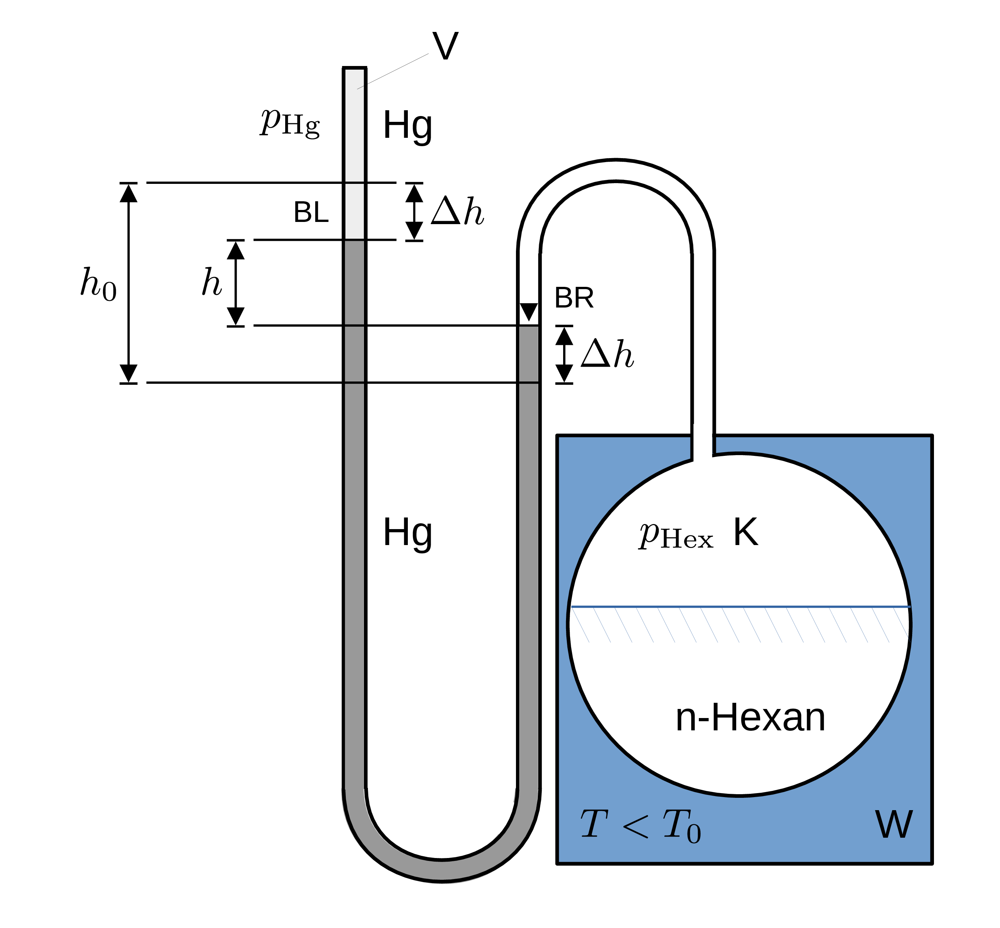

# Ideales und reales Gas

## Phasendiagramm und Dampfdruckkurve

> Übergänge der einzelnen Phasen 
>
> - fest, 
> - flüssig und 
> - gasförmig 
>
> eines Stoffes werden durch [**Phasendiagramme**](https://de.wikipedia.org/wiki/Phasendiagramm) dargestellt. 

🔔 In einem abgeschlossenen Volumen $V$ gibt es, für eine gegebene Temperatur $T$, jeweils nur einen bestimmten Druck $p(T)$, bei dem zwischen zwei Phasen eines Stoffes ein thermodynamisches Gleichgewicht herrscht. Ein thermodynamisches Gleichgewicht zwischen allen drei Phasen eines Stoffs existiert nur an einem einzigen Punkt im Phasendiagramm, dem **Tripelpunkt**. Das Phasendiagramm für den **Übergang von flüssig zu gasförmig heißt Dampfdruckkurve**. 

Für einen reversiblen Kreisprozess (Carnot-Prozess) gilt allgemein:
$$
\begin{equation*}
\frac{\mathrm{d} W}{\mathrm{d}T} = -\frac{Q}{T}.
\end{equation*}
$$
Mit $\mathrm{d}W = \left(V_{\mathrm{fl}}-V_{\mathrm{gas}}\right)\mathrm{d}p$ und den Volumina $V_{\mathrm{fl}}$ und $V_{\mathrm{gas}}$, die ein gegebener Stoff in flüssigem und gasförmigem Zustand einnimmt, wird daraus die [Clausius-Clapeyron-Gleichung](https://de.wikipedia.org/wiki/Clausius-Clapeyron-Gleichung): 

$$
%\begin{equation}
\frac{\mathrm{d}p}{\mathrm{d}T} = \frac{Q}{T\,\left(V_{\mathrm{gas}} - V_{\mathrm{fl}}\right)}.
%\end{equation}
$$
🔔 Man benötigt also die Wärme $Q$, um bei der Temperatur $T$ eine Flüssigkeit mit dem Volumen $V_{\mathrm{fl}}$ in ein Gas mit dem Volumen $V_{\mathrm{gas}}$ zu überführen. 

Für die weiteren Betrachtungen machen wir die Annahme 

$$
\begin{equation*}
V_{\mathrm{fl}}\ll V_{\mathrm{gas}}
\end{equation*}
$$
 und betrachten den Dampf als ideales Gas mit 

$$
\begin{equation*}
V_{\mathrm{gas}} = \frac{n\,R\,T}{p},
\end{equation*}
$$
womit Gleichung **(1)**, nach **Separation der Variablen**, die folgende Form annimmt: 

$$
%\begin{equation}
\begin{split}
&\frac{\mathrm{d}p}{p} = \frac{Q}{n\,R}\,\frac{\mathrm{d}T}{T^{2}} \\
&\\
&p(T) = p(T_{0})\exp\left(-\frac{Q}{n\,R}\left(\frac{1}{T}-\frac{1}{T_{0}}\right)\right), \\
\end{split}
%\end{equation}
$$
wobei $T_{0}$ einer Referenztemperatur entspricht. 🔔 Bei Gleichung **(2)** handelt es sich um die zu erwartende funktionale Form der Dampfdruckkurve für ein ideales Gas. Zur Vereinfachung führen wir noch die molare Verdampfungswärme 
$$
%\begin{equation}
Q_{\mathrm{M}}\equiv\frac{Q}{n}
%\end{equation}
$$
ein. 

### Modell für den im Praktikum befindlichen Aufbau

Eine Skizze des im Praktikums befindlichen Aufbaus zur Bestimmung der Dampfdruckkurve von n-Hexan ist in **Abbildung 1** gezeigt: 

---

(**Abbildung 1**: Aufbau zur Bestimmung der Dampfdruckkurve von n-Hexan)

---

Er ähnelt bis auf einige Details dem Aufbau des Gasthermometers aus **Abbildung 1 [hier](https://gitlab.kit.edu/kit/etp-lehre/p2-praktikum/students/-/blob/main/Ideales_und_reales_Gas/doc/Hinweise-Gasthermometer.md)**. In einem Kolben K befindet sich das zu untersuchende n-Hexan in einem Wärmebad W, dessen Temperatur Sie durch Zufuhr von zerstoßenem Eis oder geringen Mengen von Wasser kontrollieren können. An K schließt sich ein Hg-Barometer an, das (in der Abbildung oben links), abgeschlossen ist. Wir gehen zunächst von Raumtemperatur 
$$
\begin{equation*}
T_{0}=293.15\,\mathrm{K}
\end{equation*}
$$
aus. Bei dieser Temperatur ist in dem abgeschlossenen Teil des Hg-Barometers ein kleines Volumen V mit Hg-Gas gefüllt. Dieses weist einem Dampfdruck von
$$
\begin{equation*}
p_{\mathrm{Hg}}(T_{0}) = 0.00163\,\mathrm{mbar}
\end{equation*}
$$
auf. 🔔 Da der Dampfdruck nur von der Temperatur abhängt und V bei $T_{0}$ gehalten wird ist der Druck dort konstant und so klein, dass Sie ihn für Ihre Messungen vernachlässigen können. In K herrscht der Dampfdruck 
$$
%\begin{equation}
\begin{split}
p_{\mathrm{Hex}}(T_{0})&=\rho\,g\,h_{0}+p_{\mathrm{Hg}}(T_{0})\\
&\\
&\approx\rho\,g\,h_{0}\\
\end{split}
%\end{equation}
$$
von n-Hexan vor, wobei $\rho$ der Dichte von Hg und $g$ der Erdbeschleunigung entsprechen. O.b.d.A gehen wir für unsere weiteren Betrachtungen von einer Senkung der Temperatur von $T_{0}$ auf $T<T_{0}$ aus. Bei $T_{0}$ zeigt das Barometer die Höhendifferenz $h_{0}$ an. Bei abnehmender Temperatur sollte $p_{\mathrm{Hex}}$ ebenfalls abnehmen. Durch die Senkung der Temperatur hebt sich also der n-Hexan-seitige Pegel des Barometers (rechts im Bild) um den Betrag $\Delta h$; um den gleichen Betrag sinkt der Hg-seitige Pegel (links im Bild). Diese Änderung führt zu einer Höhendifferenz von 
$$
\begin{equation*}
h=h_{0}-2\,\Delta h.
\end{equation*}
$$
Für den Dampfdruck von n-Hexan bei $T$ erhalten wir:
$$
\begin{equation*}
\begin{split}
p_{\mathrm{Hex}}(T)&=\rho\,g\,h;\\
&\\
& =\rho\,g\,\left(h_{0}-2\,\Delta h\right);\\
&\\
&=p_{\mathrm{Hex}}(T_{0})-2\,\rho\,g\,\Delta h.
\end{split}
\end{equation*}
$$
Nach Gleichung **(2)** erwarten wir den Zusammenhang:
$$
%\begin{equation}
\begin{split}
&p_{\mathrm{Hex}}(T) = p_{\mathrm{Hex}}(T_{0})\,\exp\left(-\frac{Q_{\mathrm{M}}}{R}\left(\frac{1}{T}-\frac{1}{T_{0}}\right)\right);\\
&\\
&\Delta h(T) = \frac{h_{0}}{2}\,\left(1-\exp\left(-\frac{Q_{\mathrm{M}}}{R}\left(\frac{1}{T}-\frac{1}{T_{0}}\right)\right)\right).\\
\end{split}
%\end{equation}
$$
Daraus lässt sich das folgende Modell zur Anpassung an die Daten ableiten: 
$$
%\begin{equation}
\ln\left(1-2\frac{\Delta h}{h_{0}}\right) = -\frac{Q_{\mathrm{M}}}{R}\left(\frac{1}{T}-\frac{1}{T_{0}}\right).
%\end{equation}
$$

### Hinweise zu den verwendeten Apparaturen

#### Flüssiges n-Hexan über dem n-Hexan-seitigen Pegel des Hg-Barometers 

Es kann vorkommen, dass sich flüssiges n-Hexan über dem n-Hexan-seitigen Pegel des Hg-Barometers (BR in **Abbildung 1**) niederschlägt, was zu einer Verfälschung der Messung führen kann. 

Sie können den Niederschlag leicht entfernen, indem Sie BR, z.B. mit Hilfe eines Föhns erwärmen und gleichzeitig K abkühlen. Sie können einen entsprechenden Föhn bei den Technikern erhalten. 

#### Flüssiges n-Hexan über dem Hg-seitigen Pegel des Hg-Barometers 

⚠️ Ungleich schwieriger zu korrigieren ist der Fall, wenn sich flüssiges n-Hexan auf dem Hg-Pegel in V (BL in **Abbildung 1**) niedergeschlagen hat. In diesem Fall müsste das n-Hexan durch die komplette Hg-Säule nach K zurückgeführt werden. 

In diesem Fall müssen Sie in Gleichung **(4)** den Dampfdruck von Hg in V durch den Dampfdruck von n-Hexan bei $T_{0}$ ($p_{\mathrm{Hex}}(T_{0})$) ersetzen. Gleichung **(5)** wird dadurch wie folgt modifiziert:
$$
%\begin{equation}
\ln\left(1-2\frac{\rho\,g\,\Delta h}{p_{\mathrm{Hex}}(T_{0})}\right) = -\frac{Q_{\mathrm{M}}}{R}\left(\frac{1}{T}-\frac{1}{T_{0}}\right).
%\end{equation}
$$
Die entsprechenden Daten entnehmen Sie dem [Datenblatt](https://gitlab.kit.edu/kit/etp-lehre/p2-praktikum/students/-/blob/main/Ideales_und_reales_Gas/Datenblatt.md) zum Versuch. 

## Erwartung

Was wir an dieser Stelle von Ihnen erwarten:

- :white_check_mark: Sie erkennen die **Gleichung von Clausius-Clapeyron** und können sie inhaltlich erklären. 
- :white_check_mark: Sie können unter den oben gemachten Annahmen aus Gleichung **(1)** die **erwartete Form der Dampfdruckkurve herleiten**.
- :white_check_mark: Sie können **erklären was Dampfdruck ist**.
- :white_check_mark: Sie kennen den **Dampfdruck von n-Hexan** bei Raumtemperatur.
- :white_check_mark: Sie wissen, ob der Dampfdruck von n-Hexan mit zunehmender Temperatur **steigt oder sinkt**. 

## Testfragen

1. Gibt es bei einem idealen Gas den Übergang von gasförmig in flüssig?
2. Wie verändert sich Ihre Erwartung für $p(T)$, wenn Sie statt eines idealen Gases ein [reales Gas](https://de.wikipedia.org/wiki/Clausius-Gleichung) nach Clausius-Gleichung zugrundelegen?
3. Wie sieht das Diagramm einer Dampfdruckkurve aus, wenn man es auf alle drei Phasen, fest, flüssig und gasförmig erweitert?
4. Hat jedes Phasendiagramm einen Tripelpunkt?
5. Wie genau müssen Sie die Hg-Pegel mit dem Kathetometer ablesen, damit der endliche Druck $p_{\mathrm{Hg}}(T_{0})$ in V nicht mehr vernachlässigbar ist? 

---

[Main](https://gitlab.kit.edu/kit/etp-lehre/p2-praktikum/students/-/tree/main/Ideales_und_reales_Gas/README.md)

