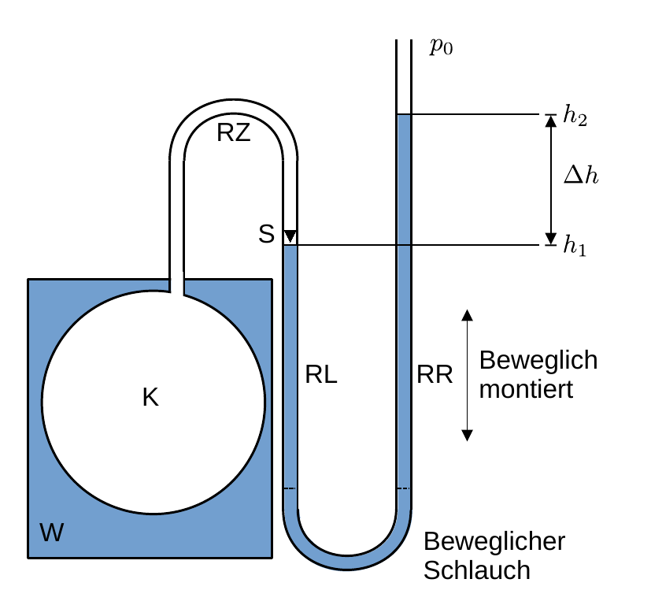

# Hinweise für den Versuch: **Ideales und reales Gas** 

##  Messung des absoluten Nullpunkts der Temperatur mit Hilfe eines Gasthermometers

Der grundsätzliche Aufbau eines Gasthermometers und die im weiteren Verlauf verwendeten Bezeichnungen sind in **Abbildung 1** dargestellt: 

---

**Abbildung 1**: (Prinzipieller Aufbau eines Gasthermometers und im Text verwendete Bezeichnungen)

---

Ein Glaskolben (K) befindet sich in einem [Wärmebad](https://de.wikipedia.org/wiki/W%C3%A4rmebad) (W) und ist mit einem zweifach geschwungenen U-Rohr verbunden. Das untere U besteht aus einem flexiblen Gummischlauch. Dieser trennt das Rohr in einen (RL) linken und (RR) rechten Schenkel. RR ist beweglich montiert. In K ist das Volumen $V$ des Arbeitsgases eingeschlossen. Das Rohr wird durch eine Flüssigkeit (i.a. Hg) dicht abgeschlossen. Der Volumenanteil $\delta V$ in der Rohrzuleitung RZ ist klein gegen $V$. Für den Druck $p$ in K gilt 
$$
\begin{equation*}
p(\Delta h) = p_{\mathrm{norm}} + \rho(\mathrm{Hg})\,g\,\Delta h, 
\end{equation*}
$$
wobei $p_{\mathrm{norm}}$ dem Umgebungsdruck, $\rho(\mathrm{Hg})$ der Dichte von Hg und $g$ der Erdbeschleunigung entsprechen.  

Die Temperaturmessung beruht auf der [idealen Gasgleichung](https://de.wikipedia.org/wiki/Thermische_Zustandsgleichung_idealer_Gase) 
$$
\begin{equation*}
p(V, T) = \frac{n\,R\,T}{V},
\end{equation*}
$$
wobei $T$ der Temperatur (in Kelvin, $\mathrm{K}$), $n$ der Stoffmenge und $R$ der idealen [Gaskonstanten](https://de.wikipedia.org/wiki/Gaskonstante) entsprechen. Für Messungen auf der Kelvin-Skala werden wir die Variable $T$ verwenden, für Messungen auf der Celsius-Skala die Variable $\vartheta$. 

Das Thermometer wird nach dem Prinzip der Druckmessung bei $V=const.,\ n=const.$ betrieben ([Gesetz von Amontons](https://de.wikipedia.org/wiki/Thermische_Zustandsgleichung_idealer_Gase#Gesetz_von_Amontons)). In diesem Fall gilt $p\propto \vartheta$ mit 
$$
\begin{equation}
\begin{split}
&\left.p(\vartheta)\right|_{V=const.} = p_{0}\left(1+\gamma\,\vartheta\right);\\
&\\
&\text{mit}\\
&\\
&p_{0}=p(\vartheta=0^{\circ}\mathrm{C}).\\
\end{split}
\end{equation}
$$
Die Steigung $\gamma$ wird als [**Volumenausdehnungskoeffizient**](https://de.wikipedia.org/wiki/Ausdehnungskoeffizient) bezeichnet. Laut Gleichung **(1)** verschwindet der Gasdruck $p(\vartheta_{0})$ bei einer Temperatur von 
$$
\begin{equation*}
\vartheta_{0}=-1/\gamma.
\end{equation*}
$$
Diese Temperatur bezeichnet man als **absoluten Nullpunkt** der Temperatur.

Zur Messung von $\gamma$ tauchen Sie K vollständig in ein [Wärmebad](https://de.wikipedia.org/wiki/W%C3%A4rmebad) ein, das Sie mit destilliertem Wasser herstellen. Wenn Sie den Druck bei der Siede- ($T_{s}$) und Schmelztemperatur von Wasser messen erhalten Sie, ohne ein weiteres Thermometer benutzen zu müssen, eine Abschätzung aus der Beziehung 
$$
\begin{equation*}
\gamma = \frac{p(\vartheta_{s}) - p_{0}}{p_{0}\,\vartheta_{s}}.
\end{equation*}
$$
Sowohl bei der Siede- als auch bei der Schmelztemperatur wird Wärme in [latente Wärme](https://de.wikipedia.org/wiki/Latente_W%C3%A4rme) umgewandelt, so dass $\vartheta=const.$ gilt. 

Diese Art der Messung setzt den linearen Zusammenhang $p(\vartheta)$ aus Gleichung **(1)** voraus. 

### Korrektur auf die thermische Ausdehnung von K

Im vorliegenden Messaufbau machen Sie mehrere implizite vereinfachende Annahmen. Einen Korrekturterm für die thermische Ausdehnung von K erhalten Sie aus der folgenden Überlegung: 

Bei $\vartheta_{s}$ hat sich das von K vorgegebene Volumen $V_{\mathrm{K}}$ um den Faktor 
$$
\begin{equation*}
\frac{V_{\mathrm{K}}^{\prime}}{V_{\mathrm{K}}} = 1+\vartheta_{s}\gamma_{\mathrm{K}}
\end{equation*}
$$
ausgedehnt, wobei Sie für Glas den kubischen Ausdehnungskoeffizient 
$$
\begin{equation*}
\gamma_{K}=(0.9\pm0.1)\times10^{-5}\,\mathrm{K}^{-1}
\end{equation*}
$$
annehmen können. Nach der idealen Gasgleichung ($pV=n\ R\ T_{s}$) ist $p(\vartheta_{s})$ um den entsprechenden Faktor zu verringern. Gleichung **(1)** nimmt dadurch die folgende Form an:
$$
\begin{equation}
\begin{split}
&p(\vartheta_{s}) = \frac{p_{0} + \gamma\,p_{0}\,\vartheta_{s}}{1+T_{s}\gamma_{\mathrm{K}}}; \\
&\\
&\gamma^{(1)} = \frac{\left(1+T_{s}\gamma_{\mathrm{K}}\right)\,p(\vartheta_{s})-p_{0}}{p_{0}\,\vartheta_{s}}; \\
&\hphantom{\gamma^{(0)}} = \underbrace{\frac{p(\vartheta_{s})-p_{0}}{p_{0}\,\vartheta_{s}}} + \underbrace{\frac{p(\vartheta_{s})}{p_{0}}\,\frac{T_{s}}{\vartheta_{s}}\,\gamma_{\mathrm{K}}} \\
& \hphantom{cccccccccc} \equiv\gamma^{(0)}
\hphantom{cccccccc}\equiv\delta\gamma\\
&\\
&\text{mit:}\\
&\\
&T_{s} = \vartheta_{s}+\frac{1}{\gamma}.\\
\end{split}
\end{equation}
$$
Es ergibt sich also ein additiver Korrekturterm $\delta\gamma$ zur ursprünglichen Abschätzung $\gamma^{(0)}$. 

Es zeigt sich, dass die Berechnung von $\delta\gamma$ bereits einen Wert für $T_{s}$ (und damit für $\gamma$) voraussetzt. Sie können Gleichung **(1)** nach $\gamma$ auflösen und die Korrektur exakt berechnen. Ein in der Praxis oft alternativ angewandtes Verfahren besteht darin iterativ vorzugehen. Hierzu bestimmen Sie $\gamma^{(0)}$ zunächst ohne Korrektur und verwenden diesen Wert zur Bestimmung von $\delta\gamma$. 

## Essentials

Was Sie ab jetzt wissen sollten:

- Sie sollten wissen **wie ein Gasthermometer funktioniert**.

## Testfragen

1. Wenn die Temperatur in W zunimmt wird die Flüssigkeitssäule im U-Rohr nach oben gedrückt. Offensichtlich dehnt sich das Volumen des in K gefangenen Arbeitsgases aus. Warum kann man immer noch von der Beziehung $V=const.$ ausgehen?
2. Erklären Sie warum kochendes Wasser immer die gleiche Temperatur $\vartheta_{s}$ hat, obwohl dem Wasser ständig weitere Energie, z.B. von einer Kochplatte zugeführt wird? Was ist dabei unbedingt zu beachten, damit diese Annahme wirklich stimmt?

# Navigation

[Main](https://gitlab.kit.edu/kit/etp-lehre/p2-praktikum/students/-/tree/main/Ideales_und_reales_Gas)

