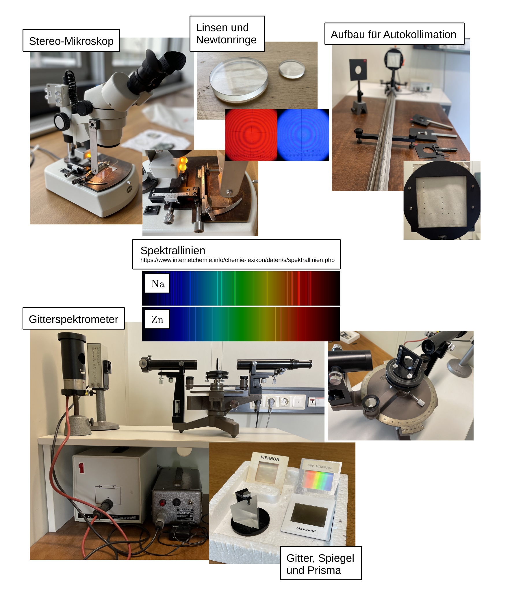

# Fakultät für Physik

## Physikalisches Praktikum P2 für Studierende der Physik

Versuch P2-211, 212, 213 (Stand: **April 2025**)

[Raum F1-09](https://labs.physik.kit.edu/img/Klassische-Praktika/Lageplan_P1P2.png)

# Interferenz

## Motivation

Beugung und Interferenz sind die wichtigsten charakterisierenden Eigenschaften von Wellenphänomenen. Sie beruhen auf einer physikalischen Observablen, die i.a. schwer zu beobachten ist, der **Phase einer Welle**. Die Phase einer einzelnen Welle ist für physikalische Beobachtungen zumeist irrelevant. Bedeutung gewinnt sie, wenn Wellen feste Phasenbeziehungen zueinander haben. Diesen Zustand bezeichnet man als [Kohärenz](https://de.wikipedia.org/wiki/Koh%C3%A4renz_(Physik)). Auch in der Quantenmechanik, wo Materie Wellencharakter aufweist, ist Kohärenz eine zentrale physikalische Eigenschaft. Bahnbrechende Experimente, wie das [Doppelspaltexperiment](https://de.wikipedia.org/wiki/Doppelspaltexperiment) beruhen auf der Demonstration von Interferenzeffekten von Materiewellen. Die systematische Untersuchung geometrischer Kristallstrukturen beruht auf der Auswertung komplexer Interferenz- und Beugungsbilder am Kristallgitter. Darüber hinaus erlaubt die geschickte Verwendung von Interferenzeffekten, z.B. in der [Interferometrie](https://de.wikipedia.org/wiki/Interferometrie) Messungen mit nahezu atemberaubender Präzision. Beugung und Interferenz nehmen damit zu Recht eine zentrale Position in der modernen Physik ein. Dies ist Motivation genug mit den Eigenschaften von Beugung und Interferenz gut vertraut zu sein. Dieser Versuch bietet Ihnen die Möglichkeit sich mit beiden Phänomenen und ihrem Wechselspiel im Experiment auseinanderzusetzen, Interferenz mit sichtbarem Licht gezielt unter Laborbedingungen herbeizuführen und zu studieren. 

## Lehrziele

Wir listen im Folgenden die wichtigsten **Lehrziele** auf, die wir Ihnen mit dem Versuch **Interferenz** vermitteln möchten: 

- Sie üben sich in der **Verwendung optischer Geräte**.
- Sie vertiefen Ihr Verständnis für die **Phänomene der Beugung und Interferenz** an Spalt und Gitter.
- Sie untersuchen die Spektren von Na und Zn. 

## Versuchsaufbau

Typische Aufbauten für diesen Versuch sind in **Abbildung 1** gezeigt:

---

**Abbildung 1**: (Typische Aufbauten für den Versuch **Interferenz**)

---

Im ersten Aufgabenteil untersuchen Sie das Phänomen der [Newtonschen Ringe](https://de.wikipedia.org/wiki/Newtonsche_Ringe) am einfachsten Beispiel plankonvexer Linsen. Sie tun dies mit Hilfe eines Stereo-Mikroskops. Sie bestimmen die optische Dichte von Wasser, sowie die optische Dichte der verwendeten Linse. Letztere können Sie aus den Messungen von Krümmungsradius und Brennweite berechnen. Die Brennweite bestimmen Sie mit der Technik der [Autokollimation](https://de.wikipedia.org/wiki/Autokollimation#:~:text=Mit%20Autokollimation%20ist%20auch%20die,der%20anderen%20Seite%20der%20Linse.). Im zweiten Teil des Versuchs nehmen Sie Messungen mit Hilfe eines Gitterinterferometers vor. Dabei untersuchen Sie die Linien der Spektren von Na und Zn. 

## Was macht diesen Versuch aus?

Das ganze Praktikum hindurch haben Sie gelernt Messwerte als reellwertige Zahlen $O$ mit reelwertigen Unsicherheiten $\Delta O$ zu bestimmen. Mit der Beugung und der Interferenz am Gitter öffnet sich nun ein Tor in die exakte Welt der ganzen Zahlen, wie Sie uns allgemein in der Wellen- und im Speziellen in der Qantenmechanik zuweilen wieder begegnet. Die Interferenz kohärenter Wellenzüge ist die Grundlage zahlreicher moderner Phänomene der Physik. Ihr Verständnis beginnt mit der Interferenz und Beugung von Licht am Einfach- und Doppelspalt. Im Rahmen dieses Versuchs unternehmen Sie erste einfache Messungen, basierend auf Interferenzbeobachtungen. Mit einem Experiment zu den Newtonschen Ringen eröffnen wir diesen Versuch mit einem Antagonismus, den Isaac Newton, ein inniger Vertreter der Korpuskulartheorie des Lichts, Zeit seines Lebens nicht auflösen konnte.

# Navigation

- [Interferenz.iypnb](https://gitlab.kit.edu/kit/etp-lehre/p2-praktikum/students/-/blob/main/Interferenz/Interferenz.ipynb): Aufgabenstellung und Vorlage fürs Protokoll.
- [Interferenz_Hinweise.ipynb](https://gitlab.kit.edu/kit/etp-lehre/p2-praktikum/students/-/blob/main/Interferenz/Interferenz_Hinweise.ipynb): Kommentare zu den Aufgaben.
- [Datenblatt.md](https://gitlab.kit.edu/kit/etp-lehre/p2-praktikum/students/-/blob/main/Interferenz/Datenblatt.md): Technische Details zu den Versuchsaufbauten.
- [doc](https://gitlab.kit.edu/kit/etp-lehre/p2-praktikum/students/-/tree/main/Interferenz/doc): Dokumente zur Vorbereitung auf den Versuch.
- [figures](https://gitlab.kit.edu/kit/etp-lehre/p2-praktikum/students/-/tree/main/Interferenz/figures): Bilder, die für die Dokumentation des Versuchs verwendet wurden.
