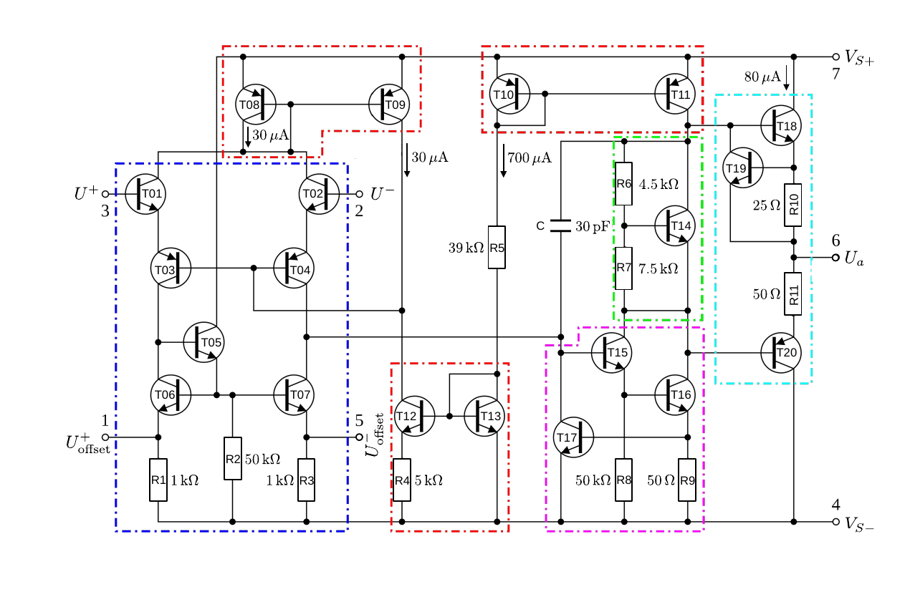
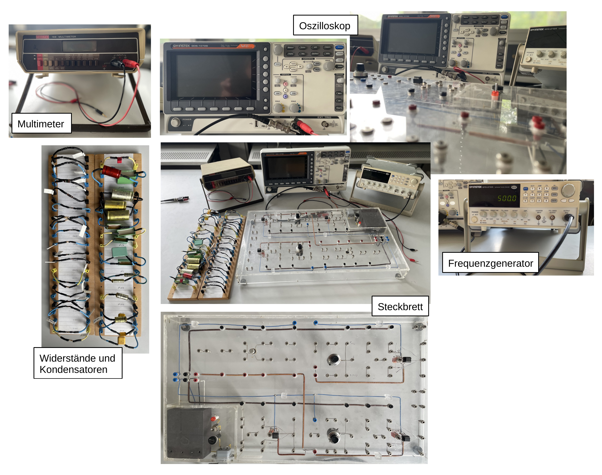

# Fakultät für Physik

## Physikalisches Praktikum P2 für Studierende der Physik

Versuch P2-191, 192, 193 (Stand: **Februar 2025**)

[Raum F1-15](https://labs.physik.kit.edu/img/Klassische-Praktika/Lageplan_P1P2.png)

# Operationsverstärker (OPV)

## Motivation

Ein [Operationsverstärker](https://de.wikipedia.org/wiki/Operationsverst%C3%A4rker) (OPV) ist ein aus Transistoren bestehender [integrierter Schaltkreis](https://de.wikipedia.org/wiki/Integrierter_Schaltkreis) zur Signalverstärkung, der eine sehr hohe Verstärkung aufweist und durch Gegenkopplung in seinem Verhalten kontrolliert werden kann. Das erste Patent wurde 1941 durch [Karl D. Schwartzel Jr.](https://en.wikipedia.org/wiki/Karl_D._Swartzel_Jr.) angemeldet. Der Begriff *operational amplifier*, von dem sich auch die deutsche Bezeichnung **Operationsverstärker** ableitet, wurde 1947 durch [John Ragazzini](https://de.wikipedia.org/wiki/John_Ralph_Ragazzini) geprägt. Sie geht auf den anfänglich überwiegenden Einsatz zur Durchführung einfacher mathematischer Operationen in den ersten analogen Rechenmaschinen und Computern zurück. Im Jahr 1968 entwickelte die Firma Fairchild Semiconductor den OPV vom Typ $\mu A741$, der sich seit dieser Zeit bis zum heutigen Tage (allerdings nur noch in geringer Stückzahl) in Produktion befindet und auch hier im Praktikum verwendet wird. Ein Schaltplan des $\mu A741$ ist in **Abbildung 1** gezeigt:

---

**Abbildung 1**: (Schaltplan eines OPV vom Typ $\mu A741$, wie er auch im Praktikum verwendet wird. Einzelne funktionale Elemente der Schaltung sind durch farbige Umrandungen hervorgehoben (Quelle [Wikipedia](https://commons.wikimedia.org/wiki/File:OpAmpTransistorLevel_Colored.svg)))

---

OPVs sind aus der heutigen Elektrotechnik und Signalverarbeitung nicht mehr wegzudenken. Sie werden als Schalter, zur Verstärkung oder als [Impedanzwandler](https://de.wikipedia.org/wiki/Impedanzwandler) verwendet. In der physikalischen Messtechnik spielen sie überall dort eine Rolle, wo Signale klein sind und/oder ein Messgerät die Messgröße nicht beeinflussen darf. Nahezu jedes physikalische Experiment, das mit kleinen Signalen konfrontiert ist benutzt daher heutzutage OPVs. Die Anforderungen an den OPV sind: 

- Gegebenenfalls hohe Verstärkung. 
- Hohe Eingangsimpedanz $X_{e}$ (im Bereich von $10^{13}\ \Omega$!). Dadurch lässt sich z.B. die Rückwirkung eines angeschlossenen Voltmeters auf das Signal minimieren. 
- Niedrige Ausgangsimpedanz $X_{\mathrm{a}}$. Dadurch lässt sich z.B. die Rückwirkung des OPV auf ein angeschlossenes Voltmeter minimieren.

Im Praktikum begegnen Ihnen diese Anforderungen zum Beispiel in den folgenden Versuchen: 

- [Photoeffekt](https://gitlab.kit.edu/kit/etp-lehre/p2-praktikum/students/-/tree/main/Photoeffekt): Hier besteht die Herausforderung darin eine Spannung zu messen, die von nur wenigen Ladungsträgern auf einem Kondensator erzeugt wird. Es geht also um die Spannungsverstärkung. Ohne einen sehr hohen Eingangswiderstand würden die Ladungsträger aber auch sofort abfließen.
-  [Franck-Hertz-Versuch](https://gitlab.kit.edu/kit/etp-lehre/p2-praktikum/students/-/tree/main/Franck_Hertz_Versuch).  Hier besteht die Herausforderung darin einen Strom im Bereich weniger $\mathrm{nA}$ zu messen. Hier geht es also v.a. um die Stromverstärkung.

## Lehrziele

Wir listen im Folgenden die wichtigsten **Lehrziele** auf, die wir Ihnen mit dem Versuch **Operationsverstärker** vermitteln möchten: 

- Sie lernen den **OPV als wichtiges aktives Bauelement** elektrischer Schaltkreise mit seinen wichtigsten Eigenschaften kennen. 
- Sie verinnerlichen die Grundschaltungen des OPV als **invertierendem Verstärker, nicht-invertierendem Verstärker und Impedanzwandler**. 
- Sie üben sich in der **Dimensionierung einfacher Schaltungen** mit dem OPV.
- Sie machen sich, im Rahmen weiterer algebraischer Schaltungen mit der **äußeren Beschaltung** des OPV und den **Goldenen Regeln** zur Beschaltung eines idealen OPV vertraut.
- Sie erkennen in der Vorbereitung auf den Versuch den Nutzen von OPVs für physikalische Messungen und erfahren, wo für konkrete Messungen im Praktikum OPVs im Einsatz sind. 

## Versuchsaufbau

Ein typischer Aufbau für den Versuch Operationsverstärker ist in **Abbildung 2** gezeigt:

---

**Abbildung 2**: (Ein typischer Aufbau für den Versuch Operationsverstärker)

---

Alle Schaltungen werden mit Hilfe verschiedener Widerstände, Potentiometer und Kondensatoren auf dem abgebildeten Schaltbrett aufgesteckt und mit dem Oszilloskop oder dem Multimeter untersucht. Zur Erzeugung eines Eingangssignals dient ein Frequenzgenerator. 

## Was macht diesen Versuch aus?

Bei diesem Versuch steht das "physikalische Innenleben" der zu untersuchenden Bauelemente nicht im Vordergrund. Dieses werden Sie in späteren Vorlesungen genauer studieren können. Uns geht es um ein grundlegendes Verständnis der Vorgänge und den (sicheren) Umgang bei der Beschaltung eines OPV. Die Grundschaltungen sollte jeder Physiker mit etwas Praxis aufbauen können. Einfache algebraische und komplexere Schaltungen geben Ihnen die Möglichkeit, sich mit der äußeren Beschaltung von OPVs und den dabei bestehenden Möglichkeiten weiter vertraut zu machen. In seinen Anfangsjahren war der OPV wirklich für die analoge Durchführung algebraischer und numerischer Operationen vorgesehen. In diesem Versuch dienen uns diese Operationen in erster Linie dazu Ihnen die Scheu bei der Beschaltung von OPVs zu nehmen. 

## Wichtige Hinweise

- Für diesen Versuch benötigen Sie einen USB-Datenträger zum Datentransfer. 

# Navigation

- [Operationsverstaerker.iypnb](https://gitlab.kit.edu/kit/etp-lehre/p2-praktikum/students/-/blob/main/Operationsverstaerker/Operationsverstaerker.ipynb): Aufgabenstellung und Vorlage fürs Protokoll.
- [Operationsverstaerker_Hinweise.ipynb](https://gitlab.kit.edu/kit/etp-lehre/p2-praktikum/students/-/blob/main/Operationsverstaerker/Operationsverstaerker_Hinweise.ipynb): Kommentare zu den Aufgaben.
- [Datenblatt.md](https://gitlab.kit.edu/kit/etp-lehre/p2-praktikum/students/-/blob/main/Operationsverstaerker/Datenblatt.md): Technische Details zu den Versuchsaufbauten.
- [doc](https://gitlab.kit.edu/kit/etp-lehre/p2-praktikum/students/-/tree/main/Operationsverstaerker/doc): Dokumente zur Vorbereitung auf den Versuch.
- [figures](https://gitlab.kit.edu/kit/etp-lehre/p2-praktikum/students/-/tree/main/Operationsverstaerker/figures): Bilder, die für die Dokumentation des Versuchs verwendet wurden.
