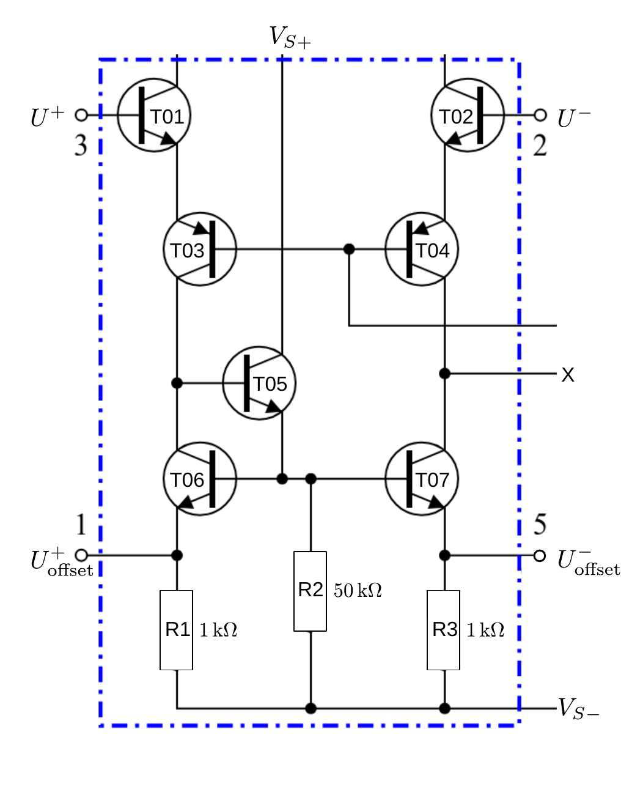
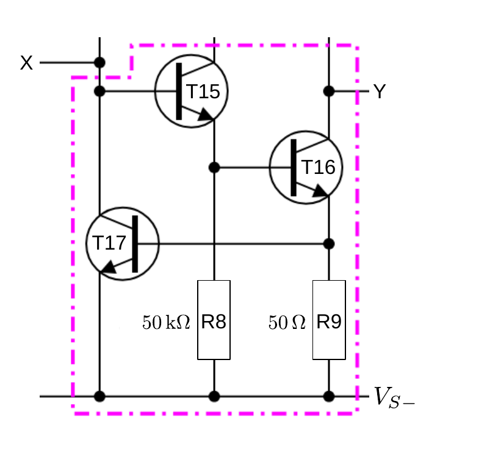
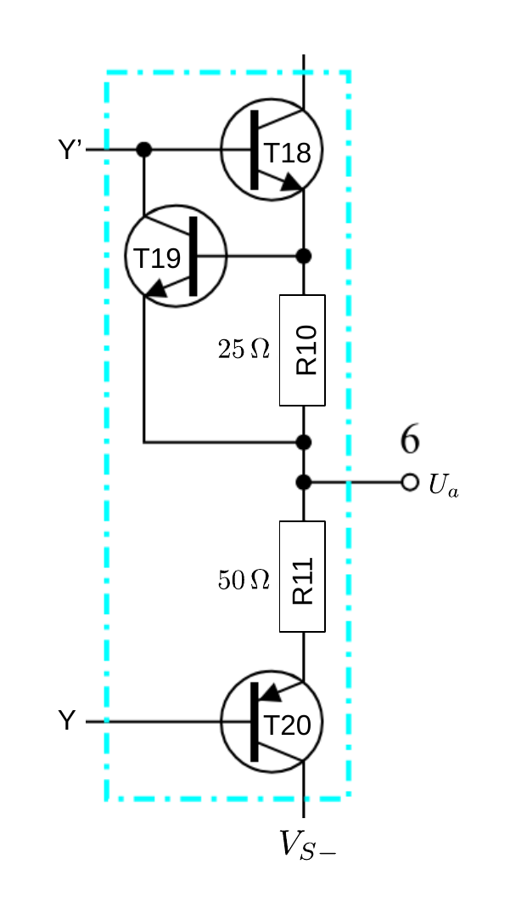

# Hinweise für den Versuch **Operationsverstärker (OPV)**

## Innenbeschaltung

Die Innenbeschaltung eines OPV ist i.a. sehr komplex und wird in der **Schaltungstheorie der Elektrotechnik** behandelt. Sie kann grundsätzlich immer in drei Abschnitte unterteilt werden:

- Eingangsstufe, 
- Kopplungsstufe, 
- Ausgangsstufe. 

Es ist im Rahmen des Praktikums nicht notwendig die Innenbeschaltung des $\mathrm{\mu A741}$ im Detail zu verstehen. Zur Vertiefung bei Interesse, stellen wir Ihnen dennoch hier die wichtigsten Konzepte der Beschaltung vor. Zum besseren Verständnis ist hierzu ein minimales Grundwissen aus dem Versuch [Transistor und Operationsverstärker](https://gitlab.kit.edu/kit/etp-lehre/p1-praktikum/students/-/tree/main/Transistor_und_Operationsverstaerker) erforderlich. 

#### Stromversorgung

Der $\mathrm{\mu A741}$ wird druch die Spannungen $V_{S\pm}$ an den Klemmen 7 und 4 in **Abbildung 1** [hier](https://gitlab.kit.edu/kit/etp-lehre/p2-praktikum/students/-/tree/main/Operationsverstaerker/README.md) mit Spannung versorgt.  Die innere Beschaltung weist mit den Transistoren T8/T9, T10/T11 und T12/T13 drei [Stromspiegel](https://de.wikipedia.org/wiki/Stromspiegel) (rot umrandet, als [Konstantstromquellen](https://de.wikipedia.org/wiki/Konstantstromquelle)) auf. Der Referenzstrom der Schaltung von $700\ \mathrm{\mu A}$  wird durch den Widerstand R5 und die Transistoren T10 und T13 festgelegt.

#### Eingangsstufe

Die **Eingangsstufe** des $\mathrm{\mu A741}$ ist in **Abbildung 1** gezeigt: 

---

(**Abbildung 1**: Eingangsstufe des $\mathrm{\mu A741}$)

---

Es handelt sich dabei um einen [**Differenzverstärker**](https://de.wikipedia.org/wiki/Differenzverstärker). Die Eingangssignale $U^{+}$ und $U^{-}$ liegen an den Klemmen 3 und 2 an und liefern damit die Basisspannungen für die npn-Transistoren T1 und T2, die jeweils als [Emitterfolger](https://de.wikipedia.org/wiki/Transistorgrundschaltungen#Kollektorschaltung_(Emitterfolger)) beschaltet sind, deren Kollektorpotential durch den Stromspiegel T8 konstant gehalten wird. Als Arbeitswiderstände der Schaltungen dienen die pnp-Transistoren T3 und T4 , die beide über eine [Basisschaltung](https://de.wikipedia.org/wiki/Transistorgrundschaltungen#Basisschaltung) betrieben werden. Man erkennt dies daran, dass die Basisanschlüsse von T3 und T4 mit dem Stromspiegel T12 auf einem gemeinsamen Potential liegen. Durch die Verwendung von T1 und T2 als Emitterfolger erhält der $\mathrm{\mu A}741$ seine hohe Eingangsimpedanz $X_{e}$. 

Da die Kollektorschaltungen jeweils eine Spannungsverstärkung von 1 aufweisen, übertragen sich $U^{+}$ und $U^{-}$ auf T3 und T4, die den eigentlichen Differenzverstärker bilden. Die Emitter von T3 und T4 liegen über T1 und T2 gemeinsam auf den Stromspiegel T8; als Arbeitwiderstände fungieren T6 und T7, jeweils wiederum mit den Arbeitswiderständen R1 und R3 . T6 und T7 liegen beide in Form von [stromgegengekoppelten Emitterschaltungen](https://de.wikipedia.org/wiki/Transistorgrundschaltungen#Emitterschaltung) vor, deren konstanter Basisstrom durch T5 und R2 geliefert wird. Stromgegengekoppelte Emitterschaltungen haben eine hohe Ausgangsimpedanz (von einigen $\mathrm{M\Omega}$), so dass sich am Punkt X eine hohe Verstärkung der Spannungsdifferenz ergibt. Die Spannungen $U^{+}_{\mathrm{offset}},\ U^{-}_{\mathrm{offset}}$ an den Klemmen 1 und 5 dienen zur Gleichtaktunterdrückung, um Fertigungsunterschiede einzelner Bauelemente auszugleichen.

#### Kopplungsstufe

Die **Kopplungsstufe** des $\mathrm{\mu A741}$ ist in **Abbildung 2** gezeigt: 

---

(**Abbildung 2**: Kopplungsstufe des $\mathrm{\mu A741}$)

---

Von T7 aus wird die verstärkte Eingangsdifferenzspannung auf eine [Darlington-Schaltung](https://de.wikipedia.org/wiki/Darlington-Schaltung) bestehend aus aus den Transistoren T15 und T16 geführt. Die Darlington-Schaltung entspricht dem Spezialfall eines [Emitterfolgers](https://de.wikipedia.org/wiki/Transistorgrundschaltungen#Emitterfolger), bei dem der Emitter von T15 die Basis von T16 ansteuert. Für den **Stromverstärkungsfaktor** $\beta$ gilt:
$$
\begin{equation*}
\begin{split}
&I_{\mathrm{out}}^{\mathrm{T16}} = \beta_{\mathrm{T16}}\,I_{\mathrm{out}}^{\mathrm{T15}};\qquad
I_{\mathrm{out}}^{\mathrm{T15}} = \beta_{\mathrm{T15}}\,I_{\mathrm{in}};\\
&\\
&\beta = \frac{I_{\mathrm{out}}^{\mathrm{T15}}+I_{\mathrm{out}}^{\mathrm{T16}}}{I_{\mathrm{in}}} = \frac{I_{\mathrm{out}}^{\mathrm{T15}}}{I_{\mathrm{in}}}\,\left(1+\beta_{\mathrm{T16}}\right)\approx\beta_{\mathrm{T15}}\beta_{\mathrm{T16}},
\end{split}
\end{equation*}
$$
die Verstärkungsfaktoren von T15 und T16 multiplizieren sich also in erster Näherung. In der Praxis werden Kleinsignalverstärkungen von bis zu 50'000 erreicht. 

Der Arbeitswiderstand dieser Stufe ist durch den Stromspiegel T11 und T14 gegeben, R9 erzeugt eine leichte Stromgegenkopplung zur Stabilisierung der Verstärkung.

#### Ausgangsstufe

Als Spannungsabfall über T16 und R9 hinge $U_{a}$ noch stark von der angeschlossenen Last ab. Wäre dies bereits der Ausgang des OPV, dann würde die Spannungsverstärkung beim Anschluss einer bereits geringen Last stark abfallen. Y wird daher an eine Ausgangsstufe, wie in **Abbildung 3** gezeigt, weitergeleitet: 

---

(**Abbildung 3**: Ausgangsstufe des $\mathrm{\mu A741}$)

---

Dabei handelt es sich um einen **komplementären Emitterfolger** ([Gegentaktendstufe](https://de.wikipedia.org/wiki/Gegentaktendstufe)) bei dem mit T18 ein npn- und mit T20 ein pnp-Transistor wechselseitig jeweils an eine Versorgungsspannung unterschiedlichen Vorzeichens angeschlossen sind. Bei einem positiven Signal ist der npn-Transistor offen und gibt das Signal weiter, während der pnp-Tansistor sperrt. Bei einem negativen Signal sind die Verhältnisse umgekehrt. T18 und T20 liegen jeweils als Emitterfolger vor. Als [Impedanzwandler](https://de.wikipedia.org/wiki/Impedanzwandler) erfüllen sie so den Zweck das Signal mit einem niedrigen Innenwiderstand auch für hohe Ströme stabil, als quasi ideale Stromquelle, an den Verbraucher weiterzugeben. Nach innen weist die Schaltung jeweils sie einen hohen Widerstand auf, wodurch die Kopplungsstufe nicht belastet wird. 

Bestünde die Ausgangsstufe aus einer einfachen Kollektorschaltung würde im Arbeitspunkt ständig elektrische Leistung über den Emitterwiderstand abfallen. Gegenüber einer solchen einfachen Kollektorschaltung hat die Gegentaktstufe den Vorteil, dass man im Arbeitspunkt $U_{a}=0$ wählen kann, wodurch der Leistungsabfall in dieser Verstärkerstufe minimiert wird. Durch diese Wahl erreicht die Ausgangsstufe des $\mathrm{\mu A741}$ einen Wirkungsgrad von über 78%, gegenüber 6.5% bei einer einfachen Kollektorschaltung. Der Nachteil dieser Schaltung besteht darin, dass für jeden einzelnen Transistor erst ab einem Signal oberhalb der Diodenknickspannung $U_{D}$ am Ausgang ein Strom fließt. Die daraus resultierende Verzerrung für kleine Eingangssignale bezeichnet man als **Übernahmeverzerrung**. Um diese abzumildern weicht man von $U_{a}=0$ als Arbeitspunkt ab und setzt beide Transistoren auf ein jeweils eigenes Potential mit der Differenz $2\,U_{D}$. Die hierzu notwendige Vorspannung wird durch den Transistor T14 und die Widerstände R6 und R7 bereitgestellt. R10 und R11 sind Gegenkopplungswiderstände. T17 und T19 verhindern eine Überlastung der Ausgangstransistoren bei Kurzschluss. 

#### Frequenzgangkompensation 

Der $\mathrm{\mu A741}$ ist ein **universell frequenzgangkompensierter OPV**, d.h. er weist einen Frequenzgang wie ein einzelner RC-Tiefpassfilter mit der Grenzfrequenz $\nu_{\mathrm{G}}$ auf. Dies wird durch den Kondensator C zwischen dem Aus- und dem Eingang der Kopplungsstufe realisiert, der eine frequenzabhängige Spannungsgegenkopplung bewirkt. Als Eingangskapazität erscheint C durch den [Millereffekt](https://de.wikipedia.org/wiki/Millereffekt) um den Faktor $\beta$ vergrößert. Zusammen mit dem Ausgangswiderstand der Eingangsstufe bildet C einen RC-Tiefpass mit großer Kapazität am Eingang des OPV, der den Frequenzgang des OPV dominiert.

## Essentials

Was Sie ab jetzt wissen sollten:

- Jeder OPV besteht aus einer **Eingangs-, Kopplungs- und Ausgangsstufe**. 
- Die Aufgabe der Eingangstufe ist die **Differenzverstärkung bei möglichst hoher Gleichtsaktunterdrückung**. 
- Die Aufgabe der Ausgangsstufe ist die **Impedanzwandlung**, so dass die erreichte Verstärkung bis zur maximalen Last (gegeben durch $I_{a}^{\mathrm{max}}$), wie bei einer idealen Stromquelle, gleich bleibt. 

## Testfragen

1. Wie unterscheiden sich die Schaltsymbole eines npn- von einem pnp-Transistors?
2. Aus wie vielen Kondensatoren, Widerständen, npn- und pnp-Transistoren besteht der $\mathrm{\mu A741}$?
3. Wodurch zeichnet sich eine Kollektorschaltung aus?

# Navigation

[Main](https://gitlab.kit.edu/kit/etp-lehre/p2-praktikum/students/-/tree/main/Operationsverstaerker)

