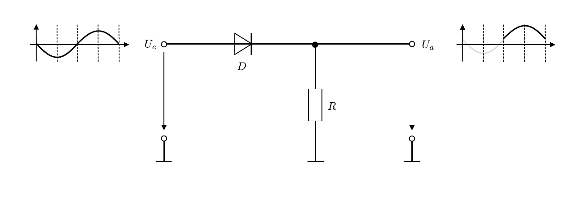
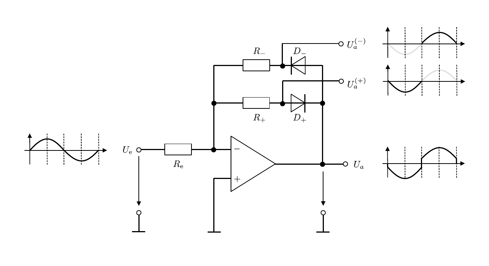
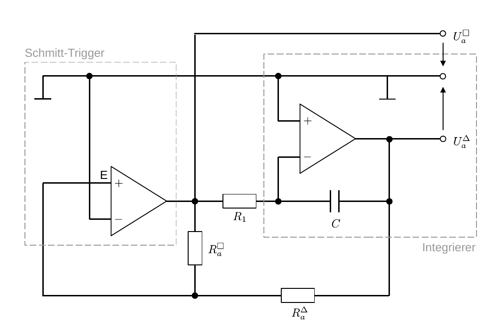
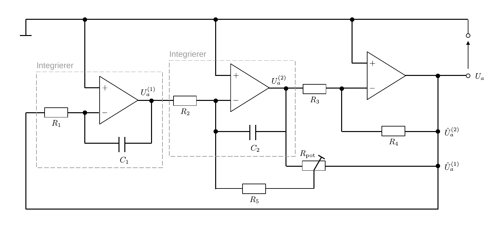

# Hinweise für den Versuch **Operationsverstärker (OPV)**

## Komplexere Schaltungen mit Operationsverstärkern

In **Aufgabe 4** werden Sie drei komplexere Schaltungen mit OPVs realisieren und studieren. Dabei handelt es sich um:

- Einen idealen Einweggleichrichter;
- einen Generator für Drei- und Rechtecksignale;
- ein Beispiel für die analoge Lösung einer Differenzialgleichung 2. Ordnung.

Alle drei Schaltungen werden wir im folgenden kurz erklären.

#### Idealer Einweggleichrichter

Ein Einweggleichrichter lässt aus einem bipolaren Signal immer nur einen unipolaren Anteil durch. Die einfachste Realisation mit Hilfe einer Diode mit Durchlass für die positive Halbwelle eines sinusförmigen Eingangssignals ist in **Abbildung 1** gezeigt:

---

**Abbildung 1**: (Schaltbild eines einfachen Einweggleichrichters mit Hilfe einer Diode mit Durchlass für ein positives Signal)

---

Die Eingangsspannung $U_{e}$ fällt über die Diode $D$ und den Widerstand $R$ ab. Das gleichgerichtete Signal kann als über $R$ abfallende Spannung $U_{a}$ abgegriffen werden. Ein Nachteil dieser Schaltung besteht darin, dass nicht die komplette Halbwelle des Signals wiedergegeben wird, da an der Diode immer zusätzlich die Diffusionsspannung ($U_{D}\approx -0.7\ \mathrm{V}$ im Fall von Silizium) abfällt. 

Die Schaltung eines **idealen Einweggleichrichters** die sich mit Hilfe eines OPV realisieren lässt und die gesamte Halbwelle wiedergibt ist in **Abbildung 2** gezeigt: 

---

**Abbildung 2**: (Schaltbild eines idealen Gleichwegrichters mit Hilfe eines OPV)

---

Die Schaltung enthält zwei Gegenkopplungszweige, von denen je nach Vorzeichen von $U_{e}$ immer nur einer stromführend aktiv ist. 

- Für $U_{e}<0$ sind $D_{-}$ und $R_{-}$ stromführend; 
- für $U_{e}>0$ sind es $𝑅_{+}$ und $𝐷_{+}$. 

Für $U_{e},\ U_{a}$ gilt: 
$$
\begin{equation*}
\begin{split}
U_{e} = I\,R_{e};\qquad U_{a}&=I\,R_{+} - U_{D} \\
&=I\,R_{-}+U_{D}.\\
\end{split}
\end{equation*}
$$
$D_{-},\ D_{+}$ bewirken also einen Sprung von $U_{a}$ um $2\ U_{D}$, wenn $U_{e}$ das Vorzeichen wechselt. Greift man $U_{a}^{(+)},\ U_{a}^{(-)}$ jeweils vor der entsprechenden Diode ab erhält man die negative oder positive Halbwelle ohne *offset*.

#### Generator für Drei- und Rechtecksignale

Das Schaltbild eines Drei- und Rechteckgenerators ist in **Abbildung 3** gezeigt:

---

**Abbildung 3**: (Schaltbild eines Drei- und Rechteckgenerators mit Hilfe von zwei OPVs)

---

Es handelt sich dabei um eine **selbsterregende Schaltung**, an der kein explizites Eingangssignal anliegt; das Ausgangssignal wird allein aus den anliegenden äußeren Betriebsspannungen der OPVs abgeleitet. Dabei entstehen periodische
Ausgangssignale obwohl an den OPVs nur Gleichspannungen anliegen. 

In der Schaltung fungiert der linke OPV als **Schwellenwertschalter ([Schmitt-Trigger](https://de.wikipedia.org/wiki/Schmitt-Trigger))** mit der Referenzspannung 0, bei dem das Ausgangssignal $U_{a}^{\Box}$ über $R_{a}^{\Box}$ teilweise signalverstärkend auf den P-Eingang E zurückgeführt wird. Der OPV wird ohne weitere äußere Beschaltung in Sättigung betrieben, d.h. wenn an E ein positives (negatives) Signal anliegt gibt er die vollständige positive (negative) Betriebsspannung aus. 

Der OPV rechts im Bild fungiert als **Integrierer** (vergleiche mit **Abbildung 7** [hier](https://gitlab.kit.edu/kit/etp-lehre/p2-praktikum/students/-/blob/main/Operationsverstaerker/doc/Hinweise-OPV-Grundschaltungen.md)). 

Zur weiteren Klärung der Vorgänge gehen wir zunächst von einer positiven Betriebsspannung am Ausgang des Schmitt-Triggers ($U_{a}^{\Box}>0$) aus, die über $R_{1}$ auf den N-Eingang des Integrierers geführt wird. Das Ausgangssignal des Integrierers ist negativ ($U_{a}^{\Delta}<0$) und wird über $R_{a}^{\Delta}$ ebenfalls auf E zurückgeführt. 

Zunächst wirkt auf E vor allem der (positive) Signalanteil aus $U_{a}^{\Box}$. Dieser Zustand besteht solange, bis $C$ hinreichend aufgeladen ist, sodass das negative Signal aus $U_{a}^{\Delta}$ überwiegt. Von diesem Zeitpunkt an wird $U_{a}^{\Box}$ negativ, am Integrierer liegt ein negatives Eingangssignal an, $U_{a}^{\Delta}$ wird positiv. Der Kondensator $C$ wird positiv geladen und sobald der nun positive Signalanteil aus $U_{a}^{\Delta}$ den negativen Signalanteil aus $U_{a}^{\Box}$ an E erneut überwiegt kehrt die Schaltung in ihren ursprünglichen Zustand zurück. 

An den eingezeichneten Klemmen lassen sich **$U_{a}^{\Delta}$ als periodisches Drei- und $U_{a}^{\Box}$ periodisches Rechtecksignal** abgreifen. Für den Versuch gehen wir von der folgenden Belegung der Widerstände und des Kondensators aus: 
$$
\begin{equation*}
R_{a}^{\Box}=10\ \mathrm{k\Omega}; \quad
R_{a}^{\Delta}=5.6\ \mathrm{k\Omega}; \quad
R_{1} =100\ \mathrm{k\Omega}; \quad
C  =10\ \mathrm{nF}.
\end{equation*}
$$

#### Analoge Lösung einer Differentialgleichung 2. Ordnung

Eine homogene Differentialgleichung 2. Ordnung hat die Form: 
$$
\begin{equation}
\ddot{U}(t) + 2\gamma\, \dot{U}(t) + \omega_{0}^{2}U(t) = 0.
\end{equation}
$$
Die Lösung $U(t)$ einer solchen Differentialgleichung lässt sich mit Hilfe von zwei Integrierern und einem weiteren invertierenden Verstärker, wie in **Abbildung 4** gezeigt, auf analoge Weise ermitteln:

---

**Abbildung 4**: (Schaltbild zur Darstellung der Lösung einer homogenen Differenzialgleichung 2. Ordnung mit Hilfe von drei OPVs)

---

In der Schaltung wird $U_{a}$ auf den N-Eingang des ersten Integrierers zurück gekoppelt. Nach Gleichung **(4)** [hier](https://gitlab.kit.edu/kit/etp-lehre/p2-praktikum/students/-/blob/main/Operationsverstaerker/doc/OPV-Grundschaltungen.md) ist das Ergebnis 
$$
\begin{equation*}
\begin{split}
& U_{a}^{(1)} = -\frac{1}{C_{1}\,R_{1}}\int U_{a}\,\mathrm{d}t.
\end{split}
\end{equation*}
$$
 Der Ausgang des ersten liegt auf dem N-Eingang des zweiten Integrierers
$$
\begin{equation*}
\begin{split}
U_{a}^{(2)} &= -\frac{1}{C_{2}\,R_{2}}\int U_{a}^{(1)}\,\mathrm{d}t = \frac{1}{C_{2}\,R_{2}}\frac{1}{C_{1}\,R_{1}}\iint U_{a}\,\mathrm{d}t. \\
\end{split}
\end{equation*}
$$
Auf der rechten Seite des Netzwerks addieren sich die Spannungen $U_{a}$, $\hat{U}_{a}^{(1)}$ und $\hat{U}_{a}^{(2)}$, wobei der Symbolzusatz $\hat{\cdot}$ kennzeichnet, dass es sich um die Anteile der Spannung nach Abzug der über die Widerstände $R_{2,5,\mathrm{pot}}$, bzw. $R_{3,4}$ abgefallenen Spannungen $U_{a}^{(1)}$ und $U_{a}^{(2)}$ handelt. Das Symbol $R_{\mathrm{pot}}$​ steht für ein regelbares Potentiometer. Für den Versuch gehen wir von der folgenden Belegung der Widerstände und Kondensatoren aus: 
$$
\begin{equation*}
R_{1}=R_{2}=10\ \mathrm{k\Omega}; \quad
R_{3}=R_{4}=5.6\ \mathrm{k\Omega}; \quad
R_{5} =1\ \mathrm{M\Omega}; \quad
R_{\mathrm{pot}} =10\ \mathrm{k\Omega,\ (regelbar)}; \quad
C_{1}=C_{2}=470\ \mathrm{nF}.
\end{equation*}
$$
Aus der Belegung des Netzwerks lässt sich mit Hilfe der [Kirchhoffschen Regeln](https://de.wikipedia.org/wiki/Kirchhoffsche_Regeln) die Beziehung zwischen den Widerständen, Kapazitäten und Vorfaktoren $\gamma$ und $\omega_{0}$ aus Gleichung **(1)** bestimmen. Für die Durchführung des Versuchs ist dies jedoch nicht notwendig. 

Dadurch, dass $R_{\mathrm{pot}}$ regelbar ist können Sie $\gamma$ für den Versuch variieren und den Schwing-, Kriech- und aperiodischen Grenzfall der gedämpften Schwingung experimentell einstellen.  

# Navigation

[Main](https://gitlab.kit.edu/kit/etp-lehre/p2-praktikum/students/-/tree/main/Operationsverstaerker)

