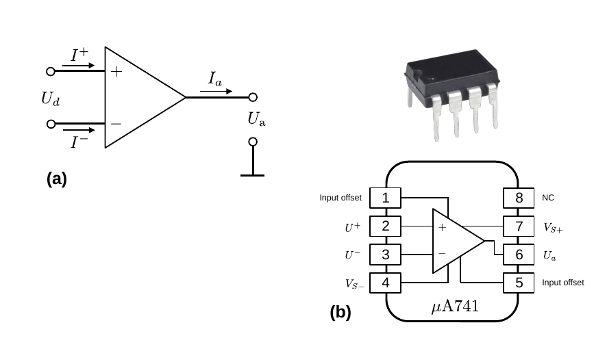

# Hinweise für den Versuch **Operationsverstärker (OPV)**

## Einführung Operationsverstärker

Ein [Operationsverstärker](https://de.wikipedia.org/wiki/Operationsverst%C3%A4rker) (OPV) ist ein aus mehreren Transistoren bestehendes [Netzwerk](https://de.wikipedia.org/wiki/Netzwerk_(Elektrotechnik)). Die Innenbeschaltung des OPV vom Typ $\mu\mathrm{A}741$, wie wir ihn für diesen Versuch verwenden ist [hier](https://gitlab.kit.edu/kit/etp-lehre/p2-praktikum/students/-/raw/main/Operationsverstaerker/figures/OpAmpTransistorLevel_Colored.png) gezeigt (Quelle [Wikipedia](https://commons.wikimedia.org/wiki/File:OpAmpTransistorLevel_Colored.svg)). Eine Diskussion dieser Beschaltung findet sich in der Datei  [Hinweise-OPV-Innenbeschaltung.md](https://gitlab.kit.edu/kit/etp-lehre/p2-praktikum/students/-/blob/main/Operationsverstaerker/doc/Hinweise-OPV-Innenbeschaltung.md). In der Praxis werden OPVs i.a. als Blackbox mit wohl-definiertem Ein- und Ausgangsverhalten verwendet. Das Schaltsymbol ist in **Abbildung 1 (a)** gezeigt:

---

**Abbildung 1**: (In Abbildung (a) ist das Schaltsymbol eines OPV mit Definition der relevanten Ströme und Spannungen gezeigt. Abbildung (b) zeigt das Anschlussschema des OPV $\mathrm{\mu A741}$, wie er in diesem Versuch verwendet wird. $V_{S\pm}$ bezeichnet die Versorgungsspannung. NC steht für *not connected*. Die Beschaltung im Inneren, sowie die Versorgungsspannung(en) werden in Schaltbildern i.a. nicht gezeigt)

---

**Abbildung 1 (b)** zeigt das Anschlussschema des $\mathrm{\mu A741}$. Ein OPV besitzt mindestens fünf Klemmen: 

- Einen (N) invertierenden und einen (P) nicht-invertierenden Signaleingang. 
- Einen Signalausgang. 
- Mindestens zwei (in Schaltbildern nicht gezeigte) Anschlüsse zur externen Spannungsversorgung. 
- Der $\mathrm{\mu A741}$ weist zudem zwei weitere Klemmen zur Feinabstimmung der Eingangsspannungen auf. 

Im allgemeinen ist der P-Eingang als hochohmiger Spannungseingang ausgeführt; der N-Eingang ist je nach OPV-Typ ebenfalls ein hochohmiger Spannungs- oder ein niederohmiger Stromeingang. Der OPV kann i.a. in guter Näherung als [ideale Strom- oder Spannungsquelle](https://gitlab.kit.edu/kit/etp-lehre/p1-praktikum/students/-/blob/main/Elektrische_Messverfahren/doc/Hinweise-Spannungsquellen.md) (relativ zum Massenpotential) angesehen und verwendet werden. Die häufigste Verwendung ist die als **Spannungsverstärker** (engl. *voltage feedback operational amplifier*, VFA) mit zwei hochohmigen Spannungseingängen. 

## Definition relevanter Größen

Der Stromfluss in den P-Eingang wird im Folgenden mit $I^{+}$ bezeichnet, der Stromfluss in den N-Eingang mit $I^{-}$, die anliegenden Spannungen bezeichnen wir mit $U^{+}$ und $U^{-}$; $U_{d}=U^{+}-U^{-}$ ist die Differenzspannung zwischen N- und P-Eingang; $I_{a}$ und $U_{a}$ bezeichnen den Strom und die Spannung am Ausgang. Die Spannungsverstärkung erfolgt als 
$$
\begin{equation*}
U_{a} = v_{0}\left(U^+-U^-\right) + v_{\mathrm{Gl}}\,\frac{U^++U^-}{2},
\end{equation*}
$$
wobei man $v_{0}$  als **Leerlaufverstärkung** (*open loop amplification*) und $v_{\mathrm{Gl}}$ als **Gleichtaktverstärkung** bezeichnet. Beides sind OPV-spezifische Größen. Im allgemeinen ist eine hohe Leerlaufverstärkung und eine niedrige Gleichtaktverstärkung erwünscht. In Datenblättern zu OPVs wird statt der Gleichtaktverstärkung daher auch die **Gleichtaktunterdrückung** (*common mode rejection ratio*, CMRR)
$$
\begin{equation*}
G = 20\,\log\left(\frac{v_{0}}{v_{\mathrm{Gl}}}\right)
\end{equation*}
$$
in [Dezibel $\mathrm{dB}$](https://de.wikipedia.org/wiki/Bel_(Einheit)), als Qualitätsmerkmal, angegeben.

Bei der Verwendung von OPVs unterscheidet man zwei Hauptbetriebsarten: 

- Den **invertierenden Betrieb** mit $U^{+}=0$ (GND) und $U_{a}=-v_{0}\,U^{-}$; sowie
- den **nicht-invertierenden Betrieb** mit $U^{-}=0$ (GND) und $U_{a}=v_{0}\,U^{+}$,

das Eingangssignal $U_{e}$ liegt also entweder als $U^{+}$ am P- oder als $U^{-}$ am N-Eingang an, während der jeweils andere Eingang auf Masse (GND) liegt.

### Idealer und realer OPV

Bei einem idealen OPV ist sowohl $v_{\mathrm{Gl}}$, also auch der Ausgangswiderstand ($X_{a}$) 0, während sowohl $v_{0}$ also auch der Eingangswiderstand $X_{e}$ unendlich groß sind. Zudem hängt die Verstärkung idealerweise nicht von der Frequenz des Signals ab. In der folgenden Tabelle sind einige charakteristische Eigenschaften von idealen und realen OPVs gegenübergestellt: 

| Eigenschaft           | idealer OPV | realer OPV                               | $\mathrm{\mu A741}$             |
| :-------------------- | ----------- | ---------------------------------------- | ------------------------------- |
| $v_{0}$               | $\infty$    | $10^{5}\ldots10^{8}$                     | $10^{5}$                        |
| $v_{\mathrm{Gl}}$     | $0$         | $0.1\ldots 3$                            | 3.2                             |
| $R_{d}$               | $\infty$    | $10^{7}\ \Omega\ldots 10^{12}\ \Omega$   | $\mathcal{O}(\mathrm{M\Omega})$ |
| $R_{a}$               | $0$         | $10\ \Omega\ldots 10^{3}\ \Omega$        | $75\ \Omega$                    |
| $I^{-(0)},\ I^{+(0)}$ | $0$         | $0.1\,\mathrm{nA}\ldots 25\ \mathrm{nA}$ | ${\approx}80\ \mathrm{nA}$      |

Dabei bezeichnen die Größen $I^{-(0)}$ und $I^{+(0)}$ potentielle *offset*-Ströme auf den Eingängen aufgrund baulicher Asymmetrien und $R_{d}$ den Widerstand zwischen dem positiven und dem negativen Eingang. 

Zudem ist die Verstärkung beim realen OPV oberhalb einer charakteristischen Grenzfrequenz $\nu_{\mathrm{G}}$ frequenzabhängig. Darunter garantiert der Hersteller i.a. ideale Unterdrückung der Frequenzabhängigkeit.  

## Goldene Regeln

Zur (ungefähren) Dimensionierung, d.h. zur Beschaltung mit konkreten äußeren Widerständen, von OPV-Schaltkreisen betrachtet man den OPV als ideal. In diesem Fall gelten die folgenden **Goldenen Regeln**:

- Die Differenzspannung zwischen den Eingängen des OPV ist Null: $U_{d}=0$;
- Durch die Eingänge des OPV fließt kein Strom: $R_{d}=R^{+}=R^{-}=\infty$;
- Bis zum maximal zulässigen Ausgangsstrom $𝐼_{a}^{\mathrm{max}}$ ist der OPV beliebig belastbar, d.h. $U_{a}$ hängt bis $𝐼_{a}^{\mathrm{max}}$ **nicht** von der Last (d.h. $I_{a}$) ab. Es handelt sich um eine [ideale Spannungsquelle](https://de.wikipedia.org/wiki/Spannungsquelle#Ideale_und_reale_Spannungsquellen). 

### Einsatz und Dimensionierung

Ohne äußere Beschaltung des OPV wäre aufgrund der hohen Verstärkung $U_{a}$ je nach Eingangsspannung $U_{e}$ entweder maximal oder Null. Aufgrund dieser Eigenschaft werden OPVs auch als **Schalter** oder [**Komparatoren**](https://de.wikipedia.org/wiki/Komparator_(Analogtechnik)) eingesetzt.

Um den OPV als Verstärker zu betreiben verhindert man dieses Verhalten durch äußere Beschaltung, mit der man, analog zum Transistor, $v_{0}$ **durch Gegenkopplung kontrolliert reduziert**. Bei der Gegenkopplung wird ein Teil von $U_{a}$ mit invertiertem Vorzeichen so auf den Eingang des OPV zurückgeführt, dass die Schaltung insgesamt Veränderungen des Eingangssignals entgegenwirkt. Bei allen Verstärkerschaltungen wird daher immer der Ausgang auf den N-Eingang gekoppelt. Bei Gegenkopplung steigt $U_{a}$ nur so lange an, bis $U_{d}$ auf Null abfällt. **Analog zum Transistor hängt der Verstärkungsfaktor $v_{U}$ der resultierenden Schaltung nicht mehr von $v_{0}$, sondern nur noch von der äußeren Beschaltung ab.** 

Die ungefähre Dimensionierung des Schaltkreises erfolgt unter Anwendung der oben erwähnten [**Goldenen Regeln**](https://de.wikipedia.org/wiki/Operationsverst%C3%A4rker). Die exakte Justierung wird daraufhin experimentell vorgenommen. 

## Essentials

Was Sie ab jetzt wissen sollten:

- Operationsverstärker haben einen **invertierenden (N-) und einen nicht-invertierenden P-Eingang**. Im allgemeinen werden Sie zur **Spannungsverstärkung** eingesetzt. 
- Ein OPV zeichnet sich durch eine große **Leerlaufverstärkung ($v_{0}$), geringe Gleichtaktverstärkung ($v_{\mathrm{Gl}}$), große Eingangs- ($X_{e}$) und geringe Ausgangsimpedanz ($X_{a}$)** aus. 
- Für die äußere Beschaltung mit Widerständen (Dimensionierung) gelten zur groben Abschätzung die **golgenen Regeln**. Diese sollten Sie benennen können. 

## Testfragen

1. Was macht eine ideale Spannungsquelle aus?
2. Was sagt die dritte Goldene Regel zur Dimenionsierung von OPVs über $X_{a}$ aus?

# Navigation

[Main](https://gitlab.kit.edu/kit/etp-lehre/p2-praktikum/students/-/tree/main/Operationsverstaerker)

