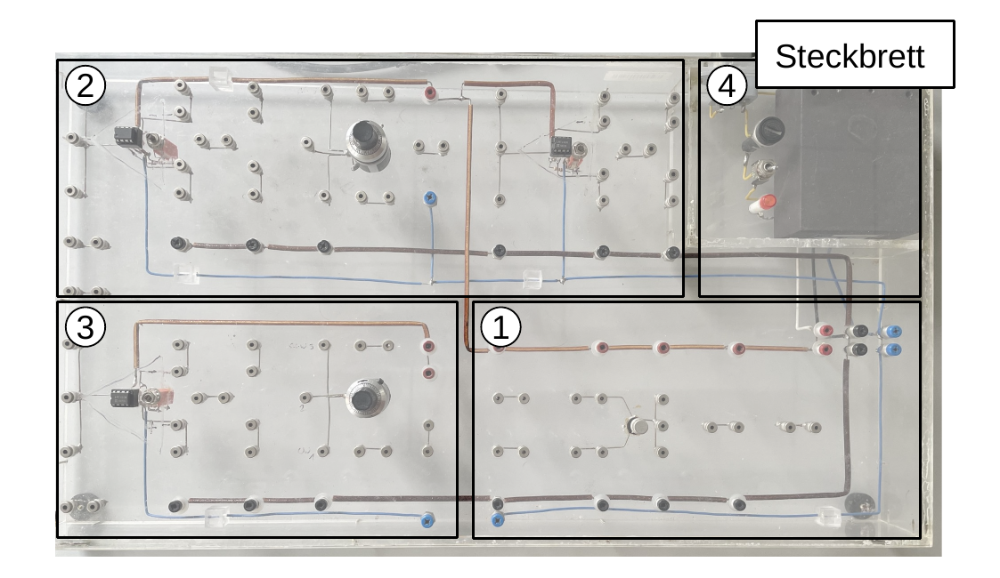

# Hinweise für den Versuch **Operationsverstärker (OPV)**

## Steckbrett

Alle Schaltungen werden auf einem Steckbrett, wie in **Abbildung 1** gezeigt, aufgebaut.

---

**Abbildung 1**: (Steckbrett zum Aufbau der für den Versuch verwendeten Schaltungen)

---

Dieses besteht aus vier Bereichen, die für verschiedene Aufgabenteile verwendet werden:

- **(1) Transistor-Bereich**: Dieser Bereich ist nicht mehr in Verwendung.
- **(2) OPVs 1 und 2**: In diesen Bereichen werden die OPV-Schaltungen für die **Aufgaben 1 bis 3.2** aufgebaut. Links und rechts in diesem Bereich befindet sich jeweils ein bereits an die Spannungsversorgung angeschlossener OPV. In der Mitte befindet ein $10\ \mathrm{k\Omega}$ Potentiometer.
- **(3) OPV 3**: Für **Aufgabe 3.3** benötigen Sie einen dritten OPV. Dieser ist noch nicht an die Spannungsversorgung angeschlossen. Bevor Sie ihn für **Aufgabe 3.3** in Gebrauch nehmen können müssen Sie die Spannungsversorgung selbst vornehmen.
- **(4) Spannungsversorgung**: Hier ist das Netzteil untergebracht, das alle angeschlossenen OPVs mit einer Spannung von $\pm15\ \mathrm{V}$ versorgt (blau: $-15\ \mathrm{V}$, rot: $+15\ \mathrm{V}$, schwarz: $0\ \mathrm{V}$/GND).

Vergessen Sie nicht die Spannungsversorgung für das Steckbrett vor **Gebrauch anzuschalten**. Der Schalter befindet sich in Bereich 4. 

## Multimeter

Sowohl Potentiometer, als auch Widerstände haben natürliche Fertigungstoleranzen. Kalibireren Sie diese mit Hilfe des am Versuchsplatz ausliegenden Multimeters auf $\Omega$ (Ohm). 

Das ausliegende Multimeter gibt im AC-Spannungen und Ströme als **RMS-Amplituden** wieder. Der Zusammenhang verschiedener Amplituden-Angaben ist in **Abbildung 2** gezeigt:

---

**Abbildung 2**: (Zusammenhang verschiedener Spannungsangaben)

---

# Navigation

[Main](https://gitlab.kit.edu/kit/etp-lehre/p2-praktikum/students/-/tree/main/Operationsverstaerker)

