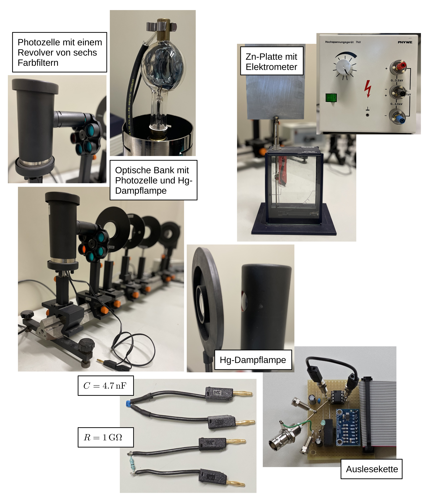

# Fakultät für Physik

## Physikalisches Praktikum P2 für Studierende der Physik

Versuch **H22** (Stand: **April 2026**)

[Raum F1-08](https://labs.physik.kit.edu/img/Klassische-Praktika/Lageplan_P2.png)

# Photoeffekt

## Motivation

> Kein experimenteller Effekt steht so sehr für den Übergang von klassischer zu moderner Physik, wie der [photoelektrische Effekt](https://de.wikipedia.org/wiki/Photoelektrischer_Effekt). Beim äußeren photoelektrischen Effekt, auch Photoemission oder Hallwachs-Effekt genannt, werden durch die Einstrahlung von Licht mit hinreichend hoher Frequenz Elektronen aus der Kathode einer evakuierten Diode ausgeschlagen, die als Photostrom $I_{\mathrm{Ph}}$ zwischen Kathode und Anode nachgewiesen werden können. 

Die Wechselwirkung von Photonen mit Materie hat die Physik des vorletzten Jahrhunderts über nahezu 70 Jahre begleitet. Die Freisetzung von Ladungsträgern aus einer blank polierten Metalloberfläche in einer elektrolytischen Flüssigkeit durch Lichteinstrahlung wurde erstmals 1839 von [Alexandre Bequerel](https://de.wikipedia.org/wiki/Alexandre_Edmond_Becquerel) beobachtet. Dieser war zu diesem Zeitpunkt erst 19 Jahre alt! Der Einfluss ultravioletter Strahlung auf Metalloberflächen wurde 1886 von [Heinrich Hertz](https://de.wikipedia.org/wiki/Heinrich_Hertz) untersucht. Diese Untersuchungen wurden später von [Wilhelm Hallwachs](https://de.wikipedia.org/wiki/Wilhelm_Hallwachs_(Physiker)), nach dem der Effekt der Photoemission auch benannt ist, systematisch weitergeführt. Die gemachten Beobachtungen waren im Rahmen klassisch-physikalischer Modellvorstellungen nicht zu erklären. Eine Erklärung lieferte 1905 erstmals Albert Einstein in §8 seiner bahnbrechenden Arbeit [Ueber einen die Erzeugung und Verwandlung des Lichtes betreffenden heuristischen Gesichtspunkt](http://myweb.rz.uni-augsburg.de/~eckern/adp/history/einstein-papers/1905_17_132-148.pdf), für die er **1921 den Nobelpreis für Physik** erhielt. 

Im Rahmen dieses Versuchs bestimmen Sie das Plancksche Wirkungsquantum $h$ als Proportionalitätskonstante zwischen der Energie $E_{\mathrm{kin}}$ der durch den äußeren Photoeffekt aus der Photokathode ausgeschlagenen Elektronen und der Frequenz $\nu$ des eingestrahlten Lichts:
$$
\begin{equation*}
E_{\mathrm{kin}}=h\,\nu.
\end{equation*}
$$
Seit einer grundlegenden [Revision der SI-Einheiten](https://de.wikipedia.org/wiki/Internationales_Einheitensystem#Neudefinition2019) am 20. Mai 2019 gilt $h$, neben sechs weiteren Naturkonstanten und der Definition der Sekunde durch Atomuhren, als exakte Naturkonstante, die zur Bestimmung des Kilogramms herangezogen wird. Der exakte Wert beträgt
$$
\begin{equation*}
h=6.62607015\times10^{-26}\,\mathrm{J\,s}.
\end{equation*}
$$
Bis dato erfolgten die genauesten Messungen durch den [Quanten-Hall-Effekt](https://de.wikipedia.org/wiki/Quanten-Hall-Effekt). 

## Lernziele

Wir listen im Folgenden auf, was wir von Ihnen erwarten, nachdem Sie diesen Versuch erfolgreich absolviert haben:  

- ✅ Sie kennen und verstehen den Versuchsaufbau zur Messung des Effekts der Photoemission.
- ✅ Sie sind in der Lage mit dem bestehenden Versuchsaufbau das Plancksche Wirkungsquantum ([Planck-Konstante](https://de.wikipedia.org/wiki/Planck-Konstante)) $h$ und damit zentrale Naturkonstante der Quantenmechanik zu bestimmen.
- ✅ Sie können mindestens drei technische Herausforderungen messen, die auf dem Weg zur Messung zu bewältigen sind. 

## Weiterführendes Angebot

Beim photoelektrischen Effekt, den Sie hier untersuchen handelt es sich um einen fundamentalen Effekt, der Ihnen öfter im Alltag als Physiker:in begegnet, als Sie vielleicht erwarten würden. Achten Sie gerne darauf, in wie vielen Versuchen des P2, Ihnen der Effekt begegnen wird oder begegnet sein wird.

## Versuchsaufbau

Einen typischer Aufbau der Apparatur für diesen Versuch ist in **Abbildung 1** gezeigt:

---

**Abbildung 1**: (Ein typischer Aufbau des Versuchs **Photoeffekt**)

---

Auf einer optischen Bank sind, einander gegenüberstehend, eine Quecksilberdampflampe (Hg) und eine Photozelle montiert. Dazwischen befinden sich optische Elemente, wie Linsen zur Fokussierung des emittierten Lichts und eine Revolverhalterung mit sechs Fabry-Pero-Farbfiltern, um einzelne Frequenzen des von Hg emittierten Lichts auszuwählen. Die Photozelle ist durch einen Lichtschutzkollimator vor der Einstrahlung von Umgebungslicht geschützt. Zu Demonstrationszwecken dient eine Zinkplatte (Zn) mit statischem Elektrometer (E). 

## Was macht diesen Versuch aus?

> Dieser Versuch hat zwei Besonderheiten. Zum einen haben Sie die Möglichkeit mit diesem Aufbau mit $h$ eine der wichtigsten Konstanten der modernen Physik eigenhändig und mit erstaunlicher Präzision nachzumessen. Erfolgreiche Gruppen schaffen es, $h$ mit der Unsicherheit von einigen % und einer Genauigkeit von unter 1% zu treffen. Zum anderen erhalten Sie einen Einblick in die Herausforderungen, die eine solche Messung an Sie als Experimentator:innen stellt. 

Bei diesem Versuch haben Sie mit kleinsten Strömen im $\mathrm{nA}$-Bereich zu tun, durch die ein Kondensator aufgeladen wird. Die auf dem Kondensator gesammelten Ladungen sind über ein übliches Spannungsmessgerät mit mäßig hohem Innenwiderstand schneller abgeflossen, als das Gerät die zugehörige Spannung messen kann. Sie benötigen also einen äußerst sorgfältig geerdeten Aufbau mit hohem Innenwiderstand und möglichst geringer Anfälligkeit auf Störsignale von außen. Alle Leiterbahnen sollten möglichst kurz und am besten integriert verbaut sein. Beim Bestrahlen der Photodiode dürfen Sie die davor liegende Ringanode nicht mit dem Licht treffen, da dort sonst ebenfalls Elektronen ausgeschlagen werden können. Selbst beim Demonstrationsversuch mit der Zn-Platte kann eine sich auf dem Zn bildende Oxydschicht den zu beobachtenden Effekt vollkommen zunichte machen, wenn Sie die Platte zuvor nicht sorgfältig poliert haben.  

## Wichtige Hinweise

- 🚨 Bei diesem Versuch arbeiten Sie mit **Hochspannung**. Beachten Sie die entsprechenden [Sicherheitshinweise im Umgang mit Elektrizität](https://labs.physik.kit.edu/163.php?tab=%5B311%5D#tabpanel-311) auf den Webseiten des P1/P2.
- 🚨 Schalten Sie die Hg-Dampflampe für **Aufgabe 2** frühzeitig ein, um einen stabilen Betrieb zu gewährleisten. Die Lampe erreicht ihre volle Intensität erst ${\approx}10\ \mathrm{min}$ nach Inbetriebnahme. Die Lampe muss nach dem Ausschalten einige Zeit abkühlen, bevor sie wieder eingeschaltet werden kann. **Schalten Sie sie daher also nicht aus!**
- 🚨 Da ein signifikanter Anteil der Emissionslinien von Hg im UV-Bereich liegt sollten Sie vermeiden offen in das Licht der Lampe zu sehen. 
- 🚨 Beim Messen so geringer Ströme, wie für diesen Versuch ist es essentiell die gesamte Messapparatur auf dem gleichen wohldefinierten elektrischen Potential zu halten, so dass das Elektrometer nicht auf störende Streusignale reagiert. Bei unzureichender Erdung können winzige Umladeströme und Kontaktpotentiale, die bei jeglicher Form von Reibung und oder Berührung auftreten einen störenden Einfluss haben. Das Reiben der Füße auf dem Boden oder elektrostatisch aufgeladene Textilien gehören z.B. zu solchen Einflüssen.

# Inventar des Versuchs

- Wir gehen davon aus, dass Sie das Protokoll zu diesem Versuch aus einer **Jupyter-Umgebung** führen:
  - 💡 Hierzu steht Ihnen das [bwJupyter Hub](https://hub.bwjupyter.de/) zur Verfügung.
  - 💡 Nutzen Sie **diesen [Direkt-Link](https://hub.bwjupyter.de/services/profilemanagement/add?profile=5fbace23-bf49-4edd-bcaf-c9d421afa8c7)** zur erstmaligen Einrichtung der Umgebung für das P1/P2-Praktikum.
  - 💡 Hinweise zur Arbeit auf dem bwJupyter Hub entnehmen Sie der Datei [JupyterServer.md](https://gitlab.kit.edu/kit/etp-lehre/p1-praktikum/students/-/blob/main/doc/JupyterServer.md).
- Die folgenden Links führen auf/in die wichtigsten Dateien und Verzeichnisse dieser Versuchsanleitung:
  - [Photoeffekt.iypnb](https://gitlab.kit.edu/kit/etp-lehre/p2-praktikum/students/-/blob/main/Photoeffekt/Photoeffekt.ipynb): Aufgabenstellung und Vorlage fürs Protokoll (in Form eines Jupyter-notebook).
  - [Photoeffekt_Hinweise.ipynb](https://gitlab.kit.edu/kit/etp-lehre/p2-praktikum/students/-/blob/main/Photoeffekt/Photoeffekt_Hinweise.ipynb): Hinweise zu Versuchsdurchführung und Auswertung (in Form eines Jupyter-notebook).
  - [Datenblatt.md](https://gitlab.kit.edu/kit/etp-lehre/p2-praktikum/students/-/blob/main/Photoeffekt/Datenblatt.md): Inventar und technische Details zu den Versuchsaufbauten.
  - [doc](https://gitlab.kit.edu/kit/etp-lehre/p2-praktikum/students/-/tree/main/Photoeffekt/doc): Dokumente zur Vorbereitung auf den Versuch.
  - [figures](https://gitlab.kit.edu/kit/etp-lehre/p2-praktikum/students/-/tree/main/Photoeffekt/figures): Bilder, die für die Dokumentation des Versuchs verwendet wurden.
