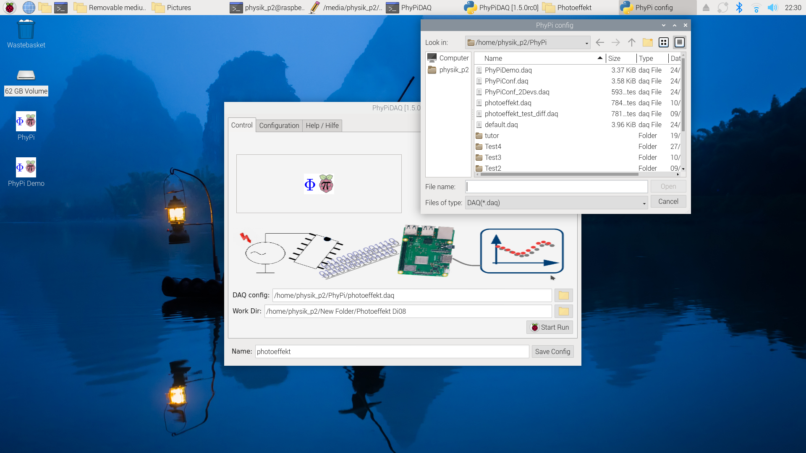
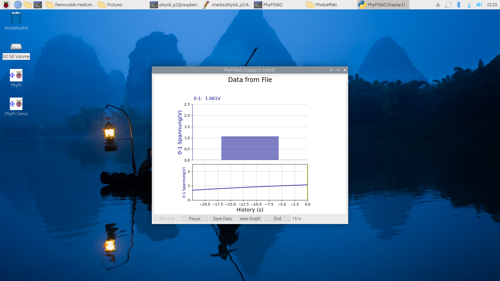
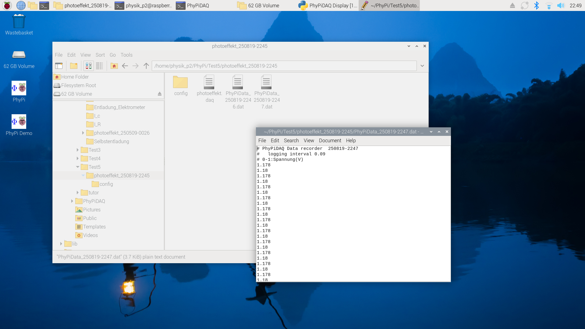

# Photoeffekt

## Experimentelle Aufbauten

### Hg-Dampflampe

Für den Versuch wird die Photozelle mit dem Licht einer Hochdruck-Quecksilberdampflampe bestrahlt. 💡 [Hg](https://de.wikipedia.org/wiki/Quecksilberdampflampe) besitzt u.a. die folgenden für diesen Versuch relevanten diskreten Emissionslinien 

- $\lambda=365.01\ \mathrm{nm}$ (UV);
- $\lambda=404.66\ \mathrm{nm}$ (violett);
- $\lambda=407.78\ \mathrm{nm}$ (violett);
- $\lambda=435.83\ \mathrm{nm}$ (blau);
- $\lambda=491.60\ \mathrm{nm}$ (cyan);
- $\lambda=546.07\ \mathrm{nm}$ (grün);
- $\lambda=576.96\ \mathrm{nm}$ (orange);
- $\lambda=579.07\ \mathrm{nm}$ (orange).

In der Überlagerung ergibt sich eine **grünliche Farbe**. Einzelne Wellenlängen können mit Hilfe von sechs [Fabry-Pero](https://de.wikipedia.org/wiki/Fabry-P%C3%A9rot-Interferometer)-Farbfiltern weiter ausgewählt werden, die für die folgenden Wellenlängen durchlässig sind:

- $\lambda^{(1)}_{\mathrm{CWL}}=360\ \mathrm{nm}$;
- $\lambda^{(2)}_{\mathrm{CWL}}=400\ \mathrm{nm}$;
- $\lambda^{(3)}_{\mathrm{CWL}}=440\ \mathrm{nm}$;
- $\lambda^{(4)}_{\mathrm{CWL}}=490\ \mathrm{nm}$;
- $\lambda^{(5)}_{\mathrm{CWL}}=540\ \mathrm{nm}$;
- $\lambda^{(6)}_{\mathrm{CWL}}=590\ \mathrm{nm}$.

💡 Die Abkürzung CWL steht dabei für *central wavelength*; es ist die Wellenlänge in der Mitte des Filterbandpasses. Laut Hersteller haben die Filter eine **[Halbwertsbreite](https://de.wikipedia.org/wiki/Halbwertsbreite) von $\pm10\ \mathrm{nm}$**, aus der Sie die Standardabweichung des eingestrahlten Lichts bestimmen können. 💡 Beachten Sie dabei die Umrechnung zwischen Halbwertsbreite und Standardabweichung unter Annahme einer Normalverteilung. 

### Spannungsmessung mit dem Messverstärker

Da die Photozelle nur sehr geringe Spannungen erzeugt würde sie bei direkter Messung mit einem einfachen Multimeter direkt über den Innenwiderstand des Messgeräts entladen werden. Ein gutes Handmultimeter besitzt zur Spannugnsmessung einen Innenwiderstand von $R_{i}\approx\mathcal{O}(1{-}10\ \mathrm{G\Omega})$. 

Die Messung als Spannungsmessung kann auf zweierlei Weise erfolgen: 

- Als sich aufbauende Spannung an einem Kondensator mit der bekannten Kapazität $C$. 
- Als abfallende Spannung an einem bekannten Widerstand $R$. 

🔔 Die Messanordnung hierzu sollte einen **maximal hohen Innenwiderstand $R_{i}$** aufweisen. Dies erreicht man z.B. durch Verwendung eines Operationsverstärkers (OPV) als Impedanzwandler (Spannungsfolger), wie in **Abbildung 1** gezeigt: 

---

(**Abbildung 1:** Schaltbild eines Impedanzwandlers, wie er zur Auslese des Versuchs **Photoeffekt** verwendet wird)

---

🔔 Ein Impedanzwandler übersetzt $U_{e}$ ohne weitere Verstärkung (d.h. mit dem Verstärkungsfaktor $v_{U}=1$) in $U_{a}=U_{e}$. Der Versuch [**Signalverarbeitung**](https://gitlab.kit.edu/kit/etp-lehre/p2-praktikum/students/-/tree/main/Signalverarbeitung/README.md) gibt Ihnen die Möglichkeit sich mit dieses Bauelement besser kennenzulernen. 

Am Ausgang des Impedanzwandlers wird das Signal mit Hilfe eines Analog-Digital-Wandlers ([ADS1115](https://gitlab.kit.edu/kit/etp-lehre/p2-praktikum/students/-/blob/main/doc/SOLDERED_ADS1115_DATASHEET.pdf)) digitalisiert und zur weiteren Verarbeitung an einen [Raspberry Pi 400](https://gitlab.kit.edu/kit/etp-lehre/p2-praktikum/students/-/blob/main/doc/raspberry-pi-400-product-brief.pdf) (oder höher) weitergeleitet. 

> Mit Hilfe des Impedanzwandlers kann $U_{a}$ weiterverarbeitet werden, ohne die am Eingang anliegende Spannung $U_{e}$ zu beeinflussen. Auf diese Weise wird die Photozelle effektiv von der weiteren Auslesekette zur Signalverarbeitung entkoppelt, so dass der Einfluss der Messung auf die Photozelle so gering wie möglich bleibt. 

Der Schaltkreis von der Aufnahme des Signals als $U_{e}$ bis zum 40-poligen Breitbandkabel zur Weiterleitung des digitalisierten Signals an den Raspberry Pi ist in **Abbildung 2** gezeigt: 

---

(**Abbildung 2**: Platine zur Auslese der Photozelle. Abbildung (a) zeigt die Platine noch in rohem Zustand, nach Abschluss der Entwicklungen. Abbildung (b) zeigt die Platine im finalen Gehäuse. Die Anschlüsse sind einzeln identifizierbar)

---

#### Bestimmung des Innenwiderstands $R_{i}$ der Messanordnung

Das Ersatzschaltbild für eine klassische Bestimmung des Innenwiderstands $R_{i}$ eines Spannungsmessgeräts ist in **Abbildung 3** gezeigt:

---

**Abbildung 3**: (Ersatzschaltbild für eine klassische Bestimmung des Innenwiderstands $R_{i}$ eines Spannungsmessgeräts)

---

🔔 Das Messgerät ist durch den gestrichelten Kasten dargestellt. Es hat den Ausgabewert $U_{a}$, den Eingabewert $U_{e}$ (jeweils relativ zu GND) und den Innenwiderstand $R_{i}$. Zum Messgerät ist mit $R_{V}$ ein bekannter Referenzwiderstand $R_{V}$ in Serie geschaltet. In der Messanordnung gehen wir zudem von einer bekannten idealen Spannungsquelle für die Spannung $U_{0}$ aus. Nach den [Kirchhoffschen Regeln](https://de.wikipedia.org/wiki/Kirchhoffsche_Regeln) gilt:
$$
\begin{equation*}
\begin{split}
&U_{e}=R_{i}\,I;\qquad U_{0}=(R_{V}+R_{i})\,I;\\
&\\
&U_{a} = U_{e} = U_{0}\,\frac{R_{i}}{R_{V}+R_{i}}\approx U_{0}\left(1-\frac{R_{V}}{R_{i}}\right); \\
%&\\
%&R_{i} = \frac{U_{e}}{U_{0}+U_{e}}\,R_{V}.\\
\end{split}
\end{equation*}
$$
🔔 Das Problem bei der Messung von $R_{i}$ für die Messanordnung, wie wir sie für diesen Versuch verwenden, besteht darin, dass der Wert von $R_{i}$ im Bereich mehrerer(!) $100\ \mathrm{G\Omega}$ und damit deutlich höher liegt als jeder im Handel erhältliche Referenzwiderstand $R_{V}$. 

Zum Vergleich: 

- Der Innenwiderstand des menschlichen Körpers wird mit ${\approx}70\ \mathrm{k\Omega}$ [[1](https://de.wikipedia.org/wiki/K%C3%B6rperwiderstand)] (von Fingerspitze zu Fingerspitze) angegeben.
- Die höchsten im Handel erhältlichen Widerstände haben einen Nennwert von $10\ \mathrm{G\Omega}$. 

Selbst unter Verwendung eines Widerstands von $R_{V}=10\ \mathrm{G\Omega}$ läge der Spannungsabfall an $U_{a}$ durch Serienschaltung von $R_{V}$ mit dem Messgerät, für das $R_{i}$ zu bestimmen ist im %-Bereich. 💡Der Effekt, aus dem $R_{i}$ zu bestimmen wäre, wäre also tendenziell eher klein und daher sehr unpräzise. 

**Wir schlagen vor, den Kondensator mit der Kapazität $C=(4.7\pm0.05)\ \mathrm{nF}$ über die Messanordnung kurz zu schließen.** Dadurch kommt es zur Entladung 
$$
\begin{equation}
U_{a}(t, C, R_{i}) = U_{0}\,e^{-\frac{1}{C\,R_{i}}t},
\tag{1}
\end{equation}
$$
die Sie über die Messanordnung bestimmen können. Aus dem Verlauf der Entladekurve lässt sich $R_{i}$ bei Kenntnis von $C$ bestimmen. 

- 💡 Sie können den Kondensator am einfachsten durch Beleuchtung mit der Hg-Lampe aufladen. 
- 💡 Decken Sie die Hg-Lampe zum Zeitpunkt $t_{0}$ ab und warten Sie einfach den exponentiellen Abfall der Spannung durch die Entladung ab. 
- Die Spannung des Kondensators wird am Ausgang des Impedanzwandlers über den Raspberry Pi ausgelesen. 
- Sie können entweder den exponentiellen Abfall aufzeichnen, oder zwei Messpunkte bestimmen, wie [hier](https://gitlab.kit.edu/kit/etp-lehre/p1-praktikum/students/-/blob/main/Elektrische_Messtechnik/doc/Hinweise-Widerstaende.md#spannungsmessger%C3%A4te-mit-extrem-hohen-innenwiderst%C3%A4nden) beschrieben. 
- Wundern Sei sich nicht, wenn die Spannung sehr langsam abfällt. Dies ist der Grund, warum wir den Impedanzwandler einsetzen! 💡 Der tatsächlich nachweisbare Innenwiderstand ist durch Kriechströme über die Ausleseplatine und deren Einhausung limitiert und hängt von äußeren Bedingungen, wie z.B. der Luftfeuchtigkeit ab. Er kann kann jedoch bis in den $\mathrm{T\Omega}$ reichen.

### Aufnahme der Daten mit dem Raspberry Pi

Die Platine zur Auslese der Daten ist über ein 14-poliges Kabel mit einem Raspberry Pi 400 (oder höher) verbunden. 💡 Dieser sollte nach Einschalten der Spannungsversorgung im Versuchsraum automatisch hochgefahren sein. 

Der Startbildschirm, nachdem Sie das Programm *PhyPi* zur digitalen Auslese der Daten gestartet haben, ist in **Abbildung 4** gezeigt:

---

**Abbildung 4**: (Startbildschirm des Raspberry Pi nach Öffnen des Programms PhyPi zur digitalen Auslese der Daten und Klick auf das Symbol rechts neben der ersten Eingabezeile. Die ausgewählte Konfigurationsdatei `photoeffekt.daq` ist in der Darstellung der Verzeichnisinhalte an vierter Stelle zu sehen)

---

💡 Das home-Verzeichnis mit Desktop verweist im Wurzelverzeichnis des Raspberry Pi auf `/home/physik_p2/`.

💡 Sie können das Programm *PhyPi* z.B. durch Doppelklick auf das gleichnamige Symbol auf dem Desktop (oben rechts im Bild) starten.

Am sich daraufhin öffnenden Startbildschirm können Sie die folgenden Eingaben vornehmen: 

- Auswahl einer Konfigurationsdatei für die Auslese der Daten (`photoeffekt.daq` im Bild). Hier liegt im allgemeinen eine Voreinstellung vor, die Sie beibehalten können. Falls dies nicht der Fall sein sollte, finden Sie eine geeignete Datei unter `/home/physik_p2/PhyPi/photoeffekt.daq`. 
  - 💡 Durch Klicken auf das Symbol rechts neben der Eingabezeile gelangen Sie ins Verzeichnis `/home/physik_p2/PhyPi`, wo Sie die entsprechende Datei finden und durch Doppelklick auswählen können. Sie können die Datei auch gerne durch Doppelklick in einem geeigneten Texteditor öffnen, um herauszufinden, welche Konfigurationen darin vorgenommen werden.  
- Auswahl eines Arbeitsverzeichnisses (`home/physik_p2/New Folder/Photoeffekt Mo-28/Widerstand` im Bild). 
  - 💡 Hierbei handelt es sich um das Verzeichnis, in dem alle Messreihen, die Sie während der Messkampagne aufnehmen werden als Textdateien mit der Endung *.dat* hinterlegt werden
  - 💡 Durch Klicken auf das Symbol rechts neben der Eingabezeile gelangen Sie ins Verzeichnis `/home/physik_p2/PhyPi`, wo Sie sich ein entsprechendes eigenes Arbeitsverzeichnis anlegen und auswählen können.
- In der letzten Zeile können Sie einen neuen Namen angeben, der als Präfix für die hinterlegten Daten in Ihrem Arbeitsverzeichnis dient.

Schließen Sie die Konfiguration durch **Klicken auf das Symbol `Start Run`** auf dem Startbildschirm ab. Sie sollten daraufhin nach kurzer Zeit den Bildschirm zur Überwachung und Steuerung der Datennahme, wie in **Abbildung 5** gezeigt, sehen:

---

**Abbildung 5**: (Bildschirm zur Überwachung und Steuerung der Datennahme)

---

Der obere Teil des Bildschirms zeigt den augenblicklichen Wert der digitalisierten Spannung am Ausgang des Impedanzwandlers in Volt an. Im unteren Teil des Bildschirms ist der zeitliche Verlauf, als Historie zu sehen. Die Kurve beginnt bei $t=0\ \mathrm{s}$, am rechten Rand der Figur, verläuft von rechts nach links und zeigt immer einen Ausschnitt von etwas mehr als $\Delta t_{\mathrm{max}}\gtrsim20\ \mathrm{s}$ an, bevor die aufgezeichneten Datenpunkte die Darstellung nach links verlassen. 💡 Die aufgezeichneten Daten werden natürlich trotzdem noch im Arbeitsspeicher des Programms vorgehalten. 

In der unteren Leiste des Bildschirms erkennen Sie einige Schaltflächen für eine minimalistische Steuerung des Programms: 

- **Start/Resume**: Zum Start oder zur Wiederaufnahme der Datennahme, nach Klick auf die Pause-Fläche.
- **Pause**: Zum Anhalten/Pausieren einer laufenden Aufnahme. 💡 Durch Klicken der Start/Resume und der Pause-Fläche definieren Sie eine Messreihe.
- **Save Data**: Zum Speichern einer Messreihe. Die Betätigung dieser Schaltfläche schließt die Datennahme in einer eigenen Datei ab.  Nach Wiederaufnahme (Resume) werden die Daten in eine neue Ausgabedatei um gleichen Unterverzeichnis geschrieben. 
- **save Graph**: Zum Speichern des Bildschirms in *png*-Format. 
- **End**: Zum Beenden des Programms. 

- Links neben den Funktionsflächen wird bei laufender Messreihe in Sekunden angezeigt, wie lange die Messung bereits läuft. 

Ein typisches Arbeitsverzeichnis ist in **Abbildung 6** gezeigt:

---

**Abbildung 6**: (Ein typisches Arbeitsverzeichnis und die Struktur einer Datei mit der Endung *.dat*)

---

💡 Sie können daran erkennen, dass hierzu das Arbeitsverzeichnis `/home/physik_p2/PhyPi/Test5` und der Projektname `photoeffekt` im Startbildschirm ausgewählt wurden. 

💡 Daraufhin wurde im ausgewählten Arbeitsverzeichnis das Unterverzeichnis `photoeffekt_250819-2245` automatisch durch das Programm *PhyPi* angelegt und die entsprechenden Konfigurationsdateien zu Dokumentationszwecken hinterlegt. 

💡 Durch zweimaliges Klicken der Schaltfläche **Save Data** wurde jeweils eine Datei mit dem Namen `PhyPiData_${TIMESTAMP}.dat` angelegt. Die Umgebungsvariable `${TIMESTAMP}` steht dabei für die Angabe von Datum und Uhrzeit, als Zeitstempel, unter dem Sie die einzeln angelegten Dateien unterscheiden können. Dieser Zusatz erfolgt automatisch durch das Programm.

Die Struktur der geöffneten Datei `PhyPiData_250819-2274.dat` ist ebenfalls im Bild zu sehen. Die aufgezeichneten Daten sind darin in einer Spalte so hinterlegt, dass in jeder Zeile der ausgelesene Wert der Spannung nach einem vorgegebenen Zeitintervall $\Delta t$ abgelegt wird. Zeit- und Spannungsintervalle sind in Kommentarzeilen im Kopf der Datei angegeben. Wie Sie sehen haben wir als *logging interval* $0.09\ \mathrm{s}$ gewählt. Diese Wahl haben wir bewusst so getroffen, dass Sie nicht allzu oft und regelmäßig mit einem Vielfachen von $0.02\ \mathrm{s}$ zusammenfällt um *locking* und Oszillationseffekte in der Auslese durch unerwünscht eingekoppelte Kriechströme aus der Haushaltsnetzspannung zu vermeiden. 

---

[Main](https://gitlab.kit.edu/kit/etp-lehre/p2-praktikum/students/-/tree/main/Photoeffekt/README.md)
