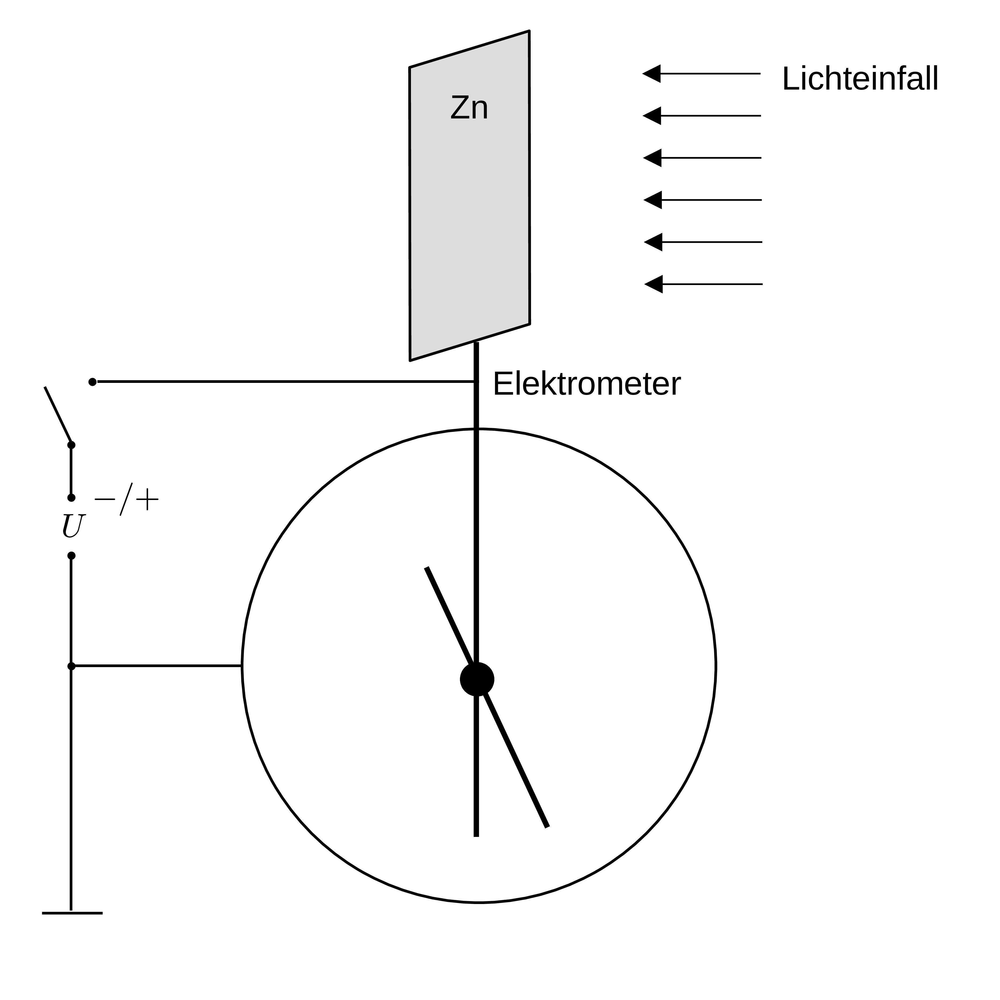
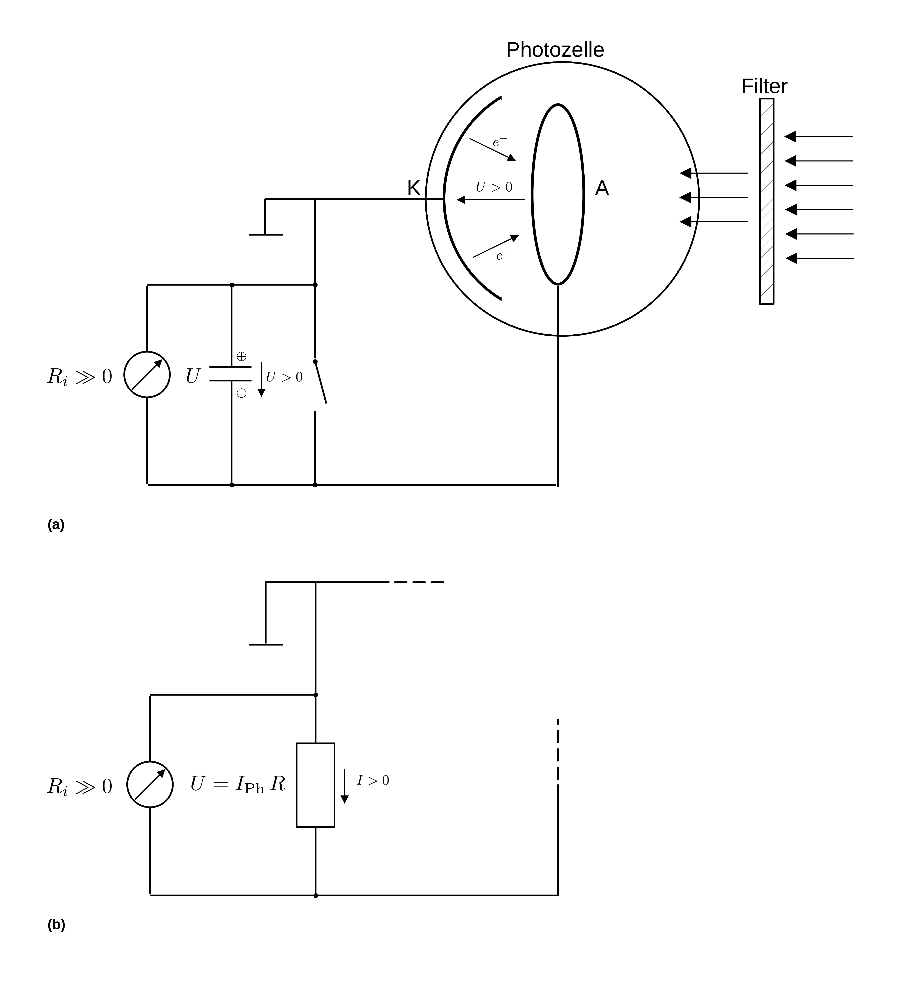
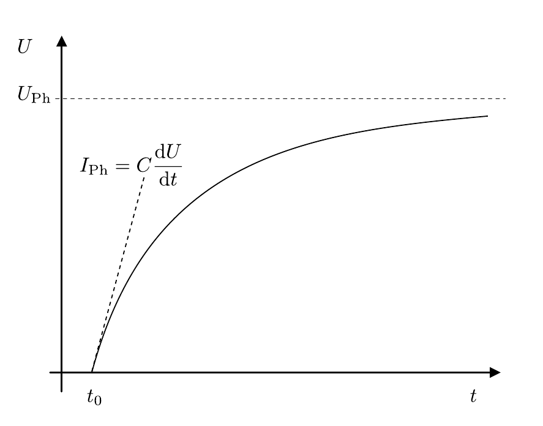

# Photoeffekt

## Photoelektrischer Effekt

### Beobachtung des äußeren photoelektrischen Effekts

Eine Skizze für die qualitative Beobachtung des äußeren photoelektrischen Effekts, wie Sie sie für **Aufgabe 1.1** vornehmen ist in **Abbildung 1** gezeigt:

---

**Abbildung 1**: (Polierte Zn-Platte und ein statisches Elektrometer (E), wie Sie es für **Aufgabe 1.1** zur qualitativen Beobachtung des äußeren photoelektrischen Effekts verwenden)

---

Ein statisches [Elektrometer](https://de.wikipedia.org/wiki/Elektroskop) (E), wie es bereits um 1600 von [William Gilbert](https://de.wikipedia.org/wiki/William_Gilbert) verwendet wurde ist mit einer polierten Zn-Platte leitend verbunden. Die ins Gehäuse ragende Aufhängung mit drehbarem Zeiger ([Versorium](https://de.wikipedia.org/wiki/Versorium)) ist gegen das auf Masse liegende Gehäuse isoliert. Die Zn-Platte kann wahlweise mit positiver oder negativer Spannung aufgeladen werden, wodurch es (unabhängig vom Vorzeichen der Ladung) zur Abstoßung und somit zur Auslenkung des Versoriums kommt. 

💡 Wird die Zn-Platte negativ aufgeladen und anschließend mit Licht von geeignet kurzer Wellenlänge bestrahlt kommt es zur schrittweisen Entladung. Nicht so, wenn die Zn-Platte positiv aufgeladen wird. 

💡 Bei negativer Ladung treten durch den äußeren photoelektrischen Effekt Elektronen aus, wodurch die Zn-Platte schrittweise entladen wird. Die ausgetretenen Elektronen bilden dabei eine Raumladungswolke, die mit zunehmender Zeit das Austreten weiterer Elektronen erschwert. Bringt man eine Anode A in die Nähe der Zn-Platte wird die Raumladungswolke von A abgesaugt, was das Austreten weiterer Elektronen wieder begünstigt.  

### Bestimmung von $h$ mit Hilfe einer Photozelle

Eine Skizze des Messprinzips zur quantitativen Bestimmung von $h$ mit Hilfe der Spannung $U_{\mathrm{Ph}}$ einer Photozelle ist in **Abbildung 2 (a)** gezeigt:

---

**Abbildung 2**: (Skizze des Messprinzips (a) zur Bestimmung von $h$ mit Hilfe der Spannung $U_{\mathrm{Ph}}$ der Photozelle und (b) zur Messung des Photostroms $I_{\mathrm{Ph}}$ bei variierender Lichtintensität)

---

Im Zentrum des Messaufbaus steht die evakuierte Photozelle mit der Kathode K und einer ringförmigen Anode A. 🔔 Ohne Lichteinstrahlung liegt zwischen K und A die **Kontaktspannung** 
$$
\begin{equation}
U_{c} = \frac{W_{A}-W_{K}}{e}
\tag{1}
\end{equation}
$$
an, wobei $e$ der Elementarladung, $W_{K}$ der Austrittsarbeit von K und $W_{A}$ der Austrittsarbeit von A entsprechen. Wir definieren dabei zweckmäßig $`U_{c}>0`$ für $`W_{K}>W_{A}`$, ein Elektron aus K auszulösen und in A einzufügen würde also Energie freisetzen, was wir mit dem Durchlaufen einer positiven Spannungsdifferenz gleichsetzen.    

Durch ein Eintrittsfenster tritt (in der Skizze von rechts kommend) monochromatisches Licht der Frequenz $\nu$ ein, dessen Strahlengang durch A hindurch verläuft (🔔 ohne auf A zu treffen) und auf K trifft. Ist die Energie der einlaufenden Photonen $E_{\gamma}=h\nu$ hinreichend groß, um $W_{K}$ zu überwinden schlagen die Photonen Elektronen mit der kinetischen Energie
$$
\begin{equation*}
E_{\mathrm{kin}}= h\nu - W_{K}
\end{equation*}
$$
aus K aus. 

💡 Auf ihrem Weg durch die Photozelle treffen einige dieser Elektronen auf A, wodurch A statisch aufgeladen und (zusätzlich zu $U_{c}$) eine nicht verschwindende Spannung $U_{\nu}$ zwischen A und K erzeugt wird, die der **Bewegung der Elektronen entgegen gerichtet** ist. Die freigesetzten Elektronen laufen im folgenden mit der Energie $E_{\mathrm{kin}}$ gegen $U_{\nu}$ an. Dieser Prozess läuft so lange ab, bis schließlich bei einer maximalen Spannung $U_{\nu}^{\mathrm{max}}$ aus kinematischen Gründen kein Elektron mehr A erreicht und der Ladungsfluss zum Erliegen kommt. Für $U_{\nu}^{\mathrm{max}}$ gilt: 
$$
\begin{equation}
\begin{split}
&E_{\mathrm{kin}}+e\,\underbrace{(U_{\nu}^{\mathrm{max}}-U_{c})}=0;\\
&\hphantom{E_{\mathrm{kin}}=e\,cccc}\equiv U_{\mathrm{Ph}}\\
&\\
&E_{\mathrm{kin}}=h\nu - W_{K}; \\
&\\
&U_{\mathrm{Ph}}= -\frac{h}{e}\nu + \frac{W_{K}}{e}.\\
\end{split}
\tag{2}
\end{equation}
$$
#### Bestimmung von $U_{\mathrm{Ph}}$ als Funktion der Lichtfrequenz

Mit der in **Abbildung 2 (a)** skizzierten Messanordnung bestimmen Sie
$$
\begin{equation*}
U_{\mathrm{Ph}}=U_{\nu}^{\mathrm{max}}-U_{c}
\end{equation*}
$$
durch Parallelschaltung eines Kondensators. Dieser kann durch einen Druckschalter kurzgeschlossen werden, worauf er bei anhaltender Lichteinstrahlung erneut aufgeladen wird. **Die Messung erfolgt über die Aufnahme der Ladekurve.** $U_{\mathrm{Ph}}$ stellt sich dabei als Grenzspannung des Ladevorgangs ein. Eine schematische Darstellung eines solchen Ladevorgangs ist in **Abbildung 3** gezeigt:

---

(**Abbildung 3**: Schematische Darstellung des Ladevorgangs des zur Photodiode parallel geschalteten Kondensators mit der Kapazität $C$)

---

Der Ladevorgang beginnt bei $t=t_{0}$. 💡 Der genaue Verlauf der Kurve und insbesondere, wie steil diese zu Beginn der Messung Ansteigt hängt von der Kapazität $C$ des verwendeten Kondensators ab. 

💡 Beachten Sie, dass bei diesem Vorgang A negativ aufgeladen wird, weshalb $U_{\mathrm{Ph}}$, als **Gegenspannung**, im Bild zwischen A und K von rechts nach links und über den Kondensator von oben nach unten positiv, gemessen wird. Weiterhin ist $U_{\nu}^{\mathrm{max}}$ der Kontaktspannung $U_{c}$ nach der Definition von Gleichung **(1)** entgegen gerichtet. Passt man an den Verlauf der Ladekurve ein geeignetes Modell an lässt sich daraus $U_{\mathrm{Ph}}$ bestimmen. 

💡 Beachten Sie, dass sich um K **Raumladungen** ausbilden. Der Ladevorgang eines Kondensators beim Anlegen einer Gleichspannung 
$$
\begin{equation}
U(t) = U_{\mathrm{Ph}}\left(1-e^{-\frac{t}{R\,C}}\right)
\tag{3}
\end{equation}
$$
ist daher **kein sehr gutes Modell** zur Anpassung an die Daten. Besser eignet sich ein Modell, dass durch das [Raumladungsgesetz von Schottky-Langmuir](https://de.wikipedia.org/wiki/Raumladungsgesetz) motiviert ist:
$$
\begin{equation}
U(t)=U_{\mathrm{Ph}}-\bigl(\kappa\,\left(t-t_{0}\right)\bigr)^{-3/2}
\tag{4}
\end{equation}
$$
Trägt man $e\,U_{\mathrm{Ph}}$ für verschiedene Werte von $\nu$ auf stellt sich ein **linearer Zusammenhang** ein, aus dem man das Verhältnis $h$ (als Steigung), sowie $W_{K}$ (als $y$-Achsenabschnitt) bestimmen kann. 

#### Bestimmung von $I_{\mathrm{Ph}}$ als Funktion der Lichtintensität

Zur Messung des Photostroms $I_{\mathrm{Ph}}$ (unter Kurzschluss) ersetzen Sie, bei gleicher Messanordnung, den Kondensator aus **Abbildung 2 (a)** durch einen geeigneten Widerstand, wie in **Abbildung 2 (b)** gezeigt, und messen den Strom als Spannungsabfall über $R$.

Alternativ können Sie $I_{\mathrm{Ph}}$ als 
$$
\begin{equation*}
I_{\mathrm{Ph}}=C\,\frac{\mathrm{d}U}{\mathrm{d}t}
\end{equation*}
$$
aus der Ladekurve des Kondensators bestimmen. Hierzu bieten sich zwei Möglichkeiten an: 

- Falls Sie durch Gleichung **(4)** eine hinreichend gute Beschreibung der Daten erzielen können erhalten Sie $I_{\mathrm{Ph}}(t)$ aus der Ableitung von Gleichung **(4)** nach der Zeit:
  $$
  \begin{equation*}
  I_{\mathrm{Ph}} = -\frac{3}{2}\,C\,\bigl(\kappa\left(t-t_{0}\right)\bigr)^{-5/2}.
  \end{equation*}
  $$
  Lesen Sie $I_{\mathrm{Ph}}$ aus dem quasi-linearen Anstieg von $U(t)$ für $t\approx t_{0}$ ab, so lange die sich aufbauende Gegenspannung noch klein ist. 

- Alternativ bestimmen Sie $I_{\mathrm{Ph}}$ aus der Steigung der Tangente für $t\approx t_{0}$, wie in **Abbildung 3** gezeigt.

## Erwartung

Was wir an dieser Stelle von Ihnen erwarten:

- ✅ Sie können den äußeren **Photoeffekt qualitativ erklären**.
- ✅ Sie können das **Messprinzip erklären** können, nach dem Sie im Versuch $h$ mit Hilfe der Ladekurve eines Kondensators bestimmen.
- ✅ Sie können erklären, **wie man aus der Ladekurve $I_{\mathrm{}Ph}$ bestimmen kann**.

## Testfragen

1. Warum schlägt beim Demonstrationsversuch zu **Abbildung 1** das Versorium des Elektrometers immer in die gleiche Richtung aus, unabhängig davon, ob eine positive oder negative Spannung anliegt?
1. Warum kommt es nicht zur Entladung das Elektrometers bei Bestrahlung mit Licht nicht, wenn es positiv aufgeladen ist?
1. Wie kommt es, dass Gleichung **(3)** **kein gutes Modell** zur Beschreibung des Ladevorgangs des Kondensators ist? 

---

[Main](https://gitlab.kit.edu/kit/etp-lehre/p2-praktikum/students/-/tree/main/Photoeffekt/README.md)

