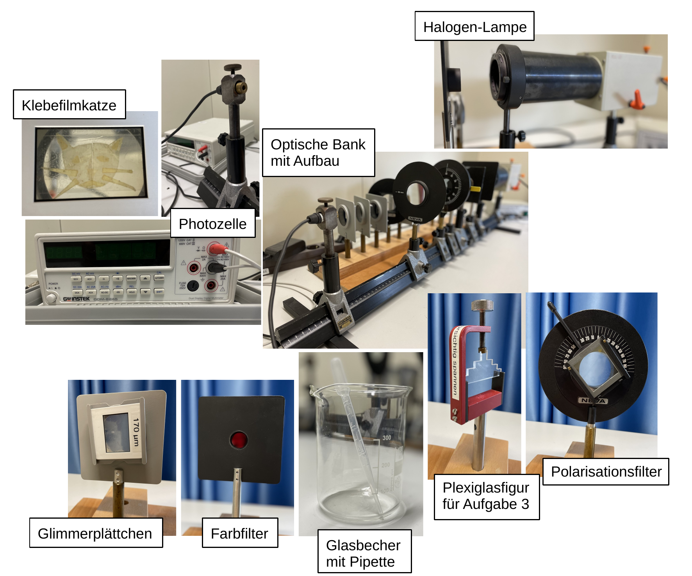

# Fakultät für Physik

## Physikalisches Praktikum P2 für Studierende der Physik

Versuch P2-201, 202, 203 (Stand: **Februar 2025**)

[Raum F1-14](https://labs.physik.kit.edu/img/Klassische-Praktika/Lageplan_P1P2.png)

# Polarisation und Doppelbrechung

## Motivation

Im Vakuum haben elektromagnetische Wellen (mit dem Wellenvektor $\vec{k}$ und der Kreisfrequenz $\omega$) sehr spezielle Eigenschaften. Das elektrische Feld $\vec{E}$ und das magnetische Feld $\vec{B}$ stehen immer senkrecht aufeinander und sowohl $\vec{E}$ als auch $\vec{B}$ stehen senkrecht auf $\vec{k}$. Es ist daher am einfachsten elektromagnetische Wellen als ebene Wellen 
$$
\begin{equation*}
\begin{split}
&\vec{E}(\vec{k}\cdot\vec{x}-\omega\ t) = \vec{E}\,e^{-i(\vec{k}\cdot\vec{x}-\omega\ t)};\\
&\vec{B}(\vec{k}\cdot\vec{x}-\omega\ t) = \vec{B}\,e^{-i(\vec{k}\cdot\vec{x}-\omega\ t)}\\
\end{split}
\end{equation*}
$$
zu beschreiben. Ebene Wellen sind **linear polarisiert**, d.h. $\vec{E}(\vec{k}\cdot\vec{x}-\omega\ t)$ und $\vec{B}(\vec{k}\cdot\vec{x}-\omega\ t)$ variieren innerhalb zweier senkrecht zueinander stehender Ebenen mit unveränderlicher Orientierung im Raum. Diese Ebenen bezeichnet man als Polarisationsebenen. Durch Verschränkung zweier ebener Wellen ist es möglich eine **elliptisch oder zirkular polarisierte** Welle zu erzeugen, bei der die Vektoren von $\vec{E}$ und $\vec{B}$ in der Ebene senkrecht zu $\vec{k}$ kreisen. Im allgemeinen Fall der elliptischen Polarisation ändern sich dabei die Beträge von $\vec{E}(t)$ und $\vec{B}(t)$ periodisch, entlang $\vec{k}$; im Spezialfall der zirkularen Polarisation bleiben die Beträge zeitlich konstant. 

Aus natürlichen oder technischen Lichtquellen tritt Licht i.a. als [inkohärente](https://de.wikipedia.org/wiki/Koh%C3%A4renz_(Physik)) Überlagerung vieler Wellenpakete aus, deren Polarisation zufällig verteilt ist. Tatsächlich trifft man in der Natur aber öfter auf polarisiertes Licht als man denkt. Es tritt immer dann auf, wenn lichtdurchlässige Medien eine immanente Vorzugsrichtung im Raum aufweisen oder wenn eine solche Vorzugsrichtung durch Reflexion entsteht. Ein Phänomen dieser Art ist die lineare Polarisation, beim Übergang von Licht in ein optisch dichteres Medium, wie z.B. Glas, unter dem [Brewster-Winkel](https://de.wikipedia.org/wiki/Brewster-Winkel). Ein weiteres Phänomen dieser Art ist die lineare [Polarisation des blauen Himmelslichts](https://de.wikipedia.org/wiki/Polarisation). Ohne Hilfsmittel können wir die Polarisation von Licht nicht sehen, weil wir kein dafür Organ besitzen. Dies ist bei einigen Tierarten anders.

In der Natur gibt es eine Vielzahl transparenter Kristalle, die aufgrund von Vorzugsrichtungen in ihrer Struktur [doppelbrechende](https://de.wikipedia.org/wiki/Doppelbrechung) Eigenschaften besitzen, d.h. der Brechungsindex $n$ dieser Kristalle hängt von der Polarisation und oft zusätzlich noch von der Wellenlänge $\lambda$ des Lichts ab. Solche Kristalle erzeugen auf natürliche Weise aus linear polarisiertem Licht elliptisch polarisiertes Licht. Mikroskopisch ist die Beschreibung der Doppelbrechung äußerst komplex. 

Im Rahmen dieses Versuchs machen Sie sich, in der Praxis und mit Hilfe einfacher Experimente, mit den Eigenschaften von verschieden polarisiertem Licht und dem Phänomen der Doppelbrechung vertraut. 

## Lehrziele

Wir listen im Folgenden die wichtigsten **Lehrziele** auf, die wir Ihnen mit dem Versuch **Polarisation und Doppelbrechung** vermitteln möchten: 

- Sie erzeugen und untersuchen verschieden polarisiertes Licht.
- Sie gehen dabei mit [Glimmer](https://de.wikipedia.org/wiki/Glimmergruppe), einem **optisch positiv, biaxial doppelbrechenden Kristall** um und leiten aus Ihren Untersuchungen einfache optische Eigenschaften von Glimmer ab.
- Sie beschäftigen sich mit dem komplexen Thema der Doppelbrechung, damit verbundenen Alltagsphänomenen und technischen Anwendungen.

## Versuchsaufbau

Einen typischer Aufbau der Apparatur für diesen Versuch ist in **Abbildung 1** gezeigt:

---

**Abbildung 1**: (Ein typischer Aufbau des Versuchs Polarisation und Doppelbrechung)

---

Auf einer optischen Bank sind, eine Halogen-Glühlampe (HL) und ein Phototransistor (PT) zur Messung der Intensität des emittierten Lichts montiert. Dazwischen lassen sich geeignet Polarisationsfilter, Linsen und [Verzögerungsplatten](https://de.wikipedia.org/wiki/Verz%C3%B6gerungsplatte) (VP) moniteren. Sie polarisieren das Licht mit Hilfe eines Polarisationsfilters (PF) im Strahlengang unmittelbar hinter der HL, lassen es je nach Aufgabenstellung verschiedene VP durchlaufen und analysieren es vor dem PT mit Hilfe eines weiteren Polarisationsfilters (Analysators AF), dessen Polarisationsebene Sie entsprechend gegen den PF verdrehen. 

## Was macht diesen Versuch aus?

Im Rahmen dieses Versuchs können Sie sich mit dem Phänomen von polarisiertem Licht praktisch auseinandersetzen. Den Kern des Versuchs bildet **Aufgabe 2**, die aus einem Vorbereitungs-, Durchführungs- und Auswertungsteil besteht. Die einzelnen Aufgabenteile sind einfach und können zuverlässig gelöst werden. Um die Versuchsabläufe verstehen zu können benötigen Sie jedoch eine gute Intuition dafür, wie man mit den zur Verfügung stehenden Mitteln, an einer optischen Bank, polarisiertes Licht herstellt und analysiert. Die Hinweise aus der Datei [Hinweise_Doppelbrechung](https://gitlab.kit.edu/kit/etp-lehre/p2-praktikum/students/-/blob/main/Polarisation/doc/Hinweise-Doppelbrechung.md) geben Ihnen einen knappen Einblick in die zugrunde liegende Physik des Phänomens der Doppelbrechung, das Ihnen in den **Aufgaben 2 und 3** begegnet. Dieses kann im konkreten Fall sehr kompliziert sein. Über die Einordnung von doppelbrechenden Kristallen hinaus müssen Sie jedoch nicht in die Materie eindringen, um den Versuch erfolgreich absolvieren zu können. Im Rahmen der **Aufgaben 1 und 3** lernen Sie technische und alltägliche Situationen kennen, bei denen man mit polarisiertem Licht und Doppelbrechung zu tun hat.   

# Navigation

- [Polarisation.iypnb](https://gitlab.kit.edu/kit/etp-lehre/p2-praktikum/students/-/blob/main/Polarisation/Polarisation.ipynb): Aufgabenstellung und Vorlage fürs Protokoll.

- [Polarisation_Hinweise.ipynb](https://gitlab.kit.edu/kit/etp-lehre/p2-praktikum/students/-/blob/main/Polarisation/Polarisation_Hinweise.ipynb): Kommentare zu den Aufgaben.

- [Datenblatt.md](https://gitlab.kit.edu/kit/etp-lehre/p2-praktikum/students/-/blob/main/Polarisation/Datenblatt.md): Technische Details zu den Versuchsaufbauten.

- [doc](https://gitlab.kit.edu/kit/etp-lehre/p2-praktikum/students/-/tree/main/Polarisation/doc): Dokumente zur Vorbereitung auf den Versuch.

- [figures](https://gitlab.kit.edu/kit/etp-lehre/p2-praktikum/students/-/tree/main/Polarisation/figures): Bilder, die für die Dokumentation des Versuchs verwendet wurden.

  
