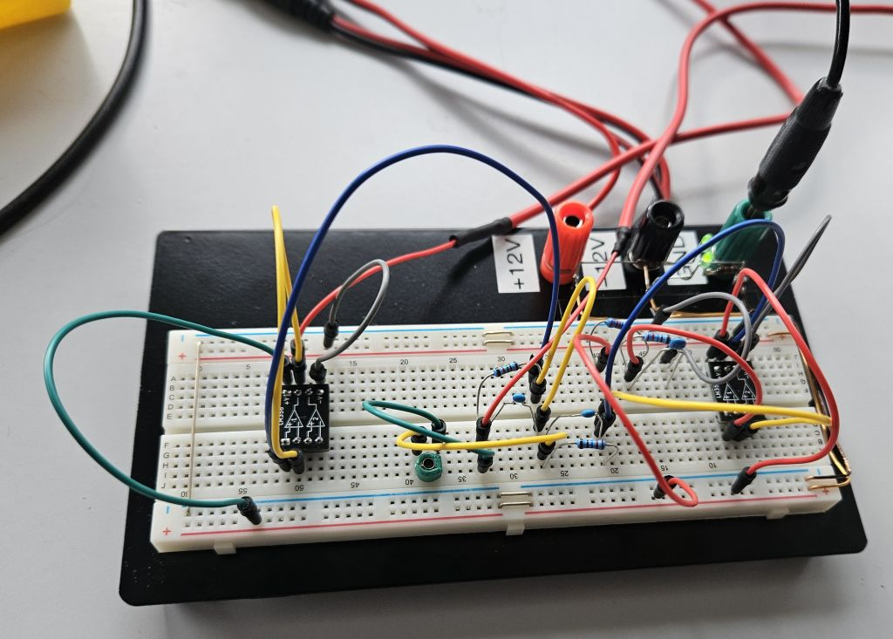

# Fakultät für Physik

## Physikalisches Praktikum P2 für Studierende der Physik

Versuch P2-191, 192, 193 (Stand: **Februar 2026**)

[Raum F1-13](https://labs.physik.kit.edu/img/Klassische-Praktika/Lageplan_P1P2.png)

# Signalverarbeitung

## Motivation

Die Grundbausteine der modernen Messtechnik in physikalischen Experimenten drehen sich um die Erfassung, Verstärkung und Verarbeitung von elektrischen Signalen. Die Erfassung der Signale wird mit einem **Analog to Digital Converter (ADC)** durchgeführt. Bei einem ADC handelt es sich um ein Bauteil, das einer Eingangsspannung einen digitalen Wert zuweist und damit als Spannungsmessgerät verwendet wird. Häufig haben ADCs aber aufgrund ihrer technischen Auslegung nur einen begrenzten Eingangsbereich, z.B. $0 \mathrm{V}$ bis $3 \mathrm{V}$, wodurch es notwendig ist, die elektrischen Signale vor der Messung durch Verstärkungen, Abschwächungen, Filterung und Verschiebungen an den Eingangsbereich des ADCs anzupassen

Die elektrischen Signal, die bei einem physikalischen Experiment gemessen werden, können je nach Experiment und Messgröße sehr klein oder sehr groß sein und müssen innerhalb eines kurzen oder langen Zeitraums erfasst werden. In Versuchen aus der Kern- und Teilchenphysik werden z.B. sehr schnelle Signale von Photomultipliern (PMTs) ausgewertet, während in der Festkörperphysik oft sehr kleine Ströme oder Spannungen gemessen werden müssen. In der Akustik und Optik können die andere Anforderungen an die Signalverarbeitung ganz anders aussehen. Um den vielfältigen Anforderungen gerecht zu werden, sind verschiedene Bauelemente und Schaltungen notwendig. Einige wichtige  Bauelemente für die Signalverarbeitung lernen sie in diesem Versuch kennen, darunter den [Operationsverstärker](https://de.wikipedia.org/wiki/Operationsverst%C3%A4rker) (OPV).

Die in diesem Versuch vorgestellten Schaltungen gelten als Grundbausteine in der elektrischen Signalverarbeitung. Sie werden in der Praxis häufig verwendet und lassen sich schnell und einfach aufbauen, um elektrische Signale auf einfache Weise anzupassen. Im Praktikum begegnen Ihnen diese Schaltungen zum Beispiel in den folgenden Versuchen: 

- [Photoeffekt](https://gitlab.kit.edu/kit/etp-lehre/p2-praktikum/students/-/tree/main/Photoeffekt): Hier besteht die Herausforderung darin, eine Spannung zu messen, die von nur wenigen Ladungsträgern auf einem Kondensator erzeugt wird. Es geht also um die Spannungsverstärkung. Ohne einen sehr hohen Eingangswiderstand würde sich der Kondensator während der Messung aber wieder entladen.
-  [Franck-Hertz-Versuch](https://gitlab.kit.edu/kit/etp-lehre/p2-praktikum/students/-/tree/main/Franck_Hertz_Versuch).  Hier besteht die Herausforderung darin einen Strom im Bereich weniger $\mathrm{nA}$ zu messen. Hier geht es also v.a. um die Stromverstärkung.

## Lehrziele

Wir listen im Folgenden die wichtigsten **Lehrziele** auf, die wir Ihnen mit dem Versuch **Signalverarbeitung** vermitteln möchten: 

- Sie lernen den **Frequenzkompensierten Spannungsteiler** als Grundbauelement elektrischer Schaltungen kennen.
- Sie lernen den **OPV als wichtiges aktives Bauelement** elektrischer Schaltkreise mit seinen wichtigsten Eigenschaften, den **Goldenen Regeln**, kennen. 
- Sie verinnerlichen die Grundschaltungen des OPV als **Impedanzwandler, nicht-invertierendem Verstärker und invertierendem Verstärker**. 
- Sie üben sich in der **Dimensionierung einfacher Schaltungen** mit dem OPV.
- Sie erkennen in der Vorbereitung auf den Versuch den Nutzen von OPVs für physikalische Messungen und erfahren, wo für konkrete Messungen im Praktikum OPVs im Einsatz sind. 

## Versuchsaufbau

Ein typischer Aufbau für den Versuch Signalverarbeitung ist in **Abbildung 1** gezeigt:
**TODO: Ein anders Bild vom neuen Aufbau verwenden**

---

**Abbildung 1**: (Ein typischer Aufbau für den Versuch Signalverarbeitung)

---

Alle Schaltungen werden mit Hilfe verschiedener Widerstände und Kondensatoren auf dem Schaltbrett aufgesteckt und mit dem Oszilloskop oder dem Multimeter untersucht. Zur Erzeugung eines Eingangssignals dient ein Frequenzgenerator. 

## Was macht diesen Versuch aus?

Bei diesem Versuch steht das "physikalische Innenleben" des Operationsverstärkers nicht im Vordergrund. Dieses werden Sie in späteren Vorlesungen genauer studieren können. Uns geht es um ein grundlegendes Verständnis der Grundschaltungen eines OPV. Mithilfe der in diesem Versuch vorgestellten Schaltungen lernen Sie die grundlegenden Bausteine in der Signalverarbeitung kennen. Das Ziel dieses Versuches ist, ihnen die Scheu vor dem Operationsverstärker zu nehmen. Die werden zuerst die Grundschaltungen aufbauen und dann mit den Eingangsparametern sowie der Beschaltung spielen, um ein Gefühl für die Möglichkeiten und Grenzen des Operationsverstärkers zu bekommen.

# Navigation

- [Signalverarbeitung.iypnb](https://gitlab.kit.edu/kit/etp-lehre/p2-praktikum/students/-/blob/main/Signalverarbeitung/Operationsverstaerker.ipynb): Aufgabenstellung und Vorlage fürs Protokoll.
- [Signalverarbeitung_Hinweise.ipynb](https://gitlab.kit.edu/kit/etp-lehre/p2-praktikum/students/-/blob/main/Signalverarbeitung/Operationsverstaerker_Hinweise.ipynb): Kommentare zu den Aufgaben.
- [Datenblatt.md](https://gitlab.kit.edu/kit/etp-lehre/p2-praktikum/students/-/blob/main/Signalverarbeitung/Datenblatt.md): Technische Details zu den Versuchsaufbauten.
- [doc](https://gitlab.kit.edu/kit/etp-lehre/p2-praktikum/students/-/tree/main/Signalverarbeitung/doc): Dokumente zur Vorbereitung auf den Versuch.
- [figures](https://gitlab.kit.edu/kit/etp-lehre/p2-praktikum/students/-/tree/main/Signalverarbeitung/figures): Bilder, die für die Dokumentation des Versuchs verwendet wurden und von Ihnen im Protokoll verwendet werden können.
