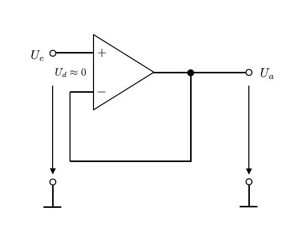

# Hinweise für den Versuch **Signalverarbeitung**

## Impedanzwandler (Spannungsfolger)

Für $R_{1}\to\infty,\ R_{2}=0$ wird aus der Schaltung aus **Abbildung 1** eine Schaltung, wie in **Abbildung 1** gezeigt:

---

**Abbildung 1**: (Schaltung des Impedanzwandlers oder Spannungsfolgers)

---

Nach Gleichung **(1)** gilt
$$
\begin{equation*}
v_{U}=1.
\end{equation*}
$$
Dies folgt ebenfalls aus aus der ersten **Goldenen Regel** ($U_{d}=0$), wonach auf dem N-Eingang des OPV die gleiche Spannung $U_{e}$, wie am P-Eingang anliegt. Durch den Kurzschluss mit dem Ausgang des OPV ergibt sich $U_{a}=U_{e}$. Aus diesem Grund bezeichnet man die Schaltung auch als **Spannungsfolger**. Der Nutzen dieser Schaltung besteht darin, dass man am Ausgang des OPV die Spannung  
$$
\begin{equation*}
U_{a}=U_{e}
\end{equation*}
$$
abgreifen kann, ohne dass es am Eingang des OPV zu einem Spannungsabfall kommt. 

## Nicht-invertierender Verstärker

Beim nicht-invertierenden Verstärker (**Elektrometerverstärker**) handelt es sich um eine Verstärkerschaltung, bei der das Ausgangssignal die gleiche Polarität aufweist, wie das Eingangssignal. Das Eingangssignal liegt also auf dem P-Eingang des OPV, während der N-Eingang mit Masse verbunden ist. Ein Teil des Ausgangssignals wird zur Rückkopplung auf den N-Eingang zurückgeführt. Die Grundschaltung ist in **Abbildung 1** gezeigt:

---

**Abbildung 1**: (Grundschaltung des nicht-invertierenden Verstärkers)

---

### Verstärkung

Die Verstärkung ergibt sich aus der ersten **goldenen Regel** ($U_{d}=0$), wonach am N-Eingang des OPV ebenfalls $U^{+}$ anliegt. Nach den [**Kirchhoffschen Regeln**](https://de.wikipedia.org/wiki/Kirchhoffsche_Regeln) ergibt sich für die Spannungsverstärkung: 
$$
\begin{equation}
\begin{split}
&U_{e} = I\, R_{1};\qquad U_{a} = I\, (R_{1} + R_{2})\\
&\\
&v_{U} = \frac{U_{a}}{U_{e}} = \frac{R_{1}+R_{2}}{R_{1}} = 1+\frac{R_{2}}{R_{1}}
\end{split}
\end{equation}
$$

### Eingangsimpedanz

Die Eingangsimpedanz $X_{e}$ des OPV lässt sich mit einer Erweiterung der Schaltung, wie in **Abbildung 3** gezeigt bestimmen:

---

**Abbildung 3**: (Abbildung (b) zeigt die Schaltung zur Bestimmung von $X_{e}$ des OPV. In Abbildung (a) ist das entsprechende Ersatzschaltbild gezeigt. Die Beschaltung innerhalb des blau gestrichelten Kastens wird im Ersatzschaltbild durch $X_{e}$ ersetzt)

---

Vor den P-Eingang des OPV wird ein bekannter **Messwiderstand** $R_{M}$ geschaltet, über den die abfallende Spannung $U_{M}$ gemessen wird. Aus der Messung von $U_{e}$ und $U_{M}$, sowie aus der Kenntnis von $R_{M}$ lässt sich $X_{e}$ wie folgt bestimmen:
$$
\begin{equation}
\begin{split}
&U_{e} = I\, (R_{M}+X_{e});\qquad U_{M}=I\, R_{M}\\
&\\
&U_{e} = U_{M}\left(1+\frac{X_{e}}{R_{M}}\right);\\
&\\
&X_{e} = R_{M}\left(\frac{U_{e}}{U_{M}}-1\right).
\end{split}
\end{equation}
$$

### Ausgangsimpedanz

Die Bestimmung der Ausgangsimpedanz $X_{a}$ des OPV ist weniger offensichtlich, da der OPV wie eine (reale) Spannungsquelle wirkt. Eine statische Messung von $X_{a}$ ist daher nicht möglich. Stattdessen ist 
$$
\begin{equation*}
X_{a} = \frac{\mathrm{d}U_{a}}{\mathrm{d}I_{a}}
\end{equation*}
$$
differentiell zu messen. Gehen Sie hierzu vor, wie in **Abbildung 4** gezeigt: 

---

**Abbildung 4**: (Abbildung (a) zeigt die Schaltung zur Bestimmung von $X_{a}$. In Abbildung (b) ist das entsprechende Ersatzschaltbild gezeigt. Die Beschaltung innerhalb des blau gestrichelten Kastens wird im Ersatzschaltbild durch $X_{a}$ ersetzt. Abbildung (c) zeigt den Spannungsverlauf $U_{a}(I)$ unter Annahme eines linearen Modells für die Ausgangsimpedanz $X_{a}$)

---

Unter der Annahme, dass der Innenwiderstand linear von $X_{a}$ abhängt gilt für die Klemmspannung $U_{K}=U_{a}$
$$
\begin{equation}
\begin{split}
U_{a}(X_{a},R_{M}) &= U_{0} - X_{a}\ I \\
&= U_{0} - X_{a}\frac{U_{V}}{R_{M}},\\
\end{split}
\end{equation}
$$
 wobei $U_{0}=\left.U_{a}\right|_{I=0}=U_{e}$ entspricht. 

Verbindet man den Ausgang des OPV über ein Potentiometer mit möglichst hohem, regelbarem Widerstand $R_{M}$ mit Masse, ist davon auszugehen, dass $U_{a}$ (bei minimaler Belastung des OPV-Ausgangs) zunächst vollständig über $R_{M}$ abfällt. Man regelt nun $R_{M}$ kontinuierlich nach unten, bis
$$
\begin{equation*}
R_{M}\approx X_{a}
\end{equation*}
$$
wobei $U_{a}$ gemäß Gleichung **(3)** abfällt. Für $R_{M}=X_{a}$ gilt 
$$
\begin{equation*}
\left. U_{V}\vphantom{\frac{U_{a}}{2}}\right|_{R_{M}=X_{a}} =
\left. U_{a}\vphantom{\frac{U_{a}}{2}}\right|_{R_{M}=X_{a}} = \frac{U_{e}}{2} = \frac{U_{0}}{2}.
\end{equation*}
$$
Die entsprechende Diskussion hierzu finden Sie [hier](https://gitlab.kit.edu/kit/etp-lehre/p1-praktikum/students/-/blob/main/Elektrische_Messverfahren/doc/Hinweise-Spannungsquellen.md).

## Invertierender Verstärker

Die Grundschaltung des invertierenden Verstärkers ist in **Abbildung 5** gezeigt: 

---

**Abbildung 5**: (Grundschaltung des invertierenden Verstärkers)

---

Das Eingangssignal liegt in diesem Fall auf dem N-Eingang des OPV, während der P-Eingang auf Masse liegt. Das Ausgangssignal $U_{a}$ wird zur Rückkopplung teilweise auf den N-Eingang zurückgeführt. 

Zur Berechnung der Verstärkung verwenden wir wieder die erste **goldene Regel** ($U_{d}=0$), wonach am N-Eingang des OPV die gleiche Spannung anliegt, wie am P-Eingang. Da der P-Eingang jedoch auf Masse liegt muss dies auch für den N-Eingang gelten. Da es keine direkte Verbindung des N-Eingangs zur Masse gibt spricht man in diesem Fall von scheinbarer oder **virtueller Masse** am N-Eingang. Nach den [**Kirchhoffschen Regeln**](https://de.wikipedia.org/wiki/Kirchhoffsche_Regeln) muss $U_{e}$ vollständig über $R_{1}$ abfallen, das gleiche gilt für $U_{a}$ und $R_{2}$:
$$
\begin{equation}
\begin{split}
&U_{e} = I\,R_{1},\qquad U_{a} = -I\,R_{2};\\
&\\
&U_{a} = -\frac{R_{2}}{R_{1}}\,U_{e}.\\
&\\
&v_{U} = \frac{U_{a}}{U_{e}} = -\frac{R_{2}}{R_{1}}
\end{split}
\end{equation}
$$
Das Minuszeichen in Gleichung **(3)** folgt daraus, dass $U_{a}$ (im Gegensatz zu $U_{e}$) dem Stromfluss entgegen gerichtet ist. Durch das Vorzeichen wird die Invertierung des Eingangssignals, als Phasenverschiebung um $\pi$ ($e^{i\pi}=-1$) explizit sichtbar. 

Im Rahmen von **Aufgabe 3** werden Sie einige einfache Erweiterungen der Grundschaltung des invertierenden Verstärkers untersuchen, die wir im folgenden kurz einführen.

#### Addierer   

Das Schaltbild des Addierers ist in **Abbildung 6** gezeigt:

---

**Abbildung 6**: (Schaltbild des Addierers)

---

Die Logik folgt derjenigen zur Berechnung von $v_{U}$ für die Grundschaltung. Im Eingangsschaltkreis addieren sich alle Teilströme zum Gesamtstrom
$$
\begin{equation*}
I = \sum\limits_{i=1}^{n}I_{i};\qquad \text{mit}\qquad I_{i}=\frac{U_{ei}}{R_{ei}}.
\end{equation*}
$$
 Für $U_{a}$ gilt analog zu Gleichung **(3)**: 
$$
\begin{equation*}
\begin{split}
&U_{a} = -I\,R_{2}= -\left(\sum\limits_{i=1}^{n}{\frac{U_{ei}}{R_{ei}}}\right)\,R_{2},
\end{split}
\end{equation*}
$$
d.h. $U_{a}$ ist die (negative) gewichtete Summe der $U_{ei}$, mit den Gewichten $R_{2}/R_{ei}$. Belegt man alle Widerstände mit den gleichen Werten ist
$$
\begin{equation*}
U_{\mathrm{a}}=-\sum\limits_{i=1}^{n}U_{ei}.
\end{equation*}
$$

#### Integrierer

Das Schaltbild des Integrierers ist in **Abbildung 7** gezeigt:

---

**Abbildung 7**: (Schaltbild des Integrierers)

---

Der Widerstand $R_{2}$ aus der Grundschaltung wird in diesem Fall durch den Kondensator mit der Kapazität $C$ ersetzt. Für $U_{e},\ U_{a}$ gilt: 
$$
\begin{equation}
\begin{split}
& U_{e} = I\,R_{1};\qquad U_{a} = \frac{Q}{C} = -\frac{1}{C}\int I\,\mathrm{d}t = -\frac{1}{C\,R_{1}}\int U_{e}\,\mathrm{d}t,
\end{split}
\end{equation}
$$
das Ausgangssignal entspricht also dem (negativen) Integral des Eingangssignals. 

Der Widerstand $R_{S}$ in wird in die Schaltung eingeführt, um zu verhindern, dass der Kondensator durch einen Gleichtaktanteil im Signal aufgeladen wird. Wählt man $R_{S}$ geeignet groß, kann er (den [**Kirchhoffschen Regeln**](https://de.wikipedia.org/wiki/Kirchhoffsche_Regeln) entsprechend) in den Betrachtungen aus Gleichung **(4)** vernachlässigt werden. 

#### Differenzierer

Das Schaltbild des Differenzierers ist in **Abbildung 8** gezeigt:

---

**Abbildung 8**: (Schaltbild des Differenzierers)

---

Im Vergleich zum Integrierer werden für diese Schaltung Widerstand und Kondensator vertauscht. Für das Ausgangssignal gilt: 
$$
\begin{equation*}
\begin{split}
U_{e} = \frac{Q}{C};\qquad U_{a} = -R_{2}\,I = -R_{2}\,\frac{\mathrm{d}Q}{\mathrm{d}t} = -&\underbrace{C\,R_{2}\vphantom{\frac{\mathrm{d}U_{e}}{\mathrm{d}t}}}\frac{\mathrm{d}U_{e}}{\mathrm{d}t},\\
&\equiv\tau
\end{split}
\end{equation*}
$$
das Ausgangssignal entspricht also der (negativen) Ableitung des Eingangssignals. Das Produkt $\tau=C\ R_{2}$ wird als Zeitkonstante bezeichnet.

## Essentials

Was Sie ab jetzt wissen sollten:

- Sie sollten die **Grundschaltungen des invertierenden und des nicht-invertierenden Verstärkers** kennen. 
- Sie sollten die Schaltung des OPV als **Impedanzwandler** kennen und mindestens ein Verfahren in Erinnerung haben, wie man $X_{e}$ und $X_{a}$ des OPV als aktivem Bauelement messen kann. 
- Sie sollten die Grundschaltungen des OPV mit Hilfe der **Goldenen Regeln** zur Dimensionierung von OPV Schaltungen erklären können.   

## Testfragen

1. Wo liegt das Problem bei der Messung von $X_{a}$ des OPV? Warum haben Sie dieses Problem bei der Messung von $X_{e}$ nicht?
2. Ihr Signal besteht aus einer geringen Aufladung eines Kondensators. Was passiert, wenn Sie versuchen diese Aufladung als Spannungsantieg mit einem Spannungsmessgerät mit moderatem Innenwiderstand zu messen?
3. Wie würden Sie das Signal durch einen OPV vom Spannungsmessgerät entkoppeln? 

# Navigation

[Main](https://gitlab.kit.edu/kit/etp-lehre/p2-praktikum/students/-/tree/main/Operationsverstaerker)

