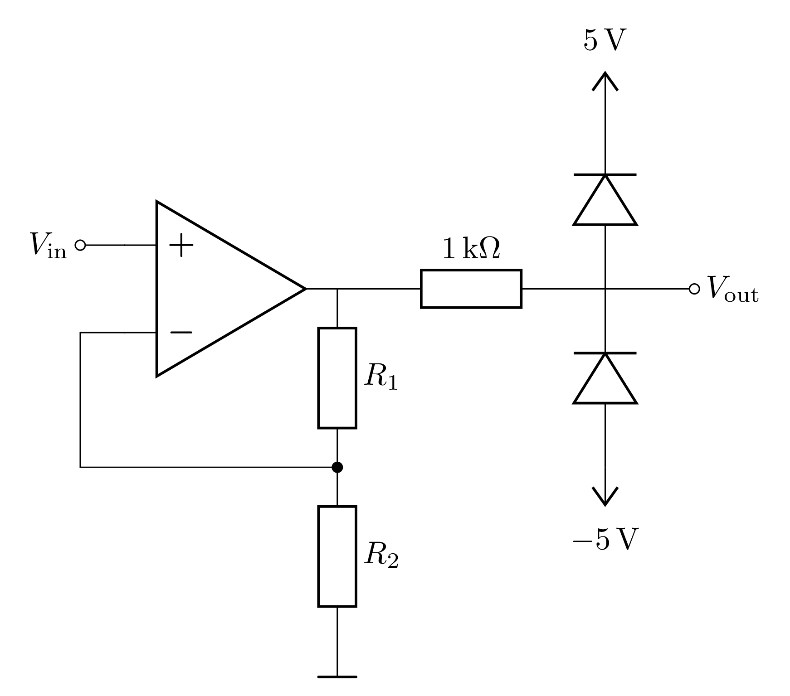
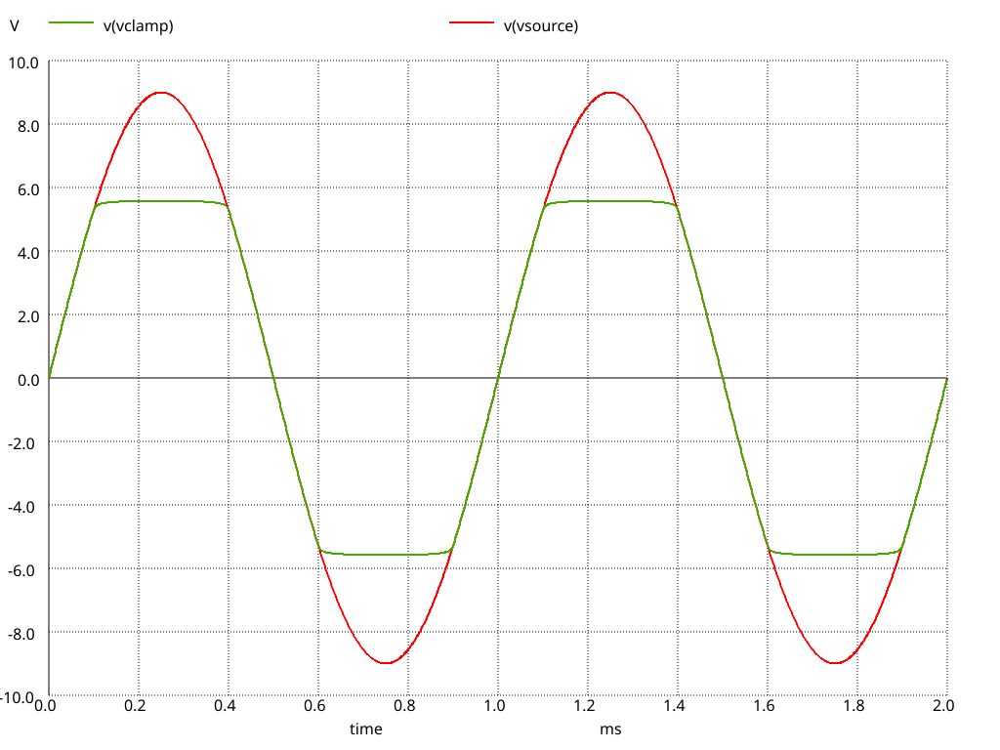
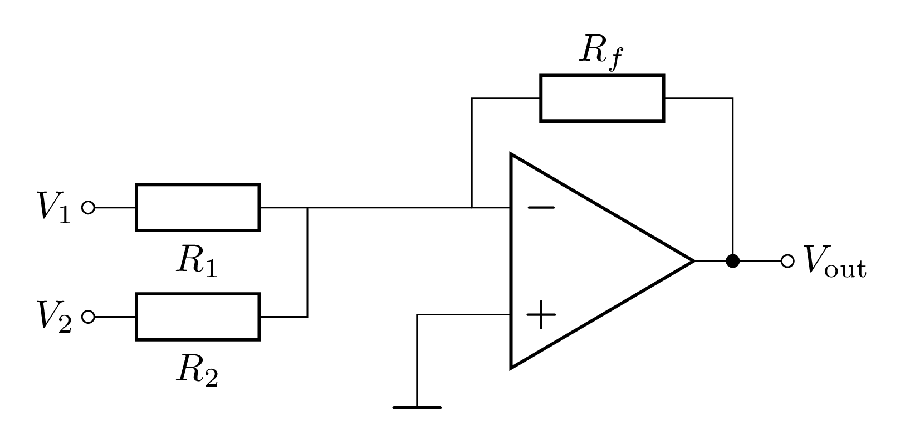

# Signalverarbeitung

## Clamping-Dioden

Ein OPV kann ein Eingangssignal $U_{\mathrm{in}}$ verstärken, aber er kann nicht verhindern, dass die Ausgangsspannung $U_{\mathrm{out}}$ einen bestimmten Wert überschreitet. Falls dies in einer gegebenen Anwendung nicht passieren darf, können Dioden als [**Clamping-Dioden**](https://de.wikipedia.org/wiki/Klemmschaltung_(Nachrichtentechnik)) verwendet werden. Sie werden so in die Schaltung eingebracht, dass sie bei Überschreiten der Schwellenspannung leitend werden, so dass die Spannung nicht über dieses Niveau hinausgehen kann. Die Dioden werden in der Regel in Sperrrichtung geschaltet, um sicherzustellen, dass sie nur bei Überschreiten der Schwellenspannung leitend werden.

In **Abbildung 1** ist eine Schaltung, bei der das Ausgangssignal auf $\pm{}5 \mathrm{V}$ begrenzt wird gezeigt: 

---

**Abbildung 1**: (Schaltung eines nicht-invertierenden Verstärkers mit Clamping-Dioden, um die Ausgangsspannung auf ${\pm}5\ \mathrm{V}$ zu begrenzen. Die Dioden sind in Sperrrichtung geschaltet, um sicherzustellen, dass sie nur bei Überschreiten der gewünschten Spannung leitend sind. Der $1\ \mathrm{k\Omega}$ Widerstand begrenzt den Strom durch die Dioden)

---

Eine Simulation dieser Schaltung ist in **Abbildung 2** zu sehen: 

---

**Abbildung 2**: (Simulation der Schaltung aus **Abbildung 1**. Das verstärkte Ausgangssignal des OPV ist rot dargestellt. Es hat eine Amplitude von ${\pm}9\  \mathrm{V}$. Das von den Dioden beschränkte Ausgangssignal, in grün, wird nach Überschreiten der der Schwellenspannung der Dioden abgeschnitten)

---

Damit der Strom durch die Dioden nicht zu groß wird, muss er zusätzlich durch einen Widerstand begrenzt werden.

ℹ️ Die Simulation in **Abbildung 2** zeigt, dass die Dioden das Niveau nicht exakt im Rahmen von ${\pm}5\ \mathrm{V}$ halten. Dies liegt daran, dass die Dioden einen zusätzlichen Potentialunterschied von ${\approx}0.7\ \mathrm{V}$ (der [Diodenknickspannung](https://de.wikipedia.org/wiki/Schwellenspannung)) benötigen um leitfähig zu werden. Daher wird die Ausgangsspannung auf etwa ${\pm}5.7\ \mathrm{V}$ begrenzt.

ℹ️ Clamping-Dioden werden verwendet, wenn durch zu hohe Ausgangsspannungen andere elektrische Bauteile, wie z.B. andere Operationsverstärker, Mikrocontroller oder Sensoren, beschädigt werden könnten.

🔔**In diesem Dokument haben wir die Polarisation der Dioden, die Sie für den Aufbau der Schaltungen verwenden, bewusst nicht erklärt.** 🔔 Führen Sie einen Dioden-Test an einer Diode durch, um die Polarität zu bestimmen, bevor Sie sie in Ihre Schaltung einbauen.

## Summierverstärker

Die Schaltung des Summierverstärkers ist in **Abbildung 3** dargestellt:

---

**Abbildung 3**: (Schaltung eines **Summierverstärkers**)

---

ℹ️ Zur Erklärung der Schaltung wird zunächst nur die Spannungsquelle $V_1$ betrachtet. Es handelt sich um einen invertierenden Verstärker, der die Ausgangsspannug des OPV so regelt, dass der eingehende Strom von $V_1$ durch den Widerstand $R_1$ vollständig durch den Widerstand $R_f$ abfließt. Es gilt also:
$$
\begin{equation}
\frac{V_{1}}{R_{1}} = - \frac{V_{\mathrm{out}}}{R_{f}} \quad\Longrightarrow\quad V_{\mathrm{out}} = - V_{1}\,\frac{R_{f}}{R_{1}}.
\end{equation}
$$

Wird nun zusätzlich die Spannungsquelle $V_2$ betrachtet, so fließt auch durch $R_{2}$ ein Strom. Am nicht-invertierenden Eingang summieren sich diese Ströme. Durch $R_{f}$ fließt der gesamte Strom, der von $V_1,\ V_2$ durch die Widerstände $R_{1},\ R_{2}$ geliefert wird. Es gilt also
$$
\begin{equation}
\frac{V_{1}}{R_{1}} + \frac{V_{2}}{R_{2}} = - \frac{V_{\mathrm{out}}}{R_{f}} \quad\Longrightarrow\quad 
V_{\mathrm{out}} = - \left( V_{1}\,\frac{R_{f}}{R_{1}} + V_{2} \,\frac{R_{f}}{R_{2}}\right).
\end{equation}
$$
Die Ausgangsspannung setzt sich somit aus der Summe der einzelnen Eingangsspannungen mit ihren jeweiligen Verstärkungsfaktoren zusammen.

ℹ️ Um einen Summierverstärker zu realisieren, der eine Eingangsspannung von ${\pm}9\ \mathrm{V}$ in den Bereich von $-3\ldots0\ \mathrm{V}$ umwandelt, verwenden Sie die folgenden Werte für die Widerstände:
- $R_{1} = 6.81\ \mathrm{k\Omega}$.
- $R_{2} = 9.09\ \mathrm{k\Omega}$.
- $R_{f} = 1.15\ \mathrm{k\Omega}$.

Schließen Sie das Ausgangssignal des Signalgenerators an $V_{1}$ und die Spannungsversorgung von $12\ \mathrm{V}$ an $V_{2}$ an. Das Ausgangssignal des OPV sollte nun eine Amplitude von $0\ldots3\ \mathrm{V}$ annehmen.

## Erwartung

Was wir an dieser Stelle von Ihnen erwarten:

- :white_check_mark: Sie verstehen die Verwendung von Clamping-Dioden.

- :white_check_mark: Sie verstehen die Schaltung des Summierverstärkers und können diese erklären.

## Testfragen

1. Wie können Sie die Polarität der Dioden bestimmen?
2. Wie wirkt sich die virtuelle Masse auf den Summierverstärker aus?

----

[Main](https://gitlab.kit.edu/kit/etp-lehre/p2-praktikum/students/-/tree/main/Signalverarbeitung/README.md)

