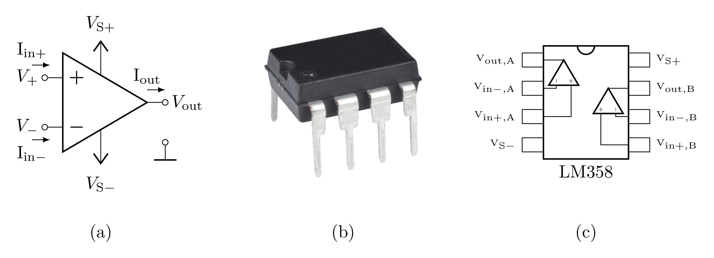
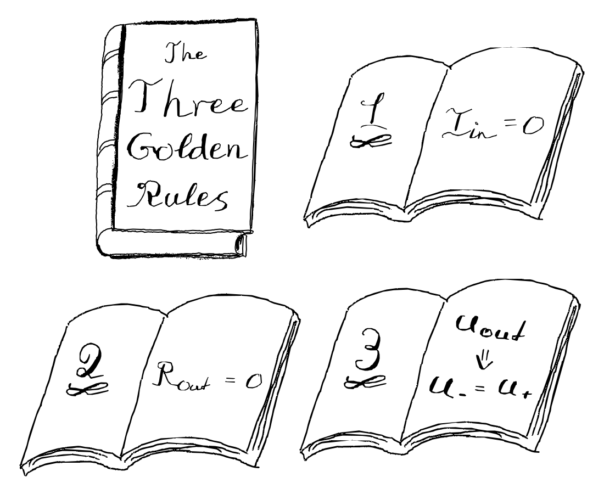
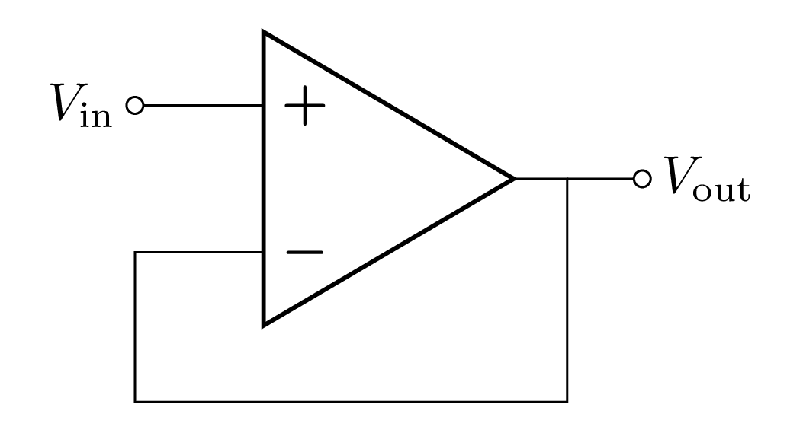
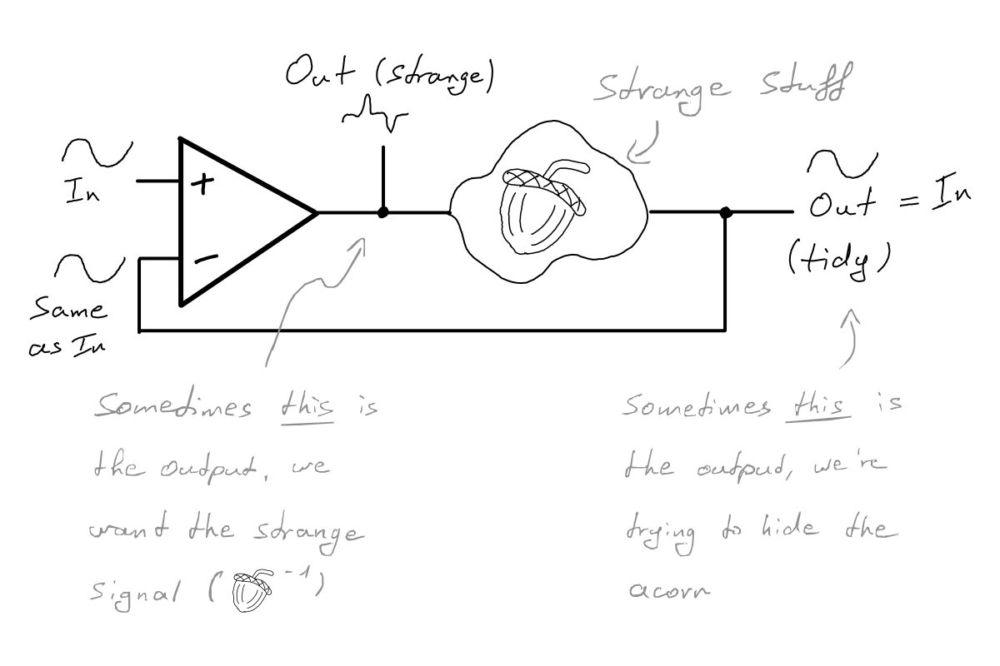
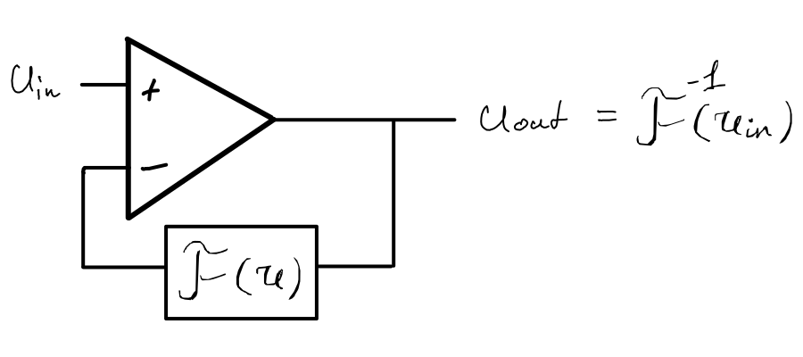
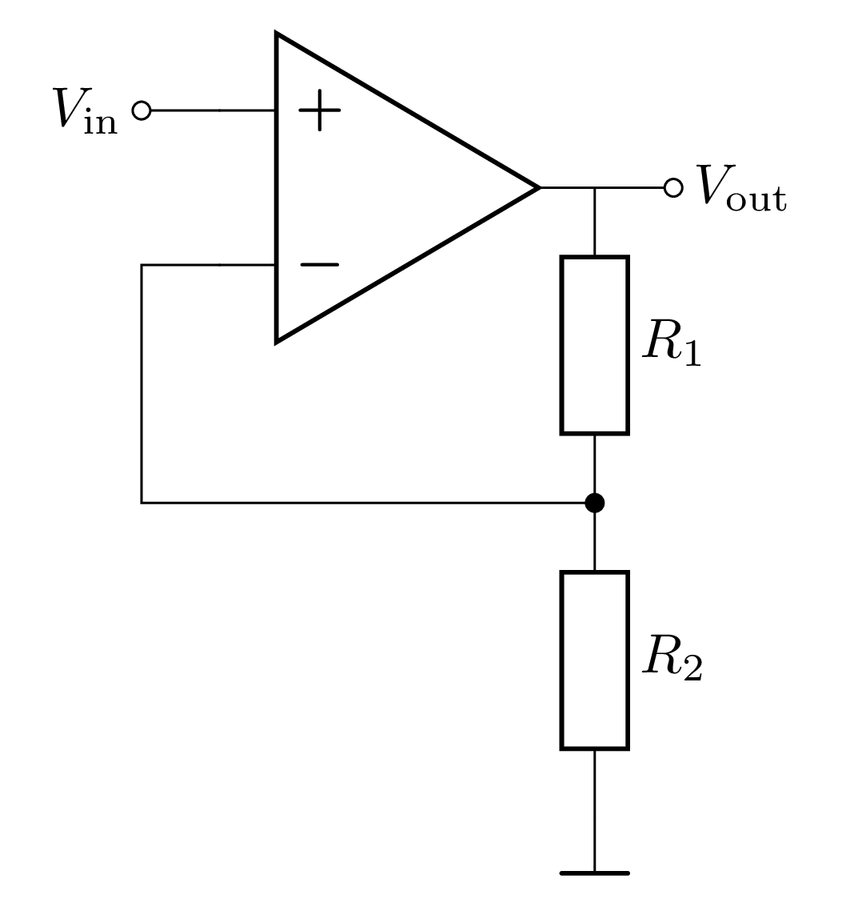
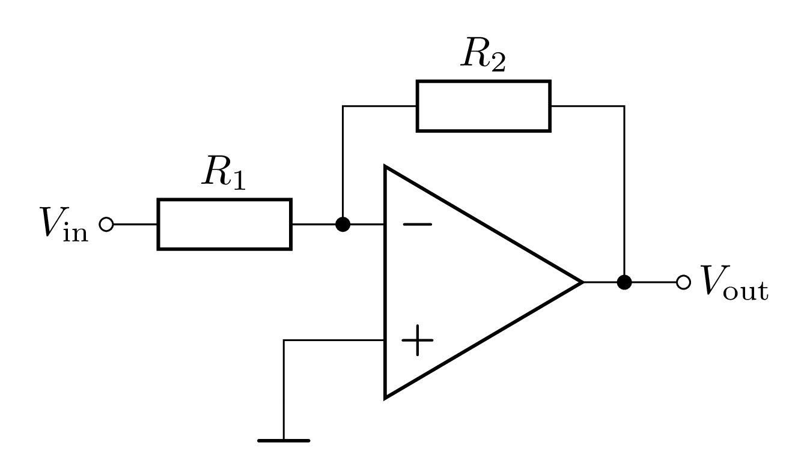

# Signalverarbeitung

## Einführung Operationsverstärker

Ein [Operationsverstärker](https://de.wikipedia.org/wiki/Operationsverst%C3%A4rker) (OPV) ist ein integrierter Schaltkreis mit vielen verschiedenen Einsatzzwecken. In diesem Versuch werden einfache Schaltungen mit dem OPV aufgebaut und untersucht. Um diese Schaltungen zu verstehen, sind einige Grundkenntnisse über den OPV notwendig.

Das Schaltsymbol eines OPVs (einschließlich seiner Anschlüsse) ist in **Abbildung 1 (a)** gezeigt:

- Ein invertierender (-) und ein nicht-invertierender (+) Eingang.
- Ein Ausgang.
- Zwei Anschlüsse für die Spannungsversorgung ($\mathrm{V_{S\pm}}$), die in Schaltbildern i.a. nicht gezeigt werden und daher in den weiteren Bildern weggelassen sind.

An den Ein- und am Ausgängen des OPV sind die relevanten Spannungen und Ströme eingezeichnet, auf die im Verlauf der Beschreibung Bezug genommen wird.

---

**Abbildung 1**: ((a) ist das Schaltsymbol eines OPV mit Definition der relevanten Anschlüsse, Spannungen und Ströme. Abbildung (b) zeigt das Gehäuse und Abbildung \(c\) das Anschlussschema des OPV LM358, wie er in diesem Versuch verwendet wird. $V_{S\pm}$ bezeichnet die Versorgungsspannung. Die Beschaltung im Inneren des OPV, sowie die Versorgungsspannung(en) werden in Schaltbildern i.a. nicht gezeigt)

---

ℹ️ **Abbildung 1 \(c\)** zeigt das Anschlussschema des OPV vom Typ LM358, wie er für diesen Versuch verwendet wird. Beachten Sie, dass dieser OPV Typ zwei baugleiche OPVs in einem Gehäuse bereitstellt. Das Gehäuse selbst ist in **Abbildung 1 (b)** dargestellt.

Ein OPV lässt sich auf viele verschiedene Weisen beschalten und bietet damit eine Vielzahl verschiedener Einsatzmöglichkeiten. In diesem Versuch werden die wichtigsten Schaltungen, die auf dem Prinzip der [Gegenkopplung](https://de.wikipedia.org/wiki/Negative_R%C3%BCckkopplung) basieren, erklärt und untersucht.

## Die goldenen Regeln

Das Prinzip der Gegenkopplung (auch negative Rückkopplung genannt) beruht darauf, dass ein Teil des Ausgangssignals mit invertiertem Vorzeichen auf den Eingang zurückgeführt wird. Darüber wird das Verhalten des OPVs kontrolliert und lässt sich, für einen idealisierten OPV, mit Hilfe der **goldenen Regeln** beschreiben:

1. Es fließt kein Strom in die Eingänge des OPVs. Der Eingangswiderstand am invertierenden und am nicht-invertierenden Eingang wird als unendlich groß angenommen.
2. Der OPV hat eine niedrige Ausgangsimpedanz und kann als [ideale Spannungsquelle](https://de.wikipedia.org/wiki/Spannungsquelle#Ideale_und_reale_Spannungsquellen) mit einem Ausgangswiderstand $R_{\mathrm{out}} = 0\ \Omega$ angenommen werden.
3. Der OPV wählt seine Ausgangsspannung so, dass die Differenz der Eingangsspannungen verschwindet: $U_{+} - U_{-} = 0\mathrm{V}$. Dies ist nur möglich, wenn eine Gegenkopplung vorhanden ist.

Die drei goldenen Regeln sind in **Abbildung 2** zusammengefasst:

---

**Abbildung 2**: (Die drei **goldenen Regeln** des OPV)

---

## Spannungsfolger (Impedanzwandler)

Die einfachste Schaltung, die mit dem OPV realisiert werden kann, ist der **Spannungsfolger** (engl. *voltage follower*), wie in **Abbildung 3** dargestellt: 

---

**Abbildung 3**: (Grundschaltung des **Spannungsfolgers**)

---

In diesem Fall wird der Ausgang des OPV direkt in dessen invertierenden Eingang zurückgeführt. Das Eingangssignal wird an den nicht-invertierenden Eingang angelegt.

Nach den goldenen Regeln gilt:

- Da kein Strom in den nicht-invertierenden Eingang fließt, fällt hier auch keine Spannung ab, so dass $U_{\mathrm{in}} = U_{+}$ gilt.
- Da der Ausgang mit dem invertierenden Eingang verbunden ist, gilt $U_{-} = U_{\mathrm{out}}$.
- Damit die Differenz zwischen den beiden Eingängen verschwindet, muss $U_{+} = U_{-}$ gelten. Daraus folgt, dass $U_{\mathrm{in}} = U_{\mathrm{out}}$ gilt.

Nach dieser Schaltung wird die gleiche Spannung am Ausgang ausgegeben, die am nicht-invertierenden Eingang anliegt, weshalb diese Schaltung auch als **Spannungsfolger** bezeichnet wird. Der Nutzen dieser Schaltung liegt darin, dass am Ausgang die Spannung $U_{\mathrm{out}} = U_{\mathrm{in}}$ abgegriffen werden kann, ohne dass der Eingang belastet wird. Somit kommt es, durch die Last am Ausgang, zu keiner Spannungsänderung am Eingangssignal.

💡 Der Spannungsfolger kann verwendet werden, um die Ausgangsspannung eines Spannungsteilers abzugreifen, ohne den Spannungsteiler zu belasten. 

## Die Feedback-Schleife

Der oben beschriebene einfachste Fall, in dem das *Feedback* aus einer direkten Verbindung des Ausgangs mit dem invertierenden Eingang besteht, kann durch das Einfügen weiterer Bauelemente in die *Feedback*-Schleife erweitert werden. Elektrische Bauelemente haben einen Einfluss auf die Spannung des rückführenden Signals wodurch sich die Ausgangsspannung des OPV verändert, um die dritte goldene Regel zu erfüllen. Dieses Konzept ist in **Abbildung 4**  dargestellt:

---

**Abbildung 4**: (Durch Hinzufügen von Bauteilen in die *Feedback*-Schleife verändert sich das Ausgangssignal des OPV, so dass die dritte goldene Regel erfüllt wird. Dabei können sowohl das veränderte als auch das ursprüngliche Eingangssignal abgenommen werden)

---

Dabei können je nach Anwendungszweck sowohl das veränderte als auch das ursprüngliche Eingangssignal als Ausgang weiterverwendet werden. Bei einer *Feedback*-Schleife mit bekannter Transformation lässt sich das veränderte Ausgangssignal des OPV bestimmen. Die *Feedback*-Schleife transformiert eine Spannung $U$ wie eine mathematische Funktion $\mathfrak{F}(U)$. Da das *Feedback*-Signal am invertierenden Eingang anliegt und zum Eingangssignal identisch ist, muss das Ausgangssignal des OPV so gewählt werden, dass gilt:
$$
\begin{equation*}
U_{\mathrm{out}} = \mathfrak{F}^{-1}(U_{\mathrm{in})}
\end{equation*}
$$
mit der inversen Funktion $\mathfrak{F}^{-1}$ der *Feedback*-Funktion $\mathfrak{F}$. In **Abbildung 5** ist dieses Prinzip dargestellt:

---

**Abbildung 5**: (Das Ausgangssignal des OPV lässt sich über die Inverse der *Feedback*-Funktion bestimmen.)

---

In den nachfolgenden Schaltungen wird die *Feedback*-Schleife zur Umsetzung gezielter Veränderungen des Eingangssignals entworfen.

## Nicht-invertierender Verstärker

Der Nicht-invertierende Verstärker verwendet einen Spannungsteiler in der *Feedback*-Schleife, um eine Spannungsverstärkung zu realisieren. Die Schaltung ist in **Abbildung 6** dargestellt:

---

**Abbildung 6**: (Grundschaltung des **nicht-invertierenden Verstärkers**)

---

ℹ️ Die am invertierenden Eingang anliegende Spannung $U_{-}$ lässt sich über den Spannungsteiler berechnen:
$$
\begin{equation}
U_{-} = U_{\mathrm{out}}\,\frac{R_{2}}{R_{1} + R_{2}}
\end{equation}
$$
Nach den goldenen Regeln gilt $U_{-} = U_{+} = U_{\mathrm{in}}$. Diese Gleichung lässt sich nach der Ausgangsspannung umstellen:
$$
\begin{equation}
U_{\mathrm{out}} = U_{\mathrm{in}}\,\left(1 + \frac{R_{1}}{R_{2}}\right)
\end{equation}
$$

Das Eingangssignal wird um den Faktor 
$$
\begin{equation*}
\beta=\left(1 + \frac{R_{1}}{R_{2}}\right)
\end{equation*}
$$
 verstärkt.

Für die Realisierung dieser Schaltung stehen Ihnen ein $2.26\  \mathrm{k\Omega}$ und ein $1.15\  \mathrm{k\Omega}$ Widerstand zur Verfügung.

## Invertierender Verstärker

Der invertierende Verstärker ist in **Abbildung 7** dargestellt: 

---

**Abbildung 7**: (Grundschaltung des **invertierenden Verstärkers**)

---

In diesem Fall wird das Eingangssignal über einen Widerstand $R_{1}$ in den invertierenden Eingang des OPV eingespeist. In der *Feedback*-Schleife befindet sich ein Widerstand $R_{2}$.

ℹ️ Der nicht-invertierende Eingang ist mit Masse verbunden. Nach der dritten goldenen Regel liegt daher auch der invertierende Eingang auf Masse. Da keine direkte Verbindung zur Masse besteht, wird dieser Punkt auch als **virtuelle Masse** bezeichnet.

Nach dem ohmschen Gesetz fallen die Spannungen an den Widerständen $R_{1}$ und $R_{2}$ wie folgt ab:
$$
\begin{equation*}
U_{\mathrm{in}}=R_1\,I; \quad U_{\mathrm{out}} = - R_2\,I.
\end{equation*}
$$
Der Strom durch den zweiten Widerstand wird negativ angegeben, da der Eingangsstrom auf den Knotenpunkt zuläuft, während der Ausgangsstrom vom Knotenpunkt abfließt. Da kein Anteil des Stroms $I$ in den Eingang des OPV fließt (erste goldene Regel), muss der Stromfluss durch beide Widerstände identisch sein. Daraus folgt:
$$
\begin{equation*}
\frac{U_{\mathrm{in}}}{R_{1}} = -\frac{U_{\mathrm{out}}}{R_{2}}; \quad
U_{\mathrm{out}} = -U_{\mathrm{in}}\,\frac{R_2}{R_1}.
\end{equation*}
$$

Durch das Vorzeichen wird die Invertierung des Eingangssignals, als Phasenverschiebung um 
$$
\begin{equation*}
e^{i\pi} = -1
\end{equation*}
$$
deutlich gemacht. Das Eingangssignal wird betragsmäßig um den Faktor 
$$
\begin{equation*}
\beta=\frac{R_2}{R_1}
\end{equation*}
$$
 verstärkt.

Für die Realisierung dieser Schaltung stehen Ihnen ein $2.26\  \mathrm{k\Omega}$ und ein $1.15\  \mathrm{k\Omega}$ Widerstand zur Verfügung.

## Grenzen der Anwendung der goldenen Regeln

Die goldenen Regeln basieren auf dem Prinzip des negativen *Feedbacks*. Wenn kein *Feedback* am invertierenden Eingang ankommt, gelten die Regeln nicht. Dies kann z.B. in den folgenden Situationen auftreten:
- Es liegt einen Wackelkontakt oder Kabelbruch vor.
- Ein extrem hochohmiger Widerstand in der *Feedback*-Schleife führt zu sehr großen Spannungsabfällen.
- In der *Feedback*-Schleife befinden sich Dioden, die in Sperrrichtung geschaltet sind und dadurch den *Feedback*-Pfad unterbrechen. Man bezeichnet diesen Zustand als *conditional feedback*.
- Das *Feedback*-Signal liegt versehentlich am nicht-invertierenden Eingang an.

- Die Ausgangsspannung ist des OPV ist durch die Versorgungsspannungen $U_{s\pm}$ limitiert. Die dritte goldene Regel kann nur angewendet werden, solange der OPV sich nicht in der Sättigung befindet.
- Bei hohen Frequenzen verhält sich der OPV wie ein Tiefpass-Filter, wodurch die Verstärkung abfällt. Ebenfalls können schnelle Änderungen an den Eingangssignalen bei hoher Verstärkung nicht immer am Ausgang nachverfolgt werden (man bezeichnet diesen Umstand als *slew rate*-Beschränkung), da der OPV nur eine begrenzte Änderungsrate der Ausgangsspannung liefern kann. Für den LM358 beträgt die *slew rate* $0.3\ \mathrm{V}/\mathrm{\mu s}$.

In der Realität sind die ersten zwei goldenen Regeln zudem nie exakt erfüllt, da der Eingangswiderstand und der Ausgangswiderstand des OPV immer endliche Werte annehmen. In die Eingänge $+$ und $-$ fließt zudem immer ein geringer Strom, die sogenannten **Eingangsruheströme** $I^{+(0)},\ I^{-(0)}$. Dennoch sind die Abweichungen in den meisten Fällen vernachlässigbar klein, so dass die goldenen Regeln als Näherung sehr gut funktionieren. In der folgenden Tabelle sind einige charakteristische Eigenschaften von idealen und realen OPVs gegenübergestellt:

| Eigenschaft           | idealer OPV  | realer OPV                                   | LM358                           |
| :-------------------- | ------------ | -------------------------------------------- | ------------------------------- |
| $R_{\mathrm{in}}$     | $\infty$     | $10^{7}\ \Omega\ldots 10^{12}\ \Omega$       | $\mathcal{O}(\mathrm{M\Omega})$ |
| $R_{\mathrm{out}}$    | $0$          | $10\ \Omega\ldots 10^{3}\ \Omega$            | $300\ \Omega$                   |
| $I^{-(0)},\ I^{+(0)}$ | $0$          | $0.1\,\mathrm{nA}\ldots 25\ \mathrm{nA}$     | ${\approx}35\ \mathrm{nA}$      |
| $V_{S\pm}$            | $\pm \infty$ | $\pm 3\ \mathrm{V}\ldots \pm 20\ \mathrm{V}$ | $\pm 15\ \mathrm{V}$            |

<!-- Stimmt das mit I^{{\pm}0} und V_{S{\pm}}? Sowohl im Text als auch in der Tabelle bin ich mir da überhaupt nicht sicher! TODO: Nochmal genauer nachschauen -->

## Erwartung

Was wir an dieser Stelle von Ihnen erwarten:

- :white_check_mark: Sie wissen, dass OPVs einen **invertierenden N- und einen nicht-invertierenden P-Eingang** besitzen. 
- :white_check_mark: Sie sidn mit den **Anwendungen von OPVs** vertraut. 

- :white_check_mark: Sie sind mit den **goldenen Regeln** für die äußere Beschaltung mit Widerständen (Dimensionierung) vertraut. 

## Testfragen

1. Was macht eine ideale Stromquelle aus?
2. Wie lauten die goldenen Regeln für den OPV?
3. Ihr Signal besteht aus einer geringen Aufladung eines Kondensators. Was passiert, wenn Sie versuchen diese Aufladung als Spannungsanstieg mit einem Spannungsmessgerät mit moderatem Innenwiderstand zu messen?
4. Welche Grundschaltung kann für eine Verstärkung mit Verstärkungsfaktor ${\lt}1$ verwendet werden?

---

[Main](https://gitlab.kit.edu/kit/etp-lehre/p2-praktikum/students/-/tree/main/Signalverarbeitung/README.md)

