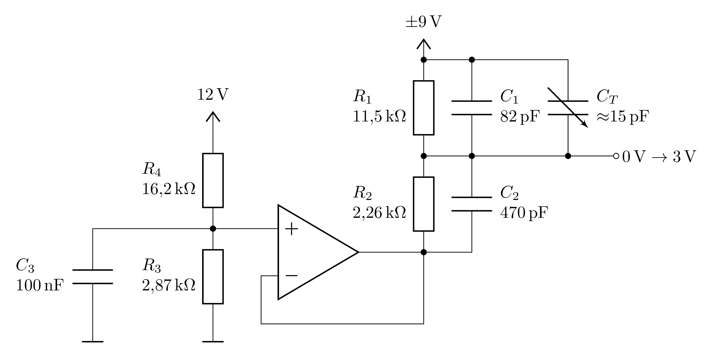

# Signalverarbeitung

## Spannungsteiler und Offset-Addition

### Ohmscher Spannungsteiler

Ein ohmscher Spannungsteiler, wie in **Abbildung 1 (a)** zu sehen, ist eine einfache Schaltung, die aus zwei in Reihe geschalteten Widerständen besteht und eine Spannung $U_{0}$, nach dem ohmschen Gesetz in zwei Teilspannungen $U_{1},\ U_{2}$aufteilt. 

---

**Abbildung 1**: ((a) Die Schaltung eines **ohmschen Spannungsteilers** mit den an $R_{1},\ R_{2}$ abfallenden Spannungen $U_{1},\ U_{2}$. Abbildung (b) zeigt ein konkretes Beispiel für einen ohmschen Spannungsteiler, um eine gezielte Ausgangsspannung von ${\pm}1.5\,\mathrm{V}$ aus einer Eingangsspannung von ${\pm}9\ \mathrm{V}$ zu erzeugen)

---

:information_source: Für den elektrischen Widerstand gilt
$$
\begin{equation*}
R = \frac{U}{I},
\end{equation*}
$$
wobei $U$ der über $R$ abfallenden Spannung und $I$ dem druch $R$ ließenden Strom entsprechen. In einer Reihenschaltung von zwei Widerständen $R_{1}$ und $R_{2}$ fließt durch beide Widerstände der gleiche Strom $I$. Die Gesamtspannung $U$ teilt sich in die Teilspannungen $U_{1}$ und $U_{2}$ auf, die jeweils über $R_{1},\ R_{2}$ abfallen: 
$$
\begin{equation*}
U_{0} = U_{1} + U_{2}.
\end{equation*}
$$
Aus der Ladungserhaltung folgt, dass der Strom durch beide Widerstände gleich sein muss
$$
\begin{equation*}
I = \frac{U_{0}}{R_{1}+R_{2}},
\end{equation*}
$$
wobei $R_{1}+R_{2}$ dem Gesamtwiderstand der Schaltung entspricht. Nach dem Ohmschen Gesetz gilt für die Teilspannungen:
$$
\begin{equation}
U_{2} = R_{2}\,I = R_{2}\,\frac{U_{0}}{R_{1}+R_{2}}.
\tag{1}
\end{equation}
$$
Analoge Rechnung führt auf $U_{1}$.

:information_source: Aus Gleichung **(1)** lässt sich ein Grundsatz ableiten, der für das Verständnis der Schaltungen in diesem Versuch hilfreich ist: 

> Am größeren Widerstand fällt die größere Spannung ab.

Aus dem Verhältnis aus $U_{1}$ und $U_{2}$ lässt sich die beschreibende Gleichung für den ohmschen Spannungsteiler ableiten
$$
\begin{equation}
\frac{U_{1}}{U_{2}} = \frac{R_{1}}{R_{2}}.
\tag{2}
\end{equation}
$$

💡 Der ohmsche Spannungsteiler kann verwendet werden, um zwischen zwei Widerständen eine bestimmte Spannung $U_{2}<U_{0}$ abzugreifen. In **Abbildung 1 (b)** ist ein Beispiel gezeigt für das die Widerstände so gewählt wurden, dass eine Eingangsspannung von ${\pm}9\ \mathrm{V}$ (relativ zu Masse) auf eine Ausgangsspannung von ${\pm}1.5\ \mathrm{V}$ reduziert wird. Der Spannungsteiler funktioniert in diesem Fall unabhängig davon, ob die Eingangsspannung positiv oder negativ ist.

:information_source: Ein ohmscher Spannungsteiler stellt also eine sehr einfache Schaltung dar, um Spannungen zu reduzieren. Er weist jedoch einige Nachteile auf, die seinen Einsatzbereich einschränken: 

**Der ohmsche Spannungsteiler ist keine gute Stromquelle.** Wenn wir die Ausgangsspannung verwenden wollen, um damit ein anderes Bauteil mit Strom zu versorgen, fließt durch die Schaltung ein Strom. Ein entsprechendes Schaltbild ist in **Abbildung 2** gezeigt: 

---

**Abbildung 2**: (Ein belasteter ohmscher Spannungsteiler mit einem Lastwiderstand $R_{\mathrm{L}}$ am Ausgang. $U_{\mathrm{out}}$ bezeichnet die abgegriffene Ausgangsspannung)

---

Das angeschlossene Bauteil lässt sich als ein weiterer Lastwiderstand $R_{\mathrm{L}}$ am Ausgang des Spannungsteilers betrachten. Die abgegriffene Spannung über $R_{2}$ wird als $U_{\mathrm{out}}$ bezeichnet. $R_{\mathrm{L}}$ ändert den Gesamtwiderstand des unteren Zweigs der Schaltung von $R_{2}$ auf
$$
\begin{equation*}
\begin{split}
&R_{\mathrm{out}} = R_{2}\parallel R_{\mathrm{L}}=\frac{R_{2} R_{\mathrm{L}}}{R_{2} + R_{\mathrm{L}}}\lt R_{2}, \\
&\\
&\text{mit}\\
&\\
&R_{\mathrm{out}}<\min(R_{\mathrm{L}},\,R_{2}),\\
\end{split}
\end{equation*}
$$
was wiederum dazu führt, dass $U_{\mathrm{out}}$ kleiner ist als erwartet. Je kleiner $R_{\mathrm{L}}$, desto stärker ändert sich $U_{\mathrm{out}}$. Nur für den Fall $R_{\mathrm{L}} \gg R_{2}$ fällt die Änderung von $U_{\mathrm{out}}$ gering aus. 💡 Der ohmsche Spannungsteiler verhält sich also, wie eine reale Stromquelle mit dem Innenwiderstand $R_{2}$. ℹ️ Im Verlauf des Versuches werden Sie dieses Problem durch den Einsatz eines [Impedanzwandlers](https://de.wikipedia.org/wiki/Impedanzwandler) umgehen.

Ein weiteres Problem wird sichtbar, wenn wir ein Oszilloskop an den Ausgang der Schaltung anschließen. ℹ️ Der Eingang eines Oszilloskops hat für gewöhnlich einen sehr hohen Eingangswiderstand (von typischerweise ${\gtrsim}1\  \mathrm{M}\Omega$) und eine sehr niedrige Eingangskapazität (von typischerweise $15\ \mathrm{pF}$). In **Abbildung 3** ist ein Ersatzschaltbild für einen ohmscher Spannungsteiler, mit den Widerständen $R_{1}=R_{2}=1\ \mathrm{k\Omega}$ dargestellt, dessen Ausgang an einen Oszilloskop mit typischem Eingangswiderstand und typischer Eingangskapazität angeschlossen ist: 

---

**Abbildung 3**: (Ersatzschaltbild für einen ohmschen Spannungsteiler, der an ein Oszilloskop mit dem Eingangswiderstand von $1\ \mathrm{M\Omega}$ und der Eingangskapazität von $15\ \mathrm{pF}$ angeschlossen ist)

---

**Obwohl die Kapazität klein ist, wirkt sie dennoch wie ein [Tiefpassfilter](https://de.wikipedia.org/wiki/Tiefpass), der die Messung verfälschen kann.** ℹ️ Bei rechteckigen Signalen kann eine solche Verfälschung besonders gut beobachtet werden, wie eine [SPICE](https://de.wikipedia.org/wiki/SPICE_(Software)) Simulation der Schaltung aus **Abbildung 3** in **Abbildung 4** zeigt:

---

**Abbildung 4**: (Simulation der in **Abbildung 3** dargestellten Schaltung. Bei v(vsource) handelt es sich um ein Rechteck-förmiges Eingangssignal, das durch den Spannungsteiler zu v(vout) reduziert wird. Das Ausgangssignal ist durch die Kapazität des Oszilloskops sichtbar verzerrt)

---

:information_source: Zur Lösung dieses Problems schauen wir uns im nächsten Abschnitt einen anderen Spannungsteiler an, der **nicht aus Widerständen aufgebaut** ist.

### Kapazitiver Spannungsteiler

Für Wechselspannungen lässt sich ein Spannungsteiler auch aus Kondensatoren realisieren, wie in **Abbildung 5** gezeigt:

---

**Abbildung 5**: (Schaltung eines **kapazitiven Spannungsteilers** für Wechselspannungen)

---

In einer Reihenschaltung von zwei Kondensatoren $C_{1}$ und $C_{2}$ ist die Ladung $Q$ auf beiden Kondensatoren gleich. Es gilt:
$$
\begin{equation*}
Q = C\,U_{0} = C_{1}\,U_{1} = C_{2}\,U_{2}.
\end{equation*}
$$
Die Kapazität zweier in Reihe geschalteter Kondensatoren ist den Zusammenhang
$$
\begin{equation*}
C = C_{1}\parallel C_{2} = \frac{C_{1}\, C_{2}}{C_{1} + C_{2}}
\end{equation*}
$$
gegeben. Daraus lässt sich der Spannungsabfall an $C_{2}$ zu
$$
\begin{equation}
U_{2} = \frac{Q}{C_{2}} = \frac{C\,U_{0}}{C_{2}} = \frac{U_{0}}{C_{2}} \cdot \frac{C_{1}\,C_{2}}{C_{1} + C_{2}} = U_{0} \cdot \frac{C_{1}}{C_{1} + C_{2}}
\tag{3}
\end{equation}
$$
berechnen. Analoge Rechnung führt auf $U_{1}$. Aus dem Verhältnis von $U_{1}$ zu $U_{2}$ lässt sich die beschreibende Gleichung für den kapazitiven Spannungsteiler ableiten:
$$
\begin{equation}
\frac{U_{1}}{U_{2}} = \frac{C_{2}}{C_{1}}
\tag{4}
\end{equation}
$$
💡 Im Vergleich zu Gleichung **(2)** liegen hier die Kapazitäten in Zähler und Nenner vertauscht vor, es gilt also: 

> Am kleineren Kondensator fällt die größere Spannung ab.

💡 Mit Hilfe eines kapazitiven Spannungsteilers lässt sich das Problem der Eingangskapazität $C_{\mathrm{Osz}}$ am Oszilloskops lösen. Für $C_{2}\gg C_{\mathrm{Osz}}$ gilt 
$$
\begin{equation*}
C_{\mathrm{p}} = C_{\mathrm{Osz}}+C_{2}\approx C_{2}
\end{equation*}
$$
und die Verzerrung von $U_{\mathrm{out}}$ durch $C_{\mathrm{Osz}}$ wird minimal.

### Frequenzkompensierter Spannungsteiler

Aus der Kombination eines ohmschen mit einem kapazitiven Spannungsteiler lässt sich ein frequenzkompensierter Spannungsteiler, wie in **Abbildung 6** gezeigt konstruieren, der sich für Gleich- und Wechselspannungen gleichermaßen verwenden lässt:

---

**Abbildung 6**: (Schaltung eines frequenzkompensierten Spannungsteilers)

---

Damit der Spannungsteiler sowohl für Gleich- als auch für Wechselspannungen funktioniert, sollten die Widerstände und Kapazitäten so gewählt werden, dass die beschreibenden Gleichungen des ohmschen sowie des kapazitiven Spannungsteilers übereinstimmen:
$$
\begin{equation}
\begin{split}
&\frac{U_{1}}{U_{2}} = \frac{R_{1}}{R_{2}} = \frac{C_{2}}{C_{1}}; \\
&\\
&R_{1}\,C_{1} = R_{2}\,C_{2}.\\
\end{split}
\tag{5}
\end{equation}
$$
Durch passend gewählte Lastwiderstände und -kapazitäten lassen sich damit Verzerrungen von $U_{\mathrm{Osz}}$ kontrollieren. 

ℹ️ Widerstände lassen sich industriell mit hoher Genauigkeit fertigen, während Kapazitäten meist nur mit geringerer Genauigkeit zur Verfügung stehen. Daher wird in der Praxis meist zuerst der ohmsche Spannungsteiler ausgelegt und zu den Kondensatoren zusätzlich ein [Trimmkondensator](https://de.wikipedia.org/wiki/Variabler_Kondensator) $C_{\mathrm{T}}$ verwendet, um die Kapazität $C_{2} \parallel C_{\mathrm{T}}$ feinzujustieren.

ℹ️ Ein frequenzkompensierter Spannungsteiler ist auch in den Tastköpfen für Oszilloskope verbaut, um die Verzerrung des Signals durch die Kapazität des Oszilloskops zu minimieren. Hier passen Sie mit einem Schraubendreher ebenfalls einen Trimmkondensator an, um die Frequenzkompensation zu erreichen.

### Offset-Addition

In einigen Schaltungen erweist es sich als notwendig, einen Gleichspannugsanteil $U_{\mathrm{off}}$ zu einem Wechselspannungssignal zu addieren. Eine typische Anwendung ist es ein Wechselspannungssignal in den Messbereich eines Geräts zu verschieben, das nicht für die Messung von negativen Spannungen ausgelegt ist. Dies lässt sich leicht erreichen, indem man einem Spannungsteiler eine weitere Spannungsquelle $U_{+}$, wie in **Abbildung 7 (a)** dargestellt, zufügt:

---

**Abbildung 7**: ( (a) Addition eines Offsets zu einem ohmschen Spannungsteiler. Das Prinzip lässt sich identisch auf kapazitive oder frequenzkompensierte Spannungsteiler übertragen. In Abbildung (b) ist das angeführte Beispiel für eine Dimensionierung aus dem Text gezeigt)

---

in der weiteren Diskussion gehen wir davon aus, dass sich die Eingangs- und Ausgangsspannungen immer auf Masse beziehen. $R_{2}$ wird mit der zusätzlichen Spannungsquelle mit der konstanten Offset-Spannung $U_{+}$ verbunden. Mit den bekannten Gleichungen können wir den Spannungsabfall an $R_{2}$ berechnen. Dabei ist zu beachten, dass $U_{0}$ aus **Abbildung 1** in diesem Fall durch $U_{\mathrm{in}} - U_{+}$ zu ersetzen ist. $U_{\mathrm{out}}$ setzt sich dann aus der an $R_{2}$ abfallenden Spannung und $U_{+}$ zusammen.
$$
\begin{equation*}
\begin{split}
% Wegen eines Bugs im LaTeX-Renderer KaTeX muss in der 2. Zeile das + durch \char"002B ersetzt werden. Andernfalls wird die Gleichung nicht dargestellt.
% KaTeX kann die Gleichung nicht darstellen, wenn zwei mal `_{+}` in derselben Zeile steht.
% Dies ist in einer neueren KaTeX Version bereits behoben. Die Gitlab Vorschau verwendet aber immer noch die alte Version.
U_{\mathrm{out}} & = U_{2} + U_{+} \\
& = (U_{\mathrm{in}} - U_{\char"002B}) \frac{R_{2}}{R_{1} + R_{2}} + U_{+} \\
& = U_{\mathrm{in}}\frac{R_{2}}{R_{1} + R_{2}} + U_{+} \left(1 - \frac{R_{2}}{R_{1} + R_{2}}\right) \\
& = \underbrace{U_{\mathrm{in}}\frac{R_{2}}{R_{1} + R_{2}}} + \underbrace{U_{+} \frac{R_{1}}{R_{1} + R_{2}}}. \\
& 
\hphantom{cccccc,}\equiv U_{R_{2}}
\hphantom{cccccccc}\equiv U_{\mathrm{off}}
\end{split}
\end{equation*}
$$
Die Gleichung zeigt, dass $U_{\mathrm{in}}$ um den Betrag 
$$
\begin{equation*}
U_{\mathrm{off}} = U_{+} \frac{R_{1}}{R_{1} + R_{2}}
\end{equation*}
$$
verschoben wird.

### Beispiel für eine Dimensionierung

Als Beispiel für eine Dimensionierung betrachten wir eine Wechselspannung von $U_{0}={\pm}9\ \mathrm{V}$, die auf einen Bereich von $0\ldots3\mathrm{V}$ abgebildet werden soll. Hierzu bietet es sich an $U_{0}$ zunächst auf die Hälfte des anvisierten Wertebereichs (in diesem Fall ${\pm}1.5\ \mathrm{V}$) zu reduzieren. Für die Wahl der Widerstände folgt daraus
$$
\begin{equation*}
\begin{split}
&U_{\mathrm{out}}=U_{0} \cdot \frac{R_{2}}{R_{1} + R_{2}} \\
&\\
&\frac{R_{1}}{R_{2}}=\frac{U_{0}}{U_{\mathrm{out}}} - 1 \\
&\hphantom{\frac{R_{1}}{R_{2}}}= \frac{9\,\mathrm{V}}{1.5\,\mathrm{V}}-1 = 5.
\end{split}
\end{equation*}
$$
Für die Kondensatoren des frequenzkompensierten Spannungsteilers gilt das Inverse Verhältnis
$$
\begin{equation*}
\frac{C_{2}}{C_{2}} = 5.
\end{equation*}
$$
Um die Berechnung zu konkretisieren werden die Bauteile auf die folgenden Werte festgelegt:

- $R_{1} = 11.5\ \mathrm{k\Omega}$
- $R_{2} = 2.26\ \mathrm{k\Omega}$
- $C_{1} = 82\ \mathrm{pF}$
- $C_{2} = 470\ \mathrm{pF}$
- $C_{\mathrm{T}} = 15\ldots 85\ \mathrm{pF}$.

Das Eingangssignal liegt nun im Bereich ${\pm}1.5\ \mathrm{V}$. Durch die Addition von $U_{\mathrm{off}}=1.5\ \mathrm{V}$ wird es schließlich auf den gewünschten Zielbereich verschoben. Die Wahl von $U_{+}$ ergibt sich dabei aus
$$
\begin{equation*}
\begin{split}
&U_{\mathrm{off}} = 1.5\ \mathrm{V} \\
& \hphantom{U_{\mathrm{off}}} = U_{+}\ \frac{R_{1}}{R_{1} + R_{2}}; \\
&\\
&U_{+} = U_{\mathrm{off}}\,\left(1 + \frac{R_{2}}{R_{1}}\right) \\
&\hphantom{U_{+}} = 1.5\ \mathrm{V}\cdot\frac{6}{5} = 1.8\ \mathrm{V}
\end{split}
\end{equation*}
$$
Mit diesen Werten lässt sich die in **Abbildung 7 (b)** gezeigte Schaltung aufbauen. Zum Feinjustieren der Kapazitäten in der Schaltung wird zusätzlich ein Trimmkondensator ($C_{\mathrm{T}}$) zu $C_{1}$ parallel geschaltet. Eine Simulation zur Verifikation der Funktion dieser Schaltung ist in **Abbildung 8** gezeigt:

---

**Abbildung 8**: (Simulation der in **Abbildung 7 (b)** dargestellten Schaltung)

---

💡 Laut Simulation sollte der Trimmkondendator auf einen Wert von $C_{\mathrm{T}}=15\ \mathrm{pF}$ eingestellt werden. Da das Steckbrett selbst aber Streukapazitäten ( von etwa $2\ldots4\ \mathrm{pF}$ zwischen zwei Zeilen) zur Schaltung hinzufügt, muss der Trimmerkondensator im realen Versuch weitaus größer gewählt werden, um die Streukapazitäten zu kompensieren. Auf einer aufgelöteten Messplatine ließen sich Streukapazitäten deutlich reduzieren.

💡 Um die Offset-Spannung von $1.8\ \mathrm{V}$ bereitzustellen, können Sie die $12\  \mathrm{V}$ Spannungsversorgung des Steckbretts verwenden und einen Spannungsteiler aus einem $16.2\  \mathrm{k\Omega}$ und einem $2.87\ \mathrm{k\Omega}$ Widerstand konstruieren. Um eine stabile Ausgangsspannung hinter dem Spannungsteiler zu garantieren verwenden wir einem Impedanzwandler. Weitere Informationen zum Impedanzwandler finden Sie in der Datei [Hinweise-OPV](https://gitlab.kit.edu/kit/etp-lehre/p2-praktikum/students/-/blob/main/Signalverarbeitung/doc/Hinweise-OPV.md). Die vollständige Schaltung ist in **Abbildung 9** gezeigt.

---

**Abbildung 9**: (Eine konkrete Realisierung der in **Abbildung 7 (b)** gezeigten Schaltung, für die die Offset-Spannung über einen Spannungsteiler und einen Impedanzwandler aus der $12\ \mathrm{V}$ Versorgungsspannung bezogen wird)

---

## Erwartung

Was wir an dieser Stelle von Ihnen erwarten:

- :white_check_mark: Sie können erklären, wie ein **ohmscher und ein kapazitiver Spannungsteiler** funktionieren.
- :white_check_mark: Sie können für den ohmschen und den kapazitiven Spannungszeiler die jeweilige Formel zur **Berechnung der Ausgangsspannung** nennen und ableiten.

- :white_check_mark: Sie können einen **frequenzkompensierten Spannungsteiler** für vorgegebene Eingangs- und Ausgangsspannungen dimensionieren.
- :white_check_mark: Sie verstehen die Funktionsweise der **Offset-Addition** und sind in der Lage, eine Schaltung mit vorgegebenen Parametern zu entwerfen.

## Testfragen

1. Wieso ist ein ohmscher Spannungsteiler keine gute Stromquelle?
2. Warum verzerrt die Eingangskapazität eines Oszilloskops das Ausgangssignal eines ohmschen Spannungsteilers?
3. Warum wird ein ohmscher Spannungsteiler bei einer hochohmigen Last weniger verzerrt?
4. Warum wird ein kapazitiver Spannungsteiler bei einer niedrigen Lastkapazität weniger verzerrt?
5. Wieso muss die Spannungsquelle für die Offset-Spannung eine höhere Spannung ausgeben als die tatsächliche Verschiebung der Ausgangsspannung?

---

[Main](https://gitlab.kit.edu/kit/etp-lehre/p2-praktikum/students/-/tree/main/Signalverarbeitung/README.md)

