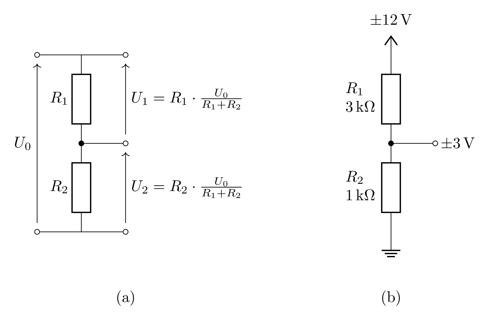
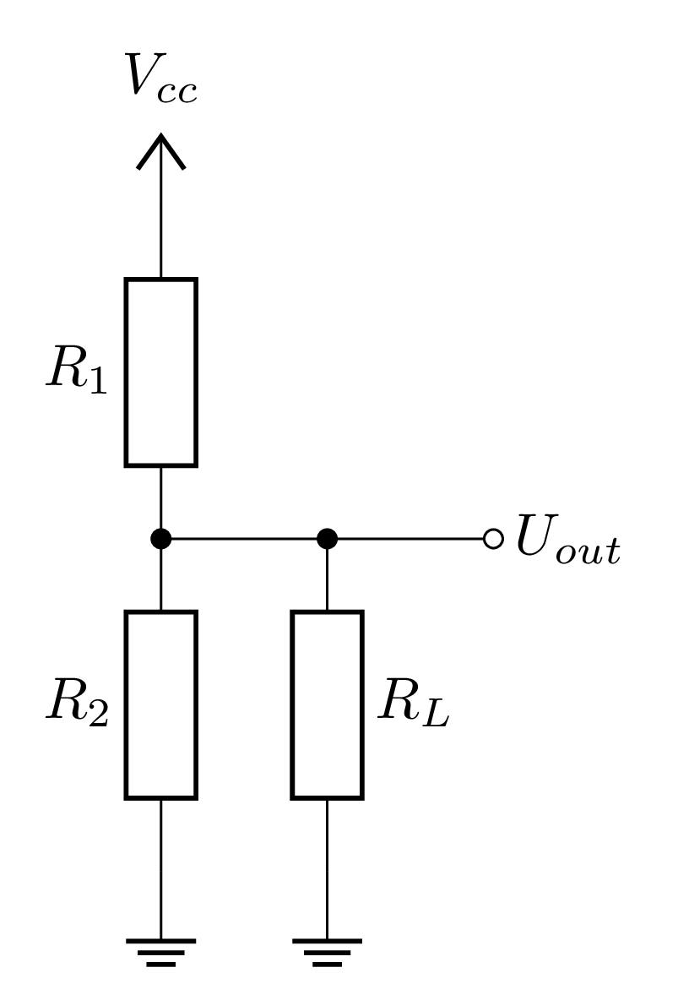
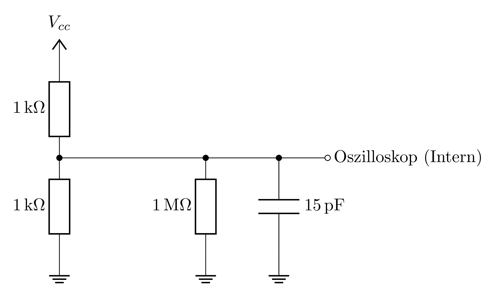
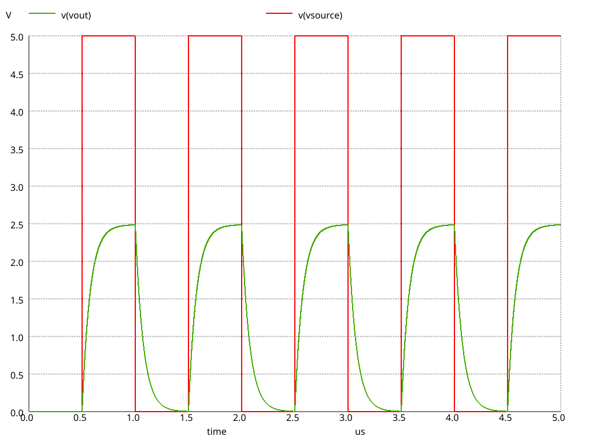
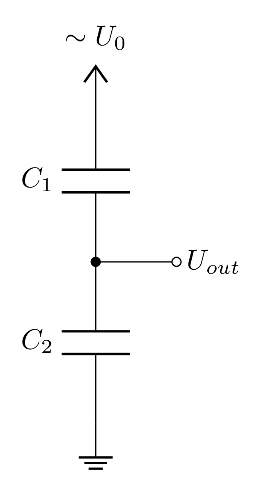
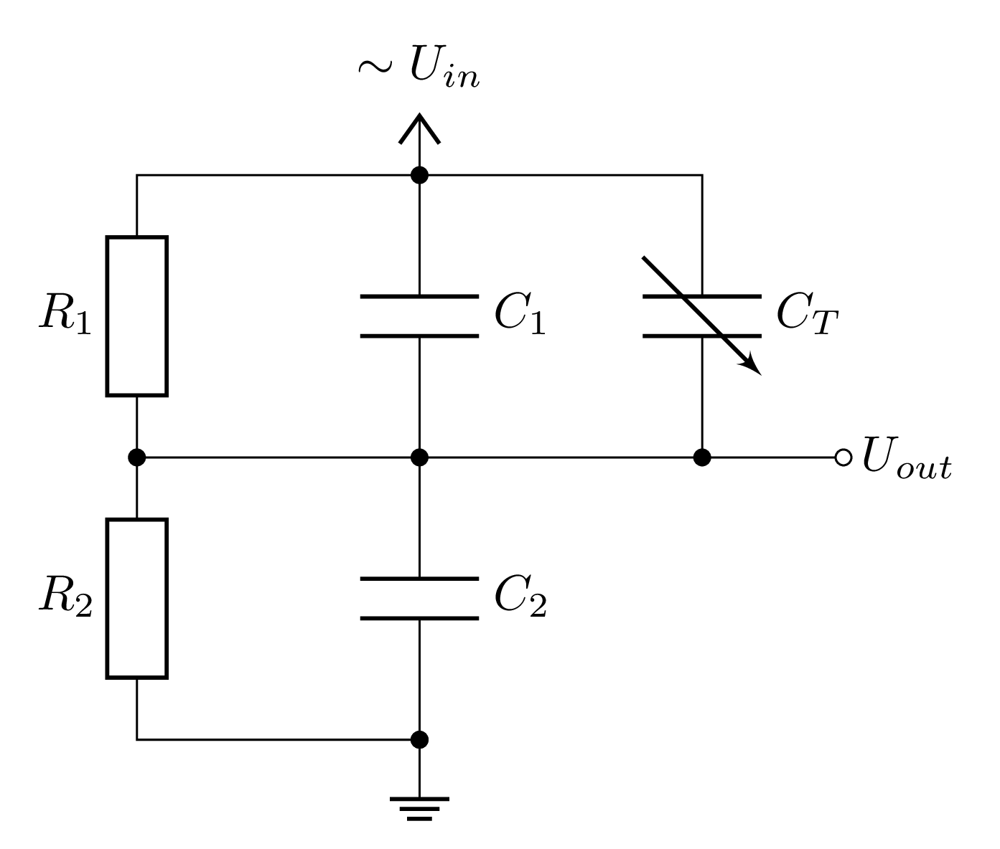
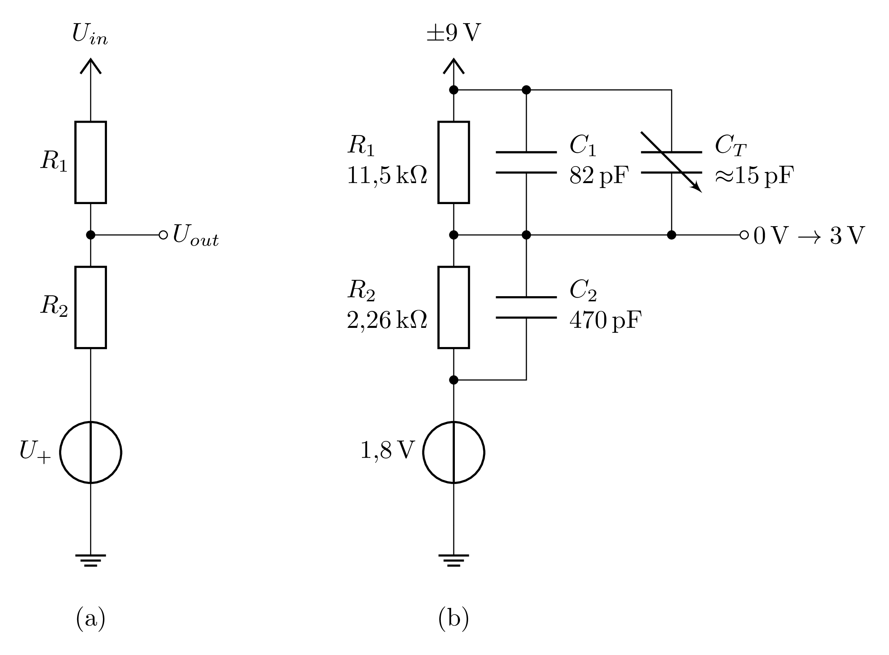
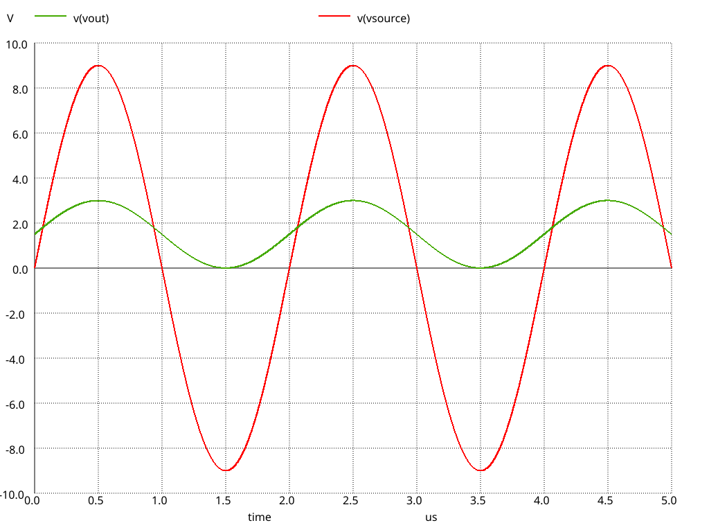

# Hinweise für den Versuch **Signalverarbeitung**

## Spannungsteiler

Ein Spannungsteiler, wie in **Abbildung 1 (a)** zu sehen, ist eine einfache Schaltung, die aus zwei Widerständen in Reihe aufgebaut ist und nach dem Ohmschen Gesetz eine Spannung in zwei Teilspannungen aufteilt. Ein elektrischer Widerstand $R$ ist definiert als das Verhältnis von Spannung $U$ zu Strom $I$:
$$
\begin{equation*}
R = \frac{U}{I}.
\end{equation*}
$$
In einer Reihenschaltung von zwei Widerständen $R_{1}$ und $R_{2}$ fließt durch beide Widerstände der gleiche Strom $I$. Die Gesamtspannung $U$ teilt sich in die Teilspannungen $U_{1}$ und $U_{2}$ auf, die jeweils über den Widerständen $R_{1}$ und $R_{2}$ abfallen. Aus der Energieerhaltung folgt, dass die Gesamtspannung die Summe der abfallenden Teilspannungen ist $U_{0} = U_{1} + U_{2}$ und aus der Ladungserhaltung folgt, dass der Strom durch beide Widerstände gleich sein muss:
$$
\begin{equation*}
I = \frac{U_{0}}{R_{1}+R_{2}}.
\end{equation*}
$$
Dabei wurde verwendet, dass der Gesamtwiderstand zweier in Reihe geschalteter Widerstände die Summe der Einzelwiderstände ist: $R=R_{1}+R_{2}$.
Nach dem Ohmschen Gesetz gilt für die Teilspannungen:
$$
\begin{equation*}
U_{2} = R_{2}\,I = R_{2}\,\frac{U_{0}}{R_{1}+R_{2}}.
\end{equation*}
$$
Analog lässt sich auch die Spannung $U_{1}$ berechnen. Aus der Gleichung lässt sich auch ein Zusammenhang erkennen, der für das Verständnis der Schaltungen in diesem Versuch hilfreich ist: Am größeren Widerstand fällt auch die größere Spannung ab.

Aus dem Verhältnis der beiden abfallenden Spannungen lässt sich die beschreibende Gleichung für den Spannungsteiler ableiten:
$$
\begin{equation*}
\frac{U_{1}}{U_{2}} = \frac{R_{1}}{R_{2}}
\end{equation*}
$$

Der Spannungsteiler kann verwendet werden, um am Abgriff zwischen den beiden Widerständen eine bestimmte Spannung $U_{2}$ zu erzeugen, die kleiner ist als die Eingangsspannung $U_{0}$. In **Abbildung 1 (b)** ist beispielhaft ein Spannungsteiler dargestellt, der am unteren Ende mit der Masse verbunden ist. Die Widerstände wurden so gewählt, dass eine Eingangsspannung von $\pm12 \mathrm{V}$ auf eine Ausgangsspannung von $\pm 3 \mathrm{V}$ reduziert wird. Der Spannungsteiler funktioniert in diesem Fall unabhängig davon, ob die Eingangsspannung positiv oder negativ ist.

---

**Abbildung 1**: ((a) Schaltung eines Spannungsteilers mit den an den Widerständen abfallenden Spannungen. (b) Ein Spannungsteiler, um eine gezielte Ausgangsspannung zu erzeugen.)

---

Ein Spannungsteiler ist eine sehr einfache Methode um Spannungen zu reduzieren aber es gibt zwei wichtige Nachteile, die den Einsatzbereich des Spannungsteilers einschränken. Erstens ist der Spannungsteiler keine gute Stromquelle. Wenn wir die Ausgangsspannung verwenden wollen, um ein anderes Bauteil zu versorgen, dann fließt durch dieses Bauteil ein Strom. Das angeschlossene Bauteil lässt sich als ein weiterer Widerstand $R_{L}$, für gewöhnlich "Lastwiderstand" genannt, am Ausgang des Spannungsteilers betrachten (siehe **Abbildung 2**). Der Widerstand $R_{L}$ ändert den Gesamtwiderstand des unteren Zweigs des Spannungsteilers von $R_{2}$ auf den Parallelschaltungswiderstand $R_{p}$:
$$
\begin{equation*}
R_{p} = R_2 \parallel R_L = \frac{R_{2} R_{L}}{R_{2} + R_{L}} \lt R_2.
\end{equation*}
$$
Der Parallelwiderstand ist dabei immer kleiner als der kleinste der beiden Widerstände $R_{2}$ und $R_{L}$. Dieser führt dazu, dass die Ausgangsspannung $U_{2}$ kleiner wird als erwartet, da der Gesamtwiderstand des unteren Zweigs des Spannungsteilers kleiner wird. Je kleiner der Lastwiderstand $R_{L}$ ist, desto stärker ändert sich die Ausgangsspannung. Nur wenn der Lastwiderstand sehr groß im Vergleich zu $R_{2}$ ist ($R_{L} \gg R_{2}$), ändert sich die Ausgangsspannung nur wenig. Dieses Problem werden Sie im Verlauf des Praktikumsversuches durch einen Impedanzwandler umgehen.

---

**Abbildung 2**: (Ein belasteter Spannungsteiler mit einem Lastwiderstand $R_{L}$ am Ausgang)

---

Ein weiteres Problem wird erst sichtbar, wenn wir ein Oszilloskop an den Ausgang des Spannungsteilers anschließen. Der Eingang eines Oszilloskops hat für gewöhnlich einen sehr hohen Eingangswiderstand (typischerweise $1 \mathrm{M}\Omega$ oder höher) und eine sehr niedrige Eingangskapazität (typischerweise $\mathrm{15 pF}$). In **Abbildung 3** ist ein Spannungsteiler dargestellt (Mit den Widerständen $R_{1} = R_{2} = \mathrm{1 \Omega}) dessen Ausgang an den Eingangswiderstand und die Eingangskapazität des Oszilloskops angeschlossen sind. Obwohl die Kapazität klein ist, kann sie dennoch einen Tiefpassfilter bilden, der die Messung verfälscht. Bei rechteckigen Signalen kann diese deutliche Verzerrung des Signals gut beobachtet werden, wie eine [SPICE](https://de.wikipedia.org/wiki/SPICE_(Software)) Simulation der Schaltung aus **Abbildung 3** in **Abbildung 4** zeigt.

---

**Abbildung 3**: (Ein Spannungsteiler mit dem Eingangswiderstand und der Eingangsimpedanz eines Oszilloskops am Ausgang)

---

**Abbildung 4**: (Simulation der in **Abbildung 3** dargestellten Schaltung. **v(source)** ist ein Rechteck-förmiges Eingangssignal, welches durch den Spannungsteiler zu **v(out)** reduziert wird. Das Ausgangssignal ist durch die Kapazität des Oszilloskops sichtbar verzerrt.)

---

Zur Lösung des Problems schauen wir uns im nächsten Abschnitt einen anderen Spannungsteiler an, der nicht aus Widerständen aufgebaut ist.

## Kapazitiver Spannungsteiler

Für Wechselspannungen lässt sich ein Spannungsteiler auch aus Kondensatoren aufbauen, wie in **Abbildung 5** dargestellt.

---

**Abbildung 5**: (Schaltung eines kapazitiven Spannungsteilers für Wechselspannungen.)

---

Um das Verhalten des Spannungsteilers mathematisch zu beschreiben, wird erneut die Ladungserhaltung verwendet. In einer Reihenschaltung von zwei Kondensatoren $C_{1}$ und $C_{2}$ ist die Ladung $Q$ auf beiden Kondensatoren gleich, da durch beide Kondensatoren der gleiche Strom fließt. Es gilt:
$$
\begin{equation*}
Q = C U_{0} = C_{1} U_{1} = C_{2} U_{2}.
\end{equation*}
$$
Die Kapazität zweier in Reihe geschalteter Kondensatoren ist gegeben durch:
$$
\begin{equation*}
C = \frac{1}{\frac{1}{C_{1}} + \frac{1}{C_{2}}} = \frac{C_{1} C_{2}}{C_{1} + C_{2}}.
\end{equation*}
$$
Daraus lässt sich der Spannungsabfall an $C_{2}$ berechnen:
$$
\begin{equation*}
U_{2} = \frac{Q}{C_{2}} = \frac{C U_{0}}{C_{2}} = \frac{U_{0}}{C_{2}} \cdot \frac{C_{1} C_{2}}{C_{1} + C_{2}} = U_{0} \cdot \frac{C_{1}}{C_{1} + C_{2}}.
\end{equation*}
$$
Analog lässt sich auch die Spannung $U_{1}$ berechnen. Aus dem Verhältnis der beiden abfallenden Spannungen lässt sich die beschreibende Gleichung für den kapazitiven Spannungsteiler ableiten:
$$
\begin{equation*}
\frac{U_{1}}{U_{2}} = \frac{C_{2}}{C_{1}}
\end{equation*}
$$
Im Vergleich zur beschreibenden Gleichung des ohmschen Spannungsteilers fällt hier die Kapazität im Zähler und Nenner vertauscht auf. Am kleineren Kondensator fällt die größere Spannung ab.

Mithilfe des kapazitiven Spannungsteilers kann das Problem der Eingangskapazität des Oszilloskops unter Kontrolle gebracht werden: Wenn der Kondensator $C_{2}$ deutlich größer ist als die Eingangskapazität des Oszilloskops $C_{in}$ (also $C_{2} \gg C_{in}$), dann wird aus der Parallelschaltung von $C_{2}$ und $C_{in}$ nahezu $C_{2}$ und die Ausgangsspannung ändert sich kaum.

## Frequenzkompensierter Spannungsteiler

Aus der Kombination eines ohmschen und eines kapazitiven Spannungsteilers lässt sich ein sogenannter "Frequenzkompensierter Spannungsteiler aufbauen", welcher für Gleich- und Wechselspannungen verwendet werden kann. Weiterhin können mit diesem Spannungsteiler die Verzerrungen des Ausgangsssignals durch Lastwiderstände und Lastkapazitäten unter Kontrolle gebracht werden, indem die Widerstände und Kapazitäten passend gewählt werden. In **Abbildung 6** ist ein frequenzkompensierter Spannungsteiler dargestellt.

---

**Abbildung 6**: (Schaltung eines Frequenzkompensierten Spannungsteilers.)

---

Damit der Spannungsteiler sowohl für Gleich- als auch für Wechselspannungen funktioniert, müssen die Widerstände und Kapazitäten so gewählt werden, dass die beschreibenden Gleichungen des ohmschen und des kapazitiven Spannungsteilers übereinstimmen:
$$
\begin{equation*}
\frac{U_{1}}{U_{2}} = \frac{R_{1}}{R_{2}} = \frac{C_{2}}{C_{1}}.
\end{equation*}
$$
$$
\begin{equation*}
R_{1} C_{1} = R_{2} C_{2}
\end{equation*}
$$

Widerstände lassen sich industriell mit hoher Genauigkeit fertigen, während Kapazitäten meist nur mit geringerer Genauigkeit verfügbar sind. Daher wird in der Praxis meist zuerst der Widerstandsteiler ausgelegt und zu den Kondensatoren zusätzlich ein Trimmerkondensator verbaut, in **Abbildung 6** als $C_{T}$ bezeichnet, mit dem die Kapazität $C_{2} \parallel C_{T}$ feinjustiert werden kann, um die Frequenzkompensation zu erreichen.

## Offset-Addition

In einigen Schaltungen ist es notwendig, zu einer Wechselspannung einen Gleichspannugsanteil zu addieren. Ein beispiel dafür wäre die Verschiebung einer Wechselspannung in den positiven Bereich, wenn ein Messgerät nicht für die Messung von negativen Spannungen ausgelegt ist. Eine einfache Möglichkeit dies zu erreichen, ist die Modifikation eines Spannungsteilers durch hinzufügen einer weiteren Spannungsquelle, wie in **Abbildung 7 (a)** dargestellt. Dabei wird in der Abbildung nur ein ohmscher Spannungsteiler dargestellt, aber das Prinzip lässt sich auch auf kapazitive und Frequenzkompensierte Spannungsteiler übertragen.

---

**Abbildung 7**: (Offset-Addition bei einem Spannungsteiler)

---

Für die Beschreibung der Funktionsweise nehmen gehen wir davon aus, dass der Wert der Eingangs- und Ausgangsspannung sich immer auf die Masse bezieht. Der Widerstand $R_{2}$ des Spannungsteiler wird eine Spannungsquelle verbunden, die eine konstante Offset-Spannung $U_{+}$ liefert. Mit den bekannten Gleichungen können wir den Spannungsabfall an Widerstand $R_{2}$ berechnen, berücksichtigt werden muss, dass die Spannung $U_{0}$ aus **Abbildung 1** in diesem Fall zur Spannung $U_{in} - U_{+}$ wird. Die Ausgangsspannung $U_{out}$ setzt sich aus der am Widerstand $R_{2}$ abfallenden Spannung und der Offset-Spannung $U_{+}$ zusammen.
$$
\begin{align*}
% Wegen einem Bug im LaTeX-Renderer KaTeX muss in der 2. Zeile das + durch \char"002B ersetzt werden. Andernfalls wird die Gleichung nicht dargestellt.
U_{2} & = U_{2} + U_{+} \\
    & = (U_{in} - U_{\char"002B}) \frac{R_{2}}{R_{1} + R_{2}} + U_{+} \\
    & = U_{in} \frac{R_{2}}{R_{1} + R_{2}} + U_{+} \left(1 - \frac{R_{2}}{R_{1} + R_{2}}\right) \\
    & = U_{in} \frac{R_{2}}{R_{1} + R_{2}} + U_{+} \frac{R_{1}}{R_{1} + R_{2}}.
\end{align*}
$$
Die Gleichung zeigt, dass eine Eingangsspannung $U_{in}$ um den Faktor $U_{+} \frac{R_{1}}{R_{1} + R_{2}}$ verschoben wird.

Wie lässt sich diese Schaltung in der Praxis einsetzen? Dazu betrachten wir folgendes Beispiel: Eine $\pm12 \mathrm{V}$ Eingangsspannung soll auf den Bereich von $0\mathrm{V}$ bis $3\mathrm{V}$ abgebildet werden. Für den Entwurf der Schaltung wird zuerst der Spannungsteiler richtig dimensioniert. Dabei ist der intuitive Gedanke, die Eingangsspannung auf $\pm3\mathrm{V}$ zu reduzieren nicht hilfreich, weil durch Hinzufügen eines Offsets die Spannung größer wird und die $3\mathrm{V}$ Obergrenze wieder überschreitet. Stattdessen muss die Spannung auf die Hälfte des Zielbereichs, in diesem Fall $\pm1,5\mathrm{V}$ reduziert werden. Für die Widerstände gilt dementsprechend:
$$
\begin{align*}
U_{2} & = U_{0} \cdot \frac{R_{2}}{R_{1} + R_{2}} \\
\frac{R_{1}}{R_{2}} &= \frac{U_{0}}{U_{2}} - 1
\end{align*}
$$
Die Gleichung ist erfüllt, wenn die gewählten Widerstände die Gleichung $R_{1} = 7 \cdot R_{2}$ erfüllen. Für die Kondensatoren im Frequenzkompensierten Spannungsteiler gilt das Inverse dieses Verhältnisses: $C_{2} = 7 \cdot C_{2}$. Zur Vereinfachung der Rechnung werden die Bauteile auf folgende Werte festgelegt:

- $R_{1} = 7\mathrm{k\Omega}$
- $R_{2} = 1\mathrm{k\Omega}$
- $C_{1} = 10\mathrm{pF}$
- $C_{2} = 70\mathrm{pF}$

Das Eingangssignal liegt nun in dem Bereich $\pm1,5\mathrm{V}$ vor. Durch eine Addition von $1,5\mathrm{V}$ wird es auf den gewünschten Zielbereich verschoben. Die Offset-Spannung für den Spannungsteiler berechnet sich dementsprechend zu:
$$
\begin{align*}
1,5\mathrm{V} & = U_{+} \cdot \frac{R_{1}}{R_{1} + R_{2}} \\
U_{+} & = 1,5\mathrm{V} \left(1 + \frac{R_{2}}{R_{1}}\right) \\
& = 1,5\mathrm{V} \cdot \frac{8}{7} \approx 1,71\mathrm{V}
\end{align*}
$$
Mit diesen Werten lässt sich die Schaltung in **Abbildung 7 (b)** aufbauen. Zum Feinjustieren der Kapazitäten in der Schaltung wird ebenfalls ein Trimmer-Kondensator ($C_{T}$) eingebaut. Eine Simulation zur Verifikation der Funktion dieser Schaltung ist in **Abbildung 8** dargestellt.

---

**Abbildung 8**: (Simulation der in **Abbildung 7 (b)** dargestellten Schaltung.)

---

#  Essentials

Was Sie ab jetzt wissen sollten:

- Sie sollten den Spannungsteiler erklären und die Formel zur Berechnung der Ausgangsspannung kennen.
- Sie sollten die Gleichungen zur Beschreibung des ohmschen und des kapazitiven Spannungsteilers kennen und deren Unterschiede verstehen.
- Sie sollten in der Lage sein, einen Frequenzkompensierten Spannungsteiler für vorgegebene Eingangs- und Ausgangsspannungen zu dimensionieren.
- Sie sollten die Funktionsweise der Offset-Addition verstehen und in der Lage sein, eine Schaltung mit vorgegebenen Parametern zu entwerfen.

## Testfragen  TODO

1. Wieso ist ein ohmscher Spannungsteiler keine gute Stromquelle?
2. Warum verzerrt die Eingangskapazität eines Oszilloskops das Ausgangssignal eines ohmschen Spannungsteilers?
3. Warum wird ein ohmscher Spannungsteiler bei einer hochohmigen Last weniger verzerrt?
4. Warum wird ein kapazitiver Spannungsteiler bei einer niedrigen Lastkapazität weniger verzerrt?
5. Wieso muss die Spannungsquelle für die Offset-Spannung eine höhere Spannung ausgeben als die tatsächliche Verschiebung der Ausgangsspannung?

# Navigation

[Main](https://gitlab.kit.edu/kit/etp-lehre/p2-praktikum/students/-/tree/main/Operationsverstaerker)

