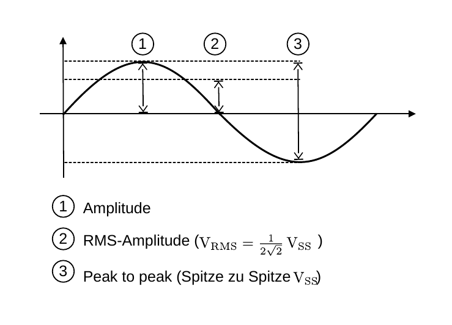

# Hinweise für den Versuch **Operationsverstärker (OPV)**

## Steckbrett

Alle Schaltungen werden auf einem Steckbrett aufgebaut.

## Elektrische Bauteile

Für den Versuch stehen Ihnen folgende elektrische Bauteile zur Verfügung, die Sie zum Aufbau ihrer Schaltung verwenden:
- Operationsverstärker (OPV) vom Typ MCP6002
- Widerstände mit verschiedenen Widerstandswerten
- Potentiometer 
- Ein Netzteil zur Spannungsversorgung des OPVs

## Multimeter

Sowohl Potentiometer, als auch Widerstände haben natürliche Fertigungstoleranzen. Kalibireren Sie diese mit Hilfe des am Versuchsplatz ausliegenden Multimeters auf $\Omega$ (Ohm). 

Das ausliegende Multimeter gibt im AC-Spannungen und Ströme als **RMS-Amplituden** wieder. Der Zusammenhang verschiedener Amplituden-Angaben ist in **Abbildung 2** gezeigt:

---

**Abbildung 2**: (Zusammenhang verschiedener Spannungsangaben)

---

## Funktionsgenerator und Oszilloskop

Mithilfe des Funktionsgenerators können Sie Sinus- Dreieck- oder Rechtecksignale mit variabler Frequenz und Amplitude erzeugen. Für diesen Versuch verwenden wir hauptsächlich Sinus- und vereinzelt Rechteck-Signale im Kilohertz-Bereich als Eingangssignal.

Das Oszilloskop, welches Sie bereits aus dem [Grundversuch Oszilloskop](https://gitlab.kit.edu/kit/etp-lehre/p1-praktikum/students/-/tree/main/Oszilloskop?ref_type=heads) kennen, ermöglicht es Ihnen, das Eingangs-Signal mit dem Ausgangssignal ihrer Schaltung zu vergleichen. Schließen Sie dazu das aus dem Funktionsgenerator kommende Signal an einen Kanal des Oszilloskops an. Mit dem zweiten Kanal können Sie an ihrer Schaltung verschiedene Messpunkte untersuchen (z.B. das Ausgangssignal der Schaltung oder die Eingänge des OPVs).

Vor der Verwendung des Oszilloskops müssen Sie die Tastköpfe kalibrieren. Verbinden Sie dazu die beiden Tastköpfe mit dem Oszilloskop und stellen Sie am Funktionsgenerator ein Rechteck-Signal mit einer Amplitude von 1 V (Spitze-Spitze) und einer Frequenz von 1 kHz ein. Passen Sie die Einstellungen des Oszilloskops so an, dass Sie das Rechteck-Signal sehen können. Justieren Sie anschließend die Tastköpfe mit der Schraube so, dass das angezeigte Signal möglichst verzerrungsfrei ist.

**TODO: Der Abschnitt über das Kalibrieren ist bestimmt beim Oszi-Versuch besser beschrieben und hier sollte nur darauf verlinkt werden.**

# Navigation

[Main](https://gitlab.kit.edu/kit/etp-lehre/p2-praktikum/students/-/tree/main/Operationsverstaerker)

