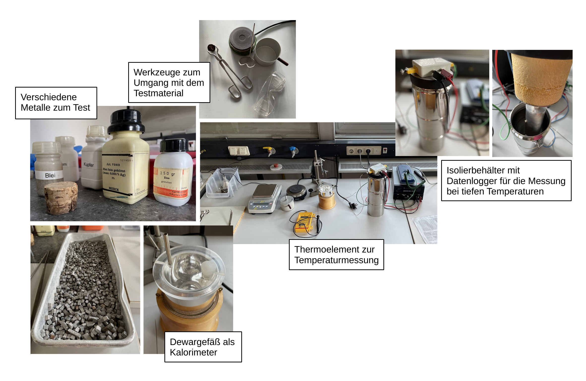

# Fakultät für Physik

## Physikalisches Praktikum P2 für Studierende der Physik

Versuch P2-171, 172, 173 (Stand: **Februar 2025**)

[Raum F1-10](https://labs.physik.kit.edu/img/Klassische-Praktika/Lageplan_P1P2.png)

# Spezifische Wärmekapazität

## Motivation

Im Jahr 1819 veröffentlichten [Pierre Dulong](https://de.wikipedia.org/wiki/Pierre_Louis_Dulong) und [Alexis Petit](https://de.wikipedia.org/wiki/Alexis_Th%C3%A9r%C3%A8se_Petit) nach eingehenden Untersuchungen die Vermutung, dass die [molare Wärmekapazität](https://de.wikipedia.org/wiki/Molare_W%C3%A4rmekapazit%C3%A4t) für alle aus einzelnen Atomen zusammengesetzten Festkörpern den gleichen Wert 

$$
\begin{equation*}
C_{M} = 3\ R=24.9\ \mathrm{J\,mol^{-1}K^{-1}}
\end{equation*}
$$

haben könnte, wobei $R$ der idealen Gaskonstanten entspricht. Diese Vermutung konnte später durch eine entsprechende Vorhersage aus der [statistischen Thermodynamik](https://de.wikipedia.org/wiki/Statistische_Thermodynamik) gestützt und erklärt werden. Eine Konsequenz dieser Vorhersage war, dass $C_{M}$ für einatomige Festkörper konstant sein sollte. Später stellte sich jedoch heraus, dass $C_{M}$ bei sehr tiefen Temperaturen ($T$) eine deutliche $T$-Abhängigkeit aufweist und und gegen Null strebt, ein Verhalten, dass im Rahmen der statistischen Thermodynamik nicht zu erklären ist. Albert Einstein ([*Annalen der Physik*, 22 (1907)](http://echo.mpiwg-berlin.mpg.de/MPIWG:7BQGFZHC)) konnte dieses Phänomen als erster unter der Annahme erklären, dass Schwingungen im Festkörper, ganz so wie Strahlung in einem [Schwarzen Körper](https://de.wikipedia.org/wiki/Schwarzer_K%C3%B6rper) nur in diskreten Energiequanten aufgenommen und abgegeben werden können ([Einsteinmodell](https://de.wikipedia.org/wiki/Einsteinmodell)). Dieses Modell wurde 1912 von [Peter Debye](https://de.wikipedia.org/wiki/Debye-Modell) weiter verfeinert. Mit diesem Versuch haben Sie die Möglichkeit mit einfachsten Mitteln die Aussagen des Dulong-Petit Gesetzes für verschiedene Festkörper experimentell nachzuprüfen und mit Hilfe von [Flüssigstickstoff](https://de.wikipedia.org/wiki/Fl%C3%BCssigstickstoff) den Temperaturverlauf von $C_{M}$ an Aluminium zu untersuchen. Damit weisen Sie eine weitere Bruchstelle der klassischen Physik und einen der ersten Quanteneffekte der Festkörperphysik im Praktikum selbst nach. 

## Lehrziele

Wir listen im Folgenden die wichtigsten **Lehrziele** auf, die wir Ihnen mit dem Versuch **Spezifische Wärmekapazität** vermitteln möchten: 

- Sie üben sich in der sorgfältigen Planung, Dokumentation und Durchführung einfacher Experimente zur Bestimmung der [spezifischen Wärmekapazität](https://de.wikipedia.org/wiki/Spezifische_W%C3%A4rmekapazit%C3%A4t) verschiedener Metalle.
- Sie üben sich im gewissenhaften und exakten Experimentieren, sowie in der Abschätzung und Minimierung systematischer Effekte bei der Planung und Durchführung Ihrer Experimente.
- Sie untersuchen den Einfluss der Umgebung auf Experimente, die mit Wärme zu tun haben ([Wärmegang](https://de.wikipedia.org/wiki/W%C3%A4rme%C3%BCbergangskoeffizient)).
- Sie untersuchen die Abhängigkeit der spezifischen Wärmekapazität von der Temperatur, ein Phänomen, das im Rahmen der klassischen Thermodynamik nicht erklärt werden kann. 
- Sie üben sich im verantwortungsvollen Umgang mit [Flüssigstickstoff](https://de.wikipedia.org/wiki/Fl%C3%BCssigstickstoff) und führen ein Experiment bei tiefen Temperaturen durch. 
- Sie nutzen dabei den [thermoelektrischen (Peletier) Effekt](https://de.wikipedia.org/wiki/Thermoelektrizit%C3%A4t) zur Temperaturmessung.  

## Versuchsaufbau

Einen typischer Aufbau mit den Apparaturen für diesen Versuch ist in **Abbildung 1** gezeigt:

---

**Abbildung 1**: (Ein typischer Aufbau mit den Apparaturen für die Durchführung des Versuchs Spezifische Wärmekapazität)

---

Für die Durchführung des Versuchs stehen Ihnen mehrere Metalle in Form von Zylindern oder Granulaten zur Verfügung. Mit einer Heizplatte oder Eis können Sie die Metallgemenge oder Wasser erhitzen oder abkühlen. In einem Dewargefäß, dass Sie als thermisches Kalorimeter nutzen, bestimmen Sie mit Hilfe verschiedener Thermometer Mischtemperaturen von geeigneten Metall-Wasser-Gemischen. **Die Planung, der grundsätzliche Aufbau und der konkrete Versuchsablauf bleibt Ihnen überlassen**. 

In einem zweiten Teil des Versuchs kühlen Sie einen Aluminium-Hohlzylinder (AL) auf die Sidetemperatur von Flüssigstickstoff ab und erwärmen ihn im Anschluss wieder unter kontrollierten Bedingungen. Nach Anwendung verschiedener Korrektur- und Kalibrationsschritte bestimmen Sie den Temperaturverlauf der spezifischen Wärmekapazität von Aluminium und überprüfen u.a. die Konsistenz Ihrer  Messungen.  

## Was macht diesen Versuch aus?

Bei der spezifischen Wärmekapazität handelt es sich um eine Größe der Thermodynamik, die auf die Beschreibung von Festkörpern angewandt zu einer Größe der Festkörperphysik wird. Die zentralen Größen der Thermodynamik, Wärme, Druck, Entropie und Temperatur sind ihrer Natur nach nicht sehr anschaulich, mikroskopische Modelle zu ihrer Beschreibung sind i.a. kompliziert und weil einzelne Effekte experimentell schwer zu isolieren sind treten oft mehrere Effekte überlagert auf, so dass die theoretischen Modelle die realen Messungen i.a. nur grob wiedergeben. Die Messung thermodynamischer Größen erfordert große **Sorgfalt und experimentelles Geschick**. Unsicherheiten sind i.a. nicht statistischer sondern systemtischer Natur, d.h. auf Fehler und Unkenntnis, während des Versuchs zurückzuführen. Die Reihenfolge des Vorgehens, die geschickte Wahl von Randbedingungen und die kluge Auswahl von Kontrollmessungen zeichnen erfolgreiche Messreihen aus. Mit diesem Versuch erhalten Sie anhand einfach anmutender Aufgaben einen groben Einblick, wie experimentelles Arbeiten in den Labors der Festkörperphysik aussieht: Das Experiment wird geplant, vorbereitet und dann in Form einer Messreihe (i.a. automatisiert) durchgeführt. Die Messreihe wird dann im Anschluss ausgewertet. Mit **Aufgabe 1** haben Sie die Chance eine Messreihe in aller Sorgfalt selbst frei zu planen, und durchzuführen. Wie gut Ihnen dies gelingen wird werden Sie an Ihren Messergebnissen erkennen. Für **Aufgabe 2** haben wir Ihnen den Ablauf der Messreihe vorgegeben. Hier werden Sie die Rohdaten aufzeichnen und in mehreren Stufen auswerten.   

## Wichtige Hinweise

- **Der Umgang mit Flüssigstickstoff erfordert besondere Vorsicht! Spritzer von flüssigem Stickstoff auf der Haut können bereits zu schweren Verbrennungen führen.** Tragen Sie daher immer Schutzhandschuhe und eine Schutzbrille im Umgang mit Flüssigstickstoff!
- Lassen Sie keine Gegenstände in die Dewargefäße fallen. Diese bestehen aus Glas und werden ständig extremen thermischen Schwankungen ausgesetzt. Sie können daher leicht zerstört werden.
- **Um die Daten von Aufgabe 2 auf das Jupyter-notebook zu überspielen benötigen Sie einen USB-Datenträger.** 

# Navigation

- [Spezifische_Waermekapazitaet.iypnb](https://gitlab.kit.edu/kit/etp-lehre/p2-praktikum/students/-/blob/main/Spezifische_Waermekapazitaet/Spezifische_Waermekapazitaet.ipynb): Aufgabenstellung und Vorlage fürs Protokoll.
- [Spezifische_Waermekapazitaet_Hinweise.ipynb](https://gitlab.kit.edu/kit/etp-lehre/p2-praktikum/students/-/blob/main/Spezifische_Waermekapazitaet/Spezifische_Waermekapazitaet_Hinweise.ipynb): Kommentare zu den Aufgaben.
- [Datenblatt.md](https://gitlab.kit.edu/kit/etp-lehre/p2-praktikum/students/-/blob/main/Spezifische_Waermekapazitaet/Datenblatt.md): Technische Details zu den Versuchsaufbauten.
- [doc](https://gitlab.kit.edu/kit/etp-lehre/p2-praktikum/students/-/tree/main/Spezifische_Waermekapazitaet/doc): Dokumente zur Vorbereitung auf den Versuch.
- [figures](https://gitlab.kit.edu/kit/etp-lehre/p2-praktikum/students/-/tree/main/Spezifische_Waermekapazitaet/figures): Bilder, die für die Dokumentation des Versuchs verwendet wurden.
