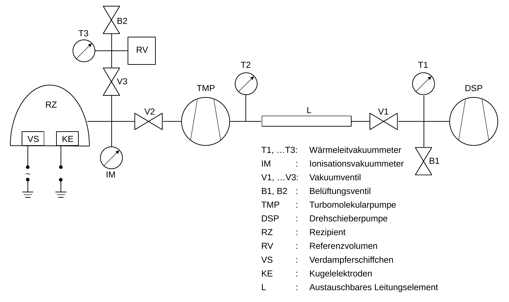
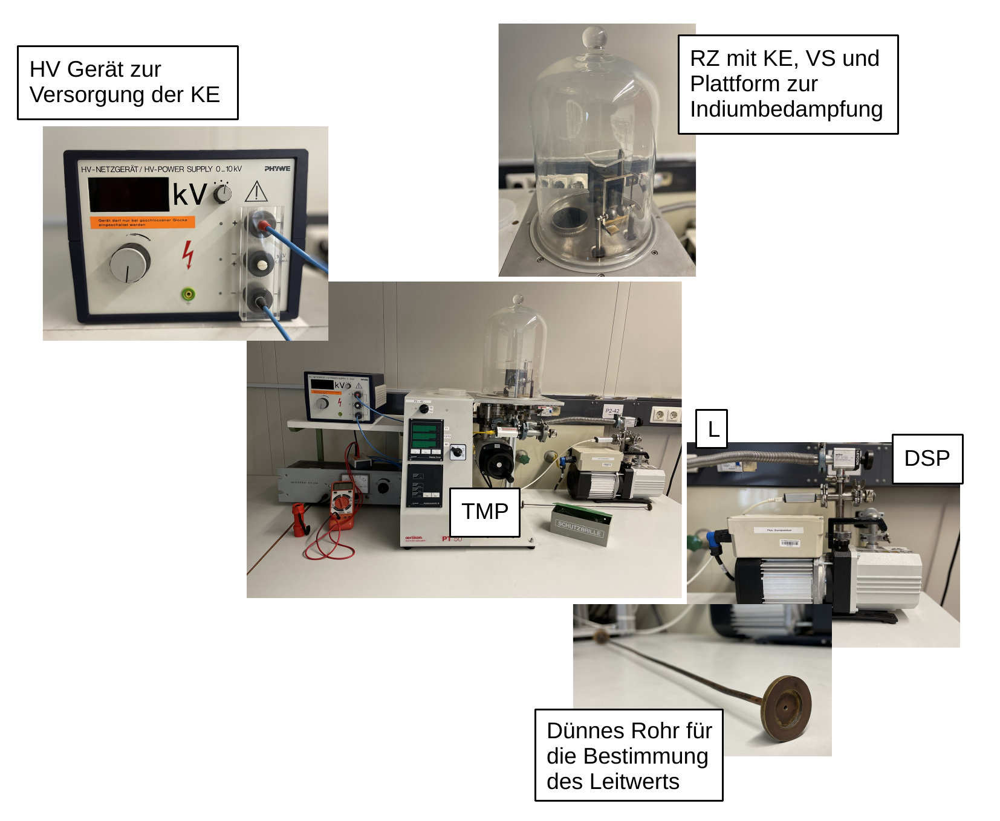

# Fakultät für Physik

## Physikalisches Praktikum P2 für Studierende der Physik

Versuch P2-151, 152, 153 (Stand: **February 2025**)

[Raum F1-19](https://labs.physik.kit.edu/img/Klassische-Praktika/Lageplan_P1P2.png)

# Vakuum

## Motivation

Die Abwesenheit von Materie im leeren Raum bezeichnen wir als [Vakuum](https://de.wikipedia.org/wiki/Vakuum). Die Vorstellung von Raum ohne Materie wurde sowohl von Platon, als auch von Aristoteles, der eine "Abneigung der Natur gegen das Leere" postulierte, die später als [*horror vacui*](https://de.wikipedia.org/wiki/Vakuum#Geschichte_der_Erforschung) bekannt wurde, abgelehnt. Auch Descarte, der Namensgeber unseres kartesischen Koordinatensystems, war davon überzeugt, dass es "keinen materiefreien Raum geben könne". Die Überzeugungen solcher Autoritäten der frühen Wissenschaft wurden nur mühsam durch Experimente im Laufe der Renaissance widerlegt. Das erste von Menschen geschaffene Vakuum ist 1644 von [Evangelista Torricelli](https://de.wikipedia.org/wiki/Evangelista_Torricelli) überliefert. Populär wurden die 1657 publikumswirksam von [Otto von Guericke](https://de.wikipedia.org/wiki/Otto_von_Guericke) in Szene gesetzten Experimente mit den evakuierten [Magdeburger Halbkugeln](https://de.wikipedia.org/wiki/Magdeburger_Halbkugeln). Noch bis zum Scheitern des berühmt gewordenen  [Michelson-Morley Experiments](https://de.wikipedia.org/wiki/Michelson-Morley-Experiment) war man von der Existenz eines allumfassenden Äthers überzeugt, der den somit "nicht-leeren" Raum ausfüllen und in dem sich das Licht ausbreiten sollte. Der Ausgang des [Rutherford-Experiments](https://de.wikipedia.org/wiki/Rutherford-Streuung) deutete schließlich darauf hin, dass sich zwischen dem Atomkern, auf den sich die gesamte Masse des Atoms konzentriert und seiner Hülle im wesentlichen *nichts* befand. Heute würden wir selbst einen von aller Materie befreiten Raum nicht als "leer" bezeichnen, weil er sowohl elektromagnetische Strahlung, Gravitationswellen, als auch allgemeine Quantenfluktuation beinhalten kann, die z.B. durch den [Casimir-Effekt](https://de.wikipedia.org/wiki/Casimir-Effekt) wirklich nachweisbar und messbar sind. Im bekannten Universum gibt es kein vollständiges Vakuum. Insofern mögen die Autoritäten der Antike und beginnenden Renaissance schließlich recht behalten haben. 

Heutzutage ist das Vakuum vor allem von technischer Bedeutung. Es schafft wichtige Voraussetzungen in Industrie und Technik, zur Konservierung von Lebensmitteln und in der Forschung. Man unterscheidet zwischen Grob-, Fein-, Hoch- und Ultrahochvakuum. Im interplanetaren Raum herrscht ein Vakuum mit Drücken von $\lt 10^{-18}\,\mathrm{mbar}$ vor. In der [Strahlröhre des LHC](https://home.cern/science/engineering/vacuum-empty-interstellar-space) am CERN in Genf oder im Vakuumtank des [KATRIN Experiments](https://de.wikipedia.org/wiki/KATRIN) herrschen Vakua mit Drücken von $\lt 10^{-10}\,\mathrm{mbar}$ vor.

## Lehrziele

Wir listen im Folgenden die wichtigsten **Lehrziele** auf, die wir Ihnen mit dem Versuch **Vakuum** vermitteln möchten: 

- Sie erhalten Einblick in die Methoden zur Erzeugung von Vakua. Sie lernen mit einer Vakuumapparatur umzugehen, können selbst Hand an die Pumpen anlegen und einfache Experimente im Vakuum durchführen.
- Sie erzeugen mit zwei wichtigen Pumpentypen ein **Hochvakuum**.
- Sie lernen grundlegende Begriffe der Vakuumtechnik, wie **Saugvermögen und Saugleistung** kennen und bestimmen den **Leitwert** eines Rohrs.
- Sie beobachten **Gasentladungen** und die Durchschlagfestigkeit zweier Kondensatorkugeln bei variierendem Luftdruck und verknüpfen Ihre Erkenntnisse zum Vakuum mit dem wichtigen Begriff der [**mittleren freien Weglänge**](https://de.wikipedia.org/wiki/Mittlere_freie_Wegl%C3%A4nge). 
- Als einfache technische Anwendung dampfen Sie bei variierendem Druck Indium auf eine Plexiglasplatte auf.

## Versuchsaufbau

Eine Schaltskizze der für den Versuch relevanten Elemente mit Legende der verwendeten Symbole ist in **Abbildung 1** gezeigt:

---

**Abbildung 1**: (Schaltskizze der verwendeten Vakuumapparatur mit Kurzbezeichnungen)

---

Einen typischer Aufbau der Apparatur für diesen Versuch ist in **Abbildung 2** gezeigt:

---

**Abbildung 2**: (Ein typischer Aufbau des Versuchs Vakuum)

---

Das Herzstück der Apparatur ist der zu evakuierende Behälter, der *Rezipient* (RZ). Er besteht aus einer Glasglocke (mit $220\ \mathrm{mm}$ Durchmesser und $250\ \mathrm{mm}$ Höhe) auf einem Metallteller mit Gummidichtung. Im RZ befinden sich zwei elektrisch aufladbare *Kugelelektroden* (KE) und ein durch Wechselstrom direkt elektrisch beheizbares *Verdampferschiffchen* (VS) für die Experimente aus **Aufgabe 3**. Über Schläuche und Rohre sind eine *Turbomolekular-* (TMP) und eine *Drehschieberpumpe* (DSP) mit dem RZ befunden. Sie verwenden die DSP u.a. dazu für den Einsatz der TMP ein Vorvakuum zu erzeugen. Ein *Metallwellschlauch* (L) lässt sich, durch ein dünnes Rohr ersetzen, für das Sie den Leitwert bestimmen werden. An verschiedenen Stellen befinden sich *Ventile* (V1 bis V3), *Belüftungsventile* (B1 und B2) und *Vakuummeter* (T1 bis T3 und IM) mit geeigneten Messbereichen zur Bestimmung und Kontrolle des Drucks in der Apparatur. Der erreichbare minimale Druck im RZ wird durch Lecks und Gasabgabe von den Wänden des Behälters und durch das Saugvermögen der Pumpe(n) begrenzt.

## Was macht diesen Versuch aus?

Die Physik des Vakuums ist die [**Strömungsmechanik**](https://de.wikipedia.org/wiki/Str%C3%B6mungsmechanik). Sie wird, unter sehr idealisierten Bedingungen aus dem Lehrbuch, durch die [Laplace-Gleichung](https://de.wikipedia.org/wiki/Laplace-Gleichung) und, unter Berücksichtigung der Wechselwirkungen der strömenden Teilchen untereinander, durch die [Navier-Stokes-Gleichungen](https://de.wikipedia.org/wiki/Navier-Stokes-Gleichungen) beschrieben. Die Navier-Stokes-Gleichungen können i.a. nicht analytisch, geschlossen gelöst werden. Die Physik des Vakuums wird dadurch weiter erschwert, dass sich das physikalische Verhalten des strömenden Mediums (Fluids) als Funktion der Dichte der Teilchen aus denen es besteht verändert. Schließlich geht, wie bei jedem physikalischen Experiment, die Beschaffenheit des Versuchsaufbaus wesentlich in die Messung ein. Dies führt dazu, dass Messungen am Versuchsaufbau üblicherweise durch mehrere Effekte gleichzeitig beeinflusst werden. Gut kontrollierte Randbedingungen lassen sich nur unter großem Aufwand herstellen. Daher sind die Messungen, die Sie im Rahmen dieses Versuchs durchführen eher qualitativer Natur: effektive Saugleistungen und Strömungsleitwerte sind Größen, die man eher am Experiment misst, als sie aus theoretischen Modellen abzuleiten. 

## Wichtige Hinweise

- Obwohl in diesem Versuch eine splittergeschützte Glasglocke verwendet wird, kann die evakuierte Glasglocke implodieren. **Zum Schutz Ihrer Augen müssen Sie daher beim Arbeiten an der evakuierten
  Apparatur eine Schutzbrille tragen**.
- Die hier aufgebaute Apparatur ist sehr empfindlich. Bei fehlerhafter Handhabung können teure Schäden entstehen. Die einzelnen Versuchsteile dürfen daher **nur nach Rücksprache mit dem/der Tutor:in** gestartet werden.
- Bei Arbeiten am RZ, decken Sie die Pumpenöffnung mit der bereitliegenden Plastikkappe ab, um Verunreinigungen der Apparatur zu vermeiden. Vor dem Verbinden von Bauteilen mit Hilfe von Dichtungsringen sollten Sie die Ringe und Dichtflächen **sorgfältig reinigen**.
- Die TMP darf nur bei einem Vorvakuumdruck von weniger als $\lesssim0.1\ \mathrm{mbar}$ eingeschaltet werden. Die Apparatur darf erst dann belüftet werden, wenn der Rotor nach dem Abschalten völlig zum Stillstand gekommen ist. Dies dauert einige Minuten. **Ein Lufteinbruch solange der Rotor sich noch bewegt kann die Pumpe zerstören.**

# Navigation

- [Vakuum.iypnb](https://gitlab.kit.edu/kit/etp-lehre/p2-praktikum/students/-/blob/main/Vakuum/Vakuum.ipynb): Aufgabenstellung und Vorlage fürs Protokoll.
- [Vakuum_Hinweise.ipynb](https://gitlab.kit.edu/kit/etp-lehre/p2-praktikum/students/-/blob/main/Vakuum/Vakuum_Hinweise.ipynb): Kommentare zu den Aufgaben.
- [Datenblatt.md](https://gitlab.kit.edu/kit/etp-lehre/p2-praktikum/students/-/blob/main/Vakuum/Datenblatt.md): Technische Details zu den Versuchsaufbauten.
- [doc](https://gitlab.kit.edu/kit/etp-lehre/p2-praktikum/students/-/tree/main/Vakuum/doc): Dokumente zur Vorbereitung auf den Versuch.
- [figures](https://gitlab.kit.edu/kit/etp-lehre/p2-praktikum/students/-/tree/main/Vakuum/figures): Bilder, die für die Dokumentation des Versuchs verwendet wurden.
