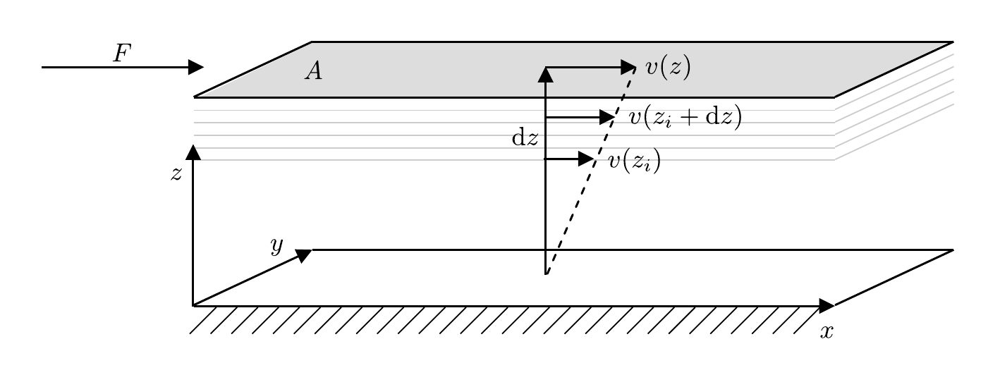
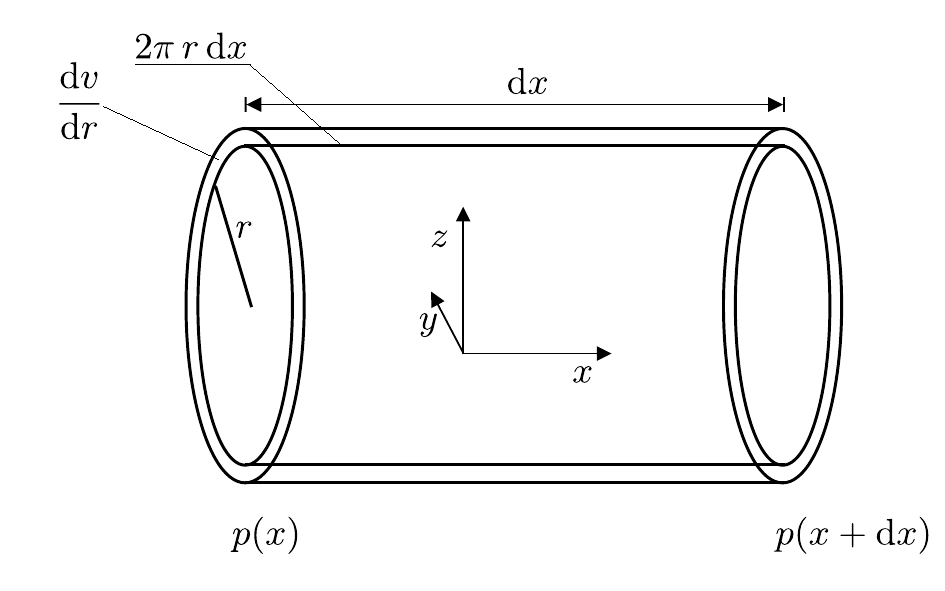

# Vakuum

## Strömungslehre und Physik des Vakuums

### Physik des Vakuums

Grundsätzlich unterscheidet man drei **Vakuumbereiche**, in denen drei verschiedene Arten von Strömungen dominant vorherrschen: 

#### Grobvakuum ($\gt 1\ \mathrm{mbar}$)

> Hier liegt viskose oder [Kontinuumsströmung](https://de.wikipedia.org/wiki/Kontinuumsstr%C3%B6mung) vor, d.h. es dominiert die Wechselwirkungen der Teilchen des Gases (Fluids) untereinander, die die innere Reibung ([Viskosität](https://de.wikipedia.org/wiki/Viskosit%C3%A4t)) des Fluids bestimmen. Treten Wirbel in der Strömung auf, spricht man von [turbulenter Strömung](https://de.wikipedia.org/wiki/Turbulente_Str%C3%B6mung), findet ein Gleiten verschiedener Schichten des Fluids gegeneinander statt, spricht man von [laminarer Strömung](https://de.wikipedia.org/wiki/Laminare_Str%C3%B6mung). 

Viskose Strömung liegt generell dann vor, wenn die [mittlere freie Weglänge](https://de.wikipedia.org/wiki/Mittlere_freie_Wegl%C3%A4nge) $\lambda$ der Teilchen sehr viel kleiner als der Durchmesser der Leitung ist. Sie können $\lambda$, wie beim [Franck-Hertz-Versuch](https://gitlab.kit.edu/kit/etp-lehre/p2-praktikum/students/-/tree/main/Franck_Hertz_Versuch), wie folgt abschätzen: 
$$
\begin{equation}
\begin{split}
&\lambda = \frac{1}{\sigma\,n} = \frac{k_{B}\,T}{\sigma\,p_{\mathrm{RZ}}};\\
&\\
&\text{mit}\\
&\\
&\sigma= \pi\,r^{2};\qquad r=\sqrt[3]{\frac{3}{4\pi}V};
\qquad V= \frac{M_{m}\,f}{N_{A}\,\rho_{\mathrm{fl}}},\\
\end{split}
\tag{1}
\end{equation}
$$

wobei $n$ der Teilchenvolumendichte (in $\mathrm{cm^{-3}}$), $k_{B}$ der [Boltzmann-Konstanten](https://de.wikipedia.org/wiki/Boltzmann-Konstante), $T$ der Temperatur (in $\mathrm{K}$), $p_{\mathrm{RZ}}$ dem Druck im RZ, $N_{A}$ der [Avogradro-Konstanten](https://de.wikipedia.org/wiki/Avogadro-Konstante),  $M_{m}$ und $\rho_{\mathrm{fl}}=807\ \mathrm{g/\ell}$ der [molaren Masse](https://de.wikipedia.org/wiki/Molare_Masse) und der Dichte von flüssigem $\mathrm{N}_{2}$ (als Hauptbestandteil von Luft) und $f\approx0.74$ dem Füllfaktor der [dichtesten Kugelpackung](https://de.wikipedia.org/wiki/Dichteste_Kugelpackung) entsprechen. 💡 Man bezeichnet $\sigma$ als den geometrischen Wirkungsquerschnitt. Geht man von einer Kontaktwechselwirkung der Luftteilchen untereinander aus, entspricht er dem Querschnitt der Luftteilchen.  

Die Bewegungsrichtung der Teilchen im Fluid entspricht in diesem Fall der makroskopischen Bewegungsrichtung des Fluids.

#### Hoch- ($\lt 10^{-3}\ \mathrm{mbar}$) und Ultrahochvakuum ($\lt 10^{-8}\ \mathrm{mbar}$) 

> Hier liegt [molekulare Strömung](https://de.wikipedia.org/wiki/Molekulare_Str%C3%B6mung) vor, in der sich die Teilchen des Fluids **ohne gegenseitige Behinderung** frei bewegen können. Die Wahrscheinlichkeit eines Teilchens mit den Begrenzungen der Leitung zu stoßen ist deutlich höher, als die Wahrscheinlichkeit der Teilchen untereinander zu stoßen. In diesem Fall ist $\lambda$ sehr viel größer als der Durchmesser der Leitung. 🔔 Da sie so geringen Einfluss aufeinander haben kann man dem Strom der Teilchen des Fluids keine eindeutige Richtung mehr zuordnen. In diesem Druckbereich hängen viele charakteristische Eigenschaften von Leitungen daher nicht mehr vom Druck, sondern v.a. von der Oberfläche der Leitungen ab. Teilchen des Fluids können von den Begrenzungen der Leitung absorbiert und zum Teil erst nach langen Zeiträumen wieder abgegeben werden.

#### Feinvakuum ($10^{-3}$ bis $1\ \mathrm{mbar}$) 

Hier liegt der Übergang zwischen Kontinuumsströmung und molekularer Strömung, die sog. [Knudsenströmung](https://de.wikipedia.org/wiki/Knudsenstr%C3%B6mung), vor.

#### Knudsen-Zahl

Der Übergang zwischen den einzelnen Strömungsarten wird durch die [Knudsen-Zahl](https://de.wikipedia.org/wiki/Knudsen-Zahl) 
$$
\begin{equation*}
K_{n} = \frac{\lambda}{\ell}
\end{equation*}
$$
charakterisiert, wobei $\ell$ einer charakteristischen Länge des Strömungsfelds, z.B. dem Durchmesser einer Rohrleitung, entspricht. Für die einzelnen Strömungsarten gilt: 

- $K_{n}\lesssim0.1$: **Kontinuumsströmung**,
- $0.1\lesssim K_{n}\lesssim 10$: **Knudsenströmung**,
- $10\lesssim K_{n}$: **Molekulare Strömung**.

#### Vakuumlecks

Schließt man den evakuierten RZ von allen Pumpen ab bleibt der darin befindliche Druck nicht konstant niedrig. Stattdessen wird er sich durch das Vorliegen unvermeidlicher Gasquellen mit zunehmender Zeit erhöhen. 

Man unterscheidet *reale* und *virtuelle* Gasquellen: 

- Unter **realen Gasquellen** versteht man kleine Lecks, durch die tatsächlich Gas von außen in den RZ eindringt. 
- Unter **virtuellen Gasquellen** subsumiert man alle Quellen, die sich innerhalb des RZ selbst befinden. Dabei kann es sich um Rückströmung aus der Pumpe oder Ausgasungen innerhalb oder an den Wänden des RZ handeln. 

Als **Leckrate** bezeichnet man die Geschwindigkeit, mit der der Druck nach Abschluss aller Pumpen im RZ zunimmt. Die Suche nach realen Gasquellen erfolgt i.a. mit Hilfe von **Prüfgasen** (Tracer), die man z.B. an verschiedenen Stellen von außen auf die evakuierte Apparatur aufbringt und die durch Lecks in die Apparatur eindringen. Kann man diese Prüfgase lokal in der Apparatur nachweisen gibt dies Hinweise auf die Lage des Lecks. 

### Viskosität

> Viskosität ist ein Maß für die innere Reibung eines Fluids aufgrund der Wechselwirkung der Teilchen, aus denen es besteht, untereinander. 

Um die innere Reibung einer viskosen Strömung zu verstehen betrachten wir den Fall zweier übereinander liegender Flächen in einem Fluid, wie in **Abbildung 1** dargestellt:

---

**Abbildung 1**: (Übereinandergleitende Schichten eines viskosen Fluids)

---

Wir stellen uns vor, dass sich die graue Fläche $A$ über dem Fluid mit der konstanten Geschwindigkeit $v(z)$ bewegt. Die weiße Grundfläche bei $z=0$ hat die Geschwindigkeit 0. Aufgrund der inneren Reibung der Flüssigkeit erfordert es die Kraft $F$, um die obere Fläche, die andernfalls zum Stillstand kommen würde, mit konstanter Geschwindigkeit fort zu bewegen. Im Kräftegleichgewicht wirkt der Kraft $F$ die Kraft $F_{R}$ entgegen. In der Modellvorstellung führt die Bewegung mit $v(z)$ zu einer Scherung der übereinander gleitenden Fluidschichten. Die Kraft $F_{R}$ ist proportional zu $A$ und zum Differenzialquotienten $\mathrm{d}v/\mathrm{d}z$ 
$$
\begin{equation}
F_{R}=-\eta\,A\frac{\mathrm{d}v}{\mathrm{d}z}.
\tag{2}
\end{equation}
$$
Die Proportionalitätskonstante $\eta$ heisst **Viskosität** des Fluids. Diese Beziehung gilt auch für turbulente Strömungen, die für infinitesimal kleine Volumenelemente immer noch näherungsweise als laminar angenommen werden können.  

### Gesetz von Hagen-Poiseuille

Für ein zylindrisches Volumenelement mit Abmessungen, wie in **Abbildung 2** gezeigt:

---

**Abbildung 2**: (Dimensionen eines zylindrischen Volumenelements zur Herleitung des Gesetzes von Hagen-Poiseuille)

---

nimmt Gleichung **(2)** die Form 
$$
\begin{equation*}
F_{R} = -\eta\,2\pi\,r\,\mathrm{dx}\frac{\mathrm{d}v}{\mathrm{d}r}
\end{equation*}
$$
an. Die Bewegung des Fluids durch ein solches Volumenelement kommt durch eine Druckdifferenz 
$$
\begin{equation*}
F=\pi\,r^{2}\bigl(p(x+\mathrm{d}x)-p(x)\bigr) = \pi\,r^{2}\,\mathrm{d}p
\end{equation*}
$$
zustande. Im stationären Fall gilt:
$$
\begin{equation*}
\begin{split}
&F+F_{R}=0;\\
&\\
&\frac{\mathrm{d}v}{\mathrm{d}r} = \frac{r}{2\,\eta}\frac{\mathrm{d}p}{\mathrm{d}x}.
\end{split}
\end{equation*}
$$
Für den Fluss eines Fluids durch ein zylindrisches Rohr mit Radius $R$ wählen wir die Randbedingung $v(R)=0$. 💡 Integriert man mit diesen Randbedingungen den obigen Ausdruck von $R$ bis $r$ erhält man das Geschwindigkeitsprofil des Fluids
$$
\begin{equation}
v(r) = \int\limits_{R}^{r}\frac{r}{2\,\eta}\,\frac{\mathrm{d}p}{\mathrm{d}x}\,\mathrm{d}r = \frac{r^{2}-R^{2}}{4\,\eta}\frac{\mathrm{d}p}{\mathrm{d}x},
\tag{3}
\end{equation}
$$
das eine $r^{2}$-Abhängigkeit aufweist. 💡 Eine laminare Strömung in kreiszylindrischen Rohren mit einer solchen Geschwindigkeitsverteilung nennt man [Poiseuille’sche Strömung](https://de.wikipedia.org/wiki/Gesetz_von_Hagen-Poiseuille). Integriert man das Geschwindigkeitsprofil aus Gleichung **(3)** zusätzlich über die Querschnittsfläche des Rohrs (in der $yz$-Ebene in **Abbildung 2**) erhält man den **Volumendurchfluss** durch das Rohr:
$$
\begin{equation}
\dot{V} = \int\limits_{0}^{2\pi}\int\limits_{0}^{R}\frac{r^{2}-R^{2}}{4\,\eta}\frac{\mathrm{d}p}{\mathrm{d}x}\,r\,\mathrm{d}\varphi\,\mathrm{d}r = -\frac{\pi\,R^{4}}{8\,\eta}\,\frac{\mathrm{d}p}{\mathrm{d}x}.
\tag{4}
\end{equation}
$$
💡 Das Minuszeichen in Gleichung **(4)** zeigt, dass $\dot{V}$ der Druckdifferenz entgegen gerichtet ist, d.h. das Fluid fließt in Richtung des geringeren Drucks. ℹ️ Gleichung **(4)** bezeichnet man als das **Gesetz von Hagen-Poisseuille**. Demnach gilt entlang der Stömungsrichtung $x$: 
$$
\begin{equation*}
\dot{V}\propto R^{4};\qquad \dot{V}\propto \frac{\mathrm{d}p}{\mathrm{d}x}.
\end{equation*}
$$
🔔 Für strömdende Gase ist zwar der Massenfluss $\dot{m}$, nicht aber $\dot{V}$ konstant. Trotzdem ist Gleichung **(4)** differenziell anwendbar. Man verwendet sie in diesem Fall oft in der Form
$$
\begin{equation}
\begin{split}
& p\dot{V}\,\mathrm{d}x = -\frac{\pi\,R^{4}}{8\,\eta}\,p\,\mathrm{d}p; \\
&\\
&\text{Nach Separation der Variablen:}\\
&\\
&\int\limits_{0}^{\ell}p\dot{V}\,\mathrm{d}x = -\int\limits_{p_{\mathrm{ein}}}^{p_{\mathrm{aus}}}\frac{\pi\,R^{4}}{8\,\eta}\,p\,\mathrm{d}p; \\
&\\
&p\,\dot{V} = -\frac{\pi\,R^{4}}{8\,\eta\,\ell}\left(\frac{p_{\mathrm{aus}}^{2}}{2}-\frac{p_{\mathrm{ein}}^{2}}{2}\right) = 
-\frac{\pi\,R^{4}}{8\,\eta\,\ell}\,\overline{p}\,\Delta p \\
&\\
&\text{mit:} \\
&\\
&\overline{p} = \frac{p_{\mathrm{aus}}+p_{\mathrm{ein}}}{2}; \qquad \Delta p = p_{\mathrm{aus}}-p_{\mathrm{ein}},
\end{split}
\tag{5}
\end{equation}
$$

wobei $\ell$ dem Abstand zwischen den Messpunkten von $p_{\mathrm{ein}}$ und $p_{\mathrm{aus}}$ entspricht. 

## Erwartung

Was wir an dieser Stelle von Ihnen erwarten:

- :white_check_mark: Sie wissen nach welchen Kriterien man die **Vakuumbereiche**, Grob-, Fein- und Hochvakuum unterscheidet.
- :white_check_mark: Sie kennen kennen die Bedeutung der **Viskosität** und deren wichtigste Abhängigkeitne von äußeren Parametern.
- :white_check_mark: Sie kennen die wichtigsten Abhängigkeiten des **Gesetzes von Hagen-Poiseuille**. 

## Testfragen

1. Welche Viskosität ist höher, die von Honig, oder die von Wasser?
1. Wie hängt die Viskosität von Luft von der Temperatur ab?
1. Sie ersetzen ein zylindrisches Rohr mit Radius $R$ durch ein formgleiches Rohr mit doppeltem Radius. Wie verändert sich der Volumendurchfluss von Wasser durch dieses Rohr?
1. Sie möchten den Abfluss von Wasser durch ein zylindrisches Rohr verzehnfachen. Wie ist der Radius zu wählen? 

---

[Main](https://gitlab.kit.edu/kit/etp-lehre/p2-praktikum/students/-/tree/main/Vakuum/README.md)

