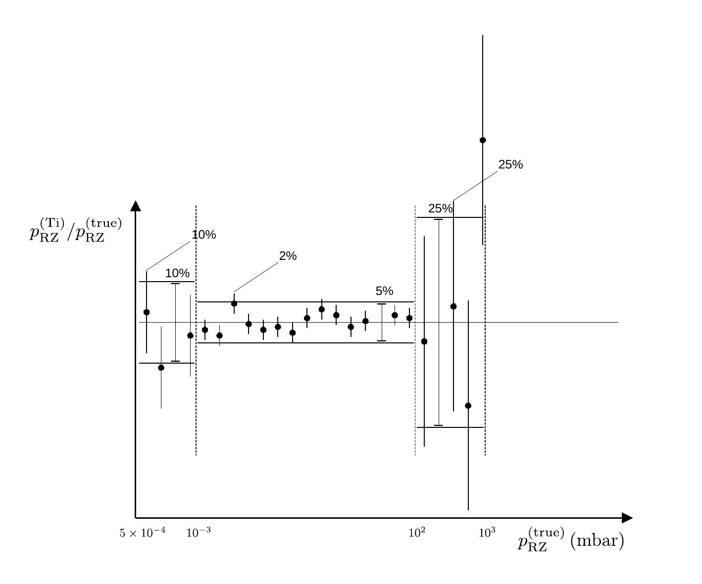

# Vakuum

## Vakuummeter

### Wärmeleitungs-Vakuummeter ($10^{-4}\lesssim p \lesssim 10^{3}\ \mathrm{mbar}$)

> Das Wärmeleitungs- oder [Pirani-Vakuummeter](https://de.wikipedia.org/wiki/Pirani-Vakuummeter) nutzt die Abhängigkeit der Wärmeleitung von Gasen vom Druck. 

Im Vakuum befindet sich ein (meist aus Wolfram oder Nickel bestehender) Messdraht, der Bestandteil einer [Wheatstoneschen Messbrücke](https://de.wikipedia.org/wiki/Wheatstonesche_Messbr%C3%BCcke) ist. Der Widerstand $R$ des Drahts hängt von dessen Temperatur $\vartheta$ ab. 💡 Die am Draht anliegende Spannung wird so geregelt, dass $R=const$ gilt. Die dabei aufzuwendende elektrische Leistung entspricht im thermischen Gleichgewicht der abgeführten Wärmeleistung des Drahts. 

Abhängig vom Druck lässt sich die abgeführte Wärmeleistung in drei Bereiche aufteilen: 

- $p\lesssim10^{-4}\ \mathrm{mbar}$: Hier erfolgt der Wärmegang **unabhängig von $p$ vor allem durch Wärmestrahlung** des Drahtes, sowie Wärmeableitung an den Drahtenden. 
- $10^{-4}\lesssim p \lesssim 1\ \mathrm{mbar}$: Hier erfolgt der Wärmegang vor allem durch die **Wärmeleitung im Gas. Diese ist i.a. linear von $p$ abhängig**. 
- $1\lesssim p\lesssim 10^{3}\ \mathrm{mbar}$: Hier erfolgt der Wärmegang durch **Konvektion**. Obwohl auch dieser i.a. unabhängig von $p$ ist gelingt es durch die Dimensionierung der Messsonde auch hier eine Abhängigkeit von $p$ zu realisieren, die jedoch i.a. nicht mehr linear ist und somit durch Kalibration linearisiert werden muss. 

💡Wärmeleitungs-Vakuummeter sind über einen weiten Bereich von
$$
\begin{equation*}
10^{-4}\lesssim p \lesssim 10^{3}\ \mathrm{mbar}
\end{equation*}
$$
 einsetzbar, in dem sie im %-Bereich reproduzierbare Drucke wiedergeben. 

💡 Für die eingesetzen Geräte ([THERMOVAC Transmitter TTR91](https://gitlab.kit.edu/kit/etp-lehre/p2-praktikum/students/-/blob/main/Vakuum/doc/LeyboldTN91_Tansducer.pdf)) macht der Hersteller die folgenden Angaben zur Messgenauigkeit: 

- $5\times10^{-4}\lesssim p \lesssim 10^{-3}\ \mathrm{mbar}$: $\pm10\%$ (*of reading*);
- $10^{-3}\lesssim p \lesssim 10^{2}\ \mathrm{mbar}$: $\pm5\%$ (*of reading*);

- $10^{2}\lesssim p \lesssim 10^{3}\ \mathrm{mbar}$: $\pm25\%$ (*of reading*);
- $10^{-3}\lesssim p \lesssim 10^{2}\ \mathrm{mbar}$: $\pm2\%$ (*or reading*) Reproduzierbarkeit; 

Verwenden Sie für Ihre Messreihen im Bereich $10^{-3}\lesssim p \lesssim 10^{2}\ \mathrm{mbar}$ die Messunsicherheit von $\pm2\%$ auf die Reproduzierbarkeit einzelner Messwerte. Die darüber angegebenen Unsicherheiten gelten als korrelierte Unsicherheiten auf den gesamten angegebenen Messbereich, wie in **Abbildung 1** dargestellt:

---



(**Abbildung 1**: Illustration zur Verwendung der Unsicherheiten zu diesem Messgerät)

---

🤓 Wenn Sie Anpassungen mit einem etwas komplexeren Modell für die Abschätzung von Unsicherheiten mit *kafe2* durchführen möchten, können Sie für die Datenpunkte im Bereich von $10^{-3}\lesssim p \lesssim 10^{2}\ \mathrm{mbar}$ eine Unsicherheit von 2% für die unkorrelierten Unsicherheiten (von Messpunkt zu Messpunkt) verwenden. Verwenden Sie zusätzlich eine Unsicherheit von 5% korreliert für alle Datenpunkte in diesem Messbereich. Verwenden Sie für Datenpunkte im Bereich $p \lesssim 10^{-3}\ \mathrm{mbar}$ eine Unsicherheit von 10% unkorreliert von Messpunkt zu Messpunkt und für Datenpunkte im Bereich $p\gtrsim 10^{2}\ \mathrm{mbar}$ eine Unsicherheit von 25% unkorreliert von Datenpunkt zu Datenpunkt. 

### Ionisations-Vakuummeter ($10^{-8}\lesssim p\lesssim 10^{-3}\ \mathrm{mbar}$)

> [Ionisations-Vakuummeter](https://de.wikipedia.org/wiki/Ionisations-Vakuummeter) basieren auf der Abhängigkeit des elektrischen **Entladungsstroms** einer evakuierten Diode von der Restteilchenzahldichte $n$. 

Aus einer Kathode werden unter Hochspannung Elektronen emittiert und im Feld der Hochspannung beschleunigt. Die Elektronen ionisieren die Restgasteilchen durch Stöße. Diese wandern als positiv geladene Ionen zur Kathode. Dort können Sie haften bleiben oder beim Auftreffen Material aus der Kathode ausschlagen (Kathodenzerstäubung). Das ausgeschlagene Material schlägt sich dann an den Wänden des Messgeräts nieder. 💡 Durch diesen Prozess wird die Kathode langsam verbraucht. Sie ist daher i.a. austauschbar.

💡 Um auch bei sehr niedrigen Drucken und sehr kleinen $n$ einen messbaren Ionisationsstrom zu garantieren können die Elektronen durch ein zusätzlich angelegtes Magnetfeld auf eine Spiralbahn gezwungen werden, um ihren Weg durch die Ionisationskammer und damit die Wahrscheinlichkeit für Stöße mit Restgasteilchen zu erhöhen. **Man bezeichnet dieses Vorgehen als invertiertes Magnetron-Prinzip und ein Messgerät, das nach diesem Prinzip funktioniert als Penning-Vakuummeter.** Bei dem eingesetzten Gerät (PENNINGVAC PTR 225) handelt es sich um ein Penning-Kaltkathoden-Vakuummeter. 

Die Messgenauigkeit gibt der Hersteller mit $\pm30\%$ im Bereich 
$$
\begin{equation*}
10^{-8}\lesssim p\lesssim 10^{-3}\ \mathrm{mbar}
\end{equation*}
$$
 an.  

### Kalibration von Vakuummetern

Alle Vakuummeter müssen vor Betrieb kalibriert werden. Hierzu dienen *statische Verfahren* mit bekannten Messgeräten (z.B. U-Rohrmanometern, wie sie im P2-Versuch [Ideales und reales Gas](https://gitlab.kit.edu/kit/etp-lehre/p2-praktikum/students/-/tree/main/Ideales_und_reales_Gas) verwendet werden) oder *dynamische Verfahren* mit Hilfe von Pumpen mit bekanntem Saugvermögen. Dabei geht es im Allgemeinen darum, das zu kalibrierende Gerät für einen Druckbereich einzusetzen, in dem das Referenzmanometer nicht anwendbar ist. 

#### Dynamisches Kalibrationsverfahren

Ein einfaches **dynamisches Kalibrationsverfahren** würde z.B. wie folgt ablaufen:

- Sie statten einen Rezipienten R1 mit regelbarem Belüftungsventil und einem Referenzdruckmessgerät G1 aus. 

- Sie verbinden R1 über ein Rohr mit bekanntem Leitwert $L$ mit einem zweiten Rezipienten R2, an dem sich das zu kalibrierende Messgerät und eine Pumpe P2 mit bekannter, hoher effektiver Saugleistung $S_{\mathrm{eff}}$ befindet. 

- Im Betrieb ist der Druck $p_{2}$ in R2 durch 

  ```math
  \begin{equation*}
  p_{2}=\frac{L}{S}\,p_{1}
  \end{equation*}
  ```

  gegeben, wobei $p_{1}$ dem mit G1 gemessenen Druck in R1 entspricht. 

#### Statisches Kalibrationsverfahren

Ein einfaches **statisches Kalibrationsverfahren** würde z.B. wie folgt ablaufen: 

- Sie definieren mehrere bekannte Volumina $V_{i}$, die Sie durch Ventile voneinander trennen können. 

- Sie evakuieren alle Volumina bei zunächst geöffneten inneren Ventilen. Daraufhin schließen Sie alle Ventile und isolieren die $V_{i}$ auf diese Weise voneinander.

- Im folgenden belüften Sie das Volumen $V_{0}$ und bestimmen den sich darin einstellenden Druck $p_{0}$, z.B. mit Hilfe eines bekannten Messgeräts G1; das zu kalibrierende Messgerät kann in diesem Fall direkt gegen G1 abgeglichen werden. Isolieren Sie hierzu $V_{0}$ wieder von der Umgebung. 

-  Im folgenden öffnen Sie sukzessive ein Volumen nach dem anderen. Nach dem [Gesetz von Boyle-Mariotte](https://de.wikipedia.org/wiki/Thermische_Zustandsgleichung_idealer_Gase#Gesetz_von_Boyle-Mariotte) gilt 
  ```math
  \begin{equation*}
  p_{i+1}=\frac{\sum\limits_{k=0}^{i}V_{k}}{\sum\limits_{k=0}^{i+1}V_{k}}\cdot p_{i}.
  \end{equation*}
  ```

Auf diese Weise lässt sich das Gerät auch außerhalb des Messbereichs von G1 kalibrieren. 

#### Statisches Kalibrationsverfahren aus Aufgabe 3.1

Für **Aufgabe 3.1** führen Sie ein einstufiges, statisches Kalibrationsverfahren, unter Anwendung des Gesetzes von [Boyle-Mariotte](https://en.wikipedia.org/wiki/Boyle%27s_law) für T3 durch. 

#### Aufnahme der Messpunkte

Gehen Sie zur Aufnahme der Messpunkte wie folgt vor:

 * In der **Ausgangssituation** sollte V3 geschlossen, B2 geöffnet und der RZ mit Hilfe der DSP und der TMP evakuiert sein. Im Referenzvolumen (RV [hier](https://gitlab.kit.edu/kit/etp-lehre/p2-praktikum/students/-/blob/main/Vakuum/figures/VakuumSkizze.png)) herrscht der Druck $p_{0}$ der auch an T3 angezeigt werden sollte.
 * Schließen Sie V2 beim niedrigsten erreichbaren Druck, um den RZ vom Rest der Apparatur zu trennen. Dieser sollte zwischen  von $10^{-4}\lesssim p_{\mathrm{RZ}}^{\mathrm{(IM)}}\lesssim2\times 10^{-3}\,\mathrm{mbar}$ liegen. Dabei entspricht $p_{\mathrm{RZ}}^{\mathrm{(IM)}}$ dem bei IM angezeigten Druck. Sie können die TMP daraufhin abschalten. 
   * **Schritt 1:** Schließen Sie B2. Öffnen Sie daraufhin V3 und lesen Sie $p_{\mathrm{RZ}}^{\mathrm{(T3)}}$ an T3 ab. **Warten Sie hierzu den Druckausgleich im Gleichgewichtszustand ab!**
   * **Schritt 2:** Schließen Sie V3 und öffnen Sie daraufhin B2, damit sich im RV erneut Atmosphärendruck ($p_{0}$) einstellen kann. **Warten Sie den Druckausgleich im Gleichgewichtszustand ab!**
 * Wiederholen Sie diesen Vorgang beginnend mit **Schritt 1**, solange bis sich in RZ ein Druck von $p_{\mathrm{RZ}}^{\mathrm{(T3)}}\approx80\,\mathrm{mbar}$ einstellt.

#### Kalibration von T3

Für den Druck nach einer Iteration $i$ gilt: 
$$
\begin{equation*}
\begin{split}
&\bigl(p_{\mathrm{RZ},i}+\Delta p_{i}\bigr)\,\bigl(V_{\mathrm{RZ}}+V_{\mathrm{RV}}\bigr) = \bigl(n_{\mathrm{RZ}}+n_{\mathrm{RV}}\bigr)\,R\,T; \\
&\\
&\text{mit:}\\
&\\
&n_{\mathrm{RZ}} = \frac{p_{\mathrm{RZ},i}\,V_{\mathrm{RZ}}}{R\,T};\qquad
n_{\mathrm{RV}} = \frac{p_{0}\,V_{\mathrm{RV}}}{R\,T} \\
&\\
&\Bigl(p_{\mathrm{RZ},i}+\Delta p_{i}\Bigr)\,\Bigl(V_{\mathrm{RZ}}+V_{\mathrm{RV}}\Bigr) = p_{\mathrm{RZ},i}\,V_{\mathrm{RZ}}+p_{0}\,V_{\mathrm{RV}};\\
\end{split}
\end{equation*}
$$
wobei $V_{\mathrm{RZ}}$ dem Volumen im RZ und $V_{\mathrm{RV}}$ dem RV entsprechen. Daraus folgt der Zusammenhang: 
$$
\begin{equation}
\Delta p_{i} = \frac{V_{\mathrm{RV}}}{V_{\mathrm{RV}}+V_{\mathrm{RZ}}}\left(p_{0} - p_{\mathrm{RZ},i}\right).
\end{equation}
$$
Mit zunehmendem Druck im RZ nimmt $\Delta p_{i}$ also linear ab! Da es sich bei T3 um das Messgerät handelt, das zu kalibrieren ist, können Sie $p_{\mathrm{RZ},i}$ als Eingangsparameter für Gleichung **(1)** nicht von T3 ablesen. Gehen Sie stattdessen wie folgt vor: 

- Wählen Sie als Aufpunkt zur Kalibration die erste Anzeige an T3:
  ```math
  \begin{equation*}
  p_{\mathrm{RZ},0}\equiv p_{\mathrm{RZ},0}^{\mathrm{(T3)}}
  \end{equation*}
  ```

- Berechnen Sie $p_{\mathrm{RZ},i+1}$ als 
  ```math
  \begin{equation*}
  p_{\mathrm{RZ},i+1} = p_{\mathrm{RZ},i}+\Delta p_{i}
  \end{equation*}
  ```

Sie erhalten die **Kalibrationskurve** 
$$
\begin{equation*}
K\left(p_{\mathrm{RZ}}, p_{\mathrm{RZ}}^{\mathrm{(T3)}}\right)
\end{equation*}
$$
für das Vakuummeter T3 aus den Datenpunkten $\Bigl(p_{\mathrm{RZ},i}, p_{\mathrm{RZ},i}^{\mathrm{(T3)}}\Bigr)$. 

- 💡 Sie können ggf. am Aufpunkt die Übereinstimmung von T3 und IM am Aufpunkt überprüfen. 
- 💡 Sie können $K$ dazu nutzen, um ihre zuvor mit T3 bestimmten Messkurven zu korrigieren.   

---

[Main](https://gitlab.kit.edu/kit/etp-lehre/p2-praktikum/students/-/tree/main/Vakuum/README.md)
