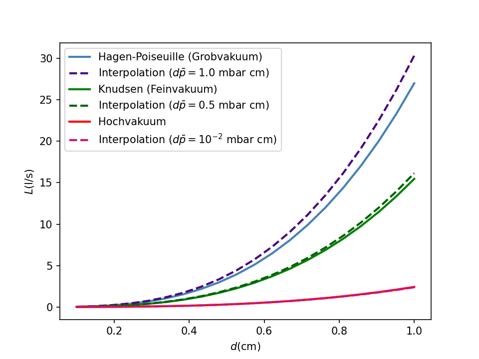

# Hinweise für den Versuch **Vakuum**

## Grundbegriffe der Vakuumtechnik

### Zusammenhang zwischen Saugvermögen, Massen- und $pV$-Durchfluss

In der Vakuuumtechnik bezeichnet man den **Volumendurchfluss** ([Volumenstrom](https://de.wikipedia.org/wiki/Volumenstrom#Normvolumenstrom)) durch die Ansaugöffnung einer Pumpe als **Saugvermögen**
$$
\begin{equation}
S\equiv\dot{V}.
\end{equation}
$$
Gebräuchliche Einheiten hierfür sind $[\mathrm{l/s}]$ oder $[\mathrm{m^{3}/h}]$. Für viskose Flüssigkeiten haben Sie $S$ in Form des Gesetzes von Hagen-Poiseuille in form von Gleichung **(4)** [hier](https://gitlab.kit.edu/kit/etp-lehre/p2-praktikum/students/-/blob/main/Vakuum/doc/Hinweise-Vakuum.md) kennengelernt. 

Im Fall von [Verdrängerpumpen](https://de.wikipedia.org/wiki/Pumpe#Verdr%C3%A4ngerpumpen) (wie der DSP) lässt sich das **Nennsaugvermögen** als 
$$
\begin{equation*}
S_{N}=V_{N}\,\nu
\end{equation*}
$$
aus den technischen Spezifikationen der Pumpe berechnen, wobei $V_{N}$ dem pro Umdrehung wirksamen Volumen des Schöpfraums und $\nu$ der Drehzahl der Pumpe entsprechen. Wegen verschiedener Verluste wie z.B. unvollständiger Füllung des Schöpfraums mit Gas, Wirbelbildung oder Gasrückstrom innerhalb der Pumpe, gilt allgemein $S<S_{N}$.

Für einen Pumpvorgang ist die physikalisch relevantere Größe die in der Zeitspanne $\Delta t$ geförderte **Stoffmenge $n$**, die zum **Massenfluss**
$$
\begin{equation}
q_{m}\equiv\dot{m}
\end{equation}
$$
äquivalent ist. Zwischen $n$ und $m$ besteht dabei der Zusammenhang
$$
\begin{equation*}
m = M_{m}\,n,
\end{equation*}
$$
wobei $M_{m}$ der [molaren Masse](https://de.wikipedia.org/wiki/Molare_Masse) mit der Einheit $\mathrm{g/mol}$ entspricht. Für Flüssigkeiten gilt der Zusammenhang
$$
\begin{equation*}
q_{m}=\rho\,S,
\end{equation*}
$$
wobei $\rho$ der Dichte der Flüssigkeit entspricht.

Für Gase erfolgt die Abschätzung von $n$ mit Hilfe der idealen Gasgleichung 

$$
\begin{equation*}
n = \frac{p\,V}{R\,T},
\end{equation*}
$$
die bei vorgegebener Temperatur zur Angabe der Masse äquivalent ist. Für Gase ist daher neben $q_{m}$ der **$pV$-Durchfluss**

$$
\begin{equation}
q_{pV} = \frac{\mathrm{d}(pV)}{\mathrm{dt}}
\end{equation}
$$
(mit der Einheit $[\mathrm{W}]$) in Verwendung.

### Zusammenhang zwischen Saugvermögen und Saugleistung

Die **Saugleistung** einer Pumpe ist durch $q_{pV}$ an der Ansaugöffnung der Pumpe definiert. Für das das Pumpen eines Gases aus dem RZ betrachten wir zwei Grenzfälle: 

$$
\begin{equation}
\begin{split}
& q_{pV} = \left.\frac{\mathrm{d}(pV)}{\mathrm{d}t}\right|_{p=const.} = p\dot{V} = p\,S; \\
&q_{pV} = \left.\frac{\mathrm{d}(pV)}{\mathrm{d}t}\right|_{V=const.} = \dot{p}V.\\
\end{split}
\end{equation}
$$
Für einen in der Vakuumtechnik eher gebräuchlichen Aufbau, bei dem das Volumen $V=V_{\mathrm{RZ}}$ durch die Abmessungen des RZ fest vorgegeben ist, ist der Zusammenhang für $V=const.$ der praktischere. **Danach wird durch eine Pumpe mit höherer Saugleistung der Druck im RZ schneller reduziert.** 

Der Ausdruck für $p=const.$ mag im Sinne der verrichteten Arbeit zunächst anschaulicher erscheinen. Er stellt zudem einen nominellen Zusammenhang zwischen $q_{pV}$ und $S$ her. Tatsächlich ist die Voraussetzung $p=const.$ für einen realistischen Pumpvorgang mit einem RZ von endlichem Volumen jedoch so gut wie nie erfüllt. Die Beziehung 
$$
\begin{equation*}
\mathrm{d}q_{pV}=p\,\mathrm{d}S
\end{equation*}
$$
spielt daher, analog zum Gesetz von Hagen-Poiseuille in der Formulierung von Gleichung **(5)** [hier](https://gitlab.kit.edu/kit/etp-lehre/p2-praktikum/students/-/blob/main/Vakuum/doc/Hinweise-Vakuum.md), v.a. für differenzielle Betrachtungen eine Rolle.  

Wenn wir beim Saugvorgang von einer **adiabatischen** Zustandsänderung des Gases ($\delta Q=0$) ausgehen erhalten wir:
$$
\begin{equation*}
\begin{split}
&p\,V^{\kappa}=const. \\
&\\
&\mathrm{d(p\,V^{\kappa})}=\kappa\,p\,V^{\kappa-1}\mathrm{d}V + V^{\kappa}\mathrm{d}p=0; \\
&\\
&\frac{\mathrm{d}p}{p} = -\kappa\frac{S}{V}\mathrm{d}t,
\end{split}
\end{equation*}
$$
wobei $\kappa$ dem [**Adiabetanexponenten**](https://de.wikipedia.org/wiki/Isentropenexponent) des verwendeten Gases entspricht. Diese Annahme ist aufgrund der geringen Wärmeleitfähigkeit von Luft im Grobvakuum (d.h. für $p>1\ \mathrm{mbar}$) in sehr guter Näherung erfüllt. Im Feinvakuum liegt i.a. ein guter Temperaturausgleich mit den Behälterwänden vor [[1](https://onlinelibrary.wiley.com/page/journal/15222454/homepage/lex/lex_40.html)], so dass der Pumpvorgang **isotherm** ($\mathrm{d}T=0$) abläuft:   
$$
\begin{equation*}
\begin{split}
\mathrm{d}T &= \mathrm{d}(pV) = 0;\\
&\\
&= p\,\mathrm{d}V  + V\,\mathrm{d}p \\
&\\
&= p\,S\,\mathrm{d}t  + V\,\mathrm{d}p;\\
&\\
\frac{\mathrm{d}p}{p} &= -\frac{S}{V}\mathrm{d}t.
\end{split}
\end{equation*}
$$
Zum Zeitpunkt $t_{0}$ nimmt das Gas im RZ das Volumen $V_{\mathrm{RZ}}$ mit dem Druck $p_{0}$ ein. Nach der infinitesimal kleinen Zeitspanne $\mathrm{d}t$ hat die Pumpe aufgrund ihres Saugvermögens das Volumen $\mathrm{d}V=S\,\mathrm{d}t$ des Gases abgesaugt. Da $V=V_{\mathrm{RZ}}$ jedoch durch den RZ vorgegeben ist fällt der Druck im RZ um den infinitesimal kleinen Betrag $\mathrm{d}p$ ab. Für eine Pumpe, die ein Gas aus einer Apparatur **hinreichend großen Volumens** $V$ absaugt, würden wir also einen exponentiellen Abfall des Drucks in der Form
$$
\begin{equation}
\begin{split}
&\ln\left(\frac{p}{p_{0}}\right) = -n\frac{S}{V}\left(t-t_{0}\right)\\
&\\
&p(t) = p_{0}\,\exp\left(-n\frac{S}{V}\left(t-t_{0}\right)\right)
\end{split}
\end{equation}
$$
erwarten, wobei man $n=1\ldots1.4$ (für Luft) als den [Polytropenexponenten](https://de.wikipedia.org/wiki/Polytrope_Zustands%C3%A4nderung) bezeichnet. Hierzu müssen $V$ groß und $\Delta t=t-t_{0}$ klein genug sein, so dass die Bedingungen $S\,\Delta t\ll V$ und $p=const.$ in guter Näherung erfüllt sind. Für einen Aufbau mit endlichem Volumen $V=V_{\mathrm{RZ}}$ sind diese Voraussetzungen nicht über beliebig große Zeiträume hinweg erfüllt. In einem solchen Fall lässt sich in Anlehnung an den oberen Teil von Gleichung **(5)** 

$$
\begin{equation}
\begin{split}
&S(p) = \frac{V_{\mathrm{RZ}}}{n\left(t_{i+1}-t_{i}\right)}\,\ln\left(\frac{p_{i}}{p_{i+1}}\right);\\
&\\
&\text{mit}\\
&\\
&t_{i+1}>t_{i};\qquad p_{i}>p_{i+1}\\
\end{split}
\end{equation}
$$
immer noch als Funktion von $p$ bestimmen.

## Strömungsleitwert und -widerstand

Laut Gleichung **(5)** [hier](https://gitlab.kit.edu/kit/etp-lehre/p2-praktikum/students/-/blob/main/Vakuum/doc/Hinweise-Vakuum.md) ist die Saugleistung durch ein zylindrisches, hinreichend langes Rohr proportional zur Druckdifferenz $\Delta p$ an den Rohrenden. Die Proportionalitätskonstante 
$$
\begin{equation}
L=\frac{\pi\,R^{4}\,\overline{p}}{8\,\eta\,\ell}
\end{equation}
$$
(mit der Einheit $[\mathrm{l/s}]$) bezeichnet man als **Strömungsleitwert**, den Kehrwert von $L$ als **Strömungswiderstand** des Rohrs. Beide Größen lassen sich über den Zusammenhang 
$$
\begin{equation}
q_{pV}\equiv L\,\Delta p
\end{equation}
$$
allgemein definieren. Gleichung **(7)** gilt nur für viskose, laminare Fluide. Im allgemeinen hängt $L$ stärker vom Druck ab, als es durch Gleichung **(7)** wiedergegeben wird, da sich druckabhängig die Art der Strömung verändert (siehe Abschnitt Vakuumbereiche [hier](https://gitlab.kit.edu/kit/etp-lehre/p2-praktikum/students/-/blob/main/Vakuum/doc/Hinweise-Vakuum.md)). Zudem hängt $L$ von der Art des strömenden Gases, dem Querschnitt der Leitung, sowie dem Umstand ab, ob die Leitung geradlinig verläuft oder in irgendeiner Weise gekrümmt ist. 

Bei **Parallelschaltung von Leitungen** addieren sich die Saugleistungen, während der Druckunterschied gleich bleibt: 
$$
\begin{equation*}
\begin{split}
&q_{pV}^{\mathrm{(ges)}}= L_{\mathrm{ges}} \Delta p = q_{pV}^{(1)}+q_{pV}^{(2)}= L_{1}\Delta p + L_{2}\Delta p = \left(L_{1}+L_{2}\right)\Delta p;\\
&\\
&L_{\mathrm{ges}} = L_{1} + L_{2}.
\end{split}
\end{equation*}
$$
Bei **Serienschaltung von Leitungen** addieren sich die Druckunterschiede während die Saugleistung gleich bleibt: 
$$
\begin{equation*}
\begin{split}
&\Delta p_{\mathrm{ges}}= \Delta p_{1} + \Delta p_{2}; \\
&\\
&\frac{q_{pV}}{L_{\mathrm{ges}}} = \frac{q_{pV}}{L_{1}} + \frac{q_{pV}}{L_{2}};\\
&\\
&\frac{1}{L_{\mathrm{ges}}} = \frac{1}{L_{1}} + \frac{1}{L_{2}}.\\
\end{split}
\end{equation*}
$$
Es handelt sich dabei um ein Analogon zu den [**Kirchhoffschen Regeln**](https://de.wikipedia.org/wiki/Kirchhoffsche_Regeln) der Elektrizitätslehre mit den folgenden Ersetzungen: 
$$
\begin{equation*}
\begin{split}
\vphantom{\frac{\mathrm{d}p}{\mathrm{d}x}}\dot{V}\qquad&\longleftrightarrow \qquad I\\
\frac{\mathrm{d}p}{\mathrm{d}x}\qquad&\longleftrightarrow\qquad U \\
\vphantom{\frac{\mathrm{d}p}{\mathrm{d}x}}L\qquad&\longleftrightarrow\qquad\sigma \\
\vphantom{\frac{\mathrm{d}p}{\mathrm{d}x}}L^{-1}\qquad&\longleftrightarrow\qquad R. \\
\end{split}
\end{equation*}
$$

### Effektives Saugvermögen

Eine Pumpe schließt nur selten direkt an die zu evakuierende Apparatur an. Ist dies nicht der Fall, ist das Saugvermögen der Pumpe durch den Gesamtleitwert aller verbindenden Leitungselemente reduziert. 

Nimmt man an, dass sich die Temperatur des Gases während des Durchflusses durch die Leitungselemente nicht wesentlich ändert, so dass also der $pV$-Durchfluss durch die Leitungselemente konstant ist, dann erhält man für das **effektive Saugvermögen** $S_{\mathrm{eff}}$ hinter den Leitungselementen den Zusammenhang 

$$
\begin{equation*}
\begin{split}
&q_{pV} = p_{1}\,S = p_{2}\,S_{\mathrm{eff}};\\
&\\
&S_{\mathrm{eff}} = \frac{p_{1}}{p_{2}}\,S.
\end{split}
\end{equation*}
$$

Für $S_{\mathrm{eff}}$ folgt daraus:

$$
\begin{equation}
\begin{split}
&L = \frac{q_{pV}}{p_{2}-p_{1}} = \frac{p_{1}}{p_{2}-p_{1}}S = \frac{p_{2}}{p_{2}-p_{1}}S_{\mathrm{eff}};\\
&\\
&\frac{p_{2}}{p_{1}} = \frac{S}{L}+1;\\
&\\
&\frac{S_{\mathrm{eff}}}{L} = \left(1-\frac{p_{1}}{p_{2}}\right) = \left(1-\frac{L}{S+L}\right) = \frac{S}{S+L}; \\
&\\
&\left(S+L\right)\,S_{\mathrm{eff}} = S\,L; \\
&\\
&\frac{S+L}{S\,L} = \frac{1}{S_{\mathrm{eff}}} \\
&\\
&\frac{1}{L} + \frac{1}{S} = \frac{1}{S_{\mathrm{eff}}} \\
&\\
&S_{\mathrm{eff}} = \left(\frac{1}{L} + \frac{1}{S}\right)^{-1}. \\
\end{split}
\end{equation}
$$

**Die effektive Saugleistung der Pumpe ergibt sich durch Serienschaltung mit den entsprechenden Leitungselementen.** 

### Knudsen-Gleichung

Bei $20^{\circ}\mathrm{C}$ beträgt die dynamische Viskosität für [Stickstoff](https://www.unternehmensberatung-babel.de/industriegase-lexikon/viskositaet/dynamische-viskositaet-stickstoff.html) und [Sauerstoff](https://www.unternehmensberatung-babel.de/industriegase-lexikon/viskositaet/dynamische-viskositaet-sauerstoff.html) jeweils: 
$$
\begin{equation*}
\eta_{\mathrm{N_{2}}} = 17.58\times10^{-6}\ \mathrm{Pa\ s}; \qquad \eta_{\mathrm{O_{2}}} = 20.182\times10^{-6}\ \mathrm{Pa\ s}.
\end{equation*}
$$
Bei einem Verhältnis von 80% $\mathrm{N_{2}}$ und 20% $\mathrm{O_{2}}$ ergibt sich daraus eine Viskosität für Luft von 
$$
\begin{equation*}
\eta_{\mathrm{Luft}} = 18.1\times10^{-6}\ \mathrm{Pa\ s}.
\end{equation*}
$$
Setzt man diesen Wert in Gleichung **(7)** ein erhält man die folgende gebräuchliche Ingenieursformel für $L$:
$$
\begin{equation}
\begin{split}
&L[\mathrm{l/s}] = \frac{\pi\,R^{4}\,\overline{p}}{8\,\eta\,\ell} = \frac{\pi\,\left(d[\mathrm{cm}]\right)^{4}\,\overline{p}[\mathrm{mbar}]\cdot 100}{1000\cdot8\cdot16\cdot18.1\times10^{-6}[\mathrm{Pa\ s}]\,\ell[\mathrm{cm}]} \\
&\hphantom{L[\mathrm{l/s}]}=135\frac{\left(d[\mathrm{cm}]\right)^{4}}{\ell[\mathrm{cm}]}\, \overline{p}[\mathrm{mbar}] \\
&\\
&\text{mit:}\\
&\\
&d=2\,R; \qquad
1\ \mathrm{Pa}=100\ \mathrm{mbar}; \qquad
\eta_{\mathrm{Luft}} = 18.1\times10^{-6}\ \mathrm{Pa\ s},\\
\end{split}
\end{equation}
$$
wobei $d$ dem Durchmesser der Leitung entspricht. Die eckigen Klammern geben an, in welchen Einheiten die Messgrößen jeweils einzusetzen sind.

Im Feinvakuum nimmt Gleichung **(9)** die Form 
$$
\begin{equation}
L[\mathrm{l/s}] = 135\frac{d^{4}}{\ell}\overline{p} + 12.1\frac{d^{3}}{\ell}\frac{1+192\, d\,\overline{p}}{1+237\, d\, \overline{p}}
\end{equation}
$$
an, wobei es sich um die sog. **Knudsen-Gleichung** handelt. 

Die folgende Gleichung 
$$
\begin{equation}
\begin{split}
&L[\mathrm{l/s}] = 12.1\frac{d^{3}}{\ell}\cdot\underbrace{\frac{1+203\, d\, \overline{p} + 2.78\times 10^{3}\,\left(d\,\overline{p}\right)^{2}}{1+237\, d\, \overline{p}}}\\
&\hphantom{L[\mathrm{l/s}] = 12.1\frac{d^{3}}{\ell}1+203\, d\, \overline{p}c}\equiv f(d\,\overline{p}) \\
\end{split}
\end{equation}
$$
eignet sich gut dazu, basierend auf der dimensionsbehafteten Skala $d\,\overline{p}\ [\mathrm{mbar\ cm}]$, **zwischen Grob-, Fein- und Hochvakuum zu interpolieren**, wie man aus **Abbildung 1** ersehen kann: 

---

**Abbildung 1**: (Vergleich der Interpolationsformel aus Gleichung **(12)** (jeweils als gestrichelte Linie) mit der Erwartung nach dem Gesetz von Hagen-Poiseuille (Gleichung **(10)**), der Knudsen-Gleichung (Gleichung **(11)**) und der Erwartung fürs Hochvakuum)

---

Dabei lassen sich die entsprechenden Bereiche, wie folgt auftrennen:
$$
\begin{equation}
\begin{split}
&\text{Grobvakuum (Viskos, laminare Str\"omung; } 0.6\lesssim d\,\overline{p}\ [\mathrm{mbar\cdot cm}]): \\
&\\
&L[\mathrm{l/s}] = 135\frac{d^{4}}{\ell}\overline{p}\\
&\\
&\text{Feinvakuum (Knudsen-Strömung; } 10^{-2}\lesssim d\,\overline{p}\ [\mathrm{mbar\cdot cm}]\lesssim0.6): \\
&\\
&L[\mathrm{l/s}] = 135\frac{d^{4}}{\ell}\overline{p} + 12.1\frac{d^{3}}{\ell}\frac{1+192\, d\,\overline{p}}{1+237\, d\, \overline{p}}\\
&\\
&\text{Hochvakuum (Molekulare Str\"omung; } d\,\overline{p}\ [\mathrm{mbar\cdot cm}]\lesssim10^{-2}): \\
&\\
&L[\mathrm{l/s}] = 12.1\frac{d^{3}}{\ell}.\\
\end{split}
\end{equation}
$$
Es fällt auf, dass $L$ für molekulare Strömungen vom Druck unabhängig ist.   

## Essentials

Was Sie ab jetzt wissen sollten:

- Die Begriffe **Saugvermögen** und **Saugleistung** sollten Ihnen geläufig sein. Sie sollten Ähnlichkeiten und Unterschiede (z.B. der Einheiten) benennen können.
- Sie sollten den Begriff des **Strömungsleitwerts** $L$ kennen. Sie sollten wissen in welchen Einheiten $L$ gemessen wird. Die Analogie zu den **Kirchhoffschen Gesetzen** der Elektrizitätslehre sollten Ihnen klar sein.
- Der Zusammenhang zwischen $L$ und dem **Gesetz von Hagen-Poiseuille** sollte Ihnen bekannt sein. 

## Testfragen

1. Bedeutet ein höherer Leitwert, dass mehr oder weniger Fluid pro Zeiteinheit durch das Leitungselement fließen kann?
1. Warum gilt $S_{\mathrm{eff}}<S$ unabhängig von den Leitwerten der eingesetzten Leitungselemente?
1. Sie pumpen Luft über ein zylindrisches Rohr aus einem luftdichten RZ ab. Wie ändert sich der Leitwert des Rohrs als Funktion der Zeit?
1. Das Saugvermögen der verwendeten DSP können Sie aus dem [Datenblatt](https://gitlab.kit.edu/kit/etp-lehre/p2-praktikum/students/-/blob/main/Vakuum/Datenblatt.md) zum Versuch ablesen. Nach welcher Zeitspanne hätte die DSP das Volumen des RZ bei Normaldruck abgesaugt?

# Navigation

[Main](https://gitlab.kit.edu/kit/etp-lehre/p2-praktikum/students/-/tree/main/Vakuum)

